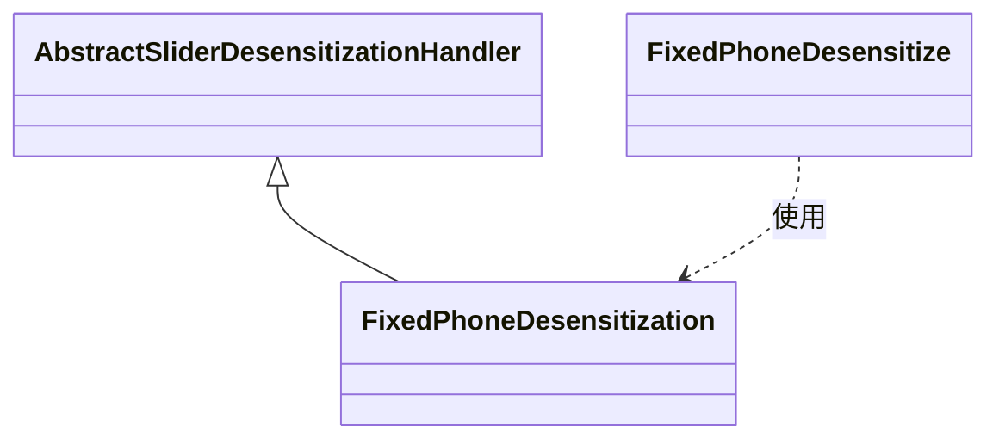

# FixedPhoneDesensitization 模块文档

## 概述
FixedPhoneDesensitization 是一个用于固定电话号码脱敏的处理器，属于 yudao-framework 的脱敏框架的一部分。它通过保留指定数量的前缀和后缀字符，并使用自定义字符替换中间部分来实现对固定电话号码的脱敏。

## 核心功能
- 实现了 AbstractSliderDesensitizationHandler 抽象类，专门处理固定电话号码的脱敏逻辑。
- 通过读取 @FixedPhoneDesensitize 注解上的 prefixKeep、suffixKeep 和 replacer 属性来配置脱敏规则。
- 提供了 getPrefixKeep、getSuffixKeep 和 getReplacer 方法的具体实现，用于从注解中获取脱敏参数。

## 架构与组件关系
FixedPhoneDesensitization 属于脱敏处理器层级，继承自 AbstractSliderDesensitizationHandler，并依赖于 FixedPhoneDesensitize 注解。



## 在系统中的作用
该模块是 yudao-spring-boot-starter-web 中 web 脱敏功能的一部分。在系统中，当需要对固定电话号码进行脱敏时（例如在日志、API 响应或数据展示中隐藏敏感信息），可以通过在字段上添加 @FixedPhoneDesensitize 注解，并配合脱敏框架使用 FixedPhoneDesensitization 处理器来实现自动脱敏。

## 依赖关系
- 依赖于 AbstractSliderDesensitizationHandler 抽象类（提供了脱敏处理器的基础框架）。
- 依赖于 FixedPhoneDesensitize 注解（提供了脱敏配置）。

## 使用示例
在实体类或DTO中，对固定电话号码字段添加注解：
```java
@FixedPhoneDesensitize(prefixKeep = 2, suffixKeep = 2, replacer = "*")
private String fixedPhone;
```
当该字段被脱敏框架处理时，例如号码 "01012345678" 将变为 "01******78"（保留前2位和后2位，中间用*替换）。

## 注意事项
- 该处理器仅处理固定电话号码的脱敏逻辑，实际脱敏框架的调用由上层组件负责。
- 注解参数 prefixKeep 和 suffixKeep 不应超过号码总长度，否则可能导致异常或不符合预期的脱敏效果。