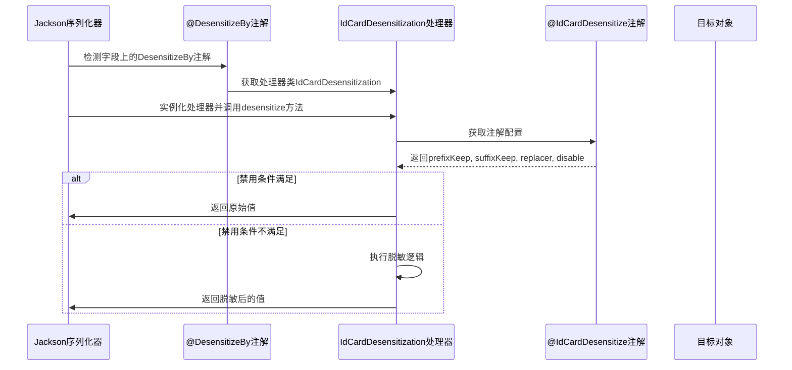

# IdCardDesensitization 模块文档

## 模块概述

IdCardDesensitization 是 yudao-framework 中用于身份证号码脱敏的实现类，属于数据脱敏框架的一部分。该模块实现了身份证号码的敏感信息保护，通过保留身份证号码的前几位和后几位，用指定字符替换中间部分来实现脱敏效果。

例如：身份证号码 `530321199204074611` 在保留前6位和后2位，用`*`替换中间部分后变为 `530321**********11`

## 核心功能

1. **身份证号码脱敏**：根据配置保留前缀和后缀字符，用指定字符替换中间部分
2. **可配置脱敏规则**：支持自定义前缀保留长度、后缀保留长度和替换字符
3. **条件禁用脱敏**：支持通过Spring EL表达式条件性地禁用脱敏功能
4. **Jackson序列化集成**：通过`@DesensitizeBy`注解自动集成到Jackson序列化过程中

## 架构设计

### 类关系图

```mermaid
classDiagram
    direction TB
    
    %% 接口定义
    class DesensitizationHandler<T extends Annotation> {
        <<interface>>
        +String desensitize(String origin, T annotation)
        +String getDisable(T annotation)
    }
    
    %% 抽象基类
    class AbstractSliderDesensitizationHandler<T extends Annotation> {
        <<abstract>>
        #DesensitizationHandler<T>
        +String desensitize(String origin, T annotation)
        #String getDisable(T annotation)
        +Integer getPrefixKeep(T annotation)
        +Integer getSuffixKeep(T annotation)
        +String getReplacer(T annotation)
    }
    
    %% 注解定义
    class IdCardDesensitize {
        <<annotation>>
        +int prefixKeep() default 6
        +int suffixKeep() default 2
        +String replacer() default "*"
        +String disable() default ""
    }
    
    %% 具体实现
    class IdCardDesensitization {
        <<extends>> AbstractSliderDesensitizationHandler<IdCardDesensitize>
        +Integer getPrefixKeep(IdCardDesensitize annotation)
        +Integer getSuffixKeep(IdCardDesensitize annotation)
        +String getReplacer(IdCardDesensitize annotation)
    }
    
    %% 元注解
    class DesensitizeBy {
        <<annotation>>
        +Class<? extends DesensitizationHandler> handler()
    }
    
    %% 关系
    DesensitizationHandler <|.. AbstractSliderDesensitizationHandler
    AbstractSliderDesensitizationHandler <|-- IdCardDesensitization
    IdCardDesensitize ..> DesensitizeBy : handler()
    DesensitizeBy ..> DesensitizationHandler
```

### 组件关系说明

1. **DesensitizationHandler接口**：定义了脱敏处理器的标准接口，包括脱敏方法和获取禁用条件的方法
2. **AbstractSliderDesensitizationHandler抽象类**：实现了滑动窗口式脱敏的通用逻辑，子类只需实现获取配置的方法
3. **IdCardDesensitize注解**：定义了身份证脱敏的具体参数（前缀保留位数、后缀保留位数、替换字符、禁用条件）
4. **IdCardDesensitization类**：具体实现身份证脱敏逻辑的处理器，继承自抽象基类
5. **DesensitizeBy元注解**：将脱敏注解与其对应的处理器类关联起来，用于Jackson序列化时自动调用相应的脱敏处理器

## 详细实现

### IdCardDesensitization 类

```java
public class IdCardDesensitization extends AbstractSliderDesensitizationHandler<IdCardDesensitize> {
    @Override
    Integer getPrefixKeep(IdCardDesensitize annotation) {
        return annotation.prefixKeep();
    }

    @Override
    Integer getSuffixKeep(IdCardDesensitize annotation) {
        return annotation.suffixKeep();
    }

    @Override
    String getReplacer(IdCardDesensitize annotation) {
        return annotation.replacer();
    }
}
```

### IdCardDesensitize 注解

```java
@Documented
@Target({ElementType.FIELD})
@Retention(RetentionPolicy.RUNTIME)
@JacksonAnnotationsInside
@DesensitizeBy(handler = IdCardDesensitization.class)
public @interface IdCardDesensitize {

    /**
     * 前缀保留长度
     */
    int prefixKeep() default 6;

    /**
     * 后缀保留长度
     */
    int suffixKeep() default 2;

    /**
     * 替换规则，身份证号码;比如：530321199204074611 脱敏之后为 530321**********11
     */
    String replacer() default "*";

    /**
     * 是否禁用脱敏
     *
     * 支持 Spring EL 表达式，如果返回 true 则跳过脱敏
     */
    String disable() default "";
}
```

### 工作流程



### 脱敏算法实现

脱敏逻辑在`AbstractSliderDesensitizationHandler`中实现：

1. 检查禁用条件（Spring EL表达式），如果满足则直接返回原值
2. 获取配置的前缀保留长度、后缀保留长度和替换字符
3. 如果输入字符串长度小于等于保留长度之和，则直接返回原值
4. 否则，保留前缀和后缀，中间部分用替换字符填充

```java
// 简化后的脱敏逻辑（实际在父类中实现）
public String desensitize(String origin, T annotation) {
    // 检查禁用条件
    String disableExpr = getDisable(annotation);
    if (StringUtils.isNotBlank(disableExpr) && 
        Boolean.TRUE.equals(SpringExpressionUtils.value(disableExpr, Boolean.class))) {
        return origin;
    }
    
    // 获取配置
    int prefixKeep = getPrefixKeep(annotation);
    int suffixKeep = getSuffixKeep(annotation);
    String replacer = getReplacer(annotation);
    
    // 执行脱敏
    if (org.apache.commons.lang3.StringUtils.isEmpty(origin)) {
        return origin;
    }
    
    int length = origin.length();
    if (length <= prefixKeep + suffixKeep) {
        return origin;
    }
    
    int starCount = length - prefixKeep - suffixKeep;
    StringBuilder sb = new StringBuilder(length);
    sb.append(origin.substring(0, prefixKeep));
    for (int i = 0; i < starCount; i++) {
        sb.append(replacer);
    }
    sb.append(origin.substring(length - suffixKeep));
    
    return sb.toString();
}
```

## 使用方法

### 在实体类中使用

```java
public class UserInfoDTO {
    // 其他字段...
    
    @IdCardDesensitize(
        prefixKeep = 6,    // 保留前6位
        suffixKeep = 2,    // 保留后2位
        replacer = "*",    // 用*替换中间部分
        disable = "#{'${security.id-card.masking.enabled}' != 'true'}" // 可选的禁用条件
    )
    private String idCardNumber;
    
    // getters and setters
}
```

### 脱敏效果示例

| 原始身份证号 | prefixKeep | suffixKeep | replacer | 脱敏后结果 |
|--------------|------------|------------|----------|------------|
| 530321199204074611 | 6 | 2 | * | 530321**********11 |
| 530321199204074611 | 4 | 4 | # | 5303####****4611 |
| 530321199204074611 | 0 | 0 | * | **************** |
| 530321199204074611 | 18 | 0 | * | 530321199204074611 (不脱敏) |
| 530321 | 6 | 2 | * | 530321 (长度不足，不脱敏) |

## 配置选项

| 参数 | 类型 | 默认值 | 说明 |
|------|------|--------|------|
| prefixKeep | int | 6 | 保留前面的字符数量 |
| suffixKeep | int | 2 | 保留后面的字符数量 |
| replacer | String | "*" | 用于替换中间字符的字符串 |
| disable | String | "" | Spring EL表达式，返回true时禁用脱敏 |

## 与其他脱敏处理器的关系

IdCardDesensitization 是一系列滑动窗口式脱敏处理器之一，其他类似的处理器包括：

- `MobileDesensitization`：手机号脱敏（保留前3位后4位）
- `BankCardDesensitization`：银行卡脱敏（保留前6位后4位）
- `FixedPhoneDesensitization`：固定电话脱敏
- `PasswordDesensitization`：密码脱敏（全替换）
- `ChineseNameDesensitization`：中文姓名脱敏（保留姓氏）
- `CarLicenseDesensitization`：车牌号脱敏
- `DefaultDesensitizationHandler`：默认脱敏处理器

所有这些处理器都继承自 `AbstractSliderDesensitizationHandler`，复用了相同的脱敏算法框架。

## 集成点

### Jackson序列化集成

通过 `@DesensitizeBy` 注解，该脱敏处理器自动集成到 Jackson 序列化过程中。当对象被序列化为 JSON 时，被 `@IdCardDesensitize` 标注的字段会自动调用此处理器进行脱敏处理。

### Spring容器集成

该类是一个普通的 Java 类，无需特殊的 Spring 配置即可工作。只要 Jackson 在序列化过程中遇到带有 `@DesensitizeBy` 注注解的字段，就会使用指定的处理器进行处理。

## 性能考虑

1. **轻量级实现**：脱敏操作是轻量级的字符串处理，对性能影响 minimal
2. **无状态设计**：处理器无状态，可以安全地在多线程环境中共享实例
3. **条件检查优化**：禁用条件仅在需要时才评估，避免不必要的 SpEL 表达式解析

## 测试建议

1. **基本脱敏功能**：验证不同 prefixKeep 和 suffixKeep 组合下的脱敏结果
2. **边界条件**：测试字符串长度小于等于保留长度之和的情况
3. **空值处理**：确保 null 和空字符串的正确处理
4. **禁用条件**：验证 SpEL 表达式正确控制脱敏行为
5. **特殊字符**：测试包含特殊字符的替换符
6. **集成测试**：验证在实际 Jackson 序列化过程中的工作情况

## 依赖关系

此模块依赖于：
- `yudao-framework/yudao-spring-boot-starter-web`: 主框架模块
- `org.springframework:spring-context`: 用于 SpEL 表达式解析
- `com.fasterxml.jackson.core:jackson-databind`: 用于 Jackson 集成
- `org.apache.commons:commons-lang3`: 用于字符串工具方法（间接通过父类）

## 最佳实践

1. **合理的保留位数**：根据身份证号码特征选择合适的保留位数（通常前6位是地址码，后面是顺序码和校验码）
2. **安全的替换字符**：使用不易混淆的字符如 `*` 或 `#` 作为替换符
3. **适当的禁用条件**：在非生产环境或特定角色下可以考虑禁用脱敏以便调试
4. **统一配置**：考虑在应用配置中统一管理脱敏参数，而不是硬编码在注解中
5. **性能监控**：在高并发场景下监控脱敏操作的性能影响

## 与其他模块的关系

此模块属于 yudao-framework 的数据脱敏体系，与以下模块协同工作：

- **数据脱敏核心框架**：提供基础的脱敏接口和抽象类
- **Jackson 集成模块**：实现自动化的字段脱敏序列化
- **其他脱敏实现**：如手机号、银行卡、姓名等专用脱敏处理器
- **Spring 框架**：利用 SpEL 表达式实现条件化脱敏

通过这种模块化设计，可以轻松添加新的脱敏类型，只需创建新的注解和对应的处理器实现即可。