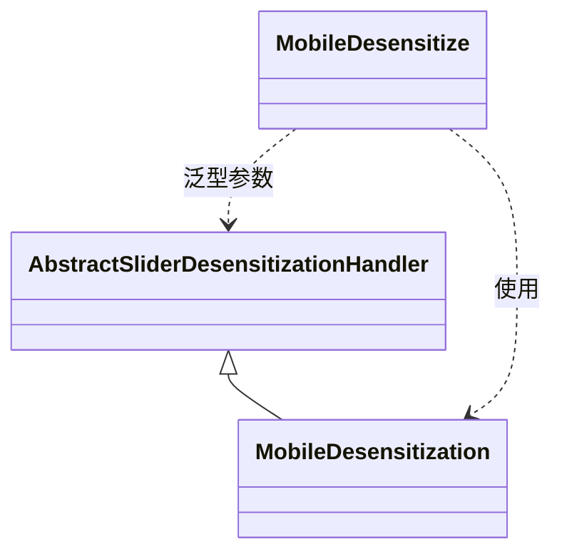

# MobileDesensitization 模块文档

## 概述
MobileDesensitization 是 yudao-framework 中用于手机号脱敏的处理器实现。它继承自 AbstractSliderDesensitizationHandler，并根据 MobileDesensitize 注释的配置执行脱敏操作。

## 核心功能
- 根据 MobileDesensitize 注释的 prefixKeep 属性保留手机号前面的指定位数。
- 根据 MobileDesensitize 注释的 suffixKeep 属性保留手机号后面的指定位数。
- 使用 MobileDesensitize 注释的 replacer 属性指定的字符替换中间的数字。
- 例如，对于手机号 13800138000，如果 prefixKeep=3, suffixKeep=4, replacer='*'，则脱敏结果为 138*****8000。

## 架构与组件关系
MobileDesensitization 属于脱敏处理器体系的一部分，具体关系如下：



说明：
- `AbstractSliderDesensitizationHandler` 是抽象基类，定义了脱敏处理器的通用模板。
- `MobileDesensitization` 是具体实现，用于处理手机号脱敏。
- `MobileDesensitize` 是注释类，用于标记需要脱敏的手机号字段，并提供配置（prefixKeep, suffixKeep, replacer）。

## 在系统中的作用
在 yudao-framework 的脱敏机制中，MobileDesensitization 负责处理标注了 `@MobileDesensitize` 的字段。当系统需要对手机号进行脱敏时（例如在日志、API 响应中隐藏敏感信息），它会调用该类的脱敏逻辑。

有关脱敏框架的总体设计，请参阅 [AbstractSliderDesensitizationHandler](handler_3_abstract.md) 的文档。
有关 MobileDesensitize 注释的详细信息，请参阅相关注释文档（如果有单独的文档）。

## 依赖关系
MobileDesensitization 依赖于：
- AbstractSliderDesensitizationHandler（抽象基类）
- MobileDesensitize（注释类）

## 使用示例
在实体类中，可以这样使用 MobileDesensitize 注释：

```java
public class UserVO {
    @MobileDesensitize(prefixKeep = 3, suffixKeep = 4, replacer = "*")
    private String mobile;
}
```

当该字段被脱敏时，MobileDesensitization 会被调用来处理。

## 注意事项
- 确保 MobileDesensitize 注释的属性值设置合理，以避免过度脱敏或脱敏不足。
- 该类仅处理字符串类型的手机号，如果输入为 null，则返回 null（具体行为取决于父类实现）。