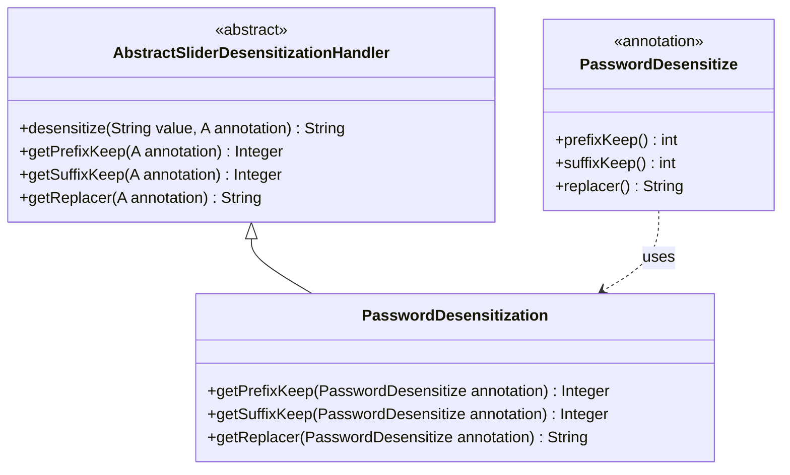

# PasswordDesensitization 模块文档

## 模块概述

`PasswordDesensitization` 是 Yudao 框架中用于密码脱敏的处理器，位于 `yudao-framework/yudao-spring-boot-starter-web` 模块下。它继承自 `AbstractSliderDesensitizationHandler`，专门处理基于 `@PasswordDesensitize` 注解的密码字段脱敏。

## 核心功能

该模块的主要职责是根据 `@PasswordDesensitize` 注解的配置对密码字段进行脱敏处理。脱敏规则包括：
- 保留前缀字符数（`prefixKeep`）
- 保留后缀字符数（`suffixKeep`）
- 使用自定义字符替换中间部分（`replacer`）

例如，对于密码 `"myPassword123"`，如果配置为 `prefixKeep=2`, `suffixKeep=3`, `replacer="*"`，则脱敏结果为 `"my********123"`。

## 架构设计

### 类关系

`PasswordDesensitization` 继承自 `AbstractSliderDesensitizationHandler<PasswordDesensitize>`，实现了其抽象方法以获取注解配置。



### 与脱敏框架的集成

该处理器是 Yudao 框架脱敏体系的一部分，与其他滑块式脱敏处理器（如手机号、身份证等）共享相同的基础架构。脱敏处理器通过 Spring 的自动装配机制被注册到脱敏上下文中，当系统检测到带有 `@PasswordDesensitize` 注解的字段时，会自动调用此处理器进行脱敏。

```mermaid
graph LR
    A[带有@PasswordDesensitize注解的字段] --> B(脱敏上下文)
    B --> C{匹配处理器}
    C -->|PasswordDesensitize| D[PasswordDesensitization处理器]
    D --> E[返回脱敏后的值]
```

## 在系统中的作用

`PasswordDesensitization` 模块属于 `yudao-spring-boot-starter-web` 启动器中的脱敏功能组件。它为系统提供了安全处理敏感密码信息的能力，常用于：
- 日志输出中的密码脱敏
- API 响应中的密码掩码
- 调试信息中的密码保护

通过将此处理器集成到框架中，开发者只需在实体类或DTO的密码字段上添加 `@PasswordDesensitize` 注解，即可自动启用脱敏功能，无需编写重复的脱敏逻辑。

## 关键依赖

此模块依赖于以下核心组件：
- `AbstractSliderDesensitizationHandler`: 提供滑块式脱敏的基础实现（参考 [handler_3_abstract](handler_3_abstract.md) 文档）
- `PasswordDesensitize`: 配置脱敏行为的注解（定义在同一包下）

注意：为了避免信息重复，详细的抽象处理器和注解定义请参考相应的模块文档。

## 使用示例

在需要脱敏密码的字段上添加注解：

```java
public class UserDTO {
    // 其他字段...
    
    @PasswordDesensitize(prefixKeep = 1, suffixKeep = 1, replacer = "*")
    private String password;
    
    // getters and setters
}
```

当该DTO被序列化为JSON或输出到日志时，`password`字段将自动被脱敏处理。

> 注：具体的脱敏上下文注册和使用机制请参考 [脱敏框架总览](desensitize_framework_overview.md) 文档。