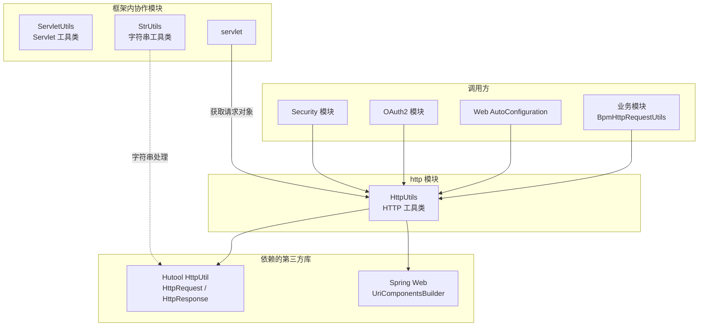
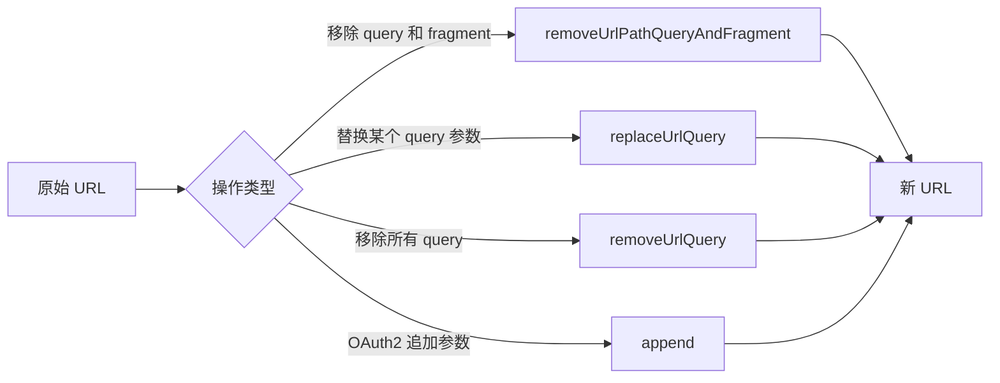
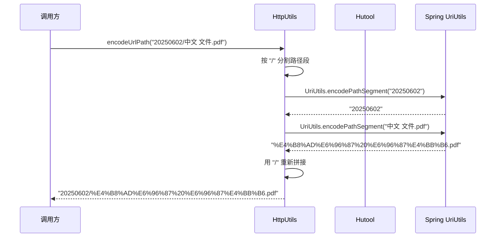
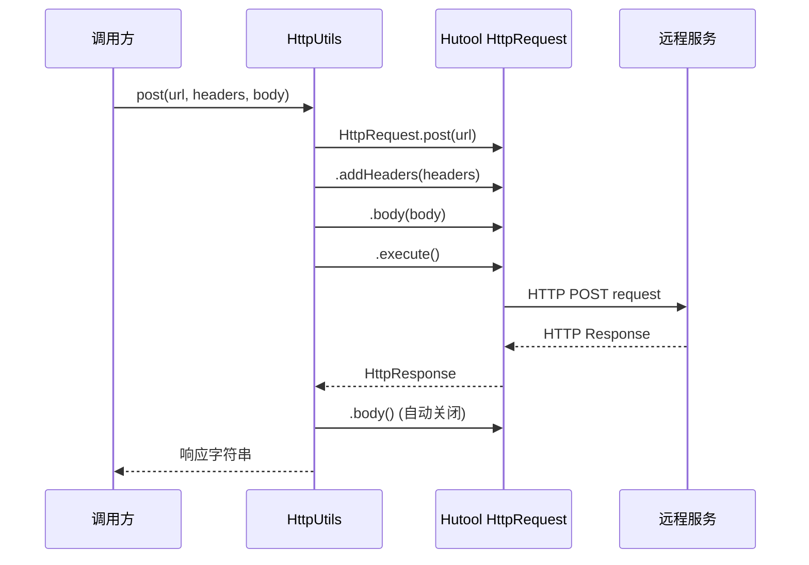

# HTTP 工具模块

## 概述

`http` 模块位于 `yudao-framework/yudao-common` 中，核心组件为 `HttpUtils` 工具类。该模块提供了项目中常用的 HTTP 相关操作封装，基于 Hutool 的 `HttpUtil`、`HttpRequest` 等工具进行二次封装，涵盖 URL 编解码、URL 参数操作、Basic 认证解析、HTTP 请求发送以及 WebSocket 协议转换等能力。

该模块是框架层的基础设施模块，被 `security`、`oauth2`、`web` 等上层模块广泛依赖。

---

## 模块架构



---

## 核心 API 说明

### 1. URL 编解码

HTTP 协议中 URL 的特殊字符需要进行编码/解码处理。`HttpUtils` 提供了多组编解码方法以应对不同的使用场景。

| 方法 | 说明 | 适用场景 |
|------|------|----------|
| `encodeUtf8(String)` | 使用 UTF-8 对 URL 参数值进行编码 | URL query parameter 编码 |
| `decodeUtf8(String)` | 解码 URL query 参数（`+` → 空格） | URL query parameter 解码 |
| `decodeUrlPath(String)` | 解码 URL 路径（保留 `+` 原义） | URL path 部分解码 |
| `encodeUrlPath(String)` | 按路径段编码 URL 路径 | URL 路径整体编码 |
| `encodeUrlPathSegment(String)` | 编码单个 URL 路径段 | 路径中单个 segment 编码 |

**设计差异说明：**

- `decodeUtf8` 会将 `+` 解码为空格（符合 `application/x-www-form-urlencoded` 规范），适用于 query 参数解码。
- `decodeUrlPath` 先将 `+` 替换为 `%2B` 再解码，避免路径中的 `+` 被误转为空格，适用于 URL 路径解码。
- `encodeUrlPath` 按 `/` 分割后逐段调用 `UriUtils.encodePathSegment` 编码，保留路径分隔符。

### 2. URL 操作

提供对 URL 字符串的常见操作，基于 Hutool 的 `UrlBuilder` 和 Spring 的 `UriComponentsBuilder`。



| 方法 | 说明 |
|------|------|
| `removeUrlPathQueryAndFragment(String)` | 移除 URL 中的 query 参数（`?` 之后）和 fragment（`#` 之后） |
| `replaceUrlQuery(String, String, String)` | 替换 URL 中指定 query 参数的值（先移除再添加） |
| `removeUrlQuery(String)` | 移除 URL 中的所有 query 参数和 fragment |
| `append(String, Map, Map, boolean)` | OAuth2 风格追加参数到 URL 的 query 或 fragment 中 |

#### `append` 方法详解

该方法主要用于 OAuth2 授权码流程中向回调 URL 追加参数，支持将参数拼接到 query 或 fragment 中，并支持参数名映射。

```java
// 示例：将 code=abc123 拼接到回调 URL 的 query 中
String callback = "https://example.com/callback";
Map<String, Object> params = Map.of("code", "abc123");
String result = HttpUtils.append(callback, params, null, false);
// → https://example.com/callback?code=abc123
```

参数说明：
- `base`：基础 URL
- `query`：待追加的参数 Map
- `keys`：参数名映射（例如 query 中的 key 为 `xx`，实际应为 `extra_xx`，则通过此 Map 映射）
- `fragment`：`true` 时拼接到 `#` 后，`false` 时拼接到 `?` 后

### 3. Basic 认证解析

```mermaid
flowchart TD
    Request[HttpServletRequest] --> A{obtainBasicAuthorization}
    A --> B[从 Header 获取<br/>Authorization: Basic xxx]
    A --> C[从 Param 获取<br/>client_id / client_secret]
    B --> D{解析成功?}
    C --> D
    D -->|是| E[返回 [clientId, clientSecret]]
    D -->|否| F[返回 null]
```

| 方法 | 说明 |
|------|------|
| `obtainBasicAuthorization(HttpServletRequest)` | 从请求中提取 clientId 和 clientSecret（先查 Header，再查 Param） |

解析流程：
1. 首先尝试从 `Authorization` 请求头中获取 `Basic` 认证信息，Base64 解码后按 `:` 拆分为 clientId 和 clientSecret
2. 若 Header 中不存在，则从请求参数 `client_id` 和 `client_secret` 中获取
3. 两者非空时返回 `String[]`，否则返回 `null`

### 4. HTTP 请求发送

基于 Hutool 封装了 GET 和 POST 请求，支持自定义请求头。

| 方法 | 说明 |
|------|------|
| `post(String, Map<String,String>, String)` | 发送 HTTP POST 请求，可指定请求头和请求体 |
| `get(String, Map<String,String>)` | 发送 HTTP GET 请求，可指定请求头 |

```java
// POST 请求示例
Map<String, String> headers = Map.of("Content-Type", "application/json");
String body = "{\"name\": \"test\"}";
String response = HttpUtils.post("https://api.example.com/data", headers, body);

// GET 请求示例
Map<String, String> headers = Map.of("Authorization", "Bearer token123");
String response = HttpUtils.get("https://api.example.com/data", headers);
```

**设计说明：** Hutool 的 `HttpUtil` 默认方法未暴露 headers 参数，此封装弥补了该不足。内部使用 try-with-resources 确保 `HttpResponse` 正确关闭。

### 5. WebSocket 协议转换

| 方法 | 说明 |
|------|------|
| `wsUrlToHttp(String)` | 将 WebSocket URL 转换为 HTTP URL（`ws://` → `http://`，`wss://` → `https://`） |

---

## 数据流与交互关系

### URL 编码处理流程



### HTTP 请求发送流程



---

## 依赖关系

### 内部依赖

| 依赖模块 | 说明 | 关联方式 |
|----------|------|----------|
| [servlet](servlet.md) | `ServletUtils` 提供 Servlet 请求/响应操作 | 同层协作（非直接依赖） |
| [string](string.md) | `StrUtils` 提供字符串工具方法 | 字符串处理辅助 |

### 外部依赖

| 依赖库 | 用途 |
|--------|------|
| `cn.hutool:hutool-http` | HTTP 请求发送（`HttpRequest`、`HttpResponse`）、URL 构建（`UrlBuilder`） |
| `cn.hutool:hutool-core` | Base64 编解码、字符串操作（`StrUtil`） |
| `org.springframework:spring-web` | URL 构建（`UriComponentsBuilder`）、路径编码（`UriUtils`） |

### 被哪些模块依赖

| 模块 | 用途 |
|------|------|
| `yudao-spring-boot-starter-security` | OAuth2 认证流程中的 URL 拼接参数 |
| `yudao-spring-boot-starter-web` | 日志记录、请求拦截处理 |
| `yudao-module-bpm` | `BpmHttpRequestUtils` 中的 HTTP 请求回调 |
| 各业务模块 | 发送 HTTP 请求调用外部服务 |

---

## 与 ServletUtils 的关系

`HttpUtils` 专注于 **URL 和 HTTP 协议** 层面的操作，而 [ServletUtils](servlet.md) 则专注于 **Servlet 容器** 层面的请求/响应操作。两者互补，共同构成了框架的 HTTP 处理能力：

| 关注点 | HttpUtils | ServletUtils |
|--------|-----------|--------------|
| URL 编解码 | ✅ | ❌ |
| URL 参数操作 | ✅ | ❌ |
| HTTP 请求发送 | ✅ | ❌ |
| 获取客户端 IP | ❌ | ✅ |
| 获取 User-Agent | ❌ | ✅ |
| 请求 Body 读取 | ❌ | ✅ |
| JSON 响应写入 | ❌ | ✅ |

---

## 使用示例

### 文件下载 URL 编码

```java
// 对文件路径进行 URL 编码
String filePath = "2025/06/产品手册.pdf";
String encodedPath = HttpUtils.encodeUrlPath(filePath);
// → "2025/06/%E4%BA%A7%E5%93%81%E6%89%8B%E5%86%8C.pdf"
```

### 回调地址参数拼接

```java
// OAuth2 授权码回调
String redirectUri = "https://admin.example.com/oauth2/callback";
Map<String, Object> params = new HashMap<>();
params.put("code", "auth_code_123");
params.put("state", "xyz");

String result = HttpUtils.append(redirectUri, params, null, false);
// → "https://admin.example.com/oauth2/callback?code=auth_code_123&state=xyz"
```

### Basic 认证解析

```java
// 从请求中提取认证信息
HttpServletRequest request = getRequest();
String[] credentials = HttpUtils.obtainBasicAuthorization(request);
if (credentials != null) {
    String clientId = credentials[0];
    String clientSecret = credentials[1];
    // 验证 OAuth2 客户端
}
```

### 发送 Webhook 回调

```java
// 发送 POST 回调通知
Map<String, String> headers = Map.of(
    "Content-Type", "application/json",
    "X-Signature", computeSignature(payload)
);
String response = HttpUtils.post(callbackUrl, headers, payload);
```

---

## 扩展阅读

- [Hutool HttpUtil 文档](https://doc.hutool.cn/pages/HttpUtil/) — 底层 HTTP 客户端详情
- [Spring UriUtils 文档](https://docs.spring.io/spring-framework/docs/current/javadoc-api/org/springframework/web/util/UriUtils.html) — URL 编码规范
- [Servlet 工具模块](servlet.md) — 配套的 Servlet 操作工具
- [字符串工具模块](string.md) — 字符串处理工具
