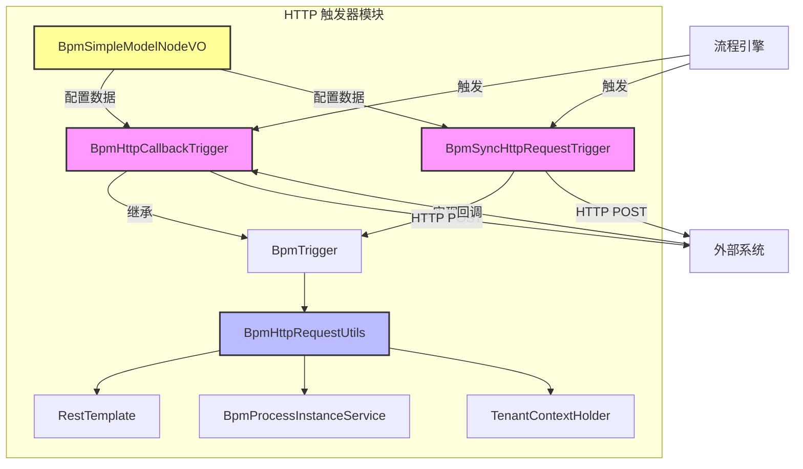
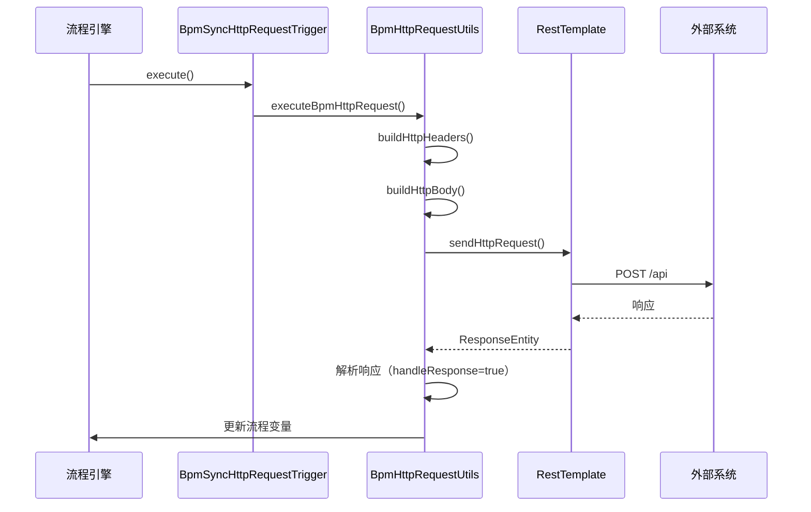
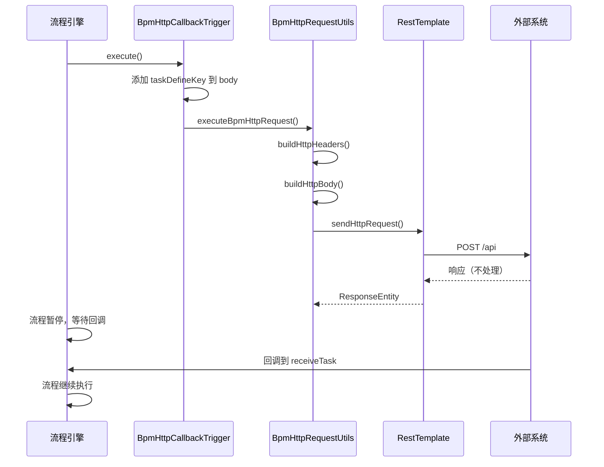

# HTTP 触发器模块文档 (http_2)

## 1. 模块概述

HTTP 触发器模块是 BPM（业务流程管理）模块的核心组件，负责在流程执行过程中与外部系统进行 HTTP 交互。该模块提供了两种主要的 HTTP 触发器类型：

- **HTTP 请求触发器**：流程发起 HTTP 请求后继续执行，无需等待外部响应（异步）
- **HTTP 回调触发器**：流程暂停执行，等待外部系统回调后再继续（同步）

该模块通过统一的抽象接口和工具类，实现了流程引擎与外部系统的解耦，支持灵活的 HTTP 请求配置和响应处理。

## 2. 架构概览



## 3. 核心组件

### 3.1 触发器接口 (BpmTrigger)

定义了触发器的基本规范，所有触发器必须实现该接口：

```java
public interface BpmTrigger {
    BpmTriggerTypeEnum getType();  // 触发器类型
    void execute(String processInstanceId, String param);  // 执行触发逻辑
}
```

### 3.2 触发器类型枚举 (BpmTriggerTypeEnum)

| 类型 | 值 | 描述 |
|------|-----|------|
| HTTP_REQUEST | 1 | 发起 HTTP 请求，流程继续执行 |
| HTTP_CALLBACK | 2 | 接收 HTTP 回调，流程等待回调 |
| FORM_UPDATE | 10 | 更新流程表单数据 |
| FORM_DELETE | 11 | 删除流程表单数据 |

### 3.3 HTTP 请求工具类 (BpmHttpRequestUtils)

提供统一的 HTTP 请求执行和响应处理逻辑：

- **executeBpmHttpRequest**：发起 HTTP 请求，支持是否处理响应
- **buildHttpHeaders**：构建请求头（包含租户 ID、流程变量等）
- **buildHttpBody**：构建请求体（包含固定值、表单变量等）
- **sendHttpRequest**：使用 RestTemplate 发送 POST 请求
- **getNeedUpdatedVariablesFromResponse**：从响应中提取需要更新的流程变量

### 3.4 请求参数类型枚举 (BpmHttpRequestParamTypeEnum)

| 类型 | 值 | 描述 |
|------|-----|------|
| FIXED_VALUE | 1 | 固定值 |
| FROM_FORM | 2 | 来自流程表单变量 |

## 4. 功能详解

### 4.1 HTTP 请求触发器 (BpmSyncHttpRequestTrigger)

**特点**：流程发起 HTTP 请求后不等待响应，直接继续执行。

**使用场景**：
- 通知外部系统流程状态变更
- 异步调用第三方服务
- 日志记录等不需要等待响应的操作

**执行流程**：
1. 解析 HTTP 请求配置（URL、请求头、请求体、响应处理）
2. 获取流程实例
3. 调用 `BpmHttpRequestUtils.executeBpmHttpRequest` 发起请求
4. 如果需要处理响应，解析返回值并更新流程变量

### 4.2 HTTP 回调触发器 (BpmHttpCallbackTrigger)

**特点**：流程发起 HTTP 请求后暂停执行，等待外部系统回调后再继续。

**使用场景**：
- 等待外部系统审批结果
- 异步任务完成后通知流程继续
- 需要与外部系统交互并获取结果的场景

**执行流程**：
1. 解析 HTTP 请求配置
2. 在请求体中添加 `taskDefineKey` 参数（用于回调时定位任务）
3. 调用 `BpmHttpRequestUtils.executeBpmHttpRequest` 发起请求（不处理响应）
4. 流程暂停，等待外部系统回调到指定任务

### 4.3 请求配置结构

HTTP 触发器的配置通过 `BpmSimpleModelNodeVO.TriggerSetting.HttpRequestTriggerSetting` 定义：

```json
{
  "url": "http://example.com/api",
  "header": [
    {
      "type": 1,
      "key": "Authorization",
      "value": "Bearer token"
    }
  ],
  "body": [
    {
      "type": 1,
      "key": "processInstanceId",
      "value": "process_123"
    }
  ],
  "response": [
    {
      "key": "result",
      "value": "status"
    }
  ],
  "callbackTaskDefineKey": "receiveTask_1"
}
```

**字段说明**：
- `url`：请求地址
- `header`：请求头参数列表
- `body`：请求体参数列表
- `response`：响应处理设置（仅 HTTP 请求触发器使用）
- `callbackTaskDefineKey`：回调任务 Key（仅 HTTP 回调触发器使用）

## 5. 数据流

### 5.1 HTTP 请求触发器数据流



### 5.2 HTTP 回调触发器数据流



## 6. 租户支持

HTTP 触发器在请求头中自动添加租户 ID 信息，实现多租户隔离：

- 从 `TenantContextHolder` 获取租户 ID
- 添加到请求头 `HEADER_TENANT_ID` 中
- 外部系统需要根据租户 ID 进行数据隔离

## 7. 错误处理

- 请求失败时记录错误日志并抛出异常
- 响应解析失败时（非 2xx 状态码或响应格式不正确）静默处理
- 配置为空时记录错误日志并返回

## 8. 与其他模块的集成

| 模块 | 集成方式 | 说明 |
|------|---------|------|
| BPM 核心模块 | 通过 BpmSimpleModelNodeVO | 获取流程节点配置 |
| 流程实例服务 | BpmProcessInstanceService | 获取流程实例和变量 |
| 工具模块 | JsonUtils、BpmHttpRequestUtils | JSON 解析和 HTTP 工具 |
| 租户模块 | TenantContextHolder | 租户上下文获取 |
| Spring Web | RestTemplate | HTTP 客户端 |

## 9. 配置示例

### 9.1 HTTP 请求触发器配置

```json
{
  "url": "http://external-system.com/api/notify",
  "header": [
    {
      "type": 1,
      "key": "Content-Type",
      "value": "application/json"
    }
  ],
  "body": [
    {
      "type": 2,
      "key": "processInstanceId",
      "value": "processInstanceId"
    },
    {
      "type": 1,
      "key": "eventType",
      "value": "TASK_COMPLETED"
    }
  ],
  "response": [
    {
      "key": "approvalResult",
      "value": "result"
    }
  ]
}
```

### 9.2 HTTP 回调触发器配置

```json
{
  "url": "http://external-system.com/api/callback",
  "header": [
    {
      "type": 1,
      "key": "Authorization",
      "value": "Bearer token"
    }
  ],
  "body": [
    {
      "type": 2,
      "key": "processInstanceId",
      "value": "processInstanceId"
    }
  ],
  "callbackTaskDefineKey": "receiveApprovalResult"
}
```

## 10. 常见问题

### 10.1 如何配置从流程变量获取请求头值？

将 `type` 设置为 `2 (FROM_FORM)`，`value` 设置为流程变量的名称。

### 10.2 如何处理 HTTP 响应？

在 HTTP 请求触发器中设置 `response` 字段，指定响应中的字段与流程变量的映射关系。

### 10.3 如何确保回调请求能正确找到任务？

在回调触发器配置中正确设置 `callbackTaskDefineKey`，该值需要与 BPMN 定义中的 receiveTask 的 `defineKey` 一致。

### 10.4 如何处理跨域请求？

需要在外部系统配置 CORS 允许来自流程引擎的域名访问。
