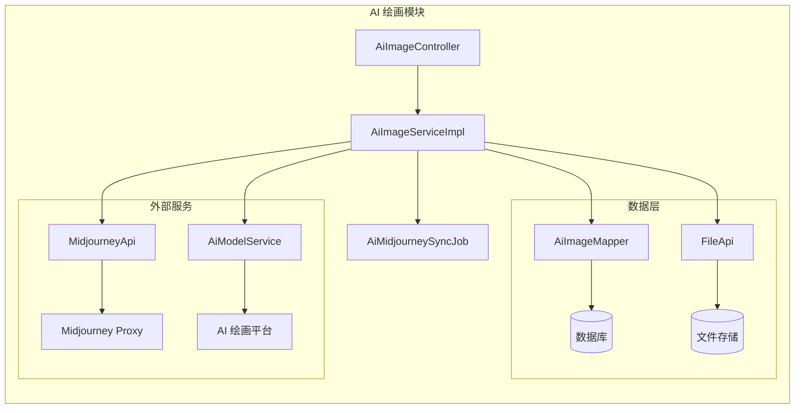
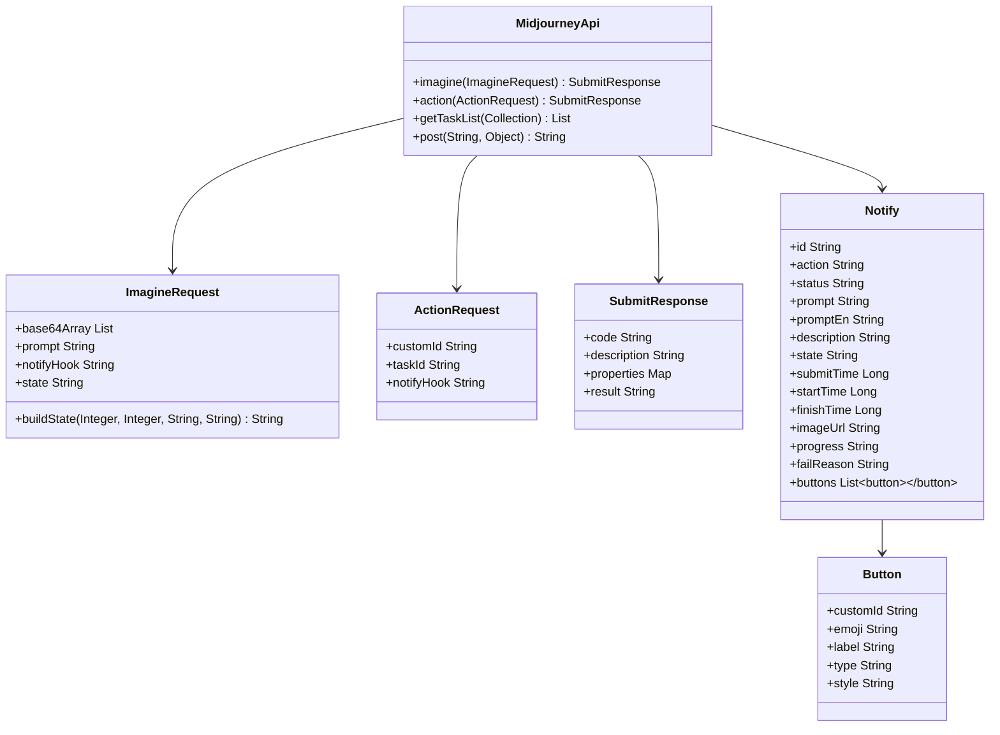
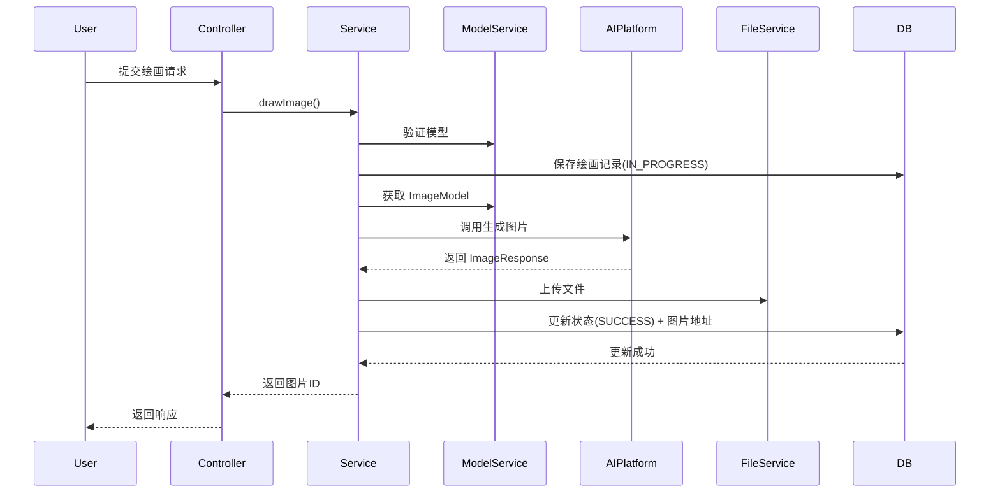
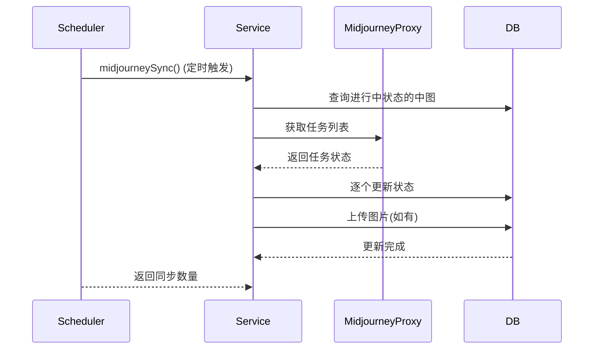
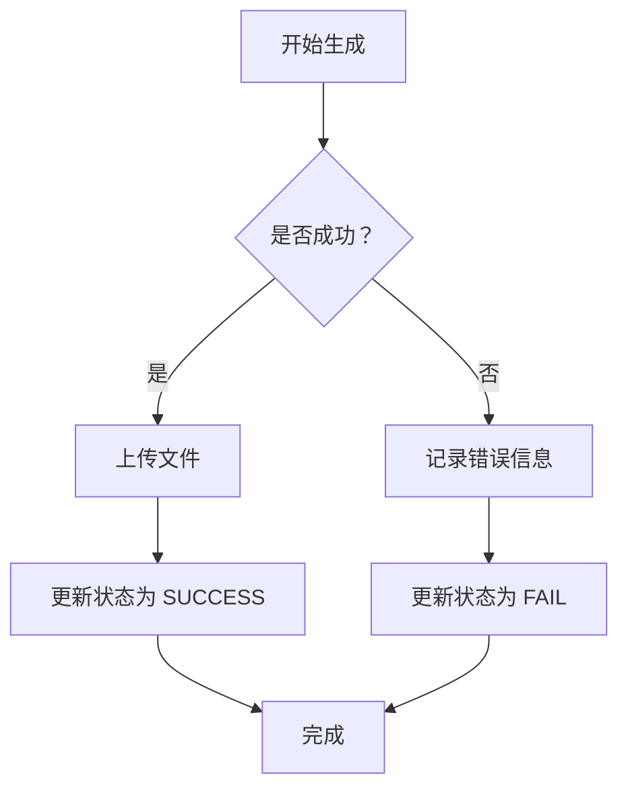

# AI 绘画模块 (Image Module) 文档

## 1. 模块概述

AI 绘画模块是 Yudao 平台中负责生成和管理 AI 生成图片的核心模块。该模块支持多种 AI 绘画平台（如 OpenAI、Midjourney、Stable Diffusion 等），提供图片生成、查询、管理、Midjourney 专属功能等完整能力。

## 2. 架构设计

### 2.1 整体架构



### 2.2 组件关系

- **AiImageController**: 提供 RESTful API 接口，处理前端请求
- **AiImageServiceImpl**: 核心业务逻辑实现，包含图片生成、Midjourney 同步等
- **AiImageMapper**: 数据访问层，操作 AiImageDO 实体
- **AiMidjourneySyncJob**: 定时任务，轮询 Midjourney 任务状态
- **MidjourneyApi**: Midjourney 平台交互封装

## 3. 核心功能

### 3.1 图片生成

支持多种 AI 绘画平台的图片生成：

| 平台 | 说明 |
|------|------|
| OpenAI | DALL-E 系列模型 |
| Silicon Flow | 硅基流动平台 |
| Stable Diffusion | Stable Diffusion 模型 |
| TongYi | 通义千问平台 |
| Midjourney | Midjourney 专属功能 |

**生成流程：**
1. 用户提交绘画请求（包含提示词、尺寸、模型等参数）
2. 系统验证模型有效性
3. 保存绘画记录到数据库（状态：IN_PROGRESS）
4. 异步调用 AI 平台生成图片
5. 生成成功后上传文件服务并更新数据库状态

### 3.2 Midjourney 专属功能

- **imagine**: 提交 Midjourney 绘画任务
- **action**: 执行 Midjourney 操作（放大、缩小、U1/U2 等）
- **notify**: Midjourney 回调通知处理
- **sync**: 定时任务轮询任务状态

### 3.3 图片管理

- 分页查询（个人/公开）
- 图片详情获取
- 图片更新（发布状态）
- 图片删除

## 4. 数据模型

### 4.1 AiImageDO (数据库实体)

```mermaid
erDiagram
    AiImageDO ||--o{ AiModelDO : "modelId"
    AiImageDO {
        Long id PK
        Long userId
        String platform
        String model
        String prompt
        Integer width
        Integer height
        Integer status
        Boolean publicStatus
        String picUrl
        String errorMessage
        Map<String, String> options
        List<Button> buttons
        LocalDateTime finishTime
        LocalDateTime createTime
        String taskId
    }
```

**状态码说明：**
- `IN_PROGRESS`: 进行中
- `SUCCESS`: 成功
- `FAIL`: 失败

### 4.2 MidjourneyApi 数据结构



## 5. API 接口

### 5.1 通用接口

| 接口 | 方法 | 描述 | 权限 |
|------|------|------|------|
| `/ai/image/my-page` | GET | 获取【我的】绘图分页 | - |
| `/ai/image/public-page` | GET | 获取公开的绘图分页 | - |
| `/ai/image/get-my` | GET | 获取【我的】绘图记录 | - |
| `/ai/image/my-list-by-ids` | GET | 获取【我的】绘图记录列表 | - |
| `/ai/image/draw` | POST | 生成图片 | - |
| `/ai/image/delete-my` | DELETE | 删除【我的】绘画记录 | - |
| `/ai/image/page` | GET | 获得绘画分页 | `ai:image:query` |
| `/ai/image/update` | PUT | 更新绘画 | `ai:image:update` |
| `/ai/image/delete` | DELETE | 删除绘画 | `ai:image:delete` |

### 5.2 Midjourney 专属接口

| 接口 | 方法 | 描述 |
|------|------|------|
| `/ai/image/midjourney/imagine` | POST | 【Midjourney】生成图片 |
| `/ai/image/midjourney/notify` | POST | 【Midjourney】通知图片进展（回调） |
| `/ai/image/midjourney/action` | POST | 【Midjourney】Action 操作（二次生成） |

### 5.3 请求/响应 VO

#### AiImageDrawReqVO (绘画请求)

```json
{
  "modelId": 1,
  "prompt": "画一个长城",
  "height": 1024,
  "width": 1024,
  "options": {
    "style": "realistic",
    "seed": "12345"
  }
}
```

#### AiImageRespVO (绘画响应)

```json
{
  "id": 1,
  "userId": 1,
  "platform": "OpenAI",
  "model": "dall-e-2",
  "prompt": "画一个长城",
  "width": 1024,
  "height": 1024,
  "status": 10,
  "publicStatus": false,
  "picUrl": "https://example.com/image.png",
  "errorMessage": null,
  "options": {},
  "buttons": [],
  "finishTime": "2024-01-01T12:00:00",
  "createTime": "2024-01-01T11:00:00"
}
```

#### AiMidjourneyImagineReqVO (Midjourney 绘画请求)

```json
{
  "prompt": "中国神龙",
  "modelId": 1,
  "width": 1024,
  "height": 1024,
  "version": "6.0",
  "referImageUrl": "https://example.com/image.jpg"
}
```

#### AiMidjourneyActionReqVO (Midjourney 操作请求)

```json
{
  "id": 1,
  "customId": "MJ::JOB::upscale::1::85a4b4c1-8835-46c5-a15c-aea34fad1862"
}
```

## 6. 异步处理

### 6.1 图片生成异步流程



### 6.2 Midjourney 同步定时任务



## 7. 错误处理

### 7.1 常见错误

| 错误码 | 描述 | 处理建议 |
|--------|------|----------|
| IMAGE_NOT_EXISTS | 图片不存在 | 检查图片ID是否正确 |
| IMAGE_MIDJOURNEY_SUBMIT_FAIL | Midjourney 提交失败 | 检查余额或参数 |
| IMAGE_CUSTOM_ID_NOT_EXISTS | 自定义ID不存在 | 检查按钮ID是否有效 |

### 7.2 异常处理流程



## 8. 依赖模块

| 模块 | 依赖说明 |
|------|----------|
| **AI 模型模块** | 获取模型信息、验证模型有效性 |
| **文件存储模块** | 上传生成的图片文件 |
| **定时任务模块** | Midjourney 状态轮询 |
| **权限模块** | 接口访问控制 |
| **租户模块** | 多租户支持（Midjourney 回调忽略租户） |

## 9. 配置项

### 9.1 MidjourneyApi 配置

```java
public MidjourneyApi(String baseUrl, String apiKey, String notifyUrl) {
    this.webClient = WebClient.builder()
            .baseUrl(baseUrl)
            .defaultHeaders(httpHeaders -> {
                httpHeaders.setContentType(MediaType.APPLICATION_JSON);
                httpHeaders.setBearerAuth(apiKey);
            })
            .build();
    this.notifyUrl = notifyUrl;
}
```

- `baseUrl`: Midjourney Proxy 基础地址
- `apiKey`: API 认证密钥
- `notifyUrl`: 回调通知地址

### 9.2 定时任务配置

`AiMidjourneySyncJob` 通过 Quartz 定时任务触发，轮询 Midjourney 任务状态，确保及时更新绘画结果。

## 10. 扩展点

1. **新平台支持**: 在 `buildImageOptions()` 方法中添加新平台的参数映射
2. **新操作类型**: 在 `MidjourneyApi` 中添加新的 Action 请求类型
3. **文件存储扩展**: 通过 `FileApi` 接口支持不同存储后端
4. **状态扩展**: 添加新的绘画状态枚举值

## 11. 参考文档

- [AI 模型模块](model.md) - 模型管理相关
- [文件存储模块](file.md) - 文件上传下载
- [定时任务模块](job.md) - Quartz 任务配置
- [权限模块](security.md) - 权限控制机制
- [租户模块](tenant.md) - 多租户支持
