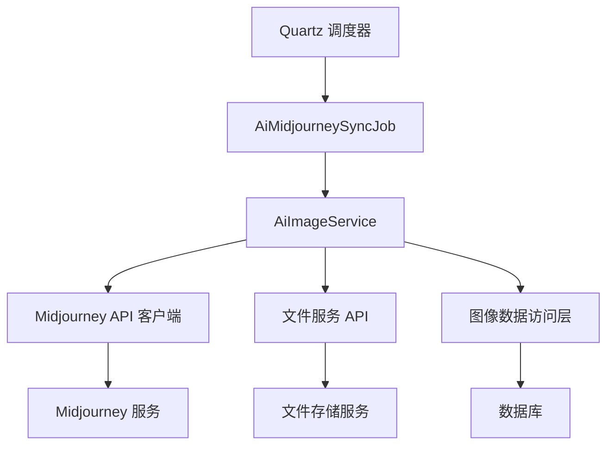
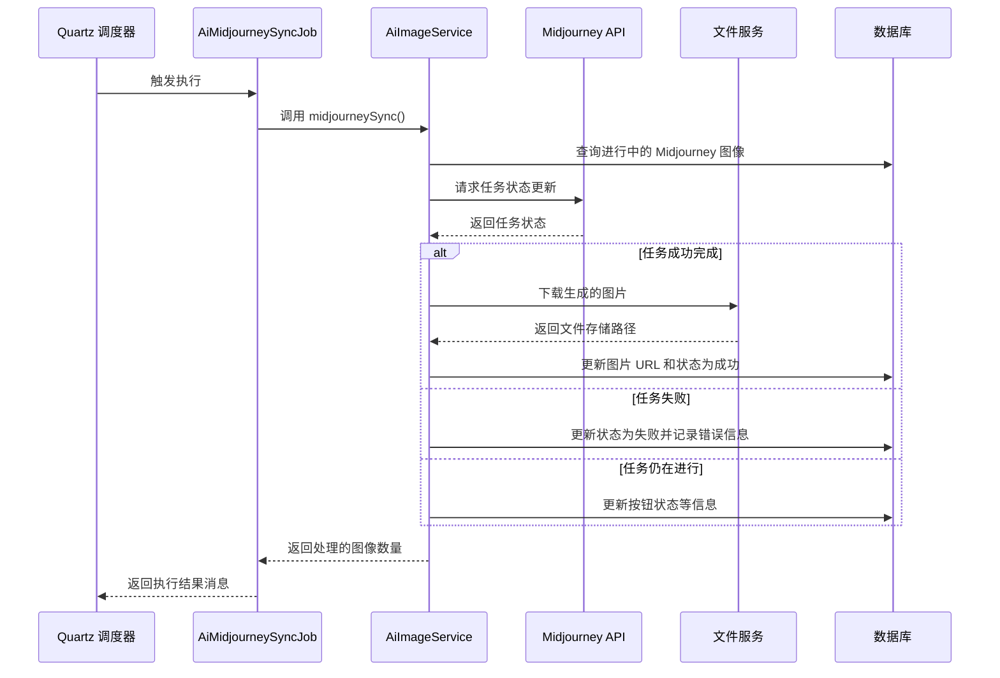

# image_2 模块文档

## 模块概述

image_2 模块是 Yudao AI 模块中的一个 Quartz 定时任务，负责定期同步 Midjourney 图像生成任务的状态。该作业定期查询正在进行中的 Midjourney 图像生成任务，更新它们的状态（成功、失败或进行中），并在完成时下载生成的图片并更新数据库记录。

## 架构概述



## 组件关系

image_2 模块主要与以下组件交互：

- **AiImageService** (`yudao-module-ai/src/main/java/cn/iocoder/yudao/module/ai/service/image/AiImageServiceImpl.java`): 提供图像服务的业务逻辑实现
- **Midjourney API 客户端**: 用于与 Midjourney 服务通信的客户端
- **文件服务 API**: 用于将生成的图片上传到文件存储系统
- **图像数据访问层**: 负责与数据库交互的 Mapper 接口

## 详细组件说明

### AiMidjourneySyncJob

位于 `yudao-module-ai/src/main/java/cn/iocoder/yudao/module/ai/job/image/AiMidjourneySyncJob.java`

这是一个 Quartz 作业处理器，实现了 `JobHandler` 接口。其主要职责是：

1. 作为 Quartz 调度器的入口点
2. 调用 `AiImageService.midjourneySync()` 方法执行实际的同步逻辑
3. 记录同步结果日志
4. 返回同步处理的图像数量

关注点：
- 使用 `@Component` 注解使其成为 Spring 管理的 bean
- 使用 `@Slf4j` 注解进行日志记录
- 通过 `@Resource` 注入 `AiImageService` 依赖
- 实现 `execute(String param)` 方法以满足 `JobHandler` 接口要求

### 与 AiImageService 的交互

虽然 `AiImageServiceImpl` 不在提供了实际的业务逻辑，但`AiMidjourneySyncJob` 通过以下方式与其交互：

1. 调用 `imageService.midjourneySync()` 方法
2. 该方法负责：
   - 查询状态为 "进行中" 且平台为 Midjourney 的图像记录
   - 调用 Midjourney API 获取这些任务的最新状态
   - 根据返回的状态更新数据库记录
   - 当任务完成时，下载生成的图片并更新图片 URL
   - 处理成功和失败的两种情况

## 数据流



## 详细实现

### 核心方法：execute(String param)

```java
@Override
public String execute(String param) {
    Integer count = imageService.midjourneySync();
    log.info("[execute][同步 Midjourney ({}) 个]", count);
    return String.format("同步 Midjourney %s 个", count);
}
```

这个方法：
1. 调用 `imageService.midjourneySync()` 执行实际的同步操作
2. 记录日志，显示处理了多少个 Midjourney 任务
3. 返回格式化的结果消息

### 依赖注入

```java
@Resource
private AiImageService imageService;
```

通过 Spring 的 `@Resource` 注解注入 `AiImageService` 依赖，使作业能够访问图像服务的所有业务方法。

## 在系统中的角色

image_2 模块在 Yudao AI 系统中扮演着重要的异步任务监控角色：

1. **异步任务监控**：Midjourney 图像生成是一个异步过程，需要轮询来检查完成状态
2. **状态同步**：确保数据库中的图像状态与实际的 Midjourney 任务状态保持同步
3. **结果处理**：当任务完成时，自动下载生成的图片并更新数据库记录
4. **错误处理**：捕获并记录任务失败的原因，更新错误信息

## 配置和使用

作为 Quartz 作业，`AiMidjourneySyncJob` 通过以下方式集成到系统中：

1. 通过 `@Component` 注解自动注册为 Spring Bean
2. 在 Quartz 配置中被引用作为要执行的作业类
3. 通过 cron 表达式或其他触发器配置定期执行

典型的配置可能看起来像：
```java
// 在 Quartz 配置中
JobDetail job = JobBuilder.newJob(AiMidjourneySyncJob.class)
    .withIdentity("midjourneySyncJob")
    .build();

Trigger trigger = TriggerBuilder.newTrigger()
    .withIdentity("midjourneySyncTrigger")
    .withSchedule(CronScheduleBuilder.cronSchedule("0 */5 * * * ?")) // 每5分钟执行一次
    .build();

scheduler.scheduleJob(job, trigger);
```

## 与其他模块的关系

image_2 模块主要与以下模块交互：

- **ai-service-image**: 提供核心的图像服务业务逻辑
- **ai-controller-image**: 提供图像相关的 REST API 接口
- **ai-model-service**: 提供 AI 模型管理功能，用于获取 Midjourney API 客户端
- **infra-file**: 提供文件存储服务，用于保存生成的图片

与这些模块的交互都是通过依赖注入和服务调用实现的，保持了良好的解耦和模块化设计。

## 性能和可靠性考虑

1. **批处理**：一次处理所有进行中的 Midjourney 任务，减少 API 调用次数
2. **错误容忍**：单个任务的失败不会影响其他任务的处理
3. **日志记录**：详细的日志便于问题排查和监控
4. **事务管理**：底层的 `midjourneySync` 方法使用事务确保数据一致性

## 依赖说明

此模块依赖于：
- Spring Framework（用于依赖注入和组件管理）
- Quartz Scheduler（用于作业调度）
- AiImageService（用于图像业务逻辑）
- 日志框架（用于运行时监控和调试）

## 最佳实践

1. **幂等性**：该作业设计为幂等的，多次执行不会产生副作用
2. **错误隔离**：单个任务的处理失败不会影响整个批处理过程
3. **资源效率**：批量获取任务状态减少了 API 调用次数
4. **可观测性**：详细的日志记录便于监控和故障排除

## 结论

image_2 模块是 Yudao AI 系统中一个关键的后台任务，负责确保 Midjourney 图像生成任务的状态与数据库保持同步。通过定期轮询 Midjourney API，它确保用户能够及时看到他们的图像生成结果，同时处理成功和失败的情况。该模块设计简洁、可靠，并且与系统的其他部分保持良好的解耦。