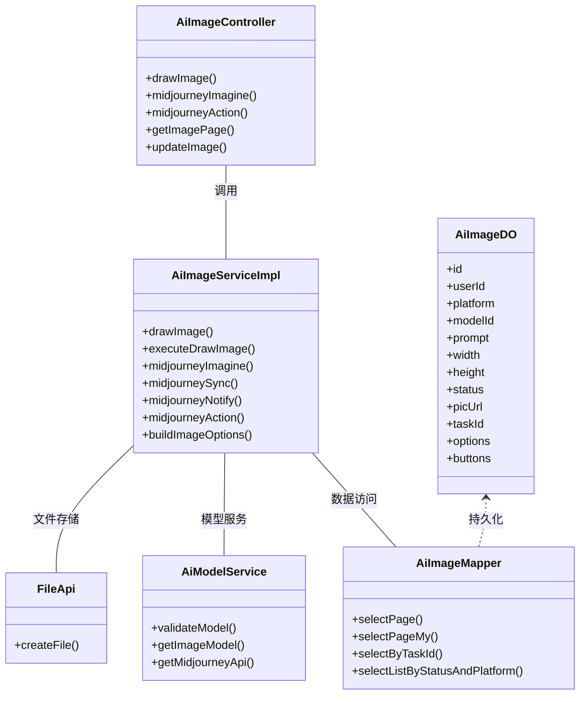
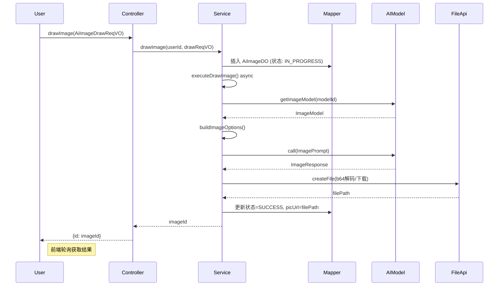
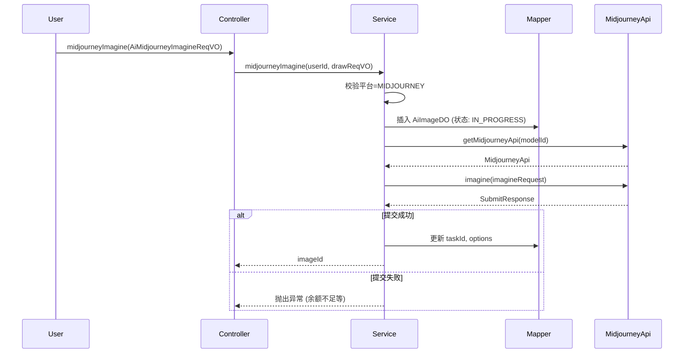
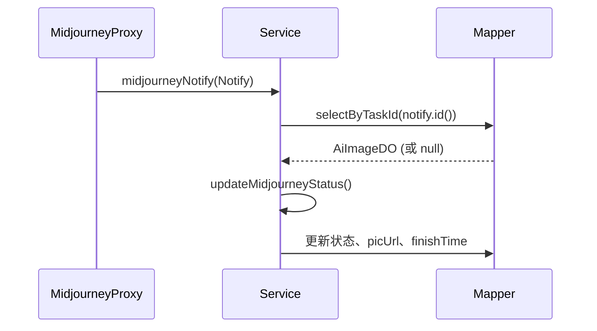
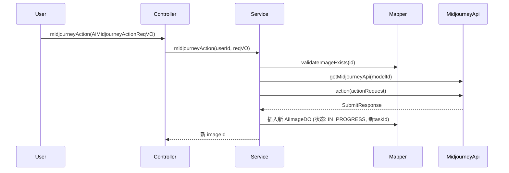
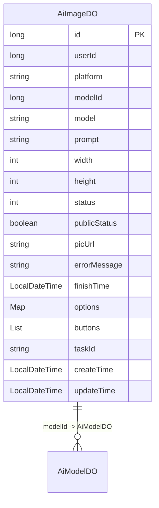

# AI 绘画模块 (image_3) 文档

## 1. 模块概述

AI 绘画模块（image_3）是 Yudao 框架中 AI 功能模块的重要组成部分，主要负责管理 AI 图像生成任务。该模块支持多种 AI 绘画平台（如 OpenAI、Midjourney、Stable Diffusion、SiliconFlow 等），提供图像生成、状态管理、结果查询、Midjourney 专属功能等完整能力。

模块核心功能包括：
- **图像生成**：支持通过文本提示词生成图像，异步处理生成任务
- **任务管理**：跟踪图像生成状态（进行中、成功、失败），支持分页查询
- **Midjourney 专属**：支持 Midjourney 的 imagine 任务提交、状态轮询、图片操作（放大、变体等）
- **结果存储**：生成的图像自动上传至文件服务，并持久化存储
- **权限控制**：用户只能操作自己的图像记录，支持公开/私有状态管理

## 2. 架构设计

### 2.1 模块组件关系



### 2.2 技术架构

```
┌─────────────────────────────────────────────────────────┐
│                    前端层 (Vue3)                        │
│  - 图像生成表单 (AiImageDrawReqVO)                      │
│  - Midjourney 操作面板                                │
│  - 图像列表分页查询                                   │
└──────────────────────┬──────────────────────────────────┘
                       │ HTTP/REST API
                       ▼
┌─────────────────────────────────────────────────────────┐
│                    控制器层 (Controller)                │
│  - AiImageController                                  │
│  - 请求参数校验 (VO)                                  │
│  - 响应结果封装 (RespVO)                              │
└──────────────────────┬──────────────────────────────────┘
                       │ Service 调用
                       ▼
┌─────────────────────────────────────────────────────────┐
│                    服务层 (Service)                     │
│  - AiImageServiceImpl                                 │
│  ├─ 核心业务：图像生成、状态管理                       │
│  ├─ 异步处理：@Async executeDrawImage                  │
│  ├─ Midjourney 专属：任务轮询、回调处理                │
│  └─ 平台适配：buildImageOptions (OpenAI/SD/MJ等)       │
└──────────────────────┬──────────────────────────────────┘
                       │ Mapper 调用
                       ▼
┌─────────────────────────────────────────────────────────┐
│                    数据访问层 (Mapper)                  │
│  - AiImageMapper                                      │
│  - 继承 BaseMapperX                                   │
│  - 分页查询、状态筛选、任务ID查询                      │
└──────────────────────┬──────────────────────────────────┘
                       │ 数据库
                       ▼
┌─────────────────────────────────────────────────────────┐
│                    数据库 (MySQL)                       │
│  - ai_image 表                                        │
│  - 字段：id, userId, platform, modelId, prompt,       │
│          width, height, status, picUrl, taskId,       │
│          options (JSON), buttons (JSON)               │
└─────────────────────────────────────────────────────────┘

外部依赖：
┌─────────────────────────────────────────────────────────┐
│  AI 模型服务 (AiModelService)                           │
│  ├─ ImageModel (Spring AI)                             │
│  ├─ MidjourneyProxy API                                │
│  └─ 平台枚举：AiPlatformEnum                           │
└─────────────────────────────────────────────────────────┘

┌─────────────────────────────────────────────────────────┐
│  文件存储服务 (FileApi)                               │
│  ├─ 本地存储                                          │
│  ├─ S3                                              │
│  ├─ FTP/SFTP                                        │
│  └─ 数据库存储                                      │
└─────────────────────────────────────────────────────────┘
```

## 3. 核心功能详解

### 3.1 图像生成流程



**关键步骤说明：**

1. **请求接收**：前端提交 `AiImageDrawReqVO`，包含模型ID、提示词、尺寸、平台特定参数
2. **模型校验**：调用 `AiModelService.validateModel()` 验证模型是否存在且可用
3. **记录保存**：在数据库中创建 `AiImageDO` 记录，状态设为 `IN_PROGRESS(10)`
4. **异步执行**：通过 `@Async` 注解的 `executeDrawImage()` 方法异步处理，避免阻塞请求线程
5. **构建请求**：根据平台类型（OpenAI/SD/Midjourney等）构建对应的 `ImageOptions`
6. **调用AI模型**：通过 Spring AI 的 `ImageModel` 接口调用图像生成服务
7. **结果处理**：
   - 获取 Base64 编码或图片 URL
   - 解码为字节数组并上传至文件服务
8. **状态更新**：更新数据库记录为 `SUCCESS(20)` 或 `FAIL(30)`，记录错误信息

### 3.2 Midjourney 专属功能

Midjourney 采用异步回调模式，模块提供了完整的任务管理流程：

#### 3.2.1 任务提交 (`midjourneyImagine`)



#### 3.2.2 状态轮询 (`midjourneySync`)

由定时任务（`AiMidjourneySyncJob`）定期调用，查询所有 `IN_PROGRESS` 状态的 Midjourney 任务：

```mermaid
sequenceDiagram
    participant Scheduler
    participant Service
    participant Mapper
    participant MidjourneyApi

    Scheduler->>Service: midjourneySync()
    Service->>Mapper: selectListByStatusAndPlatform(IN_PROGRESS, MIDJOURNEY)
    Mapper-->>Service: List<AiImageDO>
    Service->>MidjourneyApi: getTaskList(taskIds)
    MidjourneyApi-->>Service: List<Notify>
    for each image in Service
        Service->>Service: updateMidjourneyStatus(image, notify)
        Service->>Mapper: 更新状态、picUrl、buttons
    end
    Service-->>Scheduler: 更新数量
```

#### 3.2.3 回调通知 (`midjourneyNotify`)

Midjourney Proxy 在任务状态变更时主动回调：



#### 3.2.4 图片操作 (`midjourneyAction`)

支持对 Midjourney 生成的图片进行放大（U1-U4）或变体（V1-V4）操作：



### 3.3 多平台适配

`buildImageOptions()` 方法根据模型平台构建不同的图像生成参数：

| 平台 | 类 | 参数 |
|------|-----|------|
| OpenAI | `OpenAiImageOptions` | model, height, width, style, responseFormat |
| SiliconFlow | `SiliconFlowImageOptions` | model, height, width |
| Stable Diffusion | `StabilityAiImageOptions` | model, height, width, seed, cfgScale, steps, sampler, stylePreset, clipGuidancePreset |
| 通义千问 | `DashScopeImageOptions` | model, n, height, width |

## 4. 数据模型

### 4.1 AiImageDO 数据库表



**字段说明：**

| 字段 | 类型 | 说明 |
|------|------|------|
| id | BIGINT | 主键 |
| userId | BIGINT | 用户编号 |
| platform | String | AI 平台（OpenAI、Midjourney、StableDiffusion 等） |
| modelId | BIGINT | 模型外键 |
| model | String | 模型名称（冗余字段） |
| prompt | String | 提示词 |
| width | INT | 图片宽度 |
| height | INT | 图片高度 |
| status | INT | 状态（10-进行中，20-成功，30-失败） |
| publicStatus | BOOLEAN | 是否公开 |
| picUrl | String | 图片存储地址 |
| errorMessage | String | 错误信息 |
| finishTime | DATETIME | 完成时间 |
| options | JSON | 平台特定参数 |
| buttons | JSON | Midjourney 按钮列表 |
| taskId | String | Midjourney 任务ID |

### 4.2 状态枚举

```java
public enum AiImageStatusEnum {
    IN_PROGRESS(10, "进行中"),
    SUCCESS(20, "已完成"),
    FAIL(30, "已失败");
}
```

## 5. API 接口

### 5.1 图像生成

| 方法 | 端点 | 描述 |
|------|------|------|
| POST | /ai/image/draw | 生成图像（普通平台） |
| POST | /ai/image/midjourney/imagine | Midjourney 图像生成 |
| POST | /ai/image/midjourney/action | Midjourney 图片操作（放大/变体） |

**请求示例 (drawImage):**
```json
{
  "modelId": 1,
  "prompt": "一只可爱的北极熊在雪地上",
  "height": 1024,
  "width": 1024,
  "options": {
    "style": "vibrant",
    "seed": "12345"
  }
}
```

**响应:**
```json
{
  "code": 200,
  "message": "成功",
  "data": {
    "id": 1001
  }
}
```

### 5.2 图像查询

| 方法 | 端点 | 描述 |
|------|------|------|
| GET | /ai/image/page | 图像分页（管理员） |
| GET | /ai/image/page/my | 用户个人图像分页 |
| GET | /ai/image/page/public | 公开图像分页 |
| GET | /ai/image/{id} | 获取图像详情 |

### 5.3 图像管理

| 方法 | 端点 | 描述 |
|------|------|------|
| PUT | /ai/image/update | 更新图像（修改公开状态） |
| DELETE | /ai/image/{id} | 删除图像 |

### 5.4 Midjourney 任务管理

| 方法 | 端点 | 描述 |
|------|------|------|
| GET | /ai/image/midjourney/sync | 同步 Midjourney 任务状态（定时任务调用） |
| POST | /ai/image/midjourney/notify | Midjourney 状态回调通知 |

## 6. 依赖模块

AI 绘画模块依赖以下核心模块：

| 模块 | 依赖说明 | 参考文档 |
|------|----------|----------|
| **model (model_4)** | 获取 AI 模型信息、ImageModel 实例、Midjourney API | [model.md](model.md) |
| **infra (file_6)** | 文件存储服务，上传生成的图片 | [infra.md](infra.md) |
| **system (user_18)** | 用户权限校验，关联 userId | [system.md](system.md) |
| **common (collection, string, number)** | 工具类集合 | [common.md](common.md) |

## 7. 异步处理

图像生成使用 `@Async` 注解异步执行，避免阻塞 HTTP 请求线程：

```java
@Async
public void executeDrawImage(AiImageDO image, AiImageDrawReqVO reqVO, AiModelDO model) {
    // 图像生成逻辑
}
```

**注意事项：**
- 需要启用 Spring 的异步支持（`@EnableAsync`）
- 需配置线程池，避免线程耗尽
- 前端需通过轮询或 WebSocket 获取生成结果

## 8. Midjourney 特殊处理

### 8.1 任务状态转换

Midjourney 的任务状态与系统状态的映射：

| Midjourney 状态 | 系统状态 | 说明 |
|----------------|----------|------|
| SUCCESS | SUCCESS(20) | 生成成功，上传图片 |
| FAILURE | FAIL(30) | 生成失败，记录错误 |
| 其他 | 保持 IN_PROGRESS | 继续轮询 |

### 8.2 图片上传策略

- **成功时**：从 `notify.imageUrl()` 下载图片并上传至文件服务
- **失败时**：保留原始 URL 作为备用
- **上传失败时**：回退到原始 URL，记录警告日志

### 8.3 自身代理获取

```java
private AiImageServiceImpl getSelf() {
    return SpringUtil.getBean(getClass());
}
```

用于在类内部调用 `@Async` 方法，避免 AOP 代理问题。

## 9. 错误处理

模块定义了多种错误场景：

| 错误码 | 描述 | 处理 |
|--------|------|------|
| IMAGE_NOT_EXISTS | 图像不存在 | 抛出异常，返回 404 |
| IMAGE_MIDJOURNEY_SUBMIT_FAIL | Midjourney 提交失败 | 根据错误消息提示用户（如余额不足） |
| IMAGE_CUSTOM_ID_NOT_EXISTS | Midjourney Button 不存在 | 抛出异常 |
| 平台不支持 | 未知 AI 平台 | 抛出 IllegalArgumentException |

## 10. 扩展性设计

1. **平台扩展**：通过 `AiPlatformEnum` 枚举和 `buildImageOptions()` 方法，易于添加新的 AI 绘画平台
2. **模型扩展**：依赖 `AiModelService`，支持动态添加/删除模型配置
3. **文件存储扩展**：通过 `FileApi` 接口，支持多种文件存储后端（本地、S3、FTP 等）
4. **Midjourney 扩展**：`MidjourneyApi` 接口抽象，可替换不同的 Midjourney 实现

## 11. 相关组件

### 11.1 VO (Value Object)

| VO | 用途 |
|----|------|
| AiImageDrawReqVO | 图像生成请求参数 |
| AiImagePageReqVO | 图像分页查询参数 |
| AiImagePublicPageReqVO | 公开图像分页查询参数 |
| AiImageUpdateReqVO | 图像更新请求参数 |
| AiMidjourneyImagineReqVO | Midjourney 生成请求参数 |
| AiMidjourneyActionReqVO | Midjourney 操作请求参数 |
| AiImageRespVO | 图像响应数据 |

### 11.2 控制器

- `AiImageController`：图像管理 API 入口

### 11.3 定时任务

- `AiMidjourneySyncJob`：定期轮询 Midjourney 任务状态

### 11.4 枚举

- `AiImageStatusEnum`：图像生成状态
- `AiPlatformEnum`：AI 平台枚举
