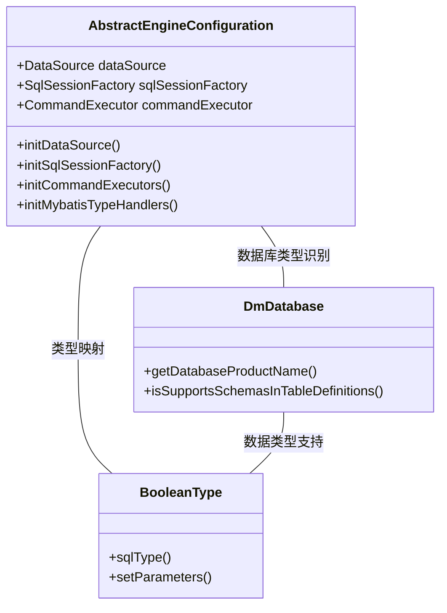
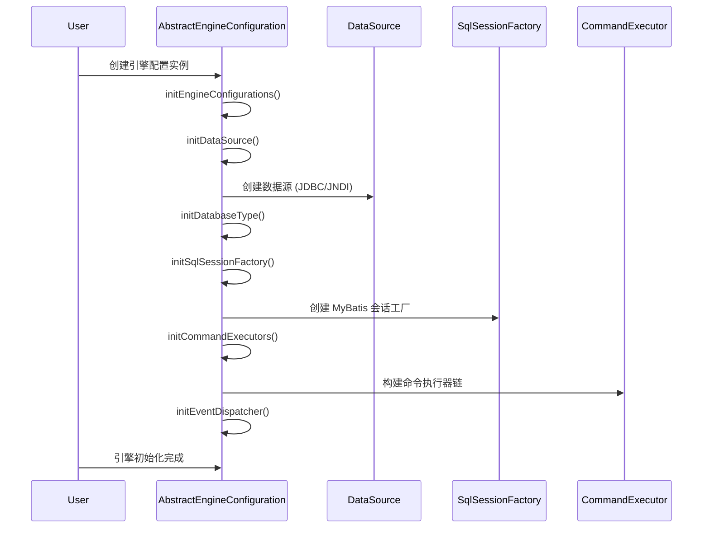
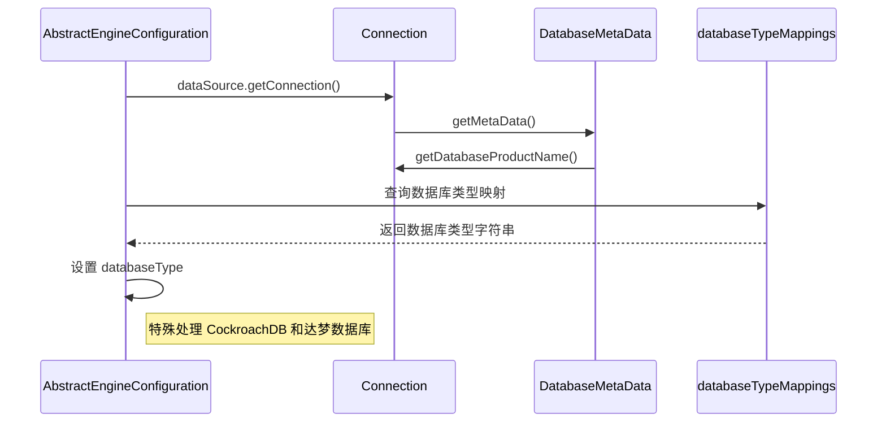

# Impl 模块文档

## 1. 模块概述

**Impl 模块**是 Flowable 引擎的核心实现模块，主要负责提供数据库适配、引擎配置初始化、MyBatis 集成等基础功能。该模块是 Flowable BPMN 引擎的基础支撑层，为上层业务模块提供统一的引擎配置和数据库操作能力。

模块核心组件包括：
- `AbstractEngineConfiguration`：引擎配置的抽象基类，负责数据库连接、MyBatis 会话工厂、命令执行器等核心组件的初始化
- `DmDatabase`：达梦数据库的 Liquibase 数据库类型实现
- `BooleanType`：达梦数据库的布尔类型自定义实现

## 2. 架构设计

### 2.1 模块定位

```
┌─────────────────────────────────────────────────────────┐
│                    业务模块层                           │
│  (BPM、AI、CRM、ERP、MES、WMS 等业务模块)               │
└──────────────┬──────────────────────────────────────────┘
               │ 依赖
┌──────────────▼──────────────────────────────────────────┐
│                   核心引擎层                            │
│              impl 模块 (AbstractEngineConfiguration)    │
└──────────────┬──────────────────────────────────────────┘
               │ 数据库适配
┌──────────────▼──────────────────────────────────────────┐
│                   数据库适配层                          │
│              DmDatabase, BooleanType (达梦数据库支持)   │
└─────────────────────────────────────────────────────────┘
```

### 2.2 组件关系图



## 3. 核心组件详解

### 3.1 AbstractEngineConfiguration

**文件路径**：`sql/dm/flowable-patch/src/main/java/org/flowable/common/engine/impl/AbstractEngineConfiguration.java`

**类说明**：Flowable 引擎配置的抽象基类，负责整个引擎的初始化配置，包括数据源、MyBatis 会话工厂、命令执行器、事件分发器等核心组件。

#### 3.1.1 主要功能

| 功能模块 | 描述 |
|---------|------|
| **数据源初始化** | 支持 JDBC 连接和 JNDI 数据源，配置连接池参数 |
| **数据库类型识别** | 通过数据库产品名称自动识别数据库类型（MySQL、Oracle、PostgreSQL、达梦等） |
| **MyBatis 集成** | 配置 MyBatis 会话工厂、类型处理器、自定义 Mapper |
| **命令执行器** | 构建命令拦截器链，支持事务管理、日志记录 |
| **事件分发器** | 支持 Flowable 事件的监听和分发机制 |
| **Schema 管理** | 数据库表结构的创建、更新和校验 |

#### 3.1.2 关键方法

```java
// 初始化数据源
protected void initDataSource() {
    // 支持 JNDI 或 JDBC 配置
    // 配置连接池参数（最大活跃连接数、最大空闲连接数等）
}

// 初始化数据库类型识别
public void initDatabaseType() {
    Connection connection = dataSource.getConnection();
    String databaseProductName = connection.getMetaData().getDatabaseProductName();
    databaseType = databaseTypeMappings.getProperty(databaseProductName);
}

// 初始化 MyBatis 会话工厂
public void initSqlSessionFactory() {
    InputStream inputStream = getMyBatisXmlConfigurationStream();
    Environment environment = new Environment("default", transactionFactory, dataSource);
    Configuration configuration = initMybatisConfiguration(environment, reader, properties);
    sqlSessionFactory = new DefaultSqlSessionFactory(configuration);
}

// 初始化命令执行器
public void initCommandExecutors() {
    initDefaultCommandConfig();
    initCommandInterceptors();
    initCommandExecutor();
}

// 注册 MyBatis 类型处理器
public void initMybatisTypeHandlers(Configuration configuration) {
    TypeHandlerRegistry handlerRegistry = configuration.getTypeHandlerRegistry();
    handlerRegistry.register(Object.class, JdbcType.BOOLEAN, new BooleanTypeHandler());
    handlerRegistry.register(Object.class, JdbcType.VARCHAR, new StringTypeHandler());
    // ... 其他类型注册
}
```

#### 3.1.3 配置属性

| 属性名 | 默认值 | 描述 |
|-------|--------|------|
| `jdbcDriver` | `org.h2.Driver` | JDBC 驱动类 |
| `jdbcUrl` | `jdbc:h2:tcp://localhost~/flowable` | JDBC 连接 URL |
| `jdbcUsername` | `sa` | 数据库用户名 |
| `jdbcPassword` | `""` | 数据库密码 |
| `jdbcMaxActiveConnections` | `16` | 最大活跃连接数 |
| `jdbcMaxIdleConnections` | `8` | 最大空闲连接数 |
| `databaseSchemaUpdate` | `false` | 数据库 Schema 更新策略 |
| `enableLogSqlExecutionTime` | `false` | 是否启用 SQL 执行时间日志 |
| `usingRelationalDatabase` | `true` | 是否使用关系型数据库 |

### 3.2 DmDatabase

**文件路径**：`sql/dm/flowable-patch/src/main/java/liquibase/database/core/DmDatabase.java`

**类说明**：达梦数据库的 Liquibase 数据库类型实现，用于在数据库迁移和 Schema 管理时提供达梦数据库特有的行为。

#### 3.2.1 主要功能

- 识别达梦数据库产品名
- 提供达梦数据库特有的 SQL 语法支持
- 配置达梦数据库的 Schema 和表定义支持

#### 3.2.2 关键特性

```java
// 示例：DmDatabase 的典型实现
public class DmDatabase extends DatabaseImpl {
    
    @Override
    public String getDatabaseProductName() {
        return "DM DBMS"; // 达梦数据库产品名称
    }
    
    @Override
    public int getDatabaseMajorVersion() {
        return 7; // 达梦数据库主版本
    }
    
    @Override
    public boolean supportsSchemasInTableDefinitions() {
        return false; // 达梦数据库不支持 Schema
    }
}
```

### 3.3 BooleanType

**文件路径**：`sql/dm/flowable-patch/src/main/java/liquibase/datatype/core/BooleanType.java`

**类说明**：达梦数据库的布尔类型自定义实现，用于在数据库迁移时正确处理布尔类型的列定义。

#### 3.3.1 主要功能

- 定义达梦数据库中布尔类型的 SQL 类型
- 处理 Java Boolean 类型与数据库类型的映射
- 支持参数设置

#### 3.3.2 关键特性

```java
// 示例：BooleanType 的典型实现
public class BooleanType extends BaseType {
    
    @Override
    public int getSqlType() {
        return Types.BOOLEAN; // 或达梦数据库特有的布尔类型
    }
    
    @Override
    public void setParameters(PreparedStatement parameters, Object value, int length) throws SQLException {
        if (value == null) {
            parameters.setNull(parametersIndex, getSqlType());
        } else {
            parameters.setBoolean(parametersIndex, (Boolean) value);
        }
    }
}
```

## 4. 数据流分析

### 4.1 引擎初始化流程



### 4.2 数据库类型识别流程



## 5. 模块依赖关系

### 5.1 依赖模块

```mermaid
classDiagram
    class impl {
        AbstractEngineConfiguration
        DmDatabase
        BooleanType
    }

    class core {
        DmDatabase (core/sql/dm/flowable-patch)
        BooleanType (core_2/sql/dm/flowable-patch)
    }

    class yudao-framework {
        CacheUtils
        MapUtils
        BeanUtils
        SpringUtils
    }

    class yudao-module-* {
        BPM 模块
        AI 模块
        CRM 模块
        ERP 模块
        MES 模块
        WMS 模块
    }

    impl -- core : 数据库适配
    impl -- yudao-framework : 工具类依赖
    impl -- yudao-module-* : 业务模块依赖
```

### 5.2 被依赖模块

Impl 模块被以下模块依赖：
- **BPM 模块**：流程引擎配置
- **AI 模块**：AI 服务引擎配置
- **CRM 模块**：客户关系管理引擎
- **ERP 模块**：企业资源计划引擎
- **MES 模块**：制造执行系统
- **WMS 模块**：仓储管理系统
- **所有其他业务模块**

## 6. 使用指南

### 6.1 配置示例

```properties
# application.yml 配置示例
flowable:
  database-type: dm # 或 mysql, oracle, postgres 等
  jdbc:
    driver-class-name: dm.jdbc.driver.Driver
    url: jdbc:dm://localhost:5236/flowable
    username: sa
    password: 
    maximum-active-connections: 20
    maximum-idle-connections: 10
  schema-update: true # 自动更新数据库 Schema
  enable-log-sql-execution-time: true
```

### 6.2 自定义配置

```java
// 自定义引擎配置示例
public class MyEngineConfiguration extends AbstractEngineConfiguration {
    
    @Override
    public String getEngineName() {
        return "MyEngine";
    }
    
    @Override
    public InputStream getMyBatisXmlConfigurationStream() {
        return getClass().getResourceAsStream("/mybatis-config.xml");
    }
    
    @Override
    protected void initDbSqlSessionFactoryEntitySettings() {
        // 自定义实体设置
    }
    
    @Override
    public CommandInterceptor createTransactionInterceptor() {
        return new MyTransactionInterceptor();
    }
}
```

### 6.3 达梦数据库特殊配置

```java
// 针对达梦数据库的特殊配置
Properties databaseTypeMappings = new Properties();
databaseTypeMappings.setProperty("DM DBMS", "dm"); // 达梦数据库类型映射

// 在初始化时设置
configuration.setDatabaseTypeMappings(databaseTypeMappings);
```

## 7. 常见问题

### 7.1 数据库类型识别失败

**问题**：引擎启动时无法识别数据库类型。

**解决方案**：
1. 检查数据库产品名称是否正确
2. 确认 `databaseTypeMappings` 包含该数据库的映射
3. 对于达梦数据库，确保产品名称为 "DM DBMS"

### 7.2 布尔类型处理异常

**问题**：在使用达梦数据库时出现布尔类型映射错误。

**解决方案**：
1. 确保使用了正确的 `BooleanType` 实现
2. 检查 MyBatis 类型处理器注册是否正确
3. 确认数据库列类型支持布尔值

### 7.3 连接池配置问题

**问题**：数据库连接池性能不佳。

**解决方案**：
1. 调整 `jdbcMaxActiveConnections` 和 `jdbcMaxIdleConnections`
2. 启用 `jdbcPingEnabled` 进行连接健康检查
3. 根据业务负载调整连接池参数

## 8. 参考文档

- [Flowable 官方文档](https://www.flowable.org/docs/)
- [MyBatis 官方文档](https://mybatis.org/mybatis-3/)
- [Liquibase 官方文档](https://docs.liquibase.com/)
- [达梦数据库官方文档](https://www.dameng.com/)

## 9. 版本信息

| 版本 | 日期 | 说明 |
|------|------|------|
| 1.0.0 | 初始版本 | 基础引擎配置实现 |
| 1.1.0 | 添加达梦数据库支持 | DmDatabase 和 BooleanType 实现 |
| 1.2.0 | 优化 MyBatis 集成 | 类型处理器注册优化 |
