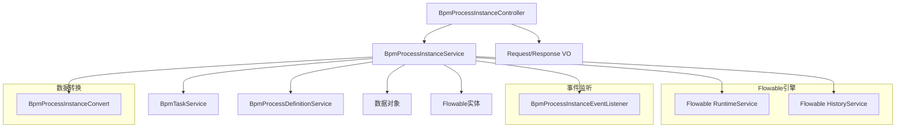
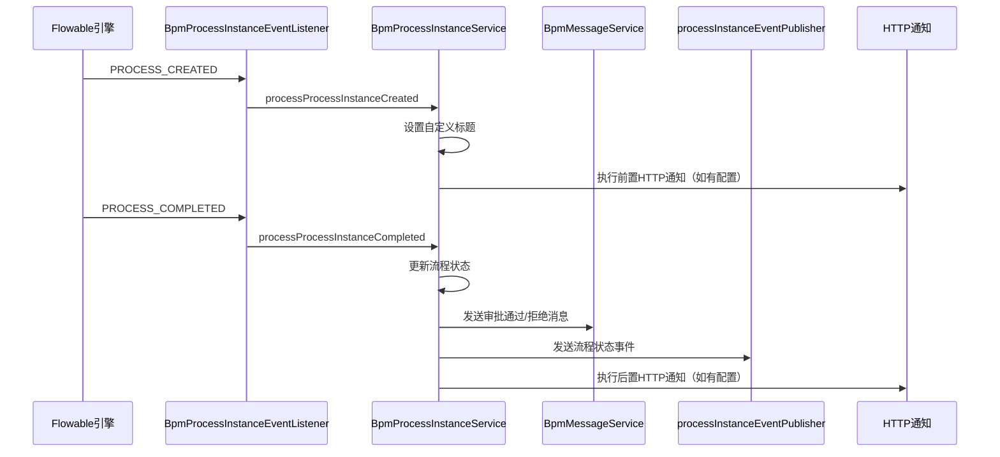

# 流程实例模块 (Instance Module)

## 1. 模块概述

流程实例模块是 BPM（业务流程管理）子系统的核心组件，负责管理流程实例的全生命周期。流程实例是流程定义的一次具体执行，代表一个具体的业务申请（如请假申请、报销申请等）。

该模块提供了以下核心功能：
- **流程实例创建**：根据流程定义发起新的流程实例
- **流程实例查询**：支持分页查询、条件过滤（状态、时间、发起人等）
- **流程实例取消**：支持发起人或管理员取消流程
- **审批详情查看**：展示完整的审批流程、历史节点和预测节点
- **流程实例抄送**：为当前任务创建抄送流程实例
- **打印数据生成**：生成流程实例的打印数据（含签名）

## 2. 架构概览



### 组件关系说明

1. **Controller层**：`BpmProcessInstanceController` 提供 RESTful API，接收前端请求，调用 Service 层处理业务逻辑。
2. **Service层**：`BpmProcessInstanceServiceImpl` 是核心业务逻辑实现，封装了流程实例的创建、查询、取消、审批详情等复杂操作。
3. **Flowable引擎集成**：通过 Flowable 的 `RuntimeService` 和 `HistoryService` 与底层 BPMN 引擎交互。
4. **事件监听**：`BpmProcessInstanceEventListener` 监听流程实例创建、完成、取消等事件，触发后续业务逻辑（如消息通知、后置通知）。
5. **数据转换**：`BpmProcessInstanceConvert` 负责 Flowable 实体、DO、VO 之间的转换。
6. **工具类**：`FlowableUtils` 提供流程实例相关的工具方法，如状态获取、表单变量过滤等。

## 3. 核心功能模块

### 3.1 流程实例创建

**入口**：`BpmProcessInstanceController#createProcessInstance`

**流程**：
1. 校验流程定义是否存在且未挂起
2. 校验发起人是否有权限启动该流程
3. 验证发起人自选审批人配置
4. 设置流程变量（发起人ID、状态、跳过表达式等）
5. 创建流程实例并启动
6. 返回流程实例ID

**关键代码**：
```java
// BpmProcessInstanceServiceImpl#createProcessInstance0
ProcessInstanceBuilder processInstanceBuilder = runtimeService.createProcessInstanceBuilder()
    .processDefinitionId(definition.getId())
    .businessKey(businessKey)
    .variables(variables);
ProcessInstance instance = processInstanceBuilder.start();
```

### 3.2 流程实例查询

**入口**：`BpmProcessInstanceController#getProcessInstanceManagerPage` / `getProcessInstanceMyPage`

**查询条件**：
- 流程名称模糊匹配
- 流程定义标识精确匹配
- 流程状态（运行中、已完成、已取消等）
- 流程分类
- 创建时间范围
- 结束时间范围
- 发起用户编号
- 表单字段查询（通过 JSON 字符串传递）

**实现**：
```java
// BpmProcessInstanceServiceImpl#getProcessInstancePage
HistoricProcessInstanceQuery processInstanceQuery = historyService.createHistoricProcessInstanceQuery()
    .includeProcessVariables()
    .processInstanceTenantId(FlowableUtils.getTenantId())
    .orderByProcessInstanceStartTime().desc();
```

### 3.3 流程实例取消

**入口**：`BpmProcessInstanceController#cancelProcessInstanceByStartUser` / `cancelProcessInstanceByManager`

**取消逻辑**：
1. 校验流程实例存在
2. 校验取消权限（发起人只能取消自己的，管理员可取消任意）
3. 校验流程定义是否允许取消运行中的流程
4. 校验不是子流程
5. 更新流程状态为取消
6. 结束所有子流程
7. 移动任务到结束节点

**关键代码**：
```java
// BpmProcessInstanceServiceImpl#updateProcessInstanceCancel
runtimeService.setVariable(id, BpmnVariableConstants.PROCESS_INSTANCE_VARIABLE_STATUS,
    BpmProcessInstanceStatusEnum.CANCEL.getStatus());
taskService.moveTaskToEnd(id, reason);
```

### 3.4 审批详情查看

**入口**：`BpmProcessInstanceController#getApprovalDetail`

**功能**：展示流程实例的完整审批历史、当前进行中的节点、以及未来预测的节点。

**审批节点分类**：
- **已结束节点**：已完成的审批任务，包含审批人、时间、意见
- **进行中的节点**：当前正在审批的任务，包含候选人列表
- **预测节点**：未来将要执行的节点（基于流程变量预测）

**预测逻辑**：
- 支持 BPMN 设计器：通过 `BpmnModelUtils.simulateProcess()` 模拟流程走向
- 支持 SIMPLE 设计器：通过 `SimpleModelUtils.simulateProcess()` 模拟流程走向

### 3.5 流程实例抄送

**入口**：`BpmProcessInstanceCopyController`

**功能**：为当前任务创建抄送流程实例，让指定用户收到相同的审批任务。

**实现**：
```java
// BpmProcessInstanceCopyServiceImpl#createProcessInstanceCopy
List<BpmProcessInstanceCopyDO> copyList = convertList(userIds, userId -> new BpmProcessInstanceCopyDO()
    .setUserId(userId)
    .setReason(reason)
    .setStartUserId(Long.valueOf(processInstance.getStartUserId()))
    .setProcessInstanceId(processInstanceId)
    .setProcessInstanceName(processInstance.getName())
    .setCategory(processDefinition.getCategory())
    .setTaskId(taskId)
    .setActivityId(activityId)
    .setActivityName(activityName)
    .setProcessDefinitionId(processInstance.getProcessDefinitionId()));
```

### 3.6 打印数据生成

**入口**：`BpmProcessInstanceController#getProcessInstancePrintData`

**功能**：生成流程实例的打印数据，包含流程实例信息、审批任务列表、签名 URL 等。

**输出**：`BpmProcessPrintDataRespVO` 包含：
- 流程实例详情 (`BpmProcessInstanceRespVO`)
- 自定义打印模板开关和 HTML
- 审批任务列表（含签名 URL、任务描述）

## 4. 数据对象

### 4.1 Request VO（请求对象）

| VO 类名 | 描述 | 使用场景 |
|---------|------|----------|
| `BpmProcessInstancePageReqVO` | 流程实例分页查询条件 | 管理后台流程实例列表页 |
| `BpmProcessInstanceCopyPageReqVO` | 流程实例抄送分页查询条件 | 抄送列表页 |
| `BpmProcessInstanceCreateReqVO` | 流程实例创建请求 | 发起新流程 |
| `BpmProcessInstanceCancelReqVO` | 流程实例取消请求 | 取消流程 |
| `BpmApprovalDetailReqVO` | 审批详情请求 | 查看审批详情、预测节点 |

### 4.2 Response VO（响应对象）

| VO 类名 | 描述 | 使用场景 |
|---------|------|----------|
| `BpmProcessInstanceRespVO` | 流程实例响应对象 | 流程实例详情、列表 |
| `BpmProcessPrintDataRespVO` | 流程打印数据响应对象 | 打印预览 |
| `BpmApprovalDetailRespVO` | 审批详情响应对象 | 审批详情页面 |

### 4.3 内部类

`BpmProcessInstanceRespVO` 内部包含 `Task` 静态内部类，用于表示当前流程中的任务信息：
- 任务编号、名称
- 分配人（不返回，仅用于内部赋值）
- 分配人用户信息

## 5. 常量与枚举

### 5.1 流程实例状态枚举

`BpmProcessInstanceStatusEnum` 定义了流程实例的状态：
- `NOT_START`：未开始
- `RUNNING`：运行中（审批中）
- `APPROVE`：审批通过
- `REJECT`：审批拒绝
- `CANCEL`：已取消

### 5.2 流程变量常量

`BpmnVariableConstants` 定义了流程实例相关的变量名：
- `PROCESS_INSTANCE_VARIABLE_STATUS`：流程状态
- `PROCESS_INSTANCE_VARIABLE_REASON`：流程原因（如拒绝理由）
- `PROCESS_INSTANCE_VARIABLE_START_USER_ID`：发起用户 ID
- `PROCESS_INSTANCE_VARIABLE_START_USER_SELECT_ASSIGNEES`：发起人自选审批人
- `PROCESS_INSTANCE_VARIABLE_APPROVE_USER_SELECT_ASSIGNEES`：审批人自选审批人
- `PROCESS_INSTANCE_SKIP_EXPRESSION_ENABLED`：跳过表达式开关

### 5.3 BPMN 模型常量

`BpmnModelConstants` 定义了 BPMN 模型相关的常量：
- `START_USER_NODE_ID`：发起人节点 ID（"StartUserNode"）
- `START_EVENT_NODE_ID`：开始事件节点 ID（"StartEvent"）
- `SIGN_ENABLE`：是否需要签名
- `FORM_FIELD_PERMISSION_ELEMENT`：表单字段权限扩展元素

## 6. 事件监听机制

`BpmProcessInstanceEventListener` 监听 Flowable 引擎的事件：

| 事件类型 | 触发时机 | 处理逻辑 |
|----------|----------|----------|
| `PROCESS_CREATED` | 流程实例创建完成 | 调用 `processProcessInstanceCreated`，设置自定义标题、执行前置 HTTP 通知 |
| `PROCESS_COMPLETED` | 流程实例完成 | 调用 `processProcessInstanceCompleted`，更新状态为审批通过/拒绝、发送消息通知、执行后置 HTTP 通知 |
| `PROCESS_CANCELLED` | 流程实例取消 | 特殊处理：跳转到 EndEvent 时，调用 `processProcessInstanceCompleted` |

### 事件处理流程



## 7. 与模块的依赖关系

### 7.1 依赖模块

| 模块 | 依赖组件 | 用途 |
|------|----------|------|
| **System模块** | `AdminUserApi`, `DeptApi` | 获取用户、部门信息 |
| **BPM模块** | `BpmTaskService`, `BpmProcessDefinitionService` | 任务管理、流程定义查询 |
| **Tenant模块** | `TenantContextHolder`, `TenantUtils` | 租户隔离处理 |
| **MQ模块** | `BpmMessageService` | 流程消息通知 |

### 7.2 被依赖模块

| 模块 | 被依赖组件 | 用途 |
|------|------------|------|
| **UI层** | `BpmProcessInstanceRespVO`, `BpmApprovalDetailReqVO` | 前端 API 接口 |
| **Convert层** | `BpmProcessInstanceConvert` | 对象转换 |

## 8. API 接口说明

| 接口路径 | 方法 | 描述 | 权限 |
|----------|------|------|------|
| `/bpm/process-instance/my-page` | GET | 我的流程分页 | `bpm:process-instance:query` |
| `/bpm/process-instance/manager-page` | GET | 管理流程实例分页 | `bpm:process-instance:manager-query` |
| `/bpm/process-instance/create` | POST | 创建流程实例 | `bpm:process-instance:query` |
| `/bpm/process-instance/get` | GET | 获取流程实例详情 | `bpm:process-instance:query` |
| `/bpm/process-instance/cancel-by-start-user` | DELETE | 发起人取消流程 | `bpm:process-instance:cancel` |
| `/bpm/process-instance/cancel-by-admin` | DELETE | 管理员取消流程 | `bpm:process-instance:cancel-by-admin` |
| `/bpm/process-instance/get-approval-detail` | GET | 获取审批详情 | `bpm:process-instance:query` |
| `/bpm/process-instance/get-next-approval-nodes` | GET | 获取下一个审批节点 | `bpm:process-instance:query` |
| `/bpm/process-instance/get-bpmn-model-view` | GET | 获取 BPMN 模型视图 | `bpm:process-instance:query` |
| `/bpm/process-instance/get-print-data` | GET | 获取打印数据 | `bpm:process-instance:query` |

## 9. 关键设计要点

### 9.1 流程状态管理

流程状态不仅存储在 Flowable 引擎中，还通过自定义变量 `PROCESS_INSTANCE_VARIABLE_STATUS` 进行管理，以便在历史记录中也能获取状态。

### 9.2 表单字段权限

通过 `getFormFieldsPermission` 方法从 BPMN 模型中解析表单字段权限，实现细粒度的字段级权限控制。

### 9.3 流程预测

支持两种预测模式：
- **BPMN 设计器**：基于 Flowable 的表达式引擎模拟流程走向
- **SIMPLE 设计器**：基于自定义的简单模型模拟流程走向

### 9.4 租户隔离

所有查询操作都通过 `FlowableUtils.getTenantId()` 添加租户 ID 过滤，确保多租户环境下的数据隔离。

### 9.5 数据权限

在创建、取消流程实例时，通过 `@DataPermission(enable = false)` 关闭数据权限，避免因数据权限导致查询不到用户数据的问题。

### 9.6 自定义标题

支持通过流程定义中的标题设置模板，动态生成流程实例标题，支持变量替换（如发起人姓名、流程名称、开始时间等）。

### 9.7 流程抄送

抄送功能通过独立的 `BpmProcessInstanceCopyDO` 表存储抄送记录，与主流程实例关联，实现多实例并行审批。

## 10. 相关文档

- [BPM模块文档](bpm.md) - BPM 模块整体架构
- [任务模块文档](task.md) - 任务管理相关功能
- [流程定义模块文档](definition.md) - 流程定义管理
- [系统模块文档](system.md) - 用户、权限等系统功能