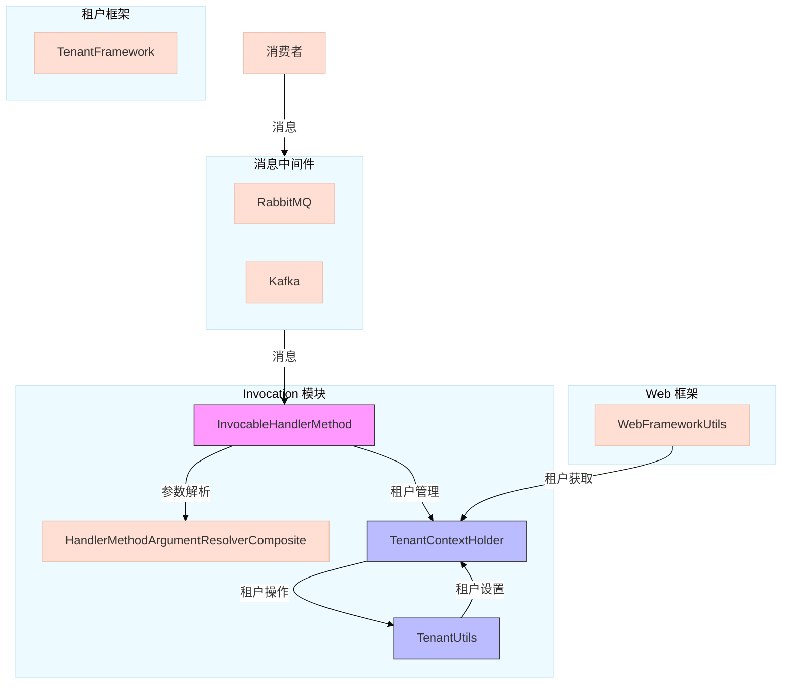
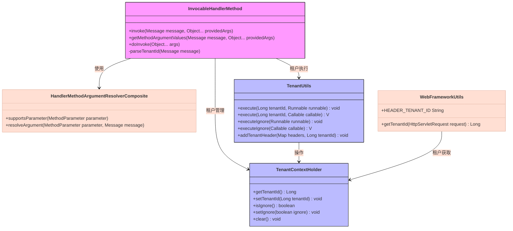
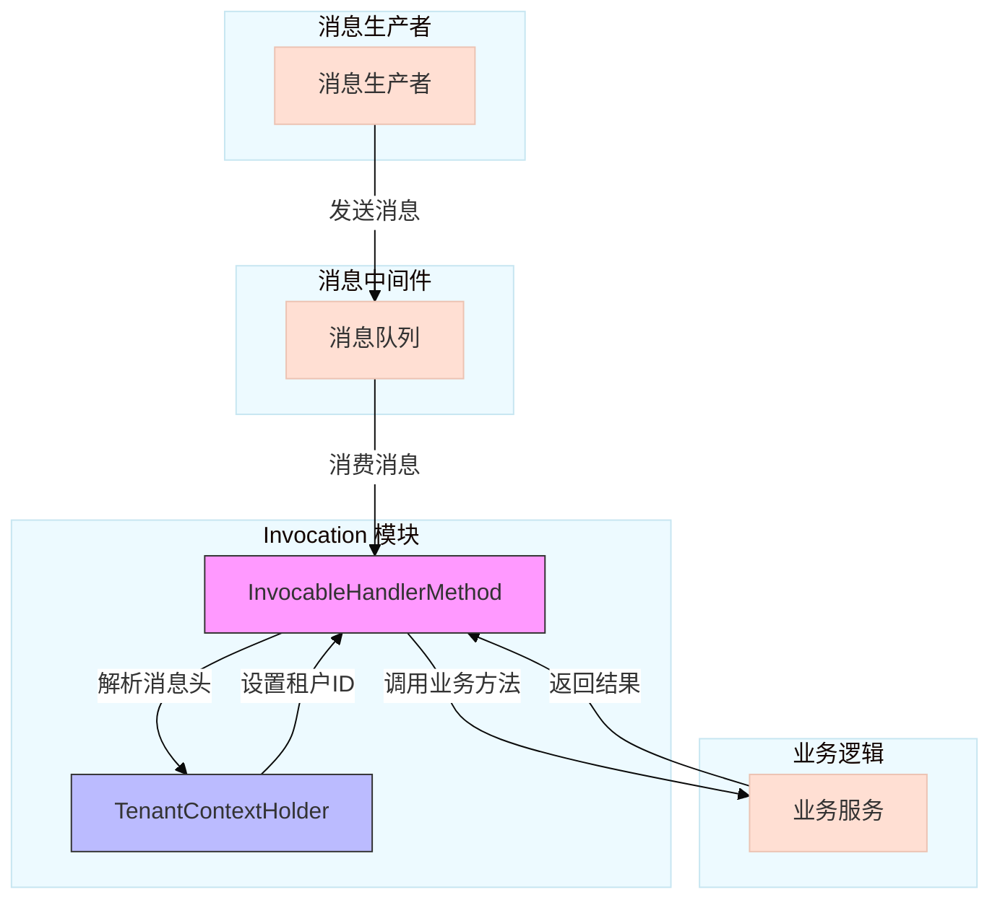
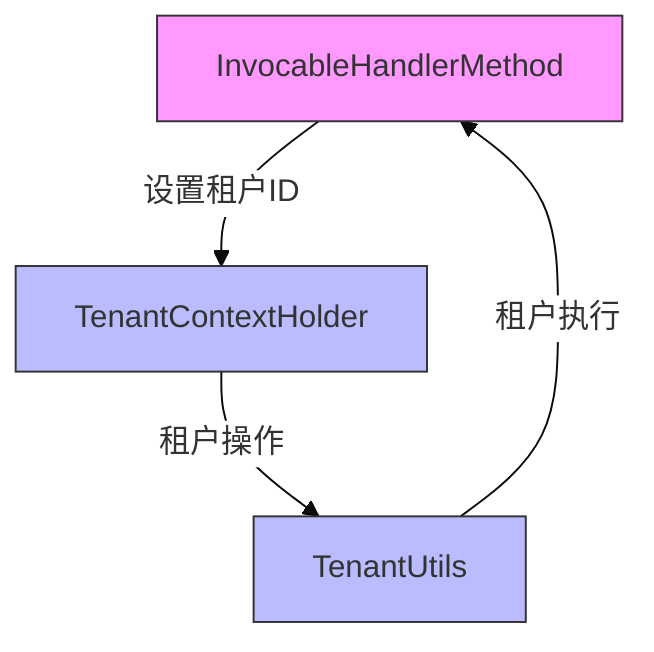

# Invocation 模块文档

## 模块概述

Invocation 模块是 Yudao Framework 中的一个核心组件，主要用于处理消息驱动的方法调用。它是 Spring 消息处理机制的扩展，特别针对 RabbitMQ 和 Kafka 等消息中间件进行了优化。

### 主要功能

1. **消息处理扩展**: 扩展了 Spring 的 `HandlerMethod` 类，使其能够处理消息驱动的方法调用
2. **多租户支持**: 通过与租户框架的集成，实现了在消息处理过程中对租户上下文的自动管理
3. **参数解析**: 提供了灵活的参数解析机制，支持从消息头、消息体等多种方式获取参数
4. **异常处理**: 完善的异常处理机制，确保在消息处理过程中出现异常时能够正确处理

### 核心类

- `InvocableHandlerMethod`: 核心处理类，扩展了 Spring 的 `HandlerMethod`，用于处理消息驱动的方法调用
- `HandlerMethodArgumentResolverComposite`: 参数解析器组合，用于解析方法参数
- `TenantContextHolder`: 租户上下文持有者，用于存储和获取当前租户信息
- `TenantUtils`: 租户工具类，提供租户相关的操作方法

## 架构设计

### 系统架构图



### 组件关系图



## 数据流图



## 核心组件详解

### 1. InvocableHandlerMethod

`InvocableHandlerMethod` 是整个 Invocation 模块的核心类，它扩展了 Spring 的 `HandlerMethod` 类，用于处理消息驱动的方法调用。

#### 主要功能

1. **消息处理**: 通过 `invoke` 方法处理传入的消息，并调用对应的业务方法
2. **租户管理**: 在消息处理过程中自动管理租户上下文
3. **参数解析**: 使用参数解析器从消息中解析方法参数

#### 关键方法

- `invoke(Message<?> message, Object... providedArgs)`: 主要入口方法，处理消息并调用业务方法
- `getMethodArgumentValues(Message<?> message, Object... providedArgs)`: 解析方法参数
- `doInvoke(Object... args)`: 实际调用业务方法
- `parseTenantId(Message<?> message)`: 从消息头中解析租户ID

#### 租户管理机制

```java
@Nullable
public Object invoke(Message<?> message, Object... providedArgs) throws Exception {
    Object[] args = getMethodArgumentValues(message, providedArgs);
    if (logger.isTraceEnabled()) {
        logger.trace("Arguments: " + Arrays.toString(args));
    }
    // 注意：如下是本类的改动点！！！
    // 情况一：无租户编号的情况
    Long tenantId= parseTenantId(message);
    if (tenantId == null) {
        return doInvoke(args);
    }
    // 情况二：有租户的情况下
    return TenantUtils.execute(tenantId, () -> doInvoke(args));
}
```

该方法首先解析消息参数，然后尝试从消息头中获取租户ID。如果存在租户ID，则使用 `TenantUtils.execute()` 方法在特定租户上下文中执行业务逻辑。

### 2. TenantContextHolder

`TenantContextHolder` 是租户上下文的持有者，使用 ThreadLocal 存储当前线程的租户信息。

#### 主要功能

1. **租户ID管理**: 存储和获取当前线程的租户ID
2. **忽略租户标记**: 控制是否忽略租户检查
3. **上下文清理**: 清除当前线程的租户信息

#### 关键方法

- `getTenantId()`: 获取当前租户ID
- `setTenantId(Long tenantId)`: 设置当前租户ID
- `isIgnore()`: 检查是否忽略租户
- `setIgnore(Boolean ignore)`: 设置是否忽略租户
- `clear()`: 清除租户上下文

### 3. TenantUtils

`TenantUtils` 提供了一系列便捷的方法来操作租户上下文。

#### 主要功能

1. **租户执行**: 在特定租户上下文中执行业务逻辑
2. **忽略租户执行**: 在忽略租户检查的情况下执行业务逻辑
3. **租户头管理**: 将租户ID添加到HTTP头中

#### 关键方法

- `execute(Long tenantId, Runnable runnable)`: 在指定租户中执行Runnable
- `execute(Long tenantId, Callable<V> callable)`: 在指定租户中执行Callable
- `executeIgnore(Runnable runnable)`: 在忽略租户的情况下执行Runnable
- `executeIgnore(Callable<V> callable)`: 在忽略租户的情况下执行Callable
- `addTenantHeader(Map<String, String> headers, Long tenantId)`: 将租户ID添加到头中

### 4. WebFrameworkUtils

`WebFrameworkUtils` 是 Web 框架的工具类，提供了与 Web 相关的便捷操作，包括租户ID的获取。

#### 主要功能

1. **租户ID获取**: 从 HTTP 请求头中获取租户ID
2. **用户信息管理**: 设置和获取当前用户的ID和类型
3. **终端检测**: 获取当前请求的终端类型

#### 关键常量

- `HEADER_TENANT_ID`: 租户ID的HTTP头名称
- `HEADER_VISIT_TENANT_ID`: 访问租户ID的HTTP头名称

## 使用示例

### 1. 基本消息处理

```java
// 定义消息处理器
@Component
public class MyMessageHandler {
    
    @RabbitListener(queues = "my.queue")
    public void handleMessage(String message) {
        System.out.println("Received message: " + message);
    }
}
```

### 2. 多租户消息处理

```java
// 定义多租户消息处理器
@Component
public class MyTenantMessageHandler {
    
    @RabbitListener(queues = "my.tenant.queue")
    public void handleTenantMessage(Message<String> message) {
        // InvocableHandlerMethod 会自动处理租户上下文
        System.out.println("Received tenant message: " + message.getPayload());
        Long tenantId = TenantContextHolder.getTenantId();
        System.out.println("Current tenant ID: " + tenantId);
    }
}
```

### 3. 使用 TenantUtils 执行业务逻辑

```java
@Service
public class MyService {
    
    public void processInTenantContext(Long tenantId, Runnable task) {
        TenantUtils.execute(tenantId, () -> {
            // 此处的业务逻辑会在指定的租户上下文中执行
            task.run();
        });
    }
}
```

## 与其他模块的集成

### 1. 与租户框架的集成

Invocation 模块与租户框架紧密集成，通过 `TenantContextHolder` 和 `TenantUtils` 提供了完整的多租户支持。



### 2. 与 Web 框架的集成

通过 `WebFrameworkUtils` 提供了与 Web 框架的集成，可以方便地从 HTTP 请求中获取租户ID。

```java
// 在 Web 请求处理中设置租户ID
@GetMapping("/set-tenant")
public String setTenant(@RequestHeader("tenant-id") Long tenantId) {
    TenantContextHolder.setTenantId(tenantId);
    return "Tenant set successfully";
}
```

### 3. 与消息中间件的集成

Invocation 模块设计上支持多种消息中间件，包括 RabbitMQ 和 Kafka。

```java
// RabbitMQ 消费者示例
@Component
public class RabbitMQMessageHandler {
    
    @RabbitListener(queues = "${rabbitmq.queue.name}")
    public void handleRabbitMQMessage(Message<String> message) {
        // InvocableHandlerMethod 会自动处理消息
        System.out.println("Received RabbitMQ message: " + message.getPayload());
    }
}

// Kafka 消费者示例
@Component
public class KafkaMessageHandler {
    
    @KafkaListener(topics = "${kafka.topic.name}")
    public void handleKafkaMessage(ConsumerRecord<String, String> record) {
        // InvocableHandlerMethod 会自动处理消息
        System.out.println("Received Kafka message: " + record.value());
    }
}
```

## 最佳实践

### 1. 租户上下文管理

始终确保在消息处理完成后清理租户上下文，避免内存泄漏和线程间的数据污染。

```java
try {
    // 处理消息
    processMessage(message);
} finally {
    // 清理租户上下文
    TenantContextHolder.clear();
}
```

### 2. 异常处理

在消息处理过程中，确保正确处理异常，避免影响后续消息的处理。

```java
@RabbitListener(queues = "my.queue")
public void handleMessageWithExceptionHandling(Message<String> message) {
    try {
        // 处理消息
        processMessage(message);
    } catch (Exception e) {
        // 记录错误日志
        logger.error("Failed to process message: " + message.getPayload(), e);
        // 可以选择重新抛出异常或进行其他错误处理
        throw new AmqpRejectAndDontRequeueException("Message processing failed", e);
    }
}
```

### 3. 参数验证

在消息处理前，对消息参数进行充分的验证，确保业务逻辑的正确性。

```java
@RabbitListener(queues = "my.queue")
public void handleValidatedMessage(@Valid MyMessage message) {
    // 处理已验证的消息
    processValidatedMessage(message);
}
```

## 性能优化

### 1. 参数解析优化

合理配置参数解析器，避免不必要的参数解析操作，提高消息处理的性能。

```java
@Configuration
public class MessageConfig {
    
    @Bean
    public HandlerMethodArgumentResolverComposite messageMethodArgumentResolvers() {
        HandlerMethodArgumentResolverComposite resolvers = new HandlerMethodArgumentResolverComposite();
        // 添加必要的参数解析器
        resolvers.addResolver(new MyCustomArgumentResolver());
        return resolvers;
    }
}
```

### 2. 租户上下文优化

在高并发场景下，租户上下文的管理需要特别注意，避免线程安全问题。

```java
// 使用 TransmittableThreadLocal 确保在子线程中正确传递租户上下文
private static final ThreadLocal<Long> TENANT_ID = new TransmittableThreadLocal<>();
```

## 常见问题与解决方案

### 1. 租户上下文丢失

**问题**: 在异步处理或子线程中，租户上下文丢失。

**解决方案**: 使用 `TransmittableThreadLocal` 确保在子线程中正确传递租户上下文。

### 2. 消息处理失败

**问题**: 消息处理过程中出现异常，导致消息处理失败。

**解决方案**: 实现适当的异常处理机制，确保异常不会导致消息处理器崩溃。

### 3. 租户ID解析错误

**问题**: 从消息头中解析租户ID时出现类型转换错误。

**解决方案**: 在 `parseTenantId` 方法中添加多种类型的支持，包括 Long、Number、String 和 byte[]。

## 总结

Invocation 模块作为 Yudao Framework 的核心组件，为消息驱动的应用程序提供了强大的消息处理能力和多租户支持。通过与租户框架的深度集成，它能够在消息处理过程中自动管理租户上下文，确保业务逻辑在正确的租户环境中执行。

该模块的设计充分考虑了扩展性和灵活性，支持多种消息中间件，并提供了完善的异常处理机制。通过合理使用 Invocation 模块，开发者可以构建出高效、可靠的消息驱动应用程序。


## 相关模块文档

- [Tenant 模块文档](tenant.md)
- [Web 框架文档](web-framework.md)
- [RabbitMQ 集成文档](rabbitmq-integration.md)
- [Kafka 集成文档](kafka-integration.md)