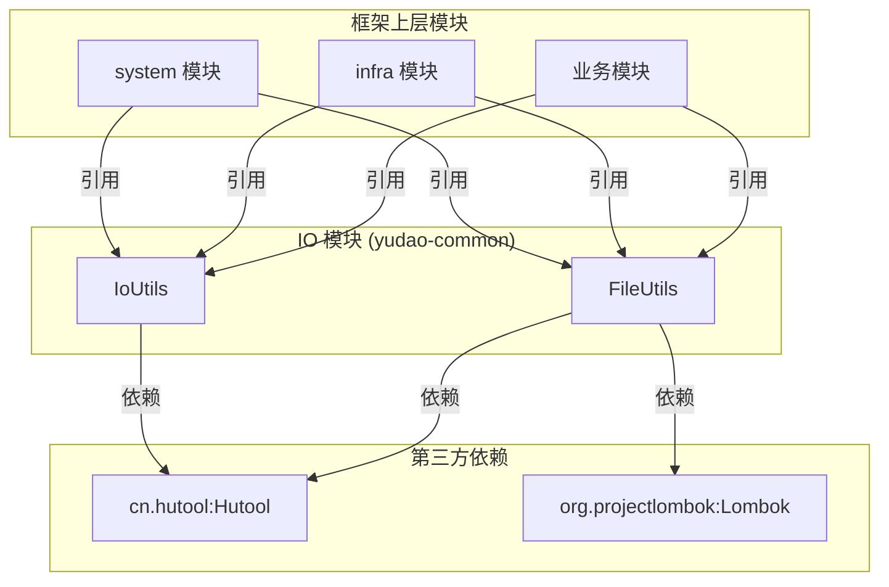
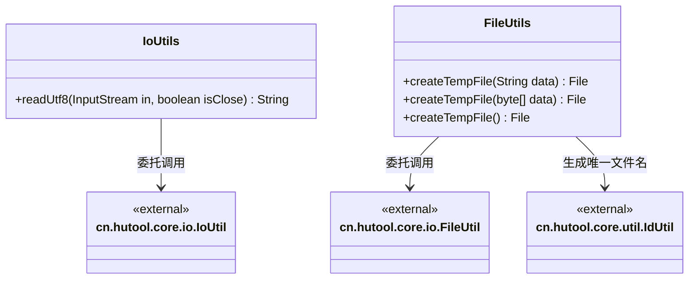
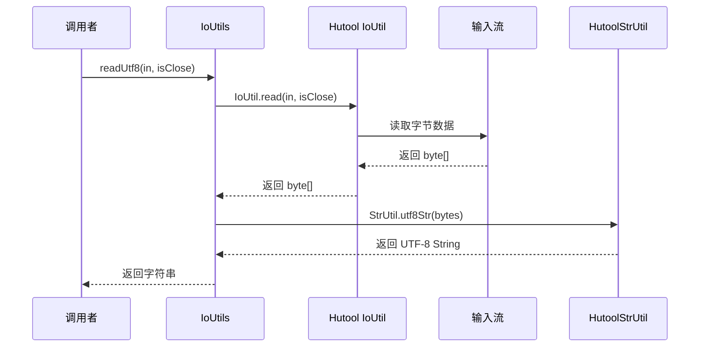

# IO 模块文档

## 1. 模块简介

IO 模块位于 `yudao-framework/yudao-common/src/main/java/cn/iocoder/yudao/framework/common/util/io/` 路径下，是框架基础工具模块的重要组成部分。该模块提供了一套简洁的 IO（输入输出）和文件操作工具类，封装了常见的流读取、临时文件创建等操作，旨在简化开发过程中对 IO 和文件处理的复杂度。

本模块基于 [Hutool](https://hutool.cn/) 工具库进行封装，在 Hutool 已有能力基础上补充了部分缺失的方法，提供更加便捷的 API。

### 1.1 模块定位

IO 模块在整个框架中处于**基础工具层（Common Util）**，被所有上层业务模块（如 system、infra、mall 等）依赖引用。它不依赖任何业务模块，只依赖第三方工具库（Hutool、Lombok）。

### 1.2 核心组件一览

| 组件 | 类名 | 功能描述 |
|------|------|----------|
| IoUtils | `IoUtils.java` | IO 流工具类，提供从 InputStream 中读取 UTF-8 编码内容的方法 |
| FileUtils | `FileUtils.java` | 文件工具类，提供创建临时文件（含内容写入）的便捷方法 |

---

## 2. 架构与依赖关系

### 2.1 模块依赖关系图



### 2.2 内部类关系图



---

## 3. 核心 API 说明

### 3.1 IoUtils — IO 流工具类

**类路径**：`cn.iocoder.yudao.framework.common.util.io.IoUtils`

该类是对 Hutool 中 `cn.hutool.core.io.IoUtil` 的补充，提供了从输入流中读取 UTF-8 编码字符串的便捷方法。

#### 3.1.1 `readUtf8(InputStream in, boolean isClose)`

- **功能**：从输入流中读取 UTF-8 编码的文本内容。
- **参数**：
  - `in`：输入流（`java.io.InputStream`）
  - `isClose`：是否在读取完成后关闭输入流
- **返回值**：读取到的字符串内容
- **异常**：`cn.hutool.core.io.IORuntimeException` — IO 异常时抛出
- **实现原理**：委托 `cn.hutool.core.io.IoUtil.read(in, isClose)` 读取字节内容，再通过 `cn.hutool.core.util.StrUtil.utf8Str()` 方法转换为 UTF-8 字符串。

**使用示例**：

```java
// 读取文件输入流中的 UTF-8 内容
try (InputStream input = new FileInputStream("example.txt")) {
    String content = IoUtils.readUtf8(input, true);
    System.out.println(content);
}
```

### 3.2 FileUtils — 文件工具类

**类路径**：`cn.iocoder.yudao.framework.common.util.io.FileUtils`

该类提供创建临时文件的功能，创建的临时文件会在 JVM 退出时自动删除，适用于需要临时存储数据（如导出文件、缓存等）的场景。

#### 3.2.1 `createTempFile()`

- **功能**：创建一个空的临时文件。
- **返回值**：`java.io.File` 对象
- **特点**：
  - 文件名通过 `cn.hutool.core.util.IdUtil.simpleUUID()` 生成 UUID 确保唯一性
  - 调用 `file.deleteOnExit()` 注册 JVM 退出时自动删除
- **异常**：`java.io.IOException`（通过 Lombok `@SneakyThrows` 隐式处理）

#### 3.2.2 `createTempFile(String data)`

- **功能**：创建临时文件并写入指定的 UTF-8 字符串内容。
- **参数**：
  - `data`：要写入的字符串内容
- **返回值**：`java.io.File` 对象
- **实现**：先调用 `createTempFile()` 创建空文件，再通过 `cn.hutool.core.io.FileUtil.writeUtf8String(data, file)` 写入内容。

#### 3.2.3 `createTempFile(byte[] data)`

- **功能**：创建临时文件并写入指定的字节数组内容。
- **参数**：
  - `data`：要写入的字节数组
- **返回值**：`java.io.File` 对象
- **实现**：先调用 `createTempFile()` 创建空文件，再通过 `cn.hutool.core.io.FileUtil.writeBytes(data, file)` 写入内容。

**使用示例**：

```java
// 创建临时文件并写入文本
File tempFile = FileUtils.createTempFile("Hello, World!");
System.out.println("临时文件路径: " + tempFile.getAbsolutePath());
// JVM 退出时自动删除

// 创建临时文件并写入字节数据
byte[] imageData = ...; // 获取图片字节数据
File imageTemp = FileUtils.createTempFile(imageData);

// 创建空临时文件
File emptyTemp = FileUtils.createTempFile();
```

---

## 4. 数据流与流程说明

### 4.1 IoUtils.readUtf8 数据流



### 4.2 FileUtils.createTempFile 流程

```mermaid
flowchart TD
    A[调用 createTempFile] --> B{是否传入数据?}
    B -->|无参数| C[调用 createTempFile 空文件]
    B -->|String data| D[调用 createTempFile 空文件]
    B -->|byte[] data| E[调用 createTempFile 空文件]
    C --> F[File.createTempFile UUID]
    D --> F
    E --> F
    F --> G[file.deleteOnExit 注册删除钩子]
    G --> H{是否有数据?}
    H -->|无| I[返回 File]
    H -->|String| J[FileUtil.writeUtf8String]
    H -->|byte[]| K[FileUtil.writeBytes]
    J --> I
    K --> I
    I --> L[JVM 退出时自动删除]
```

---

## 5. 与其他模块的关系

IO 模块作为基础工具模块，被以下模块广泛引用：

| 模块名称 | 引用场景 |
|----------|----------|
| **system 模块** | 处理配置文件读取、临时文件生成（如导入导出） |
| **infra 模块** | 文件上传/下载、代码生成中的模板文件处理 |
| **业务模块** (mall、bpm 等) | Excel 导出、报表生成等临时文件操作 |

> 更多关于基础工具模块的信息，请参考 [utils.md](utils.md)。

---

## 6. 注意事项

1. **线程安全**：`IoUtils` 和 `FileUtils` 均为无状态工具类，方法是线程安全的，可在多线程环境下直接调用。
2. **自动清理**：`FileUtils.createTempFile()` 创建的临时文件通过 `file.deleteOnExit()` 实现 JVM 退出时自动删除，但在长期运行的服务器中，建议手动删除不再需要的临时文件以避免磁盘空间占用。
3. **异常处理**：`FileUtils` 使用 Lombok `@SneakyThrows` 注解包装了受检异常，调用方无需显式 try-catch，但需注意潜在的 `IOException` 可能。
4. **依赖关系**：本模块强依赖 Hutool 工具库，确保项目中引入了 `cn.hutool` 相关依赖。

---

## 7. 更新日志

| 版本 | 日期 | 变更内容 |
|------|------|----------|
| 1.0.0 | - | 初始版本，提供 IoUtils 和 FileUtils 基础功能 |
