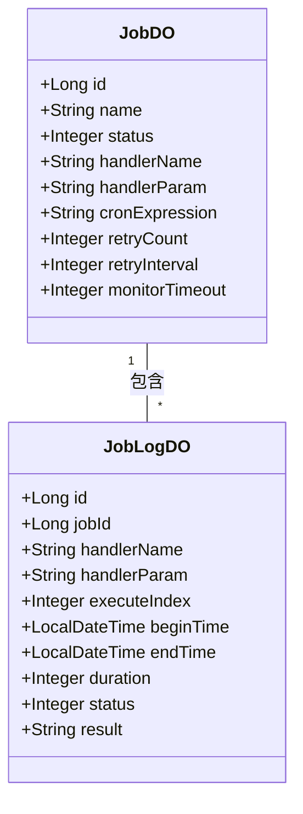

# job_3 模块文档

## 概述

job_3 模块负责系统的定时任务（Job）管理，包括任务的配置、执行和日志记录。

## 架构概述

下图展示了 job_3 模块的核心组件及其关系：

## 子模块

- [作业定义](job_3_job.md)
- [作业执行日志](job_3_job_log.md)

## 与其他模块的关系

job_3 模块是独立的，不依赖其他业务模块，但为其他模块提供定时任务能力。其他模块可以通过配置作业来实现定时任务。