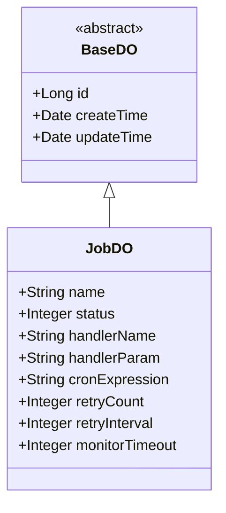

# job_3_job 模块文档

## 概述
job_3_job 模块定义了定时任务的数据对象 (JobDO)，用于存储系统中定时任务的配置信息。它是 Infra 模块下的 job 子模块的一部分，提供了定时任务的基本属性和状态管理。

## 核心功能
- 存储定时任务的基本信息：任务名称、状态、处理器名称、处理器参数、CRON 表达式。
- 管理任务的重试机制：重试次数和重试间隔。
- 支持任务执行监控：通过设置监控超时时间来告警任务执行时间过长。

## 数据结构
JobDO 类继承自 BaseDO，包含以下字段：

| 字段名 | 类型 | 说明 |
|--------|------|------|
| id | Long | 任务编号，主键 |
| name | String | 任务名称 |
| status | Integer | 任务状态，参考 JobStatusEnum 枚举 |
| handlerName | String | 处理器的名字 |
| handlerParam | String | 处理器的参数 |
| cronExpression | String | CRON 表达式，用于定时调度 |
| retryCount | Integer | 重试次数，0 表示不重试 |
| retryInterval | Integer | 重试间隔（毫秒），0 表示没有间隔 |
| monitorTimeout | Integer | 监控超时时间（毫秒），为空表示不监控 |

## 与其他组件的关系
- JobDO 是 Infra 模块中定时任务调度的核心数据对象。
- 它与 Quartz 作业调度框架集成：在 yudao-framework/yudao-spring-boot-starter-job 模块中，JobDO 被用于创建和管理 Quartz 作业。
- 在同一包下，存在 JobLogDO 用于记录定时任务的执行日志，两者共同构成了定时任务的完整生命周期管理。

## 在系统中的定位
job_3_job 模块为整个系统提供了统一的定时任务配置存储。各业务模块（如 AI、BPM、CRM 等）可以通过 Infra 模块的 job 服务来注册、查询和管理自己的定时任务。系统通过读取 JobDO 中的配置，利用 Quartz 框架在指定时间触发对应的任务处理器。

## 架构图
以下是 JobDO 在系统中的简化架构关系图：

## 依赖关系
JobDO 依赖于：
- BaseDO（来自框架）
- JobStatusEnum（来自同一模块的枚举）

## 数据流示例
当一个新的定时任务被创建时：
1. 业务方通过 Infra 模块的 job 服务接口提交任务配置。
2. 服务层将配置封装为 JobDO 对象并持久化到数据库的 infra_job 表。
3. Quartz 调度器定期扫描数据库中的 JobDO 记录，根据 cronExpression 触发对应的 handlerName。
4. 任务执行后，执行结果会被记录到 JobLogDO 中（由 job 服务负责）。

## 注意事项
- 任务状态 (status) 应参照 JobStatusEnum 枚举值，常见值包括：0（正常）、1（暂停）。
- 处理器名称 (handlerName) 必须对应系统中已注册的任务处理器 bean 名称。
- CRON 表达式遵循标准 Quartz CRON 格式。