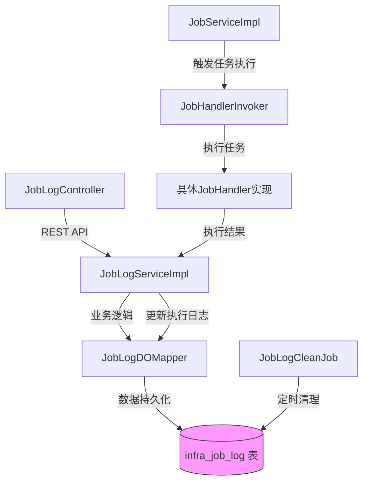
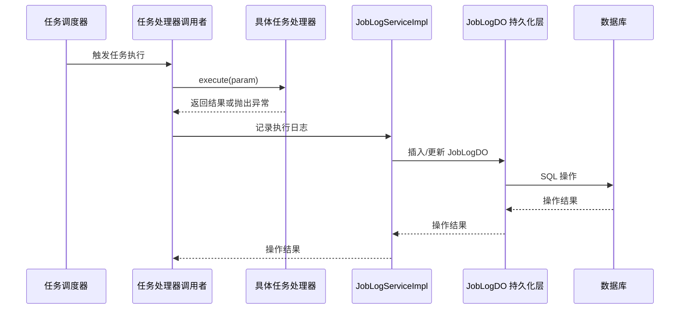

# JobLogDO 模块文档

## 概述

JobLogDO 是 Infra 模块中用于记录定时任务执行日志的数据对象（Data Object）。它继承自 BaseDO，用于持久化存储每次定时任务（Job）执行的详细信息，包括执行状态、开始/结束时间、执行时长以及执行结果（成功返回值或失败异常栈）。

## 核心功能

JobLogDO 的主要职责是：
1. 记录每次定时任务执行的完整生命周期信息
2. 提供任务执行状态查询（成功/失败/运行中等）
3. 存储任务执行结果，便于故障排查和性能分析
4. 支持任务重试机制（通过 executeIndex 字段区分重试执行）
5. 为任务执行监控和告警提供数据基础

## 架构设计

JobLogDO 作为数据持久层的核心实体，位于系统分层架构的数据访问层（DAO），与以下组件协作：

### 关键关系说明

1. **与 JobDO 的关联**：
   - JobLogDO 通过 `jobId` 外键关联到 JobDO（定时任务定义表）
   - 为提升查询性能，JobLogDO 冗余存储了 JobDO 的 `handlerName` 和 `handlerParam` 字段

2. **与服务层的交互**：
   - JobLogServiceImpl 负责 JobLogDO 的 CRUD 操作和业务逻辑
   - 通过 MyBatis-Plus 框架实现数据访问

3. **与任务执行流程的集成**：
   - 任务执行完成后，JobHandlerInvoker 会将执行结果回写到 JobLogServiceImpl
   - JobLogServiceImpl 负责更新 JobLogDO 的状态、耗时和结果字段

4. **与清理机制的配合**：
   - JobLogCleanJob 定期执行，根据配置的保留策略清理过期的 JobLogDO 记录

## 数据流

### 数据流关键点

1. **任务执行开始**：
   - 创建新的 JobLogDO 记录，状态设置为运行中（RUNNING）
   - 记录开始时间（beginTime）和执行索引（executeIndex）

2. **任务执行完成**：
   - 更新 JobLogDO 记录：
     - 设置结束时间（endTime）
     - 计算并设置执行时长（duration）
     - 根据执行结果设置状态（SUCCESS/FAILED）
     - 存储结果（成功：返回值；失败：异常栈）

3. **日志查询**：
   - 通过 JobLogServiceImpl 提供分页查询、状态过滤、时间范围过滤等功能
   - 支持按 jobId 查询特定任务的执行历史

## 字段说明

| 字段名 | 类型 | 说明 | 关联 |
|--------|------|------|------|
| id | Long | 日志主键 | - |
| jobId | Long | 关联的任务ID | JobDO.id |
| handlerName | String | 处理器名称（冗余） | JobDO.handlerName |
| handlerParam | String | 处理器参数（冗余） | JobDO.handlerParam |
| executeIndex | Integer | 执行序号（重试时>1） | - |
| beginTime | LocalDateTime | 开始执行时间 | - |
| endTime | LocalDateTime | 结束执行时间 | - |
| duration | Integer | 执行时长（毫秒） | - |
| status | Integer | 执行状态（JobLogStatusEnum） | - |
| result | String | 执行结果（成功返回值/失败异常） | - |

### JobLogStatusEnum 状态说明

| 状态值 | 含义 | 备注 |
|--------|------|------|
| 0 | 运行中 (RUNNING) | 任务正在执行 |
| 1 | 成功 (SUCCESS) | 任务执行成功 |
| 2 | 失败 (FAILED) | 任务执行失败 |
| 3 | 暂停 (PAUSED) | 任务被暂停（罕见） |
| 4 | 已停止 (STOPPED) | 任务被手动停止 |

## 在系统中的定位

JobLogDO 属于 Infra 模块的作业调度子系统，是整个 Yudao 框架中监控和运维体系的重要组成部分。它为以下功能提供数据支撑：

1. **任务监控平台**：通过 JobLogController 提供的 REST API，前端可展示任务执行状态、历史趋势等
2. **故障诊断**：当任务失败时，开发者可通过查询 JobLogDO 的 result 字段获取详细异常信息
3. **性能分析**：通过分析 duration 字段，可识别执行时间异常长的任务
4. **运维报警**：可基于 JobLogDO 的状态和时间字段设置告警规则（如连续失败、执行超时等）
5. **数据清理**：JobLogCleanJob 定期清理历史日志，防止数据库膨胀

## 与其他模块的关联

虽然 JobLogDO 属于 Infra 模块，但它被系统中的各种业务任务广泛使用。例如：

- [CRM 模块](job_3_job_log.md)：客户跟进记录自动提池 job（CrmCustomerAutoPutPoolJob）会生成执行日志
- [IM 模块](job_3_job_log.md)：实时通话清理 job（ImRtcCallCleanupJob）、参与者超时检测 job（ImRtcParticipantTimeoutJob）
- [IoT 模块](job_3_job_log.md)：设备离线检测 job（IotDeviceOfflineCheckJob）、OTA 升级 job（IotOtaUpgradeJob）
- [统计模块](job_3_job_log.md)：各种统计任务（如 ProductStatisticsJob、TradeStatisticsJob）

> 注：以上链接为示例格式，实际文档中应替换为对应模块的文档文件名（如 `crm_customer_auto_put_pool_job.md`），但由于当前任务仅聚焦于 JobLogDO 模块，此处保持原样。

## 最佳实践

1. **冗余字段设计**：handlerName 和 handlerParam 的冗余存储避免了查询时需要关联 JobDO 表，提升了日志查询性能，尤其在 JobDO 频繁更新的场景下尤为重要
2. **状态机设计**：通过 status 字段结合 beginTime/endTime 实现了简单但有效的任务执行状态追踪
3. **结果存储策略**：将成功结果和失败异常统一存储在 result 字段，简化了数据模型，但在查询时需要根据 status 字段解释结果的含义
4. **租户隔离**：通过 @TenantIgnore 注解表明 JobLogDO 不进行租户隔离，因为任务执行日志通常需要全局监控视角
5. **序列生成**：使用 @KeySequence 注解支持多种数据库的主键序列生成（Oracle、PostgreSQL等），增强了数据库兼容性

## 结论

JobLogDO 作为 Infra 模块的核心数据对象，通过简洁高效的设计为 Yudao 框架提供了可靠的任务执行监控能力。其设计充分考虑了性能、可用性和运维需求，是系统稳定运行的重要基石。