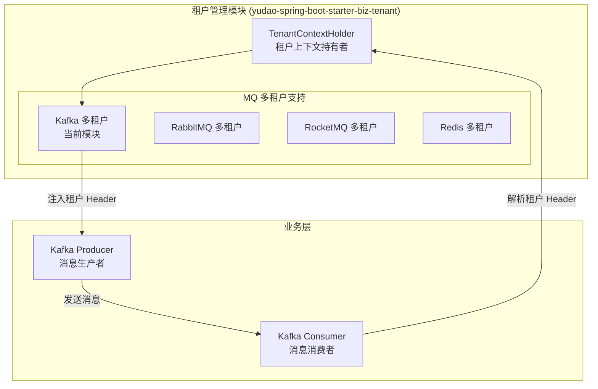
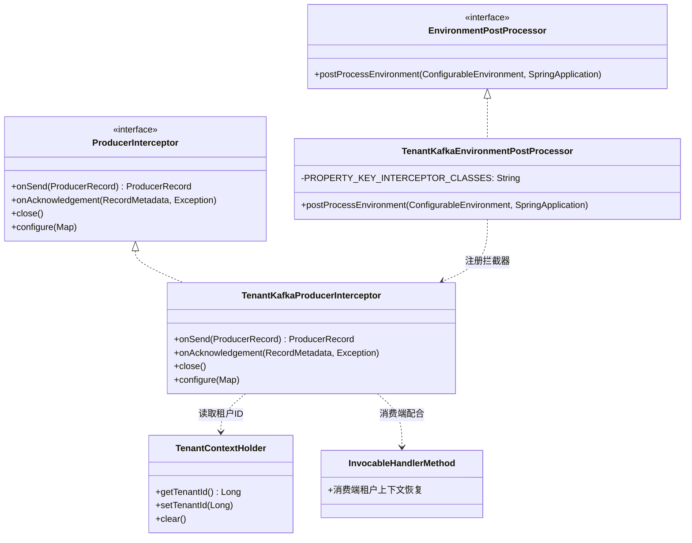
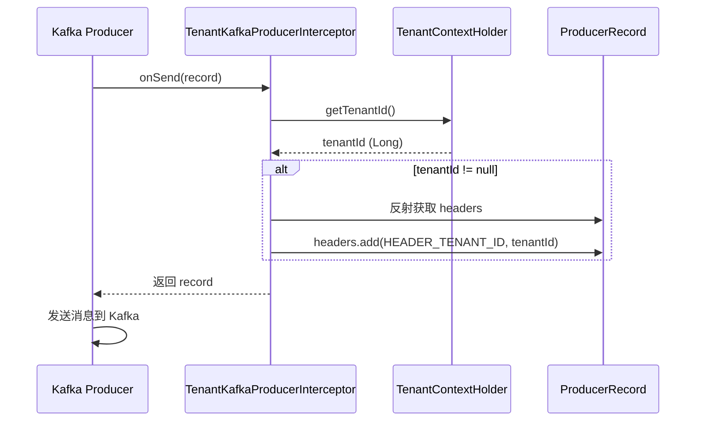
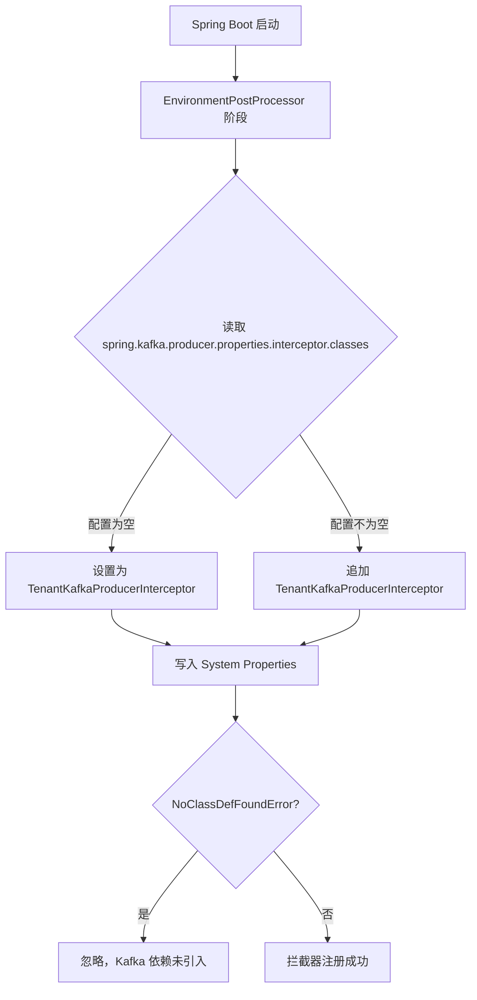

# Kafka 多租户模块

## 概述

Kafka 多租户模块是 yudao 框架中 `yudao-spring-boot-starter-biz-tenant` 模块的一部分，专门负责在 Kafka 消息队列中实现多租户数据的自动透传。该模块通过 Kafka 生产者的拦截器机制，在消息发送时自动将当前租户上下文（`TenantContextHolder` 中的租户编号）注入到消息的 Header 中，从而确保消费者端能够正确识别消息所属的租户，实现租户级别的数据隔离。

## 架构设计

### 模块定位

Kafka 多租户模块位于租户管理基础设施层，与 Redis、RabbitMQ、RocketMQ 的多租户实现并列，共同构成消息队列层面的多租户支持体系。



### 组件关系图



## 核心组件详解

### 1. TenantKafkaProducerInterceptor

**全限定名**: `cn.iocoder.yudao.framework.tenant.core.mq.kafka.TenantKafkaProducerInterceptor`

**功能说明**: Kafka 生产者的拦截器实现，实现了 `org.apache.kafka.clients.producer.ProducerInterceptor` 接口。在消息发送前，自动从 `TenantContextHolder` 获取当前线程的租户编号，并将其注入到 Kafka 消息的 Header 中。

**核心流程**:



**关键实现细节**:

- **租户 ID 获取**: 通过 `TenantContextHolder.getTenantId()` 获取当前线程绑定的租户编号。
- **Header 注入**: 由于 Kafka 的 `ProducerRecord` 中 `headers` 字段为 `private` 且没有公开的 getter 方法，因此使用 Hutool 的 `ReflectUtil.getFieldValue()` 通过反射获取 headers 对象，然后将租户 ID 以字节数组形式添加到 Header 中。
- **Header Key**: 使用 `WebFrameworkUtils.HEADER_TENANT_ID` 作为 Header 的键名，与 Web 层的租户 Header 保持一致。
- **空值处理**: 当 `tenantId` 为 `null` 时（如未启用多租户或后台任务场景），不添加租户 Header，避免污染消息。

### 2. TenantKafkaEnvironmentPostProcessor

**职责**: Spring Boot 环境后处理器，在 Spring 容器启动的早期阶段自动将 `TenantKafkaProducerInterceptor` 注册到 Kafka 生产者的拦截器配置中。

**核心流程**:



**关键实现细节**:

- **配置键**: `spring.kafka.producer.properties.interceptor.classes`，这是 Spring Kafka 用于配置生产者拦截器的标准属性。
- **追加策略**: 如果已有其他拦截器配置，则通过逗号分隔追加，不会覆盖已有配置。
- **异常容错**: 捕获 `NoClassDefFoundError`，当项目中未引入 Kafka 相关依赖时静默跳过，确保模块的可选性。

## 数据流与消息传递

```mermaid
flowchart LR
    subgraph "生产者端"
        A[业务代码] -->|设置租户ID| B[TenantContextHolder]
        B -->|ThreadLocal 存储| C[当前线程]
        C -->|发送消息| D[TenantKafkaProducerInterceptor]
        D -->|注入 Header| E[Kafka ProducerRecord]
        E -->|发送| F[Kafka Broker]
    end
    
    subgraph "消费者端"
        F -->|消费| G[Kafka ConsumerRecord]
        G -->|解析 Header| H[InvocableHandlerMethod]
        H -->|恢复租户ID| I[TenantContextHolder]
        I -->|ThreadLocal 存储| J[消费者线程]
        J -->|业务处理| K[业务服务]
    end
```



## 与其他模块的关系

| 关联模块 | 关系说明 |
|---------|---------|
| [TenantContextHolder](tenant.md) | 租户上下文的持有者，提供 ThreadLocal 级别的租户 ID 存取 |
| [WebFrameworkUtils](web.md) | 提供 `HEADER_TENANT_ID` 常量，确保 HTTP Header 和 Kafka Header 使用相同的租户标识键 |
| [InvocableHandlerMethod](tenant.md) | 消费者端通过覆写 Spring Messaging 的 `InvocableHandlerMethod`，在消费消息前从 Header 中提取租户 ID 并设置到 `TenantContextHolder` |
| [TenantRabbitMQConfiguration](tenant.md) | RabbitMQ 的多租户实现，与 Kafka 模块并列 |
| [TenantRocketMQConfiguration](tenant.md) | RocketMQ 的多租户实现，与 Kafka 模块并列 |
| [TenantRedisMQConfiguration](tenant.md) | RedisMQ 的多租户实现，与 Kafka 模块并列 |

## 配置与使用

### 自动配置

该模块通过 `TenantKafkaEnvironmentPostProcessor` 实现自动配置，无需手动添加任何配置。当项目中同时引入了 `yudao-spring-boot-starter-biz-tenant` 和 `spring-kafka` 依赖时，拦截器会自动注册。

### 手动配置（可选）

如果需要手动控制拦截器的注册顺序或添加其他拦截器，可以在 `application.yml` 中显式配置：

```yaml
spring:
  kafka:
    producer:
      properties:
        interceptor:
          classes: cn.iocoder.yudao.framework.tenant.core.mq.kafka.TenantKafkaProducerInterceptor
```

### 启用条件

- 项目必须引入 `spring-kafka` 依赖
- 多租户功能已启用（`TenantContextHolder` 中有有效的租户 ID）

## 设计要点与注意事项

1. **反射访问 Headers**: 由于 Kafka 的 `ProducerRecord.headers` 字段为 `private` 且无公开 getter，使用反射是必要的权衡。如果未来 Kafka 版本提供了公开的访问方法，建议升级实现方式。

2. **线程安全**: `TenantContextHolder` 基于 `ThreadLocal` 实现，天然线程安全。拦截器在生产者线程中执行，能正确获取当前线程的租户上下文。

3. **消费端配合**: 本模块仅负责生产端的租户 ID 注入，消费端的租户 ID 恢复由 `InvocableHandlerMethod` 的覆写实现完成，两者需配合使用。

4. **性能影响**: 拦截器在每次消息发送时执行，操作仅为读取 ThreadLocal 和添加 Header，性能开销极小。

5. **兼容性**: 通过 `NoClassDefFoundError` 捕获确保在未引入 Kafka 依赖时不会报错，实现了模块的可选性。