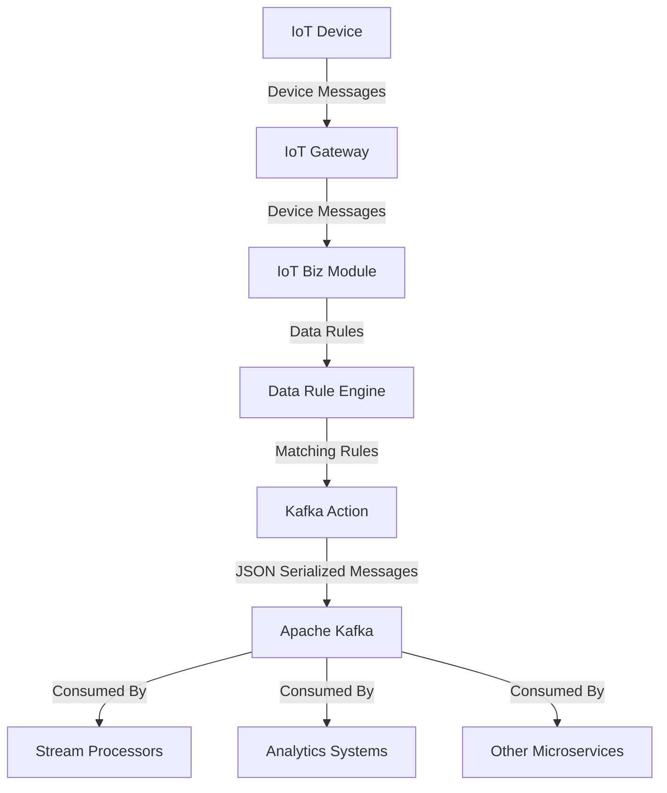
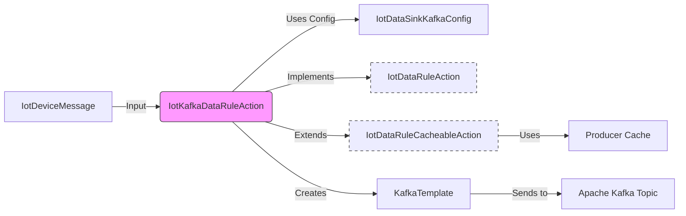
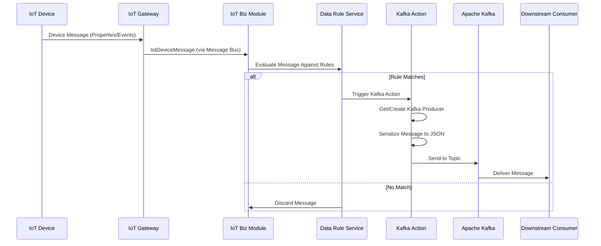

# Kafka Action Module Documentation

## Overview

The Kafka Action module is a component of the IoT rule engine that handles sending IoT device messages to Apache Kafka topics. It implements the `IotDataRuleAction` interface to process device messages and forward them to configured Kafka destinations.

This module enables IoT devices to stream their telemetry data, events, and state changes to Kafka for further processing by downstream systems such as stream processors, analytics platforms, or other microservices.

## Core Components

### IotKafkaDataRuleAction

The main implementation class located at:
`yudao-module-iot/yudao-module-iot-biz/src/main/java/cn/iocoder/yudao/module/iot/service/rule/data/action/IotKafkaDataRuleAction.java`

This class extends `IotDataRuleCacheableAction` and provides Kafka-specific implementation for sending device messages.

#### Key Features:
- **Producer Caching**: Uses a caching mechanism to reuse Kafka producers for the same configuration, improving performance
- **Secure Connections**: Supports SASL/PLAIN authentication and SSL encryption
- **JSON Serialization**: Serializes device messages to JSON format before sending to Kafka
- **Timeout Handling**: Configurable send timeout (default 10 seconds)
- **Result Logging**: Logs successful sends with partition, offset, and timestamp information

#### Dependencies:
- Spring Kafka (`org.springframework.kafka.core.KafkaTemplate`)
- Jackson JSON utilities (`cn.iocoder.yudao.framework.common.util.json.JsonUtils`)
- Apache Kafka clients (`org.apache.kafka.clients.producer.ProducerConfig`)

## Architecture



### Component Relationships



## Data Flow

1. **Device Message Generation**: IoT devices send messages to the IoT Gateway
2. **Message Routing**: Gateway forwards messages to the IoT Biz module via message bus
3. **Rule Evaluation**: Data Rule Service evaluates incoming messages against defined rules
4. **Action Execution**: Matching rules trigger corresponding actions (including Kafka actions)
5. **Message Transformation**: Kafka Action serializes the device message to JSON
6. **Message Delivery**: Serialized message is sent to the configured Kafka topic
7. **Consumption**: Downstream consumers process messages from Kafka topics



## Configuration

The Kafka action uses `IotDataSinkKafkaConfig` for its configuration:

| Property | Type | Description | Required |
|----------|------|-------------|----------|
| bootstrapServers | String | Kafka bootstrap servers (comma-separated list) | Yes |
| username | String | Username for SASL/PLAIN authentication | No |
| password | String | Password for SASL/PLAIN authentication | No |
| ssl | Boolean | Whether to enable SSL encryption | No |
| topic | String | Target Kafka topic name | Yes |

### Example Configuration (JSON)
```json
{
  "bootstrapServers": "localhost:9092",
  "username": "kafka_user",
  "password": "kafka_password",
  "ssl": false,
  "topic": "iot_device_events"
}
```

## Implementation Details

### Producer Caching Mechanism

The Kafka action inherits a producer caching mechanism from `IotDataRuleCacheableAction`:
- Producers are cached based on their configuration
- Cache expires after 30 minutes of inactivity
- Automatic cleanup of producers when cache entries are removed
- Thread-safe producer retrieval and creation

### Message Serialization

Device messages are serialized to JSON using Jackson's `ObjectMapper` via the `JsonUtils.toJsonString()` utility method.

### Error Handling

- Connection failures are logged and re-thrown to trigger cache invalidation
- Send failures are logged with full context (message, config, exception)
- Successful sends are logged at INFO level with metadata (partition, offset, timestamp)

## Integration Points

### Message Flow
The Kafka action is invoked by the `IotDataRuleServiceImpl` when processing device messages that match rules with Kafka sinks.

### Registration
The component is automatically registered as a Spring Bean due to the `@Component` annotation and is conditionally loaded when Kafka classes are present (`@ConditionalOnClass`).

### Dependencies
- Spring Kafka (spring-kafka)
- Apache Kafka clients
- Jackson databind

## Usage

### Creating a Kafka Data Sink
To use this action, create a data sink of type KAFKA (type 32) in the IoT module's data sink management:

1. Navigate to IoT Management → Data Rules → Data Sinks
2. Create a new data sink
3. Select type: Kafka
4. Configure:
   - Bootstrap Servers
   - Username/Password (if authentication required)
   - SSL Enable (if needed)
   - Topic Name

### Creating a Data Rule
Create a data rule that routes device messages to the Kafka sink:

1. Navigate to IoT Management → Data Rules → Data Rules
2. Create a new data rule
3. Define source conditions (product, device, message type, etc.)
4. Add the Kafka data sink as a target
5. Save and enable the rule

## Performance Considerations

1. **Producer Reuse**: The caching mechanism ensures efficient reuse of Kafka producers
2. **Batch Processing**: Consider enabling Kafka producer batching for high-volume scenarios
3. **Connection Pooling**: Monitor Kafka connection counts and adjust cache expiration as needed
4. **Message Size**: Large messages may require increasing Kafka's `message.max.bytes` configuration

## Error Handling and Monitoring

### Logging
- Successful sends: Logged at INFO level with message metadata
- Failed sends: Logged at ERROR level with exception details
- Producer lifecycle events: Logged at INFO level

### Troubleshooting
1. **Connection Issues**: Verify bootstrap servers, credentials, and network connectivity
2. **Authentication Failures**: Check SASL/PLAIN or SSL configuration
3. **Topic Issues**: Ensure topic exists and producer has write permissions
4. **Serialization Problems**: Verify message structure is JSON-serializable

## Related Modules

- [IoT Module](../yudao-module-iot/README.md): Main IoT module containing device management, messaging, and rule engine
- [Data Rule Service](../yudao-module-iot/README.md#data-rule-service): Service that executes data rules and actions
- [Message Bus](../yudao-module-iot/README.md#message-bus): Underlying messaging infrastructure for device communication

## Configuration Properties

The Kafka action doesn't expose specific Spring Boot configuration properties, as it relies on the configuration stored in the database for each data sink. However, the underlying Spring Kafka client can be configured via standard Spring Boot properties if needed.

## Security Considerations

1. **Authentication**: Supports SASL/PLAIN for username/password authentication
2. **Encryption**: Supports SSL/TLS for encrypting data in transit
3. **Authorization**: Depends on Kafka ACLs for topic-level authorization
4. **Secrets Management**: Consider using external secret management for credentials in production

## Future Enhancements

1. **Batch Sending**: Implement batch message sending for improved throughput
2. **Custom Serializers**: Allow custom serializers beyond JSON
3. **Key Selection**: Support for specifying message keys based on device ID or other attributes
4. **Headers Support**: Add support for Kafka message headers
5. **Metrics Integration**: Integrate with Micrometer for Prometheus metrics exposure