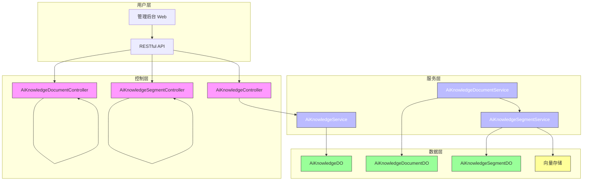
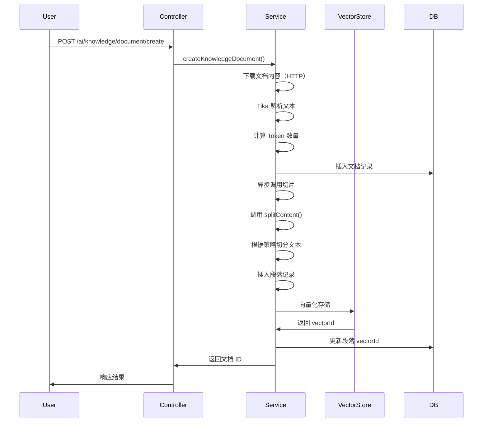
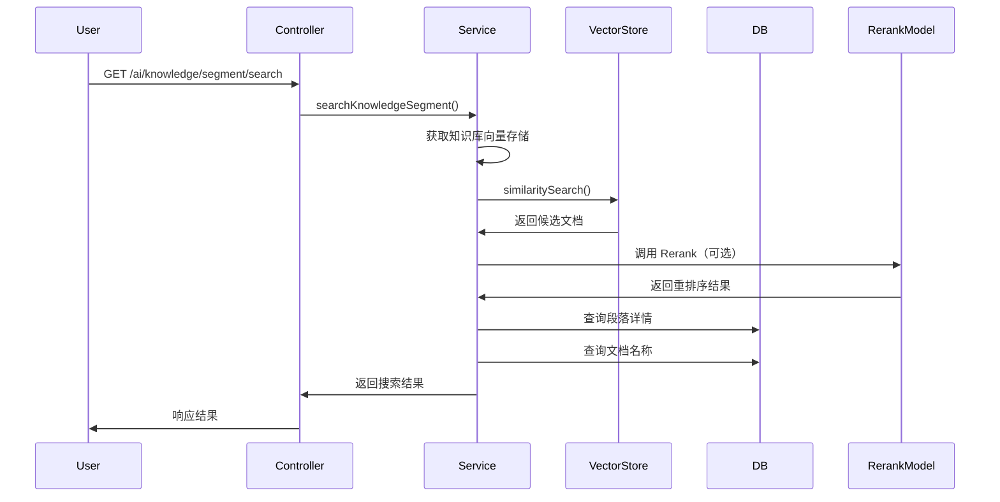

# AI 知识库模块文档

## 1. 模块概述

AI 知识库模块是 Yudao 平台中用于管理 AI 知识问答系统的核心模块，提供知识库、文档、段落的完整生命周期管理，支持文档自动切片、向量存储、语义搜索等功能，为 AI 应用提供结构化知识支持。

## 2. 架构设计

### 2.1 系统架构图



### 2.2 组件关系图

```mermaid
classDiagram
    class AiKnowledgeController {
        +getKnowledgePage()
        +getKnowledge()
        +createKnowledge()
        +updateKnowledge()
        +deleteKnowledge()
        +getKnowledgeSimpleList()
    }

    class AiKnowledgeService {
        +createKnowledge()
        +updateKnowledge()
        +deleteKnowledge()
        +getKnowledge()
        +validateKnowledgeExists()
        +getKnowledgePage()
        +getKnowledgeSimpleListByStatus()
    }

    class AiKnowledgeDO {
        +id
        +name
        +description
        +embeddingModelId
        +embeddingModel
        +topK
        +similarityThreshold
        +status
    }

    class AiKnowledgeDocumentController {
        +getKnowledgeDocumentPage()
        +getKnowledgeDocument()
        +createKnowledgeDocument()
        +createKnowledgeDocumentList()
        +updateKnowledgeDocument()
        +updateKnowledgeDocumentStatus()
        +deleteKnowledgeDocument()
    }

    class AiKnowledgeDocumentService {
        +createKnowledgeDocument()
        +createKnowledgeDocumentList()
        +getKnowledgeDocumentPage()
        +getKnowledgeDocument()
        +updateKnowledgeDocument()
        +updateKnowledgeDocumentStatus()
        +deleteKnowledgeDocument()
        +readUrl()
        +getKnowledgeDocumentList()
        +getKnowledgeDocumentListByKnowledgeId()
        +deleteKnowledgeDocumentByKnowledgeId()
    }

    class AiKnowledgeDocumentDO {
        +id
        +knowledgeId
        +name
        +url
        +content
        +contentLength
        +tokens
        +segmentMaxTokens
        +status
    }

    class AiKnowledgeSegmentController {
        +getKnowledgeSegment()
        +getKnowledgeSegmentPage()
        +createKnowledgeSegment()
        +updateKnowledgeSegment()
        +updateKnowledgeSegmentStatus()
        +deleteKnowledgeSegment()
        +splitContent()
        +getKnowledgeSegmentProcessList()
        +searchKnowledgeSegment()
    }

    class AiKnowledgeSegmentService {
        +createKnowledgeSegmentBySplitContent()
        +updateKnowledgeSegment()
        +deleteKnowledgeSegment()
        +deleteKnowledgeSegmentByDocumentId()
        +updateKnowledgeSegmentStatus()
        +reindexKnowledgeSegmentByKnowledgeId()
        +searchKnowledgeSegment()
        +splitContent()
        +createKnowledgeSegment()
        +getKnowledgeSegment()
        +getKnowledgeSegmentList()
    }

    class AiKnowledgeSegmentDO {
        +id
        +knowledgeId
        +documentId
        +content
        +contentLength
        +tokens
        +vectorId
        +retrievalCount
        +status
    }

    AiKnowledgeController --|依赖| AiKnowledgeService
    AiKnowledgeService --|依赖| AiKnowledgeDO
    AiKnowledgeDocumentController --|依赖| AiKnowledgeDocumentService
    AiKnowledgeDocumentService --|依赖| AiKnowledgeDocumentDO
    AiKnowledgeDocumentService --|依赖| AiKnowledgeSegmentService
    AiKnowledgeSegmentController --|依赖| AiKnowledgeSegmentService
    AiKnowledgeSegmentService --|依赖| AiKnowledgeSegmentDO
    AiKnowledgeSegmentService --|依赖| VectorStore
    AiKnowledgeSegmentService --|依赖| RerankModel
```

## 3. 核心功能

### 3.1 知识库管理

| 功能 | 接口 | 权限 |
|------|------|------|
| 获取知识库分页 | `GET /ai/knowledge/page` | `ai:knowledge:query` |
| 获取知识库详情 | `GET /ai/knowledge/get?id={id}` | `ai:knowledge:query` |
| 创建知识库 | `POST /ai/knowledge/create` | `ai:knowledge:create` |
| 更新知识库 | `PUT /ai/knowledge/update` | `ai:knowledge:update` |
| 删除知识库 | `DELETE /ai/knowledge/delete?id={id}` | `ai:knowledge:delete` |
| 获取启用知识库列表 | `GET /ai/knowledge/simple-list` | - |

**知识库实体（AiKnowledgeDO）：**
- `id`: 主键
- `name`: 知识库名称
- `description`: 知识库描述
- `embeddingModelId`: 向量模型编号（关联 AiModelDO）
- `embeddingModel`: 模型标识（冗余字段）
- `topK`: 检索返回结果数量
- `similarityThreshold`: 相似度阈值
- `status`: 状态（启用/禁用）

### 3.2 文档管理

| 功能 | 接口 | 权限 |
|------|------|------|
| 获取文档分页 | `GET /ai/knowledge/document/page` | `ai:knowledge:query` |
| 获取文档详情 | `GET /ai/knowledge/document/get?id={id}` | `ai:knowledge:query` |
| 创建文档（单个）| `POST /ai/knowledge/document/create` | `ai:knowledge:create` |
| 创建文档（批量）| `POST /ai/knowledge/document/create-list` | `ai:knowledge:create` |
| 更新文档 | `PUT /ai/knowledge/document/update` | `ai:knowledge:update` |
| 更新文档状态 | `PUT /ai/knowledge/document/update-status` | `ai:knowledge:update` |
| 删除文档 | `DELETE /ai/knowledge/document/delete?id={id}` | `ai:knowledge:delete` |

**文档实体（AiKnowledgeDocumentDO）：**
- `id`: 主键
- `knowledgeId`: 知识库编号
- `name`: 文档名称
- `url`: 文档 URL（支持 HTTP/HTTPS 链接）
- `content`: 文档内容（已解析文本）
- `contentLength`: 内容长度
- `tokens`: Token 数量
- `segmentMaxTokens`: 分段最大 Token 数
- `status`: 状态（启用/禁用）

**文档处理流程：**
1. 用户提交文档 URL
2. 系统下载文档内容（支持多种格式）
3. 使用 Tika 解析文档文本
4. 计算 Token 数量
5. 异步调用切片服务创建段落
6. 段落向量化并存储到向量数据库

### 3.3 段落管理

| 功能 | 接口 | 权限 |
|------|------|------|
| 获取段落详情 | `GET /ai/knowledge/segment/get?id={id}` | `ai:knowledge:query` |
| 获取段落分页 | `GET /ai/knowledge/segment/page` | `ai:knowledge:query` |
| 创建段落 | `POST /ai/knowledge/segment/create` | `ai:knowledge:create` |
| 更新段落 | `PUT /ai/knowledge/segment/update` | `ai:knowledge:update` |
| 更新段落状态 | `PUT /ai/knowledge/segment/update-status` | `ai:knowledge:update` |
| 删除段落 | `DELETE /ai/knowledge/segment/delete?id={id}` | `ai:knowledge:delete` |
| 内容切片 | `GET /ai/knowledge/segment/split?url={url}&segmentMaxTokens={value}` | `ai:knowledge:query` |
| 获取处理进度 | `GET /ai/knowledge/segment/get-process-list?documentIds={ids}` | `ai:knowledge:query` |
| 搜索段落 | `GET /ai/knowledge/segment/search` | `ai:knowledge:query` |

**段落实体（AiKnowledgeSegmentDO）：**
- `id`: 主键
- `knowledgeId`: 知识库编号
- `documentId`: 文档编号
- `content`: 段落内容
- `contentLength`: 内容长度
- `tokens`: Token 数量
- `vectorId`: 向量存储 ID
- `retrievalCount`: 检索次数
- `status`: 状态（启用/禁用）

### 3.4 语义搜索

搜索流程：
1. 用户输入查询文本
2. 根据知识库 ID 获取向量存储实例
3. 执行向量相似度搜索（支持 Rerank 重排序）
4. 返回匹配段落及分数
5. 关联文档信息返回给前端

搜索参数：
- `knowledgeId`: 知识库 ID
- `content`: 查询文本
- `topK`: 返回结果数量（默认使用知识库配置）
- `similarityThreshold`: 相似度阈值（默认使用知识库配置）

## 4. 数据流图

### 4.1 文档上传与切片流程



### 4.2 搜索流程



## 5. 关键类说明

### 5.1 切片策略（AiDocumentSplitStrategyEnum）

| 策略 | 适用场景 | 说明 |
|------|----------|------|
| `AUTO` | 自动检测 | 根据文档内容自动选择策略 |
| `MARKDOWN_QA` | Markdown QA 格式 | 针对问答对格式文档，按标题分割 |
| `SEMANTIC` | 普通文档 | 语义切分，保留上下文完整性 |
| `PARAGRAPH` | 段落文档 | 按段落分割，无重叠 |
| `TOKEN` | 通用 | 按 Token 数量切分 |

### 5.2 向量存储元数据

```java
private static final Map<String, Class<?>> VECTOR_STORE_METADATA_TYPES = Map.of(
    VECTOR_STORE_METADATA_KNOWLEDGE_ID, String.class,
    VECTOR_STORE_METADATA_DOCUMENT_ID, String.class,
    VECTOR_STORE_METADATA_SEGMENT_ID, String.class);
```

向量存储中每个段落附加的元数据：
- `knowledgeId`: 知识库 ID（字符串）
- `documentId`: 文档 ID（字符串）
- `segmentId`: 段落 ID（字符串）

### 5.3 异常常量

```java
// 知识库相关
KNOWLEDGE_NOT_EXISTS: 知识库不存在
KNOWLEDGE_NOT_EMPTY: 知识库下存在文档，无法删除

// 文档相关
KNOWLEDGE_DOCUMENT_NOT_EXISTS: 文档不存在
KNOWLEDGE_DOCUMENT_FILE_EMPTY: 文档文件为空
KNOWLEDGE_DOCUMENT_FILE_DOWNLOAD_FAIL: 文档下载失败
KNOWLEDGE_DOCUMENT_FILE_READ_FAIL: 文档读取失败

// 段落相关
KNOWLEDGE_SEGMENT_NOT_EXISTS: 段落不存在
KNOWLEDGE_SEGMENT_CONTENT_TOO_LONG: 段落内容超过限制
```

## 6. 依赖模块

| 模块 | 依赖说明 |
|------|----------|
| **AI 模型模块** | 获取向量模型、创建向量存储实例 |
| **系统模块** | 权限校验、用户认证 |
| **工具模块** | HTTP 下载、文件解析（Tika）、Token 统计 |
| **消息队列** | 异步切片处理（通过 Service 调用） |

## 7. 配置项

知识库配置项（在 AiKnowledgeDO 中）：
- `topK`: 检索时返回的段落数量（默认 5）
- `similarityThreshold`: 相似度阈值（默认 0.6）
- `embeddingModelId`: 使用的向量模型 ID

## 8. 权限控制

使用 Spring Security 的 `@PreAuthorize` 注解进行权限校验：
- `ai:knowledge:query`: 查询权限（获取列表、详情、搜索）
- `ai:knowledge:create`: 创建权限（新建知识库、文档、段落）
- `ai:knowledge:update`: 更新权限（更新知识库、文档、段落、状态）
- `ai:knowledge:delete`: 删除权限（删除知识库、文档、段落）

## 9. 异步处理

以下操作采用异步处理，避免阻塞主线程：
1. 文档创建后的段落切片
2. 知识库模型变更后的重新索引
3. 文档状态启用后的段落重建

## 10. 扩展点

1. **切片策略扩展**：通过 `AiDocumentSplitStrategyEnum` 支持自定义切片策略
2. **向量存储扩展**：通过 `VectorStore` 接口支持不同向量数据库（Pinecone、Qdrant、Milvus 等）
3. **Rerank 扩展**：可选配置重排序模型提升搜索精度
4. **文档格式扩展**：通过 Tika 支持多种文档格式解析（PDF、DOCX、TXT 等）

## 11. 接口示例

### 11.1 创建知识库

**请求：**
```json
POST /ai/knowledge/create
{
  "name": "产品文档知识库",
  "description": "包含产品相关文档的知识库",
  "embeddingModelId": 1,
  "topK": 5,
  "similarityThreshold": 0.6,
  "status": 1
}
```

**响应：**
```json
{
  "code": 200,
  "message": "成功",
  "data": 1001
}
```

### 11.2 创建文档

**请求：**
```json
POST /ai/knowledge/document/create
{
  "knowledgeId": 1,
  "name": "产品手册.pdf",
  "url": "https://example.com/manual.pdf",
  "segmentMaxTokens": 500
}
```

**响应：**
```json
{
  "code": 200,
  "message": "成功",
  "data": 2001
}
```

### 11.3 搜索段落

**请求：**
```json
GET /ai/knowledge/segment/search?knowledgeId=1&content=产品退款政策&topK=3
```

**响应：**
```json
{
  "code": 200,
  "message": "成功",
  "data": [
    {
      "id": 1001,
      "documentId": 2001,
      "knowledgeId": 1,
      "content": "产品支持7天无理由退款...",
      "score": 0.85,
      "documentName": "产品手册.pdf"
    },
    {
      "id": 1002,
      "documentId": 2001,
      "knowledgeId": 1,
      "content": "退款申请需在订单完成后3个工作日内提交...",
      "score": 0.78,
      "documentName": "产品手册.pdf"
    }
  ]
}
```

## 12. 注意事项

1. **循环依赖**：文档服务与知识库服务之间存在循环依赖，使用 `@Lazy` 注解解决
2. **事务管理**：删除操作使用 `@Transactional` 保证数据一致性
3. **向量存储**：向量存储操作与数据库操作需保持同步，确保数据一致性
4. **异步处理**：切片操作异步执行，前端需关注处理进度
5. **权限校验**：所有接口均进行权限校验，确保用户只能操作自己拥有的知识库
