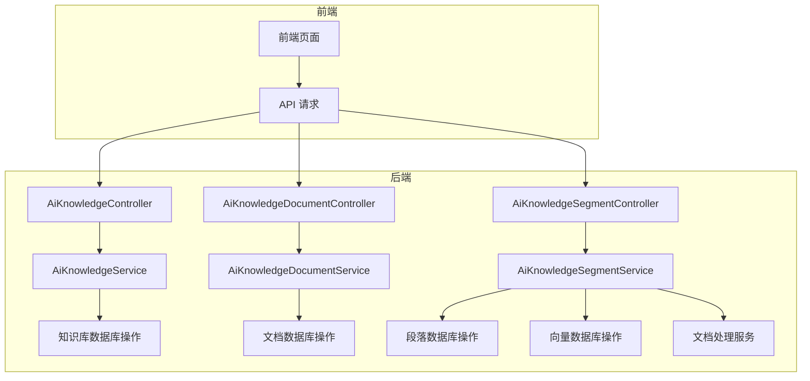
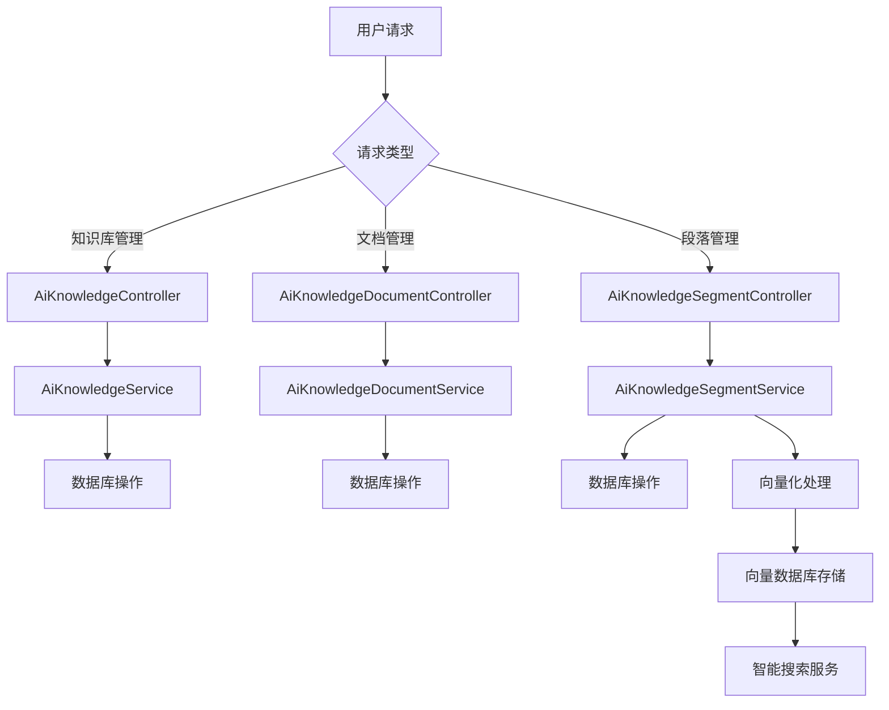
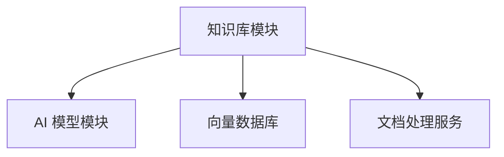

# AI 知识库模块文档

## 模块概述

AI 知识库模块是系统中的一个核心组件，主要用于管理和维护知识库、文档、段落等信息。该模块通过向量化技术将文档内容转换为向量，并存储在向量数据库中，以便后续进行智能搜索和问答。

### 主要功能

1. **知识库管理**：创建、更新、删除和查询知识库
2. **文档管理**：管理知识库中的文档，包括文档的创建、更新、状态管理和删除
3. **段落管理**：对文档进行切片处理，生成段落并进行向量化存储
4. **智能搜索**：基于向量相似度搜索相关段落内容

### 核心组件

- **知识库管理**：`AiKnowledgeController`、`AiKnowledgeService`、`AiKnowledgeDO`
- **文档管理**：`AiKnowledgeDocumentController`、`AiKnowledgeDocumentService`、`AiKnowledgeDocumentDO`
- **段落管理**：`AiKnowledgeSegmentController`、`AiKnowledgeSegmentService`、`AiKnowledgeSegmentDO`

## 架构设计

### 系统架构图



### 数据流图



## 核心组件详解

### 1. 知识库管理

#### 实体类：`AiKnowledgeDO`

```java
@TableName(value = "ai_knowledge", autoResultMap = true)
@KeySequence("ai_knowledge_seq")
@Data
public class AiKnowledgeDO extends BaseDO {
    // 编号
    @TableId
    private Long id;
    // 知识库名称
    private String name;
    // 知识库描述
    private String description;
    // 向量模型编号
    private Long embeddingModelId;
    // 模型标识
    private String embeddingModel;
    // topK
    private Integer topK;
    // 相似度阈值
    private Double similarityThreshold;
    // 状态
    private Integer status;
}
```

#### 控制器：`AiKnowledgeController`

```java
@Tag(name = "管理后台 - AI 知识库")
@RestController
@RequestMapping("/ai/knowledge")
@Validated
public class AiKnowledgeController {
    @Resource
    private AiKnowledgeService knowledgeService;
    
    @GetMapping("/page")
    @Operation(summary = "获取知识库分页")
    public CommonResult<PageResult<AiKnowledgeRespVO>> getKnowledgePage(@Valid AiKnowledgePageReqVO pageReqVO) {
        // ...
    }
    
    @PostMapping("/create")
    @Operation(summary = "创建知识库")
    public CommonResult<Long> createKnowledge(@RequestBody @Valid AiKnowledgeSaveReqVO createReqVO) {
        // ...
    }
    
    // 其他 CRUD 操作
}
```

#### 服务层：`AiKnowledgeService`

```java
@Service
@Slf4j
public class AiKnowledgeServiceImpl implements AiKnowledgeService {
    @Resource
    private AiKnowledgeMapper knowledgeMapper;
    @Resource
    private AiModelService modelService;
    @Resource
    private AiKnowledgeSegmentService knowledgeSegmentService;
    
    @Override
    public Long createKnowledge(AiKnowledgeSaveReqVO createReqVO) {
        // 1. 校验模型配置
        AiModelDO model = modelService.validateModel(createReqVO.getEmbeddingModelId());
        
        // 2. 插入知识库
        AiKnowledgeDO knowledge = BeanUtils.toBean(createReqVO, AiKnowledgeDO.class)
                .setEmbeddingModel(model.getModel());
        knowledgeMapper.insert(knowledge);
        return knowledge.getId();
    }
    
    // 其他业务方法
}
```

### 2. 文档管理

#### 实体类：`AiKnowledgeDocumentDO`

```java
@TableName(value = "ai_knowledge_document", autoResultMap = true)
@KeySequence("ai_knowledge_document_seq")
@Data
public class AiKnowledgeDocumentDO extends BaseDO {
    // 文档编号
    @TableId
    private Long id;
    // 知识库编号
    private Long knowledgeId;
    // 文档名称
    private String name;
    // 文档 URL
    private String url;
    // 文档内容
    private String content;
    // 文档内容长度
    private Integer contentLength;
    // 文档 Token 数量
    private Integer tokens;
    // 分片最大 Token 数
    private Integer segmentMaxTokens;
    // 召回次数
    private Integer retrievalCount;
    // 文档状态
    private Integer status;
}
```

#### 控制器：`AiKnowledgeDocumentController`

```java
@Tag(name = "管理后台 - AI 知识库文档")
@RestController
@RequestMapping("/ai/knowledge/document")
@Validated
public class AiKnowledgeDocumentController {
    @Resource
    private AiKnowledgeDocumentService documentService;
    
    @PostMapping("/create")
    @Operation(summary = "新建文档（单个）")
    public CommonResult<Long> createKnowledgeDocument(@RequestBody @Valid AiKnowledgeDocumentCreateReqVO reqVO) {
        Long id = documentService.createKnowledgeDocument(reqVO);
        return success(id);
    }
    
    @PostMapping("/create-list")
    @Operation(summary = "新建文档（多个）")
    public CommonResult<List<Long>> createKnowledgeDocumentList(
            @RequestBody @Valid AiKnowledgeDocumentCreateListReqVO reqVO) {
        List<Long> ids = documentService.createKnowledgeDocumentList(reqVO);
        return success(ids);
    }
    
    // 其他 CRUD 操作
}
```

### 3. 段落管理

#### 实体类：`AiKnowledgeSegmentDO`

```java
@TableName(value = "ai_knowledge_segment", autoResultMap = true)
@KeySequence("ai_knowledge_segment_seq")
@Data
public class AiKnowledgeSegmentDO extends BaseDO {
    // 编号
    @TableId
    private Long id;
    // 文档编号
    private Long documentId;
    // 知识库编号
    private Long knowledgeId;
    // 向量库编号
    private String vectorId;
    // 切片内容
    private String content;
    // 切片内容长度
    private Integer contentLength;
    // token 数量
    private Integer tokens;
    // 召回次数
    private Integer retrievalCount;
    // 文档状态
    private Integer status;
}
```

#### 控制器：`AiKnowledgeSegmentController`

```java
@Tag(name = "管理后台 - AI 知识库段落")
@RestController
@RequestMapping("/ai/knowledge/segment")
@Validated
public class AiKnowledgeSegmentController {
    @Resource
    private AiKnowledgeSegmentService segmentService;
    @Resource
    private AiKnowledgeDocumentService documentService;
    
    @GetMapping("/search")
    @Operation(summary = "搜索段落内容")
    public CommonResult<List<AiKnowledgeSegmentSearchRespVO>> searchKnowledgeSegment(
            @Valid AiKnowledgeSegmentSearchReqVO reqVO) {
        // 1. 搜索段落
        List<AiKnowledgeSegmentSearchRespBO> segments = segmentService
                .searchKnowledgeSegment(BeanUtils.toBean(reqVO, AiKnowledgeSegmentSearchReqBO.class));
        
        // 2. 拼接 VO
        Map<Long, AiKnowledgeDocumentDO> documentMap = documentService.getKnowledgeDocumentMap(convertSet(
                segments, AiKnowledgeSegmentSearchRespBO::getDocumentId));
        return success(BeanUtils.toBean(segments, AiKnowledgeSegmentSearchRespVO.class,
                segment -> MapUtils.findAndThen(documentMap, segment.getDocumentId(),
                        document -> segment.setDocumentName(document.getName()))));
    }
    
    // 其他业务方法
}
```

## API 文档

### 知识库管理 API

#### 创建知识库

**请求方式**：`POST /ai/knowledge/create`

**请求参数**：
```json
{
  "name": "知识库名称",
  "description": "知识库描述",
  "embeddingModelId": 1,
  "topK": 3,
  "similarityThreshold": 0.5,
  "status": 1
}
```

**响应**：
```json
{
  "code": 0,
  "data": 1
}
```

#### 查询知识库分页

**请求方式**：`GET /ai/knowledge/page`

**请求参数**：
```
name: 知识库名称
status: 状态
createTime: 创建时间
pageNo: 页码
pageSize: 每页数量
```

**响应**：
```json
{
  "code": 0,
  "data": {
    "list": [
      {
        "id": 1,
        "name": "知识库名称",
        "description": "知识库描述",
        "embeddingModelId": 1,
        "embeddingModel": "模型标识",
        "topK": 3,
        "similarityThreshold": 0.5,
        "status": 1,
        "createTime": "2023-01-01T00:00:00"
      }
    ],
    "total": 1
  }
}
```

### 文档管理 API

#### 创建文档

**请求方式**：`POST /ai/knowledge/document/create`

**请求参数**：
```json
{
  "knowledgeId": 1,
  "name": "文档名称",
  "url": "https://doc.iocoder.cn",
  "segmentMaxTokens": 800
}
```

**响应**：
```json
{
  "code": 0,
  "data": 1
}
```

#### 查询文档分页

**请求方式**：`GET /ai/knowledge/document/page`

**请求参数**：
```
knowledgeId: 知识库编号
name: 文档名称
status: 状态
pageNo: 页码
pageSize: 每页数量
```

**响应**：
```json
{
  "code": 0,
  "data": {
    "list": [
      {
        "id": 1,
        "knowledgeId": 1,
        "name": "文档名称",
        "url": "https://doc.iocoder.cn",
        "content": "文档内容",
        "contentLength": 2048,
        "tokens": 1024,
        "segmentMaxTokens": 512,
        "retrievalCount": 10,
        "status": 1,
        "createTime": "2023-01-01T00:00:00"
      }
    ],
    "total": 1
  }
}
```

### 段落管理 API

#### 搜索段落内容

**请求方式**：`GET /ai/knowledge/segment/search`

**请求参数**：
```
knowledgeId: 知识库编号
query: 搜索内容
pageNo: 页码
pageSize: 每页数量
```

**响应**：
```json
{
  "code": 0,
  "data": [
    {
      "id": 1,
      "documentId": 1,
      "knowledgeId": 1,
      "vectorId": "1858496a-1dde-4edf-a43e-0aed08f37f8c",
      "content": "段落内容",
      "contentLength": 1024,
      "tokens": 512,
      "retrievalCount": 5,
      "status": 1,
      "createTime": 1234567890,
      "documentName": "文档名称",
      "score": 0.95
    }
  ]
}
```

## 数据库设计

### 知识库表：`ai_knowledge`

| 字段名 | 类型 | 描述 |
|--------|------|------|
| id | bigint | 编号 |
| name | varchar | 知识库名称 |
| description | varchar | 知识库描述 |
| embedding_model_id | bigint | 向量模型编号 |
| embedding_model | varchar | 模型标识 |
| top_k | int | topK |
| similarity_threshold | double | 相似度阈值 |
| status | int | 状态 |
| create_time | datetime | 创建时间 |
| update_time | datetime | 更新时间 |

### 文档表：`ai_knowledge_document`

| 字段名 | 类型 | 描述 |
|--------|------|------|
| id | bigint | 文档编号 |
| knowledge_id | bigint | 知识库编号 |
| name | varchar | 文档名称 |
| url | varchar | 文档 URL |
| content | text | 文档内容 |
| content_length | int | 文档内容长度 |
| tokens | int | 文档 Token 数量 |
| segment_max_tokens | int | 分片最大 Token 数 |
| retrieval_count | int | 召回次数 |
| status | int | 文档状态 |
| create_time | datetime | 创建时间 |
| update_time | datetime | 更新时间 |

### 段落表：`ai_knowledge_segment`

| 字段名 | 类型 | 描述 |
|--------|------|------|
| id | bigint | 编号 |
| document_id | bigint | 文档编号 |
| knowledge_id | bigint | 知识库编号 |
| vector_id | varchar | 向量库编号 |
| content | text | 切片内容 |
| content_length | int | 切片内容长度 |
| tokens | int | token 数量 |
| retrieval_count | int | 召回次数 |
| status | int | 文档状态 |
| create_time | datetime | 创建时间 |
| update_time | datetime | 更新时间 |

## 依赖关系

### 模块依赖



### 外部依赖

1. **AI 模型模块**：提供向量模型服务，用于文档内容的向量化处理
2. **向量数据库**：存储文档段落的向量表示，支持快速相似度搜索
3. **文档处理服务**：负责文档内容的切片和预处理

## 使用场景

### 场景一：智能问答系统

1. 用户在系统中输入问题
2. 系统将问题转换为向量
3. 在向量数据库中搜索与问题向量最相似的段落
4. 将搜索结果返回给用户

### 场景二：知识库维护

1. 管理员创建新的知识库
2. 上传相关文档
3. 系统自动切片并向量化文档内容
4. 管理员可以查询、更新、删除知识库和文档

### 场景三：文档检索

1. 用户输入关键词或问题
2. 系统在知识库中搜索相关文档
3. 返回匹配的文档和相关度

## 最佳实践

### 知识库设计

1. **命名规范**：知识库名称应清晰、简洁，便于理解
2. **模型选择**：根据业务需求选择合适的向量模型
3. **参数配置**：合理设置 topK 和相似度阈值，平衡搜索精度和性能

### 文档处理

1. **内容质量**：确保文档内容的准确性和完整性
2. **切片大小**：合理设置分片最大 Token 数，避免切片过大或过小
3. **状态管理**：及时更新文档状态，确保搜索结果的准确性

### 段落管理

1. **向量化**：确保向量化过程的准确性，提高搜索精度
2. **索引维护**：定期维护向量索引，确保搜索性能
3. **数据清理**：及时清理无效或过期的段落数据

## 注意事项

1. **向量模型**：选择合适的向量模型对搜索效果有重要影响
2. **向量数据库**：选择支持高效相似度搜索的向量数据库
3. **文档处理**：文档内容的切片和预处理对搜索效果有直接影响
4. **性能优化**：大量文档时，需要考虑搜索性能的优化

## 总结

AI 知识库模块是一个功能强大的文档管理和智能搜索系统，通过向量化技术实现了高效的文档检索和问答功能。在使用过程中，需要注意模型选择、参数配置、文档质量等方面的问题，以确保系统的性能和准确性。

更多详情请参考：
- [AI 模型模块文档](./knowledge_3.md)
- [向量数据库设计文档](./vector_db_design.md)
