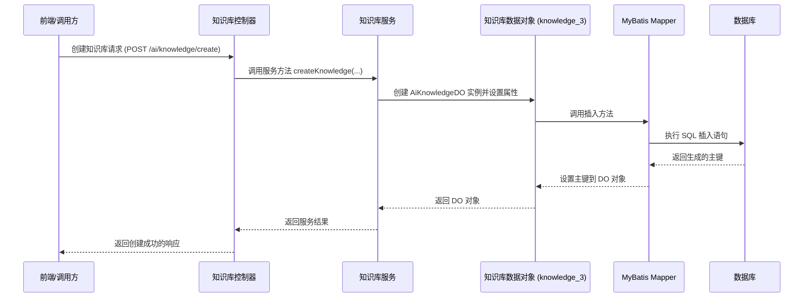

# knowledge_3 模块文档

## 概述

knowledge_3 模块是 Yudao AI 模块中的数据访问层（Data Access Object, DAO）部分，具体定义了 AI 知识库的数据对象（Data Object, DO）。该模块位于 `yudao-module-ai` 模块下，路径为 `src/main/java/cn/iocoder/yudao/module/ai/dal/dataobject/knowledge/AiKnowledgeDO.java`。

## 核心组件

### AiKnowledgeDO

`AiKnowledgeDO` 是 AI 知识库的数据对象，继承自 `BaseDO`（提供通用字段如 id、创建时间、更新时间等），并映射到数据库表 `ai_knowledge`。

#### 字段说明

| 字段名 | 类型 | 说明 |
|--------|------|------|
| id | Long | 主键编号 |
| name | String | 知识库名称 |
| description | String | 知识库描述 |
| embeddingModelId | Long | 向量模型编号，关联到 `AiModelDO` 的 id |
| embeddingModel | String | 模型标识，冗余自 `AiModelDO` 的 model 字段 |
| topK | Integer | 检索时返回的最相似向量数量 |
| similarityThreshold | Double | 相似度阈值，用于过滤低相关度的结果 |
| status | Integer | 状态，枚举值参考 `CommonStatusEnum`（0: 禁用, 1: 正常） |

#### 关联关系

- `embeddingModelId` 是外键，关联到 `model_3` 模块中的 `AiModelDO` 表的主键。
- `embeddingModel` 字段是冗余字段，用于存储 `AiModelDO` 的 `model` 字段值，以避免在查询知识库时需要额外关联模型表。

#### 数据库表结构

表名：`ai_knowledge`

| 列名 | 类型 | 说明 |
|------|------|------|
| id | BIGINT | 主键 |
| name | VARCHAR | 知识库名称 |
| description | VARCHAR | 知识库描述 |
| embedding_model_id | BIGINT | 向量模型编号 |
| embedding_model | VARCHAR | 模型标识 |
| top_k | INTEGER | 检索数量 |
| similarity_threshold | DOUBLE | 相似度阈值 |
| status | TINYINT | 状态 |
| ... | ... | `BaseDO` 继承的通用字段（如创建时间、更新时间、逻辑删除标记等） |

## 架构说明

knowledge_3 模块是 AI 模块知识库功能的数据层，它为上层的服务层和控制器层提供数据访问能力。

下面的组件图展示了 knowledge_3 模块在 AI 模块知识库功能中的位置：

```mermaid
graph LR
    subgraph AI模块
        direction TB
        subgraph 知识库功能
            direction TB
            Controller[知识库控制器层] --> Service[知识库服务层]
            Service --> DO[知识库数据对象层 (knowledge_3)]
            DO --> DB[(ai_knowledge 表)]
        end
    end

    subgraph 关联模块
        ModelDO[模型数据对象 (model_3)] -->|关联| DO
    end
```

## 与其他模块的关系

- **模型模块 (model_3)**：知识库的向量模型配置存储在 `AiModelDO` 中，知识库 DO 通过 `embeddingModelId` 和 `embeddingModel` 字段与之关联。
- **服务层 (knowledge_4)**：服务层（如 `AiKnowledgeServiceImpl`）负责业务逻辑，通过调用数据访问层（知识_3 模块的 Mapper）来操作 `AiKnowledgeDO`。
- **控制器层 (knowledge)**：控制器层（如 `AiKnowledgeController`）处理 HTTP 请求，调用服务层完成业务操作。
- **展示层 (knowledge_5)**：UI 层通过 VO（如 `KnowledgeVO`）与前端交互，服务层负责将 DO 转换为 VO。

## 数据流示例

以下序列图展示了创建一个知识库的典型数据流：



## 依赖说明

knowledge_3 模块依赖以下模块：
- `framework-mybatis-core`: 提供 `BaseDO` 和 MyBatis Plus 基础设施。
- `model_3`: 提供 `AiModelDO` 用于关联向量模型。

注意：为了避免重复，具体的服务层和控制器层的实现细节请参考对应模块的文档（如 knowledge_4 和 knowledge 模块）。

## 结论

knowledge_3 模块作为 AI 模块知识库功能的数据层，通过定义 `AiKnowledgeDO` 数据对象，为知识库的增删改查操作提供了基础。它与模型模块解耦（通过外键关联），并为上层服务提供清晰的数据访问接口。