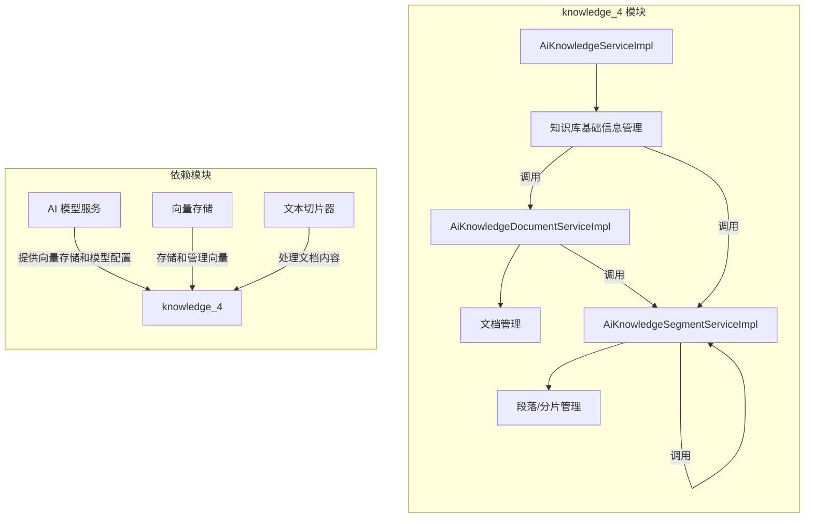
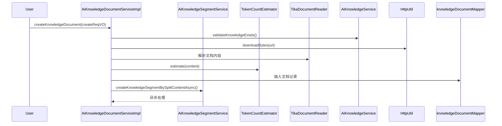
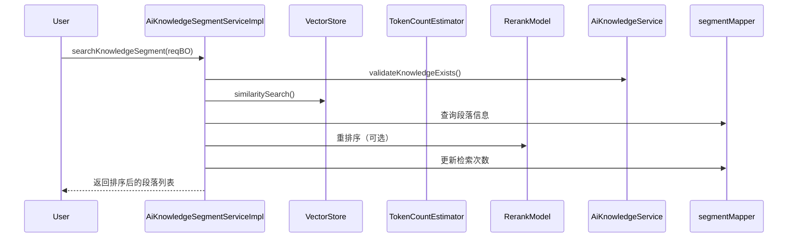

# knowledge_4 模块文档

## 1. 模块概述

knowledge_4 模块是 AI 模块（yudao-module-ai）中的知识库管理核心模块，负责管理 AI 知识库的文档、段落（切片）和基础信息。该模块实现了完整的知识库生命周期管理，包括文档上传、内容解析、文本切片、向量化存储、检索等功能，为 AI 应用提供结构化知识支持。

## 2. 模块架构

### 2.1 整体架构



### 2.2 组件关系

knowledge_4 模块包含三个核心 Service 组件，它们之间形成了紧密的协作关系：

- **AiKnowledgeServiceImpl**：知识库的基础信息管理，负责知识库的创建、更新、删除等操作
- **AiKnowledgeDocumentServiceImpl**：文档管理，负责文档的上传、下载、内容解析、状态管理等
- **AiKnowledgeSegmentServiceImpl**：段落/分片管理，负责文档内容的切片、向量化、检索、重排序等

## 3. 核心组件说明

### 3.1 AiKnowledgeServiceImpl - 知识库基础信息管理

**功能描述**：负责知识库的基础信息管理，包括知识库的创建、更新、删除和查询。

**核心方法**：

| 方法名 | 描述 |
|--------|------|
| `createKnowledge` | 创建知识库，校验模型配置后插入知识库记录 |
| `updateKnowledge` | 更新知识库信息，如果模型变化则触发重新索引 |
| `deleteKnowledge` | 删除知识库，先删除关联的文档和段落，最后删除知识库本身 |
| `getKnowledge` | 获取知识库信息 |
| `validateKnowledgeExists` | 校验知识库是否存在 |
| `getKnowledgePage` | 分页获取知识库列表 |
| `getKnowledgeSimpleListByStatus` | 按状态获取知识库简单列表 |

**依赖关系**：
- 依赖 `AiModelService` 进行模型配置校验
- 依赖 `AiKnowledgeDocumentService` 删除关联文档
- 依赖 `AiKnowledgeSegmentService` 进行重新索引操作

### 3.2 AiKnowledgeDocumentServiceImpl - 文档管理

**功能描述**：负责知识库中文档的全生命周期管理，包括文档的创建、更新、删除、状态变更以及内容读取。

**核心方法**：

| 方法名 | 描述 |
|--------|------|
| `createKnowledgeDocument` | 创建单个文档，下载 URL 内容，计算 Token 数，异步创建段落 |
| `createKnowledgeDocumentList` | 批量创建文档，支持批量下载和批量插入 |
| `getKnowledgeDocumentPage` | 分页获取文档列表 |
| `getKnowledgeDocument` | 获取单个文档信息 |
| `updateKnowledgeDocument` | 更新文档信息，如果 SegmentMaxTokens 变化则重新创建段落 |
| `updateKnowledgeDocumentStatus` | 更新文档状态，启用时创建段落，禁用时删除段落 |
| `deleteKnowledgeDocument` | 删除文档及其关联段落 |
| `validateKnowledgeDocumentExists` | 校验文档是否存在 |
| `readUrl` | 从 URL 下载文档内容并使用 Tika 解析文本 |
| `getKnowledgeDocumentList` | 根据 ID 列表获取文档 |
| `getKnowledgeDocumentListByKnowledgeId` | 根据知识库 ID 获取文档列表 |
| `deleteKnowledgeDocumentByKnowledgeId` | 删除知识库下的所有文档 |

**核心流程**：



### 3.3 AiKnowledgeSegmentServiceImpl - 段落/分片管理

**功能描述**：负责文档内容的切片、向量化存储、检索和重排序。这是知识库实现语义检索的核心组件。

**核心方法**：

| 方法名 | 描述 |
|--------|------|
| `getKnowledgeSegmentPage` | 分页获取段落列表 |
| `createKnowledgeSegmentBySplitContent` | 根据内容创建段落，自动检测切片策略，向量化存储 |
| `updateKnowledgeSegment` | 更新段落信息，删除旧向量，重新向量化 |
| `deleteKnowledgeSegment` | 删除段落及其向量 |
| `deleteKnowledgeSegmentByDocumentId` | 根据文档 ID 删除所有关联段落 |
| `updateKnowledgeSegmentStatus` | 更新段落状态，启用时向量化，禁用时删除向量 |
| `reindexKnowledgeSegmentByKnowledgeId` | 重新索引知识库下的所有段落 |
| `searchKnowledgeSegment` | 检索知识库段落，支持 Embedding + Rerank 重排序 |
| `splitContent` | 根据 URL 和策略切分内容 |
| `validateKnowledgeSegmentExists` | 校验段落是否存在 |
| `getKnowledgeSegmentProcessList` | 获取段落处理进度列表 |
| `createKnowledgeSegment` | 手动创建单个段落 |
| `getKnowledgeSegment` | 获取单个段落信息 |
| `getKnowledgeSegmentList` | 根据 ID 列表获取段落 |

**核心流程**：



## 4. 数据模型

### 4.1 知识库数据模型 (AiKnowledgeDO)

```java
@Data
@TableName("ai_knowledge")
public class AiKnowledgeDO implements Serializable {
    
    /** ID */
    private Long id;
    
    /** 知识库名称 */
    private String name;
    
    /** 描述 */
    private String description;
    
    /** 嵌入模型 ID */
    private String embeddingModelId;
    
    /** 嵌入模型 */
    private String embeddingModel;
    
    /** 最大 Token 数 */
    private Integer maxTokens;
    
    /** 检索 TopK */
    private Integer topK;
    
    /** 相似度阈值 */
    private Double similarityThreshold;
    
    /** 状态 */
    private Integer status;
    
    /** 创建时间 */
    private LocalDateTime createTime;
    
    /** 更新时间 */
    private LocalDateTime updateTime;
}
```

### 4.2 文档数据模型 (AiKnowledgeDocumentDO)

```java
@Data
@TableName("ai_knowledge_document")
public class AiKnowledgeDocumentDO implements Serializable {
    
    /** ID */
    private Long id;
    
    /** 知识库 ID */
    private Long knowledgeId;
    
    /** 文档名称 */
    private String name;
    
    /** 文档 URL */
    private String url;
    
    /** 文档内容 */
    private String content;
    
    /** 内容长度 */
    private Integer contentLength;
    
    /** Token 数 */
    private Integer tokens;
    
    **/ 最大分段 Token 数 */
    private Integer segmentMaxTokens;
    
    /** 状态 */
    private Integer status;
    
    /** 创建时间 */
    private LocalDateTime createTime;
    
    /** 更新时间 */
    private LocalDateTime updateTime;
}
```

### 4.3 段落数据模型 (AiKnowledgeSegmentDO)

```java
@Data
@TableName("ai_knowledge_segment")
public class AiKnowledgeSegmentDO implements Serializable {
    
    /** ID */
    private Long id;
    
    /** 知识库 ID */
    private Long knowledgeId;
    
    /** 文档 ID */
    private Long documentId;
    
    /** 段落内容 */
    private String content;
    
    /** 内容长度 */
    private Integer contentLength;
    
    /** Token 数 */
    private Integer tokens;
    
    /** 向量 ID */
    private String vectorId;
    
    /** 检索次数 */
    private Integer retrievalCount;
    
    /** 状态 */
    private Integer status;
    
    /** 创建时间 */
    private LocalDateTime createTime;
    
    /** 更新时间 */
    private LocalDateTime updateTime;
}
```

## 5. 文本切片策略

AiKnowledgeSegmentServiceImpl 支持多种文本切片策略，通过 `AiDocumentSplitStrategyEnum` 枚举定义：

| 策略 | 描述 | 适用场景 |
|------|------|----------|
| **AUTO** | 自动检测文档类型并选择策略 | 通用场景，推荐默认使用 |
| **MARKDOWN_QA** | Markdown QA 格式切片（基于 ## 标题）| QA 格式的 Markdown 文档 |
| **SEMANTIC** | 语义切分（基于语义边界）| 普通文本、Markdown 文档 |
| **PARAGRAPH** | 段落切分（无重叠）| 需要严格段落边界的场景 |
| **TOKEN** | Token 数切分 | 需要严格控制 Token 数的场景 |

**自动检测逻辑**：
1. 首先检测是否为 Markdown QA 格式（包含多个 ## 标题且标题占比 > 10%）
2. 其次检测是否为普通 Markdown 文档（文件扩展名为 .md 或 .markdown）
3. 默认使用语义切分策略

## 6. 检索流程

知识库检索采用 **Embedding + Rerank** 的两阶段检索策略：

1. **第一阶段：向量检索**
   - 使用 Embedding 模型将查询向量量化
   - 在向量存储中进行相似度搜索
   - 返回 topK * 4 的候选结果（为 Rerank 预留空间）

2. **第二阶段：Rerank 重排序（可选）**
   - 如果配置了 Rerank 模型，对候选结果进行重排序
   - 根据相似度阈值过滤结果
   - 返回最终 topK 结果

3. **结果处理**
   - 根据向量 ID 查询段落详细信息
   - 增加检索次数统计
   - 按分数降序排序返回

## 7. 异步处理

knowledge_4 模块大量使用异步处理来提高性能：

- **段落创建异步**：`createKnowledgeSegmentBySplitContentAsync` 方法使用异步方式创建文档段落，避免阻塞主线程
- **重新索引异步**：模型变更时触发 `reindexByKnowledgeSegmentAsync` 异步重新索引所有段落
- **状态变更异步**：文档/段落状态变更时异步处理向量存储操作

## 8. 错误处理

模块定义了详细的错误码（`ErrorCodeConstants`），包括：

| 错误码 | 描述 |
|--------|------|
| KNOWLEDGE_NOT_EXISTS | 知识库不存在 |
| KNOWLEDGE_DOCUMENT_NOT_EXISTS | 文档不存在 |
| KNOWLEDGE_SEGMENT_NOT_EXISTS | 段落不存在 |
| KNOWLEDGE_DOCUMENT_FILE_EMPTY | 文档文件为空 |
| KNOWLEDGE_DOCUMENT_FILE_DOWNLOAD_FAIL | 文档下载失败 |
| KNOWLEDGE_DOCUMENT_FILE_READ_FAIL | 文档读取失败 |
| KNOWLEDGE_SEGMENT_CONTENT_TOO_LONG | 段落内容过长 |

## 9. 与其他模块的交互

### 9.1 依赖模块

| 模块 | 依赖说明 |
|------|----------|
| **AI 模型模块** | 依赖 `AiModelService` 获取模型配置和向量存储 |
| **向量存储模块** | 使用 Spring AI VectorStore 进行向量存储和检索 |
| **文本处理模块** | 使用 TikaDocumentReader 解析文档内容，使用 TextSplitter 进行文本切片 |

### 9.2 被依赖模块

knowledge_4 模块为其他 AI 功能模块提供知识检索服务，如：
- AI 对话模块：检索知识库内容辅助对话生成
- AI 写作模块：基于知识库内容生成文章
- AI 思维导图模块：基于知识库内容生成思维导图

## 10. 使用示例

### 10.1 创建知识库

```java
// 创建知识库请求
AiKnowledgeSaveReqVO reqVO = new AiKnowledgeSaveReqVO();
reqVO.setName("产品知识库");
reqVO.setDescription("产品相关文档知识库");
reqVO.setEmbeddingModelId("embedding-model-01");
reqVO.setTopK(5);
reqVO.setSimilarityThreshold(0.7);

// 创建知识库
Long knowledgeId = knowledgeService.createKnowledge(reqVO);
```

### 10.2 添加文档

```java
// 创建文档请求
AiKnowledgeDocumentCreateReqVO docReqVO = new AiKnowledgeDocumentCreateReqVO();
docReqVO.setKnowledgeId(knowledgeId);
docReqVO.setName("产品手册.pdf");
docReqVO.setUrl("https://example.com/manual.pdf");

// 创建文档
Long docId = knowledgeDocumentService.createKnowledgeDocument(docReqVO);
```

### 10.3 检索知识库

```java
// 检索请求
AiKnowledgeSegmentSearchReqBO searchBO = new AiKnowledgeSegmentSearchReqBO();
searchBO.setKnowledgeId(knowledgeId);
searchBO.setContent("如何退款？");
searchBO.setTopK(3);

// 检索
List<AiKnowledgeSegmentSearchRespBO> results = knowledgeSegmentService.searchKnowledgeSegment(searchBO);
```

## 11. 总结

knowledge_4 模块是 AI 模块中实现知识库管理的核心组件，通过文档管理、段落管理和知识库基础信息管理三个 Service 的协作，提供了完整的知识库生命周期管理能力。模块支持多种文本切片策略、Embedding + Rerank 的两阶段检索机制，以及异步处理优化，能够满足大规模知识库的管理和高效检索需求。
