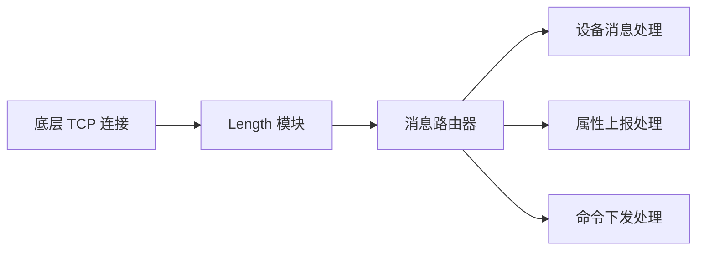

# Length 模块

## 概述

Length 模块是物联网网关TCP协议栈中的帧编解码组件，提供基于长度字段和固定长度两种消息拆包策略的实现。该模块负责将字节流解析为完整的消息帧，以及将消息对象编码为可传输的字节流。

## 架构概述

```mermaid
graph TD
    A[TCP连接] --> B[帧编解码器]
    B --> C[IotTcpLengthFieldFrameCodec]
    B --> D[IotTcpFixedLengthFrameCodec]
    C --> E[基于长度字段的拆包]
    D --> F[基于固定长度的拆包]
    E --> G[消息格式: [长度字段][消息体]]
    F --> H[消息格式: [固定长度消息体]]
```

## 核心功能

Length 模块包含两个主要的帧编解码器实现：

### 1. IotTcpLengthFieldFrameCodec (长度字段帧编解码器)

基于长度字段的拆包策略，消息格式为：[长度字段][消息体]

**主要特性：**
- 支持可配置的长度字段偏移量、长度和调整值
- 支持1、2、4字节长度字段
- 自动处理半包和粘包情况
- 内置最大帧长度限制（64KB）防止DoS攻击
- 支持初始字节跳过（initialBytesToStrip）功能

**工作流程：**
1. 读取固定长度的头部（长度字段偏移量 + 长度字段长度）
2. 解析头部获取消息体长度
3. 切换到读取指定长度的消息体模式
4. 组装完整帧并进行初始字节跳过处理
5. 将完整消息传递给上层处理器

### 2. IotTcpFixedLengthFrameCodec (定长帧编解码器)

基于固定长度的拆包策略，每条消息具有固定的字节数。

**主要特性：**
- 简单高效的固定长度消息处理
- 自动填充不足长度的数据（用0填充）
- 严格的长度校验防止数据越界

## 技术细节

### 消息格式

**长度字段格式：**
```
[填充字节][长度字段][消息体]
```

其中：
- 填充字节：长度字段偏移量指定的前置字节（通常为0）
- 长度字段：指定长度的字段（1/2/4字节）
- 消息体：实际的业务数据

**定长格式：**
```
[固定长度数据][填充字节]
```

其中：
- 固定长度数据：实际的业务数据
- 填充字节：用0填充到固定长度

### 配置参数

两种编解码器都通过 `IotTcpConfig.CodecConfig` 进行配置：

**IotTcpLengthFieldFrameCodec 配置：**
- `lengthFieldOffset`: 长度字段在消息中的偏移量
- `lengthFieldLength`: 长度字段的字节数（1/2/4）
- `lengthAdjustment`: 长度调整值
- `initialBytesToStrip`: 解码后跳过的字节数

**IotTcpFixedLengthFrameCodec 配置：**
- `fixedLength`: 固定消息长度

## 与其他模块的关系

Length 模块是 IoT 网关 TCP 协议栈的基础组件，为上层的消息处理提供可靠的帧解析服务：



## 使用示例

### 配置长度字段帧编解码器

```java
IotTcpConfig.CodecConfig config = new IotTcpConfig.CodecConfig();
config.setLengthFieldOffset(0);      // 长度字段从第0字节开始
config.setLengthFieldLength(2);      // 长度字段占用2字节
config.setLengthAdjustment(0);       // 长度不需要调整
config.setInitialBytesToStrip(0);    // 不跳过任何字节

IotTcpLengthFieldFrameCodec codec = new IotTcpLengthFieldFrameCodec(config);
```

### 配置定长帧编解码器

```java
IotTcpConfig.CodecConfig config = new IotTcpConfig.CodecConfig();
config.setFixedLength(128);          // 每条消息固定128字节

IotTcpFixedLengthFrameCodec codec = new IotTcpFixedLengthFrameCodec(config);
```

## 性能考虑

1. **内存使用**：两种编解码器都使用 Vert.x 的 RecordParser，内存开销较低
2. **防攻击机制**：长度字段编解码器内置最大帧长度限制防止 DoS 攻击
3. **零拷贝**：在可能的情况下利用 Vert.x Buffer 的零拷贝特性
4. **异步处理**：基于 Vert.x 的事件循环，支持高并发场景

## 错误处理

- 长度字段异常：抛出 IllegalStateException
- 不支持的长度字段长度：抛出 IllegalArgumentException
- 数据长度超过限制：抛出 IllegalArgumentException
- 解析异常：包装为 RuntimeException 并记录日志

## 依赖关系

Length 模块依赖于：
- io.vertx:vertx-core (用于 RecordParser 和 Buffer)
- cn.hutool:hutool-core (用于参数验证)
- lombok (用于日志记录)

## 接口规范

所有帧编解码器实现都必须遵循 `IotTcpFrameCodec` 接口，提供：
- `getType()`: 返回编解码器类型
- `createDecodeParser(Handler<Buffer> handler)`: 创建解析器
- `encode(byte[] data)`: 编码消息

这样设计使得可以根据配置灵活切换不同的帧解析策略。