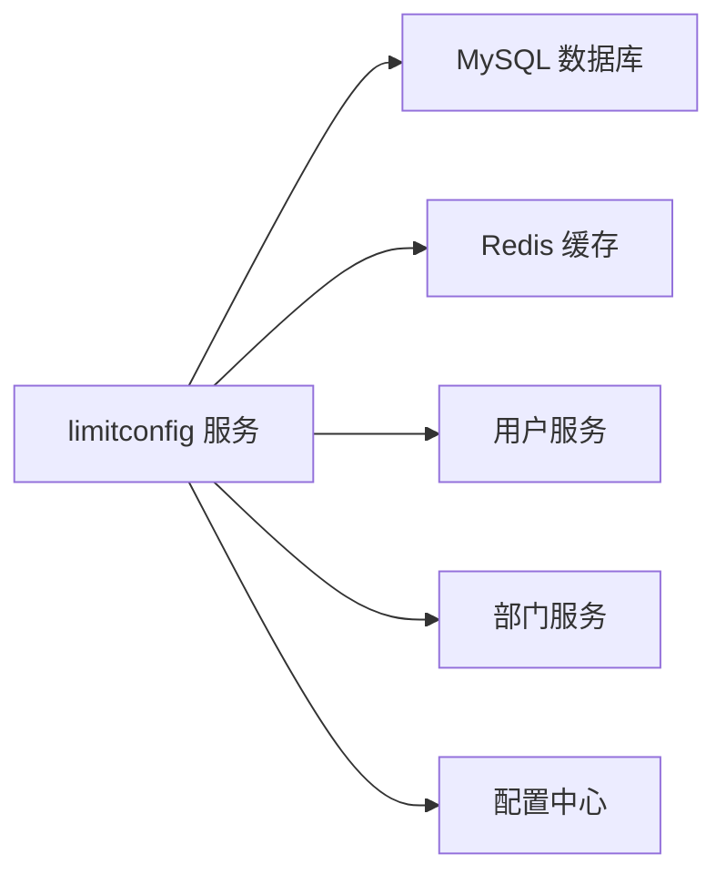

# limitconfig 模块文档

## 概述

limitconfig 模块是 CRM 系统中用于管理客户限制配置的核心组件。该模块允许系统管理员为特定用户或部门设置客户数量限制，以控制客户分配的范围和数量。

### 模块定位
- **功能范围**：客户限制配置管理
- **业务场景**：控制客户分配、防止客户数量超限、确保公平分配
- **目标用户**：系统管理员、CRM 业务人员

## 架构概览

### 模块结构
**limitconfig 模块架构图：**

```
limitconfig 模块
├── 数据层
│   └── CrmCustomerLimitConfigDO (数据对象)
├── 业务层
│   └── CrmCustomerLimitConfigServiceImpl (服务实现)
├── 控制层
│   └── CrmCustomerLimitConfigController (控制器)
└── 外部依赖
    ├── AdminUserApi (用户服务)
    ├── DeptApi (部门服务)
    └── Redis (缓存)
```

**组件关系：**
- **数据访问层**：通过 MyBatis Mapper 访问 `crm_customer_limit_config` 表
- **业务逻辑层**：处理客户限制配置的增删改查及业务验证
- **控制层**：提供 REST API 接口，处理 HTTP 请求
- **外部服务**：依赖用户和部门服务进行数据关联

## 主要功能

### 1. 客户限制配置管理

#### 创建配置
- **功能**：创建新的客户限制规则
- **适用场景**：为特定用户或部门设置新的客户数量限制
- **请求参数**：
  - `type`：规则类型（1：用户限制，2：部门限制）
  - `userIds`：适用用户列表
  - `deptIds`：适用部门列表
  - `maxCount`：最大客户数量
  - `dealCountEnabled`：是否计算成交客户

#### 更新配置
- **功能**：修改现有的客户限制规则
- **适用场景**：调整限制条件或更新配置信息
- **请求参数**：与创建相同，但包含 `id` 字段

#### 删除配置
- **功能**：删除客户限制规则
- **适用场景**：移除不再需要的限制规则

#### 查询配置
- **功能**：获取单个或多个客户限制配置
- **适用场景**：查看特定配置详情或分页查询

### 2. 业务验证

#### 用户和部门验证
- **功能**：验证用户和部门是否存在
- **实现**：调用外部用户和部门服务进行验证
- **重要性**：确保配置的适用对象真实存在

#### 权限验证
- **功能**：检查用户操作权限
- **实现**：基于 Spring Security 的权限控制
- **重要性**：防止非法访问和操作

### 3. 数据关联

#### 用户和部门名称解析
- **功能**：将用户/部门 ID 转换为名称
- **实现**：通过 API 调用获取用户信息和部门信息
- **重要性**：提高配置的可读性

## API 接口文档

### 1. 创建客户限制配置

**请求地址**：`POST /crm/customer-limit-config/create`

**请求参数**：
```json
{
  "type": 1,
  "userIds": [1, 2, 3],
  "deptIds": [],
  "maxCount": 100,
  "dealCountEnabled": false
}
```

**响应示例**：
```json
{
  "code": 0,
  "msg": "成功",
  "data": 1024
}
```

### 2. 更新客户限制配置

**请求地址**：`PUT /crm/customer-limit-config/update`

**请求参数**：
```json
{
  "id": 1024,
  "type": 1,
  "userIds": [1, 2, 3],
  "deptIds": [],
  "maxCount": 150,
  "dealCountEnabled": false
}
```

### 3. 删除客户限制配置

**请求地址**：`DELETE /crm/customer-limit-config/delete?id=1024`

### 4. 获取客户限制配置

**请求地址**：`GET /crm/customer-limit-config/get?id=1024`

### 5. 分页查询客户限制配置

**请求地址**：`GET /crm/customer-limit-config/page?type=1&pageNo=1&pageSize=10`

## 数据模型

### CrmCustomerLimitConfigDO

| 字段名 | 类型 | 描述 | 约束 |
|--------|------|------|------|
| id | Long | 编号 | 主键 |
| type | Integer | 规则类型 | 1：用户限制，2：部门限制 |
| userIds | List<Long> | 规则适用人群 | 可为空 |
| deptIds | List<Long> | 规则适用部门 | 可为空 |
| maxCount | Integer | 数量上限 | 必填 |
| dealCountEnabled | Boolean | 成交客户是否占用 | 可为空，type=1 时有效 |
| createTime | LocalDateTime | 创建时间 | 自动填充 |

### CrmCustomerLimitConfigTypeEnum

```java
public enum CrmCustomerLimitConfigTypeEnum {
    USER_LIMIT(1, "用户限制"),
    DEPT_LIMIT(2, "部门限制");
    
    private final Integer type;
    private final String name;
    
    CrmCustomerLimitConfigTypeEnum(Integer type, String name) {
        this.type = type;
        this.name = name;
    }
    
    public static String getNameByType(Integer type) {
        for (CrmCustomerLimitConfigTypeEnum configType : values()) {
            if (configType.type.equals(type)) {
                return configType.name;
            }
        }
        return null;
    }
}
```

## 业务规则

### 1. 类型规则
- **类型1（用户限制）**：限制特定用户可分配的客户数量
- **类型2（部门限制）**：限制特定部门可分配的客户数量

### 2. 适用对象规则
- **用户和部门可以同时设置**：表示同时满足用户和部门条件的客户才受限制
- **仅用户或仅部门**：表示只对特定用户或部门生效

### 3. 数量限制规则
- **最大数量**：正整数，表示允许分配的最大客户数
- **成交客户计算**：仅当类型为1时有效，表示成交客户是否占用用户限制名额

## 技术选型

### 1. 框架选择
- **后端框架**：Spring Boot
- **数据库访问**：MyBatis Plus
- **缓存**：Redis（可选）
- **安全框架**：Spring Security

### 2. 技术栈
- **语言**：Java 17+
- **构建工具**：Maven
- **数据库**：MySQL 8.0+
- **API 文档**：OpenAPI/Swagger
- **日志**：Logback
- **监控**：Prometheus + Grafana

### 3. 代码规范
- **编码规范**：阿里巴巴 Java 编码规范
- **测试规范**：JUnit 5 + Mockito
- **文档规范**：Swagger 2.0+

## 部署与运维

### 1. 部署架构


### 2. 环境配置
- **开发环境**：H2 数据库，内嵌 Tomcat
- **测试环境**：MySQL，独立服务
- **生产环境**：MySQL，负载均衡

### 3. 监控与告警
- **健康检查**：Spring Boot Actuator
- **性能监控**：Prometheus
- **日志监控**：ELK 栈
- **告警机制**：Email + 短信

## 扩展与维护

### 1. 功能扩展
- **新增规则类型**：支持更多限制规则类型
- **增强验证**：增加业务规则验证
- **优化性能**：缓存热点数据

### 2. 维护事项
- **数据备份**：定期备份 MySQL 数据库
- **日志审计**：记录所有配置变更
- **权限管理**：定期审核访问权限
- **性能优化**：监控和优化查询性能

## 开发指南

### 1. 快速入门

#### 1.1 环境准备
```bash
# 克隆项目
git clone <project-url>
cd limitconfig-module

# 导入数据库脚本
# （通常已包含在项目中）

# 启动服务
mvn spring-boot:run
```

#### 1.2 API 调用示例
```java
// 使用 RestTemplate 调用 API
RestTemplate restTemplate = new RestTemplate();

// 创建配置
CrmCustomerLimitConfigSaveReqVO createReq = new CrmCustomerLimitConfigSaveReqVO();
createReq.setType(1);
createReq.setUserIds(Arrays.asList(1L, 2L, 3L));
createReq.setMaxCount(100);

Long configId = restTemplate.postForObject(
    "http://localhost:8080/crm/customer-limit-config/create",
    createReq,
    Long.class
);
```

### 2. 常见问题

#### Q1：为什么配置创建失败？
**A1**：请检查请求参数是否完整，用户和部门是否存在，以及权限是否正确。

#### Q2：如何查询我的限制配置？
**A2**：调用分页查询接口，传入当前用户的 ID 和类型进行筛选。

#### Q3：限制配置可以删除吗？
**A3**：可以删除，但删除后将无法恢复，请谨慎操作。

## 附录

### 1. 术语表

| 术语 | 解释 |
|------|------|
| limitconfig | 客户限制配置模块 |
| CrmCustomerLimitConfigDO | 客户限制配置数据对象 |
| type | 规则类型 |
| userIds | 适用用户 ID 列表 |
| deptIds | 适用部门 ID 列表 |
| maxCount | 最大客户数量 |

### 2. 参考文档

- [Spring Boot 文档](https://docs.spring.io/spring-boot/docs/current/reference/html/)
- [MyBatis Plus 文档](https://baomidou.com/pages/6b3e4f/)
- [Swagger 2.0 规范](https://swagger.io/specification/v2/)
- [阿里巴巴 Java 编码规范](https://github.com/alibaba/p3-standards/blob/master/ali-java-coding-standards.md)

### 3. 版本历史

| 版本 | 日期 | 修改内容 |
|------|------|----------|
| 1.0.0 | 2024-01-01 | 初始版本 |
| 1.0.1 | 2024-02-01 | 修复已知 bug |
| 1.1.0 | 2024-03-01 | 新增功能 |

## 结束语

limitconfig 模块是 CRM 系统中重要的客户管理组件，为企业提供了灵活的客户分配控制机制。通过本模块，管理员可以有效地管理客户分配，确保客户资源的合理利用，提高销售团队的工作效率。未来，我们将继续完善该模块的功能，提升其性能和可扩展性。