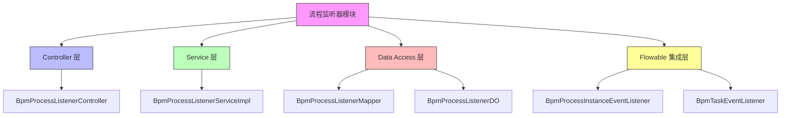
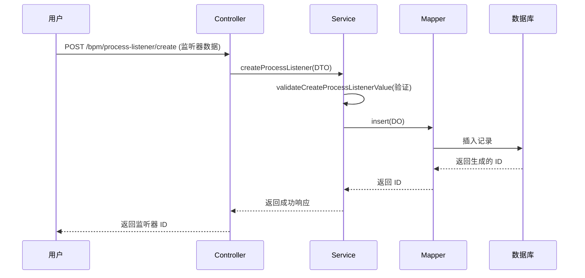
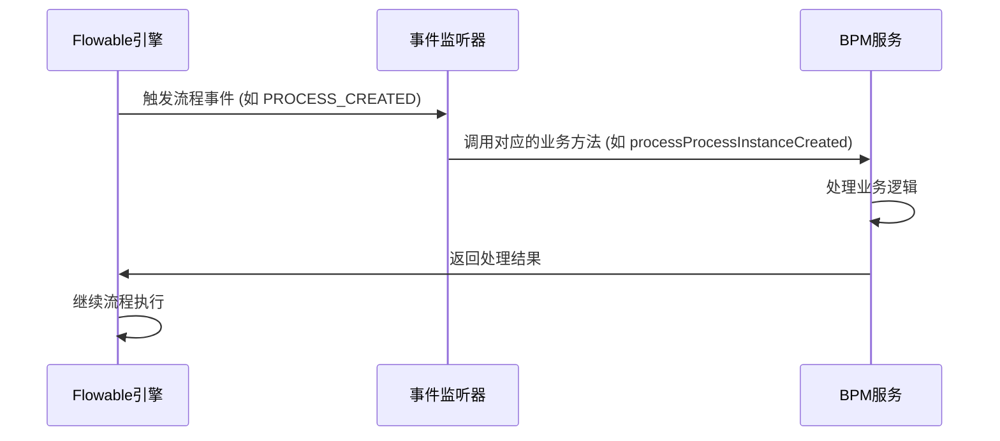
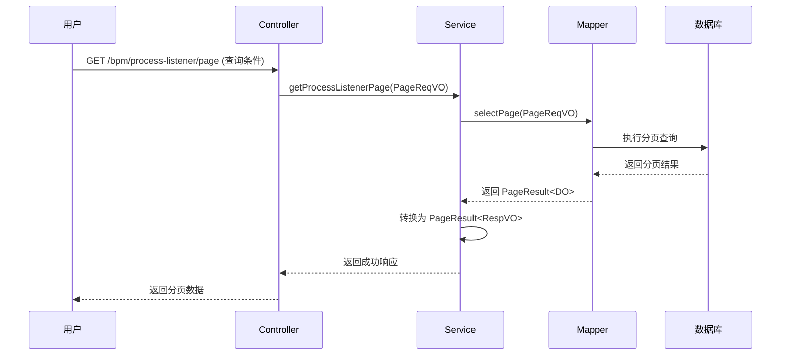

# BPM 流程监听器模块文档

## 模块概述

BPM 流程监听器模块是 Yudao 框架中业务流程管理（BPM）子系统的核心组件，负责管理 Flowable 工作流引擎中的执行监听器（ExecutionListener）和任务监听器（TaskListener）。该模块提供了完整的 CRUD 接口来配置流程监听器，并通过自定义的 Flowable 事件监听器实现与工作流引擎的深度集成。

流程监听器允许在工作流执行的特定事件点（如流程开始、结束、任务创建、完成等）自动执行自定义逻辑，是实现业务流程自动化的重要机制。

## 核心功能

1. **流程监听器管理**：提供流程监听器的创建、读取、更新、删除和分页查询功能
2. **监听器类型支持**：支持 ExecutionListener 和 TaskListener 两种类型
3. **多种监听器值类型**：支持 Java 类、委托表达式和表达式三种值类型
4. **事件触发配置**：支持配置不同的监听事件（如 start、end、create、complete 等）
5. **Flowable 集成**：通过自定义事件监听器与 Flowable 工作流引擎深度集成
6. **数据验证**：提供完整的输入验证和业务规则校验

## 架构设计

### 模块结构



### 分层说明

1. **Controller 层** (`BpmProcessListenerController`)：提供 RESTful API 接口，处理 HTTP 请求和响应
2. **Service 层** (`BpmProcessListenerServiceImpl`)：包含业务逻辑，包括数据验证和事务管理
3. **Data Access 层** (`BpmProcessListenerMapper`, `BpmProcessListenerDO`)：负持数据持久化和对象映射
4. **Flowable 集成层** (`BpmProcessInstanceEventListener`, `BpmTaskEventListener`)：实现 Flowable 事件监听器，处理工作流事件

## 详细组件说明

### 1. 数据传输对象 (DTO)

#### BpmProcessListenerRespVO
用于返回流程监听器信息的响应视图对象，包含以下字段：
- `id`: 监听器编号（主键）
- `name`: 监听器名称
- `type`: 监听器类型（execution/task）
- `status`: 监听器状态（启用/禁用）
- `event`: 监听事件（如 start、end、create 等）
- `valueType`: 监听器值类型（class/delegateExpression/expression）
- `value`: 监听器值（具体的类名、表达式等）
- `createTime`: 创建时间

#### BpmProcessListenerSaveReqVO
用于创建或更新流程监听器的请求视图对象，包含与 RespVO 相同的字段，并添加了验证注解：
- 所有字段都标记为必填，使用 `@NotEmpty` 或 `@NotNull` 进行验证
- 包含 Swagger 注解用于 API 文档生成

#### BpmProcessListenerPageReqVO
用于分页查询流程监听器的请求视图对象，继承自通用分页参数类 `PageParam`，包含：
- `name`: 监听器名称（可选过滤条件）
- `type`: 监听器类型（可选过滤条件）
- `event`: 监听事件（可选过滤条件）
- `status`: 状态（可选过滤条件，使用字典值验证）

### 2. 数据访问层

#### BpmProcessListenerDO
数据对象，映射到数据库表 `bpm_process_listener`，包含：
- `id`: 主键 ID，自增
- `name`: 监听器名称
- `status`: 状态（对应 CommonStatusEnum 枚举）
- `type`: 监听类型（execution/task）
- `event`: 监听事件
- `valueType`: 值类型（class/delegateExpression/expression）
- `value`: 值（具体实现）

#### BpmProcessListenerMapper
MyBatis Mapper 接口，提供基本的 CRUD 操作：
- `insert`: 插入新记录
- `updateById`: 根据 ID 更新记录
- `deleteById`: 根据 ID 删除记录
- `selectById`: 根据 ID 查询单个记录
- `selectPage`: 分页查询记录

### 3. 业务逻辑层

#### BpmProcessListenerServiceImpl
实现了 `BpmProcessListenerService` 接口，提供核心业务逻辑：

**主要方法：**
- `createProcessListener`: 创建流程监听器
  - 首先验证监听器值的有效性
  - 将请求 DTO 转换为数据对象
  - 插入数据库并返回生成的 ID
  
- `updateProcessListener`: 更新流程监听器
  - 验证监听器是否存在
  - 验证监听器值的有效性
  - 更新数据库记录
  
- `deleteProcessListener`: 删除流程监听器
  - 验证监听器是否存在
  - 删除数据库记录
  
- `getProcessListener`: 根据 ID 获取流程监听器
  - 直接从数据库查询并返回数据对象
  
- `getProcessListenerPage`: 分页查询流程监听器
  - 使用 MyBatis Plus 分页功能查询并返回结果

**关键验证方法：**
- `validateCreateProcessListenerValue`: 验证监听器值的有效性
  - 对于 class 类型：检查类是否存在以及是否实现了相应的接口（JavaDelegate 或 TaskListener）
  - 对于表达式类型：检查是否符合 `${expression}` 格式
  
- `validateProcessListenerExists`: 验证监听器是否存在
  - 根据 ID 查询数据库，如果不存在则抛出异常

### 4. Controller 层

#### BpmProcessListenerController
RESTful API 控制器，提供以下端点：

**API 接口：**
- `POST /bpm/process-listener/create`: 创建流程监听器
  - 需要权限: `bpm:process-listener:create`
  - 接收: `BpmProcessListenerSaveReqVO`
  - 返回: `CommonResult<Long>`（新创建的监听器 ID）
  
- `PUT /bpm/process-listener/update`: 更新流程监听器
  - 需要权限: `bpm:process-listener:update`
  - 接收: `BpmProcessListenerSaveReqVO`
  - 返回: `CommonResult<Boolean>`
  
- `DELETE /bpm/process-listener/delete`: 删除流程监听器
  - 需要权限: `bpm:process-listener:delete`
  - 接收: `id` 参数
  - 返回: `CommonResult<Boolean>`
  
- `GET /bpm/process-listener/get`: 获取单个流程监听器
  - 需要权限: `bpm:process-listener:query`
  - 接收: `id` 参数
  - 返回: `CommonResult<BpmProcessListenerRespVO>`
  
- `GET /bpm/process-listener/page`: 分页查询流程监听器
  - 需要权限: `bpm:process-listener:query`
  - 接收: `BpmProcessListenerPageReqVO`
  - 返回: `CommonResult<PageResult<BpmProcessListenerRespVO>>`

所有接口都使用了统一的响应包装器 `CommonResult` 和 Swagger 注解进行 API 文档化。

### 5. Flowable 集成层

#### BpmProcessInstanceEventListener
流程实例事件监听器，监听 Flowable 工作流引擎中的流程实例事件：

**监听的事件类型：**
- `PROCESS_CREATED`: 流程实例创建时触发
- `PROCESS_COMPLETED`: 流程实例完成时触发
- `PROCESS_CANCELLED`: 流程实例取消时触发

**实现细节：**
- 继承自 `AbstractFlowableEngineEventListener`
- 使用 `@Lazy` 注解解决循环依赖问题
- 事件处理中调用 `BpmProcessInstanceService` 的相应方法
- 使用 `FlowableUtils.execute` 在正确的租户上下文中执行业务逻辑

#### BpmTaskEventListener
任务事件监听器，监听 Flowable 工作流引擎中的任务事件：

**监听的事件类型：**
- `TASK_CREATED`: 任务创建时触发
- `TASK_ASSIGNED`: 任务被指派时触发
- `TASK_COMPLETED`: 任务完成时触发
- `ACTIVITY_CANCELLED`: 活动被取消时触发
- `TIMER_FIRED`: 定时器触发时触发（用于处理超时）

**实现细节：**
- 继承自 `AbstractFlowableEngineEventListener`
- 解决了与 `BpmModelService` 和 `BpmTaskService` 的循环依赖
- 详细处理了各种任务事件和超时场景
- 支持边界事件的超时处理（用户任务超时、延迟器超时、子流程超时）

## 与其他模块的关系

```mermaid
graph TD
    A[BPM 流程监听器模块] -->|依赖| B[BPM 流程定义模块]
    A -->|依赖| C[BPM 流程实例模块]
    A -->|依赖| D[BPM 任务模块]
    A -->|依赖| E[BPM 模型模块]
    A -->|被| F[BPM 流程引擎配置模块] 使用
    A -->|集成| G[Flowable 工作流引擎]
    
    style A fill:#f9f,stroke:#333
    style B,C,D,E fill:#dfd,stroke:#333
    style F fill:#ffd,stroke:#333
    style G fill:#ddf,stroke:#333
```

### 依赖说明

1. **依赖 BPM 流程定义模块**：流程监听器需要附加到特定的流程定义上
2. **依赖 BPM 流程实例模块**：监听器事件处理需要更新流程实例状态
3. **依赖 BPM 任务模块**：任务监听器需要处理任务相关的业务逻辑
4. **依赖 BPM 模型模块**：需要访问流程模型信息来处理某些事件
5. **被 BPM 流程引擎配置模块使用**：流程引擎初始化时会注册这些自定义监听器
6. **集成 Flowable 工作流引擎**：通过实现 Flowable 的事件监听器接口来扩展引擎功能

## 工作流程

### 1. 流程监听器配置流程



### 2. 流程执行时监听器触发流程



### 3. 分页查询流程监听器流程



## 配置和使用说明

### 数据库表结构

流程监听器数据存储在 `bpm_process_listener` 表中，结构如下：

```sql
CREATE TABLE bpm_process_listener (
    id BIGINT PRIMARY KEY AUTO_INCREMENT,
    name VARCHAR(100) NOT NULL COMMENT '监听器名称',
    status TINYINT NOT NULL DEFAULT 1 COMMENT '状态',
    type VARCHAR(50) NOT NULL COMMENT '监听类型 (execution/task)',
    event VARCHAR(50) NOT NULL COMMENT '监听事件',
    value_type VARCHAR(50) NOT NULL COMMENT '值类型 (class/delegateExpression/expression)',
    value VARCHAR(255) NOT NULL COMMENT '值',
    create_time DATETIME NOT NULL COMMENT '创建时间'
);
```

### 监听器类型和事件说明

#### 监听器类型（type）
1. **execution**: 执行监听器（ExecutionListener）
   - 监听流程执行过程中的事件
   - 需要实现 `org.flowable.engine.delegate.JavaDelegate` 接口
   - 对应的值类型可以是 class、delegateExpression 或 expression

2. **task**: 任务监听器（TaskListener）
   - 监听任务生命周期中的事件
   - 需要实现 `org.flowable.engine.delegate.TaskListener` 接口
   - 对应的值类型可以是 class、delegateExpression 或 expression

#### 监听事件（event）
- **执行监听器 (execution)**:
  - `start`: 流程实例开始时触发
  - `end`: 流程实例结束时触发

- **任务监听器 (task)**:
  - `create`: 任务创建时触发
  - `assignment`: 任务被指派时触发
  - `complete`: 任务完成时触发
  - `delete`: 任务被删除时触发
  - `update`: 任务被更新时触发
  - `timeout`: 任务超时时触发

#### 值类型（valueType）
1. **class**: Java 类
   - 值应为完整的类名（如 `cn.iocoder.yudao.module.bpm.listener.MyListener`）
   - 类需要实现相应的接口（JavaDelegate 或 TaskListener）

2. **delegateExpression**: 委托表达式
   - 值应为 Spring Bean 名称（如 `${myListener}`）
   - 对应的 Bean 需要实现相应的接口

3. **expression**: 表达式
   - 值应为 Spring EL 表达式（如 `${myBean.myMethod()}`）
   - 对应的 Bean 和方法需要在 Spring 容器中可访问

### 使用示例

#### 创建执行监听器
```json
POST /bpm/process-listener/create
{
  "name": "流程开始通知",
  "type": "execution",
  "status": 1,
  "event": "start",
  "valueType": "class",
  "value": "cn.iocoder.yudao.module.bpm.listener.StartNotifyListener"
}
```

#### 创建任务监听器
```json
POST /bpm/process-listener/create
{
  "name": "任务完成审计",
  "type": "task",
  "status": 1,
  "event": "complete",
  "valueType": "delegateExpression",
  "value": "${taskAuditListener}"
}
```

#### 查询所有启用的监听器
```json
GET /bpm/process-listener/page?status=1
```

## 异常处理

模块定义了以下业务异常（在 BpmProcessListenerServiceImpl 中）：

1. **PROCESS_LISTENER_NOT_EXISTS**: 流程监听器不存在
2. **PROCESS_LISTENER_CLASS_NOT_FOUND**: 找不到指定的监听器类
3. **PROCESS_LISTENER_CLASS_IMPLEMENTS_ERROR**: 监听器类没有实现所需的接口
4. **PROCESS_LISTENER_EXPRESSION_INVALID**: 表达式格式无效

这些异常统一通过全局异常处理机制转换为適当的 HTTP 响应码和错误信息。

## 性能考虑

1. **数据库索引**：建议在 `status`、`type` 和 `name` 字段上添加索引以提高查询性能
2. **缓存策略**：对于频繁读取很少变化的监听器配置，可以考虑添加缓存层
3. **批量操作**：如果需要批量导入/导出监听器配置，建议实现批量处理接口
4. **事件监听器性能**：自定义的 Flowable 事件监听器应该保持轻量级，避免在事件处理中执行耗时操作

## 安全考虑

1. **权限控制**: 所有 API 接口都通过 `@PreAuthorize` 注解进行权限验证
2. **数据验证**: 所有输入都通过 JSR-303 注解进行验证，防止恶意数据
3. **类加载安全**: 在验证 class 类型时使用 `Class.forName()` 但捕获了 ClassNotFoundException
4. **表达式安全**: 表达式类型的值仅检查格式，实际执行由 Spring EL 负责，需要确保表达式来源可信

## 最佳实践

1. **监听器命名**: 使用有意义的名称，便于识别和维护
2. **类路径管理**: 使用 class 类型时，确保类在应用的类路径中可访问
3. **表达式测试**: 使用 expression 类型时，充分测试表达式在不同上下文中的行为
4. **错误处理**: 在自定义监听器实现中添加适当的错误处理和日志记录
5. **版本控制**: 对监听器配置进行版本控制，以便追踪变更和回滚
6. **性能监控**: 监控监听器执行时间，避免因监听器效率低下而拖慢工作流执行

## 与相关模块的集成点

### 与 BPM 流程定义模块的集成
- 流程监听器在流程定义设计时被引用
- 流程定义模块提供监听器的可选列表供设计器使用

### 与 BPM 流程实例模块的集成
- 流程实例事件�听器处理流程生命周期事件
- 更新流程实例的业务状态和变量

### 与 BPM 任务模块的集成
- 任务事件监听器处理任务生命周期事件
- 触发任务相关的业务流程和通知

### 与 Flowable 引擎的集成
- 通过 Spring 的 `@Component` 注解自动注册为 Flowable 事件监听器
- 使用租户隔离机制确保多租户环境下的正确执行
- 通过 `FlowableUtils.execute` 在正确的上下文中执行业务逻辑

## 未来改进方向

1. **监听器分组和分类**: 添加监听器分类功能，便于大量监听器的管理
2. **监听器模板**: 提供常用监听器的预定义模板
3. **可视化编辑器**: 在流程设计器中提供监听器的可视化配置界面
4. **监听器日志和审计**: 添加监听器执行日志和审计跟踪
5. **性能监控和告警**: 集成监控系统，监控监听器执行性能并设置告警阈值
6. **动态监听器加载**: 支持在不重启应用的情况下动态加载和更新监听器配置