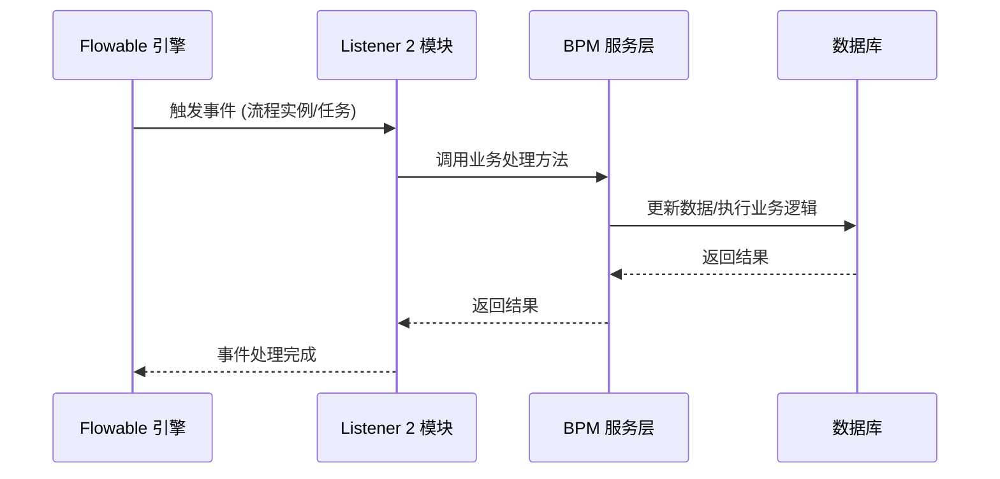
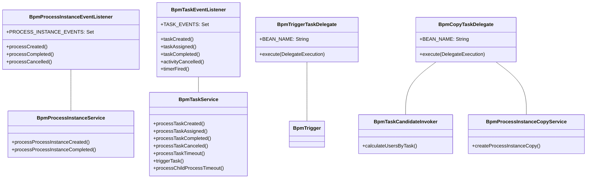
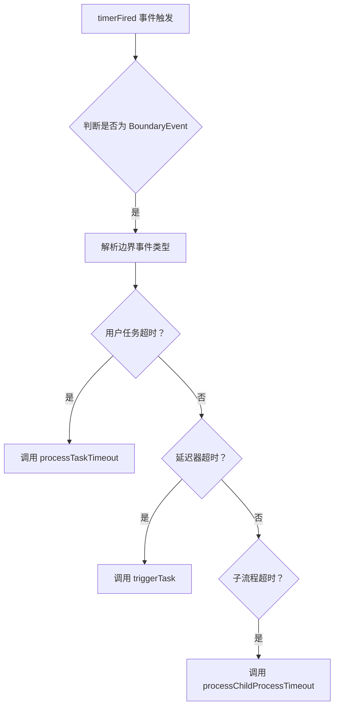
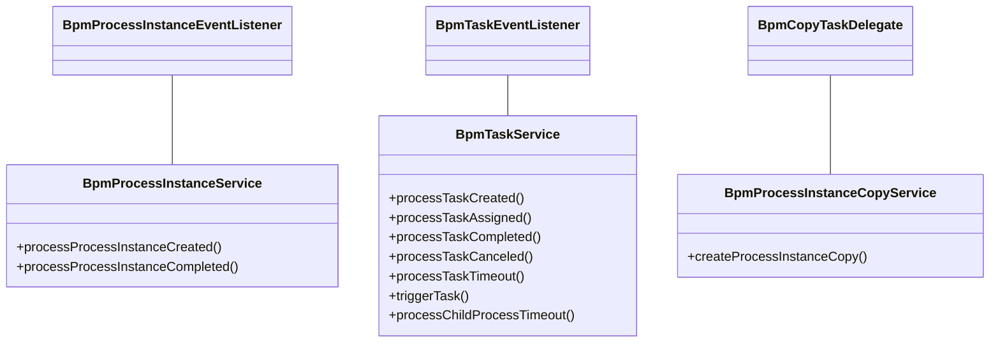
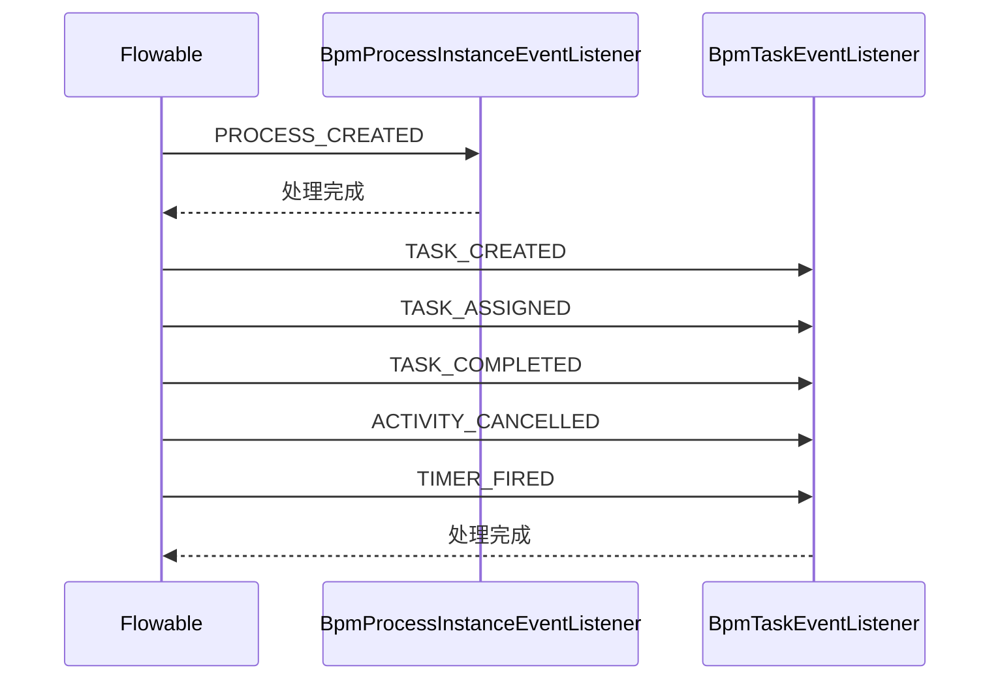

# Listener 2 模块文档

## 1. 模块概述

**Listener 2 模块**是 BPM（业务流程管理）模块中的核心监听器组件，负责监听 Flowable 引擎中的流程实例和任务事件，并执行相应的业务逻辑处理。该模块实现了事件驱动的业务流程扩展机制，使得系统能够灵活地响应流程状态变化。

### 核心功能
- 监听流程实例的生命周期事件（创建、完成、取消）
- 监听任务的生命周期事件（创建、分配、完成、取消）
- 处理触发器任务（Trigger Task）
- 处理抄送任务（CC Task）
- 处理边界事件超时（Boundary Event Timeout）

### 模块定位
```
┌─────────────────────────────────────────────────────────┐
│                    BPM 模块                              │
│  ┌─────────────────────────────────────────────────┐   │
│  │              Listener 2 子模块                   │   │
│  │  ┌─────────────┐  ┌─────────────┐  ┌──────────┐  │   │
│  │  │ BpmProcess  │  │ BpmTrigger  │  │ BpmCopy  │  │   │
│  │  │ Instance    │  │ Task        │  │ Task     │  │   │
│  │  │ EventListener│ │ Delegate    │  │ Delegate │  │   │
│  │  └─────────────┘  └─────────────┘  └──────────┘  │   │
│  │  ┌─────────────────────────────────────────────┐ │   │
│  │  │ BpmTaskEventListener                        │ │   │
│  │  │ (监听任务事件、边界事件超时处理)            │ │   │
│  │  └─────────────────────────────────────────────┘ │   │
│  └─────────────────────────────────────────────────┘   │
└─────────────────────────────────────────────────────────┘
```

## 2. 架构设计

### 2.1 整体架构

Listener 2 模块基于 Flowable 的事件监听机制，通过继承 `AbstractFlowableEngineEventListener` 实现事件监听，并通过 `JavaDelegate` 接口实现任务处理。模块与 BPM 服务层紧密协作，形成完整的事件处理链。



### 2.2 组件关系



## 3. 核心组件详解

### 3.1 BpmProcessInstanceEventListener

**文件路径**: `yudao-module-bpm/src/main/java/cn/iocoder/yudao/module/bpm/framework/flowable/core/listener/BpmProcessInstanceEventListener.java`

**功能描述**: 监听流程实例的状态变更，包括创建、完成和取消事件，并更新对应的状态。

**核心方法**:
- `processCreated()`: 流程实例创建时调用，调用 `BpmProcessInstanceService.processProcessInstanceCreated()` 处理
- `processCompleted()`: 流程实例完成时调用，调用 `BpmProcessInstanceService.processProcessInstanceCompleted()` 处理
- `processCancelled()`: 流程实例取消时调用，特殊处理跳转到 EndEvent 但未结束的情况

**事件监听集合**:
```java
public static final Set<FlowableEngineEventType> PROCESS_INSTANCE_EVENTS = ImmutableSet.<FlowableEngineEventType>builder()
        .add(FlowableEngineEventType.PROCESS_CREATED)
        .add(FlowableEngineEventType.PROCESS_COMPLETED)
        .add(FlowableEngineEventType.PROCESS_CANCELLED)
        .build();
```

### 3.2 BpmTaskEventListener

**文件路径**: `yudao-module-bpm/src/main/java/cn/iocoder/yudao/module/bpm/framework/flowable/core/listener/BpmTaskEventListener.java`

**功能描述**: 监听任务（Task）的开始、分配、完成和取消事件，同时处理边界事件的超时场景。

**核心方法**:
- `taskCreated()`: 任务创建时调用
- `taskAssigned()`: 任务分配时调用
- `taskCompleted()`: 任务完成时调用
- `activityCancelled()`: 活动取消时调用
- `timerFired()`: 定时器触发时（处理边界事件超时）

**事件监听集合**:
```java
public static final Set<FlowableEngineEventType> TASK_EVENTS = ImmutableSet.<FlowableEngineEventType>builder()
        .add(FlowableEngineEventType.TASK_CREATED)
        .add(FlowableEngineEventType.TASK_ASSIGNED)
        .add(FlowableEngineEventType.TASK_COMPLETED)
        .add(FlowableEngineEventType.ACTIVITY_CANCELLED)
        .add(FlowableEngineEventType.TIMER_FIRED)
        .build();
```

**超时处理逻辑**:


### 3.3 BpmTriggerTaskDelegate

**文件路径**: `yudao-module-bpm/src/main/java/cn/iocoder/yudao/module/bpm/framework/flowable/core/listener/BpmTriggerTaskDelegate.java`

**功能描述**: 处理触发器任务（Trigger Task），目前仅用于 Simple 设计器中的触发器节点。

**工作原理**:
1. 从 Flowable 流程元素中解析触发器类型（BpmTriggerTypeEnum）
2. 根据触发器类型从触发器映射表中查找对应的 BpmTrigger 实现
3. 执行触发器的 execute 方法

**触发器映射**:
```java
private final EnumMap<BpmTriggerTypeEnum, BpmTrigger> triggerMap = new EnumMap<>(BpmTriggerTypeEnum.class);

@PostConstruct
private void init() {
    triggers.forEach(trigger -> triggerMap.put(trigger.getType(), trigger));
}
```

### 3.4 BpmCopyTaskDelegate

**文件路径**: `yudao-module-bpm/src/main/java/cn/iocoder/yudao/module/bpm/framework/flowable/core/listener/BpmCopyTaskDelegate.java`

**功能描述**: 处理抄送用户（CC），目前仅用于仿钉钉/飞书模式的抄送节点。

**处理流程**:
1. 通过 `BpmTaskCandidateInvoker` 计算抄送用户集合
2. 如果抄送用户为空，直接返回
3. 调用 `BpmProcessInstanceCopyService.createProcessInstanceCopy()` 创建抄送流程实例

## 4. 模块交互关系

### 4.1 与 BPM 服务层的交互

Listener 2 模块通过调用 BPM 服务层的业务方法来实现具体的业务逻辑：



### 4.2 与 Flowable 引擎的交互

Listener 2 模块通过继承 Flowable 的事件监听接口，与 Flowable 引擎进行事件交互：



## 5. 配置与使用

### 5.1 Spring Bean 注册

所有监听器和委托类均通过 `@Component` 注解注册为 Spring Bean，并定义了固定的 Bean 名称：

```java
// BpmProcessInstanceEventListener
@Component
public class BpmProcessInstanceEventListener extends AbstractFlowableEngineEventListener { ... }

// BpmTriggerTaskDelegate
@Component(BEAN_NAME) // BEAN_NAME = "bpmTriggerTaskDelegate"
public class BpmTriggerTaskDelegate implements JavaDelegate { ... }

// BpmCopyTaskDelegate
@Component(BEAN_NAME) // BEAN_NAME = "bpmCopyTaskDelegate"
public class BpmCopyTaskDelegate implements JavaDelegate { ... }

// BpmTaskEventListener
@Component
public class BpmTaskEventListener extends AbstractFlowableEngineEventListener { ... }
```

### 5.2 依赖注入

模块使用 `@Resource` 注解进行依赖注入，对于可能产生循环依赖的服务类使用 `@Lazy` 注解延迟加载：

```java
@Resource
@Lazy
private BpmProcessInstanceService processInstanceService;

@Resource
@Lazy
private BpmModelService modelService;

@Resource
@Lazy
private BpmTaskService taskService;
```

### 5.3 租户上下文处理

所有事件处理都通过 `FlowableUtils.execute()` 方法在租户上下文中执行，确保多租户环境下的数据隔离：

```java
FlowableUtils.execute(processInstance.getTenantId(), 
    () -> processInstanceService.processProcessInstanceCreated(processInstance));
```

## 6. 扩展点

### 6.1 自定义触发器

通过实现 `BpmTrigger` 接口并注册为 Spring Bean，可以扩展新的触发器类型：

```java
public interface BpmTrigger {
    BpmTriggerTypeEnum getType();
    void execute(String processInstanceId, String triggerParam);
}
```

### 6.2 自定义候选人策略

通过实现 `BpmTaskCandidateInvoker` 相关的策略类，可以自定义抄送用户的计算逻辑。

## 7. 相关模块引用

- **BPM 模块**: [bpm.md](bpm.md) - 包含流程定义、任务管理等核心功能
- **Flowable 框架**: [flowable-framework.md] - Flowable 引擎的集成配置
- **服务层**: [bpm-service.md] - BPM 业务服务层实现
- **监听器子模块**: [listener_2_bpm_listener.md] - 详细监听器组件说明
