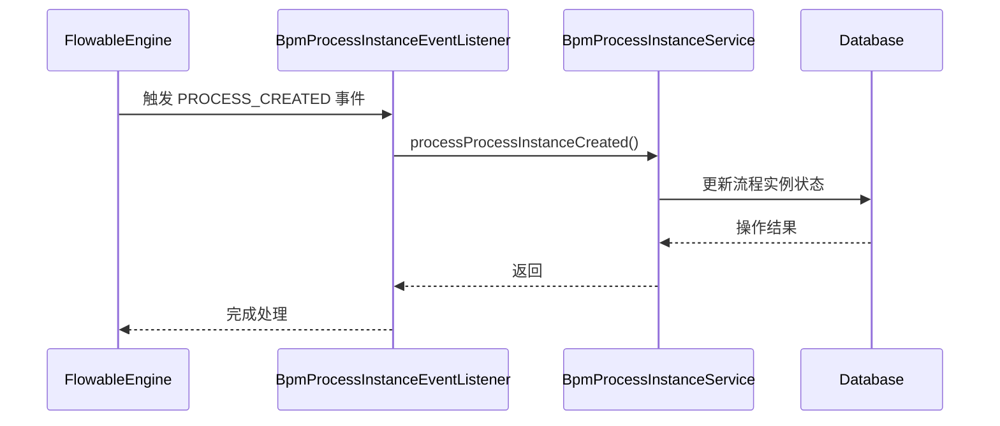
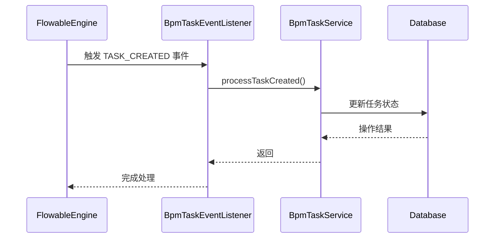
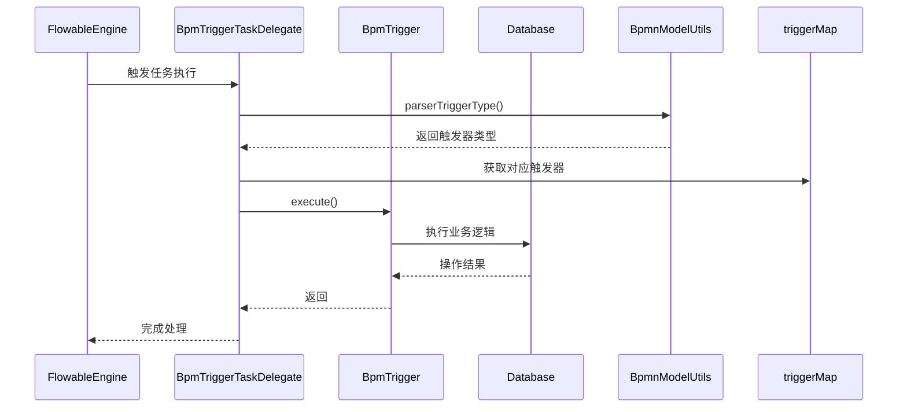
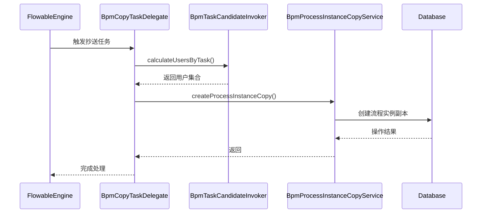

# listener_2_bpm_listener 模块文档

## 1. 概述

`listener_2_bpm_listener` 模块是 BPM 模块的核心组件之一，主要负责监听 Flowable 引擎的事件（如流程实例、任务的状态变更）以及处理特定的业务逻辑（如触发器任务、抄送任务）。该模块通过事件监听器和任务委托类，实现了 BPM 业务逻辑与 Flowable 引擎的解耦，使得业务流程的扩展和维护更加灵活。

## 2. 架构设计

### 2.1 模块定位

```
┌─────────────────────────────────────────────────────────────┐
│                      BPM 模块                               │
│  ┌───────────────────────────────────────────────────────┐  │
│  │              listener_2_bpm_listener 子模块           │  │
│  │  ┌─────────────────────────────────────────────────┐  │  │
│  │  │ 核心组件：                                    │  │  │
│  │  │  • BpmProcessInstanceEventListener            │  │  │
│  │  │  • BpmTaskEventListener                       │  │  │
│  │  │  • BpmTriggerTaskDelegate                     │  │  │
│  │  │  • BpmCopyTaskDelegate                        │  │  │
│  │  └─────────────────────────────────────────────────┘  │  │
│  └───────────────────────────────────────────────────────┘  │
└─────────────────────────────────────────────────────────────┘
```

### 2.2 组件关系图

```mermaid
classDiagram
    class BpmProcessInstanceEventListener {
        +PROCESS_INSTANCE_EVENTS: Set<FlowableEngineEventType>
        +processCreated(FlowableEngineEntityEvent)
        +processCompleted(FlowableEngineEntityEvent)
        +processCancelled(FlowableCancelledEvent)
    }

    class BpmTaskEventListener {
        +TASK_EVENTS: Set<FlowableEngineEventType>
        +taskCreated(FlowableEngineEntityEvent)
        +taskAssigned(FlowableEngineEntityEvent)
        +taskCompleted(FlowableEngineEntityEvent)
        +activityCancelled(FlowableActivityCancelledEvent)
        +timerFired(FlowableEngineEntityEvent)
    }

    class BpmTriggerTaskDelegate {
        +BEAN_NAME: String
        +execute(DelegateExecution)
    }

    class BpmCopyTaskDelegate {
        +BEAN_NAME: String
        +execute(DelegateExecution)
    }

    class BpmProcessInstanceService {
        +processProcessInstanceCreated(ProcessInstance)
        +processProcessInstanceCompleted(ProcessInstance)
    }

    class BpmTaskService {
        +processTaskCreated(Task)
        +processTaskAssigned(Task)
        +processTaskCompleted(Task)
        +processTaskCanceled(String)
        +processTaskTimeout(String, String, int)
        +triggerTask(String, String)
        +processChildProcessTimeout(String, String)
    }

    class BpmModelService {
        +getBpmnModelByDefinitionId(String): BpmnModel
    }

    class BpmTrigger {
        +execute(String, String)
    }

    class BpmTaskCandidateInvoker {
        +calculateUsersByTask(DelegateExecution): Set<Long>
    }

    class BpmProcessInstanceCopyService {
        +createProcessInstanceCopy(Set<Long>, String, String, String, String, String)
    }

    BpmProcessInstanceEventListener -- BpmProcessInstanceService : 依赖
    BpmTaskEventListener -- BpmTaskService : 依赖
    BpmTaskEventListener -- BpmModelService : 依赖
    BpmTriggerTaskDelegate -- BpmTrigger : 依赖
    BpmCopyTaskDelegate -- BpmTaskCandidateInvoker : 依赖
    BpmCopyTaskDelegate -- BpmProcessInstanceCopyService : 依赖
```



## 3. 核心组件说明

### 3.1 BpmProcessInstanceEventListener

**功能描述**：监听流程实例（ProcessInstance）的生命周期事件，包括创建、完成和取消，并调用相应的服务类更新业务状态。

**关键特性**：
- 监听的事件类型：`PROCESS_CREATED`、`PROCESS_COMPLETED`、`PROCESS_CANCELLED`
- 使用 `@Lazy` 注解避免循环依赖
- 通过 `FlowableUtils.execute` 方法处理多租户隔离

**代码示例**：
```java
@Component
public class BpmProcessInstanceEventListener extends AbstractFlowableEngineEventListener {
    
    public static final Set<FlowableEngineEventType> PROCESS_INSTANCE_EVENTS = 
        ImmutableSet.<FlowableEngineEventType>builder()
            .add(FlowableEngineEventType.PROCESS_CREATED)
            .add(FlowableEngineEventType.PROCESS_COMPLETED)
            .add(FlowableEngineEventType.PROCESS_CANCELLED)
            .build();

    @Resource
    @Lazy
    private BpmProcessInstanceService processInstanceService;

    @Override
    protected void processCreated(FlowableEngineEntityEvent event) {
        ProcessInstance processInstance = (ProcessInstance) event.getEntity();
        FlowableUtils.execute(processInstance.getTenantId(),
            () -> processInstanceService.processProcessInstanceCreated(processInstance));
    }

    @Override
    protected void processCompleted(FlowableEngineEntityEvent event) {
        ProcessInstance processInstance = (ProcessInstance) event.getEntity();
        FlowableUtils.execute(processInstance.getTenantId(),
            () -> processInstanceService.processProcessInstanceCompleted(processInstance));
    }

    @Override
    protected void processCancelled(FlowableCancelledEvent event) {
        // 特殊情况处理：当跳转到 EndEvent 流程实例未结束
        ProcessInstance processInstance = processInstanceService.getProcessInstance(event.getProcessInstanceId());
        if (processInstance != null) {
            FlowableUtils.execute(processInstance.getTenantId(),
                () -> processInstanceService.processProcessInstanceCompleted(processInstance));
        }
    }
}
```

### 3.2 BpmTaskEventListener

**功能描述**：监听任务（Task）的生命周期事件，包括创建、分配、完成、取消以及定时器触发等，并调用相应的服务类处理业务逻辑。

**关键特性**：
- 监听的事件类型：`TASK_CREATED`、`TASK_ASSIGNED`、`TASK_COMPLETED`、`ACTIVITY_CANCELLED`、`TIMER_FIRED`
- 支持边界事件（Boundary Event）的超时处理
- 支持子流程超时处理

**代码示例**：
```java
@Component
@Slf4j
public class BpmTaskEventListener extends AbstractFlowableEngineEventListener {

    @Resource
    @Lazy
    private BpmModelService modelService;
    
    @Resource
    @Lazy
    private BpmTaskService taskService;

    public static final Set<FlowableEngineEventType> TASK_EVENTS = 
        ImmutableSet.<FlowableEngineEventType>builder()
            .add(FlowableEngineEventType.TASK_CREATED)
            .add(FlowableEngineEventType.TASK_ASSIGNED)
            .add(FlowableEngineEventType.TASK_COMPLETED)
            .add(FlowableEngineEventType.ACTIVITY_CANCELLED)
            .add(FlowableEngineEventType.TIMER_FIRED)
            .build();

    @Override
    protected void taskCreated(FlowableEngineEntityEvent event) {
        Task entity = (Task) event.getEntity();
        FlowableUtils.execute(entity.getTenantId(), () -> taskService.processTaskCreated(entity));
    }

    @Override
    protected void taskAssigned(FlowableEngineEntityEvent event) {
        Task entity = (Task) event.getEntity();
        FlowableUtils.execute(entity.getTenantId(), () -> taskService.processTaskAssigned(entity));
    }

    @Override
    protected void taskCompleted(FlowableEngineEntityEvent event) {
        Task entity = (Task) event.getEntity();
        FlowableUtils.execute(entity.getTenantId(), () -> taskService.processTaskCompleted(entity));
    }

    @Override
    protected void activityCancelled(FlowableActivityCancelledEvent event) {
        // 处理活动取消
    }

    @Override
    protected void timerFired(FlowableEngineEntityEvent event) {
        // 处理定时器触发，包括用户任务超时、延迟器超时、子流程超时
    }
}
```

### 3.3 BpmTriggerTaskDelegate

**功能描述**：处理触发器任务的 JavaDelegate 实现，主要用于 Simple 设计器中的触发器节点。根据 FlowElement 中的触发器类型，调用对应的触发器执行逻辑。

**关键特性**：
- 使用 EnumMap 存储不同触发器类型的映射
- 通过 `BpmnModelUtils.parserTriggerType` 解析触发器类型
- 通过 `BpmnModelUtils.parserTriggerParam` 解析触发器参数

**代码示例**：
```java
@Component(BPM_TRIGGER_TASK_BEAN_NAME)
@Slf4j
public class BpmTriggerTaskDelegate implements JavaDelegate {

    public static final String BEAN_NAME = "bpmTriggerTaskDelegate";

    @Resource
    private List<BpmTrigger> triggers;

    private final EnumMap<BpmTriggerTypeEnum, BpmTrigger> triggerMap = new EnumMap<>(BpmTriggerTypeEnum.class);

    @PostConstruct
    private void init() {
        triggers.forEach(trigger -> triggerMap.put(trigger.getType(), trigger));
    }

    @Override
    public void execute(DelegateExecution execution) {
        FlowElement flowElement = execution.getCurrentFlowElement();
        BpmTriggerTypeEnum bpmTriggerType = BpmnModelUtils.parserTriggerType(flowElement);
        BpmTrigger bpmTrigger = triggerMap.get(bpmTriggerType);
        
        if (bpmTrigger == null) {
            log.error("[execute][FlowElement({}), {} 找不到匹配的触发器]", 
                execution.getCurrentActivityId(), flowElement);
            return;
        }
        bpmTrigger.execute(execution.getProcessInstanceId(), 
            BpmnModelUtils.parserTriggerParam(flowElement));
    }
}
```

### 3.4 BpmCopyTaskDelegate

**功能描述**：处理抄送用户的 JavaDelegate 实现，主要用于仿钉钉/飞书模式的抄送节点。计算抄送用户并创建流程实例副本。

**关键特性**：
- 使用 `BpmTaskCandidateInvoker` 计算抄送用户
- 通过 `BpmProcessInstanceCopyService` 创建流程实例副本

**代码示例**：
```java
@Component(BPM_COPY_TASK_BEAN_NAME)
public class BpmCopyTaskDelegate implements JavaDelegate {

    public static final String BEAN_NAME = "bpmCopyTaskDelegate";

    @Resource
    private BpmTaskCandidateInvoker taskCandidateInvoker;

    @Resource
    private BpmProcessInstanceCopyService processInstanceCopyService;

    @Override
    public void execute(DelegateExecution execution) {
        // 1. 获得抄送人
        Set<Long> userIds = taskCandidateInvoker.calculateUsersByTask(execution);
        if (CollUtil.isEmpty(userIds)) {
            return;
        }
        // 2. 执行抄送
        FlowElement currentFlowElement = execution.getCurrentFlowElement();
        FlowableUtils.execute(execution.getTenantId(), () ->
            processInstanceCopyService.createProcessInstanceCopy(
                userIds, null, execution.getProcessInstanceId(),
                currentFlowElement.getId(), currentFlowElement.getName(), null)
        );
    }
}
```

## 4. 数据流分析

### 4.1 流程实例状态变更数据流



### 4.2 任务状态变更数据流



### 4.3 触发器任务执行数据流



### 4.4 抄送任务执行数据流



## 5. 配置说明

### 5.1 组件注册

所有监听器和委托类均通过 `@Component` 注解注册为 Spring Bean，具体注册信息如下：

| 组件类 | Bean 名称 | 说明 |
|--------|-----------|------|
| BpmProcessInstanceEventListener | 默认（类名小写） | 监听流程实例事件 |
| BpmTaskEventListener | 默认（类名小写） | 监听任务事件 |
| BpmTriggerTaskDelegate | bpmTriggerTaskDelegate | 触发器任务处理 |
| BpmCopyTaskDelegate | bpmCopyTaskDelegate | 抄送任务处理 |

### 5.2 依赖注入

所有组件均通过 `@Resource` 注解进行依赖注入，主要依赖的服务包括：

- `BpmProcessInstanceService`：流程实例服务
- `BpmTaskService`：任务服务
- `BpmModelService`：模型服务
- `BpmTrigger` 列表：触发器实现
- `BpmTaskCandidateInvoker`：任务候选人计算器
- `BpmProcessInstanceCopyService`：流程实例副本服务

## 6. 与其他模块的交互

### 6.1 与 BPM 核心模块的交互

- **BpmProcessInstanceService**：处理流程实例的生命周期事件
- **BpmTaskService**：处理任务的生命周期事件和超时逻辑
- **BpmModelService**：获取 BPMN 模型信息

### 6.2 与 Flowable 引擎的交互

- 继承 `AbstractFlowableEngineEventListener`，监听 Flowable 引擎事件
- 实现 `JavaDelegate` 接口，作为 Flowable 的任务委托

### 6.3 与多租户系统的交互

- 通过 `FlowableUtils.execute` 方法，确保所有操作都在正确的租户上下文中执行

## 7. 扩展点说明

### 7.1 自定义触发器

要实现自定义的触发器逻辑，需要：

1. 实现 `BpmTrigger` 接口
2. 注册为 Spring Bean
3. 在 BPMN 的触发器节点中配置对应的触发器类型

### 7.2 自定义抄送逻辑

要实现自定义的抄送逻辑，需要：

1. 修改 `BpmTaskCandidateInvoker` 的用户计算逻辑
2. 或者创建新的 Delegate 类替换 `BpmCopyTaskDelegate`

### 7.3 自定义事件监听

要实现自定义的事件监听逻辑，可以：

1. 继承 `AbstractFlowableEngineEventListener`
2. 重写相应的事件处理方法
3. 注册为 Spring Bean

## 8. 常见问题

### 8.1 循环依赖问题

**问题**：在监听器和服务类之间可能存在循环依赖。

**解决方案**：使用 `@Lazy` 注解延迟加载依赖，避免 Spring 容器启动时的循环依赖问题。

### 8.2 租户隔离问题

**问题**：在多租户环境下，需要确保事件处理在正确的租户上下文中执行。

**解决方案**：使用 `FlowableUtils.execute` 方法，将租户 ID 作为上下文传递。

### 8.3 定时器事件处理

**问题**：定时器事件（TIMER_FIRED）的 elementId 可能为空。

**解决方案**：从 JobHandlerConfiguration 中解析 JSON 获取 elementId。

## 9. 参考文档

- [BPM 模块整体架构](bpm_module.md)
- [Flowable 引擎事件监听](https://www.flowable.org/docs/userguide/index.html#events)
- [多租户系统设计](tenant_system.md)
