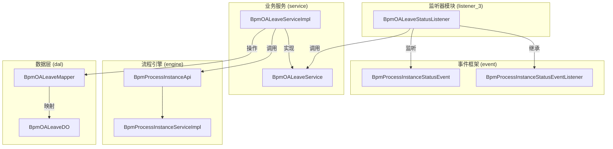
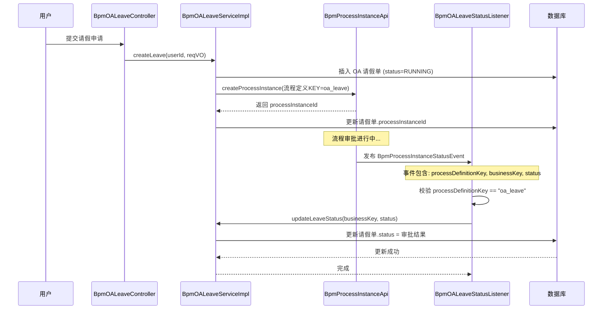
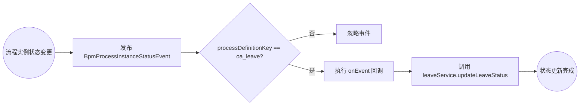
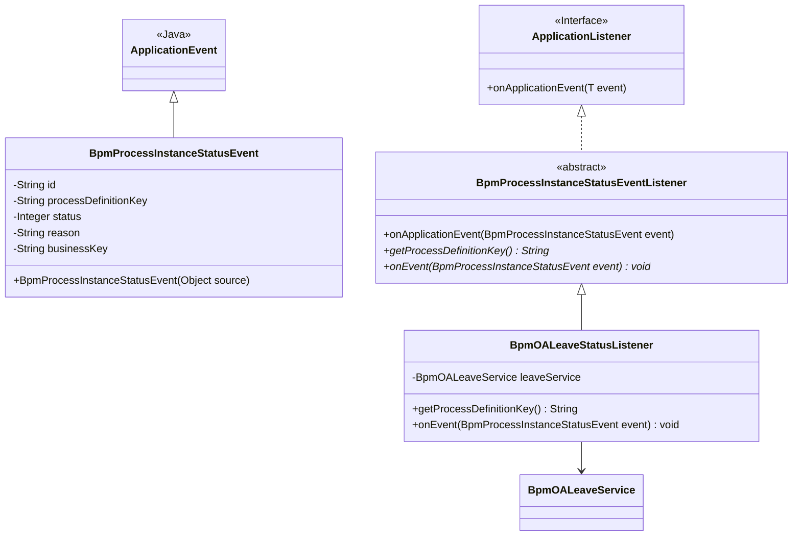
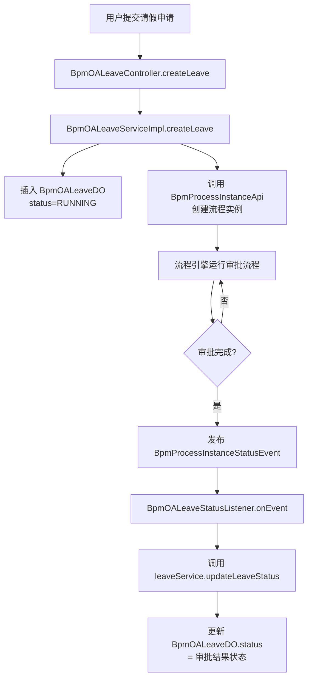

# OA 请假单状态监听器模块 (listener_3)

## 1. 模块简介

`listener_3` 模块位于 `yudao-module-bpm` 项目中，核心组件为 **BpmOALeaveStatusListener**（OA 请假单状态监听器）。该监听器负责监听 BPM 工作流引擎中 OA 请假流程（`oa_leave`）的流程实例状态变更事件，并根据事件结果同步更新 OA 请假单的业务状态。

通过监听机制，实现了**流程审批状态与业务单据状态的解耦联动**——当审批流结束（通过、驳回、取消等）时，自动更新请假单的审批状态字段。

## 2. 架构概览

### 2.1 模块依赖关系



### 2.2 核心组件关系

| 组件 | 类型 | 职责 |
|------|------|------|
| `BpmOALeaveStatusListener` | 监听器 (Listener) | 监听 OA 请假流程实例状态事件，更新请假单业务状态 |
| `BpmProcessInstanceStatusEventListener` | 抽象监听器 | 提供流程实例状态事件监听的通用骨架，按 `processDefinitionKey` 过滤 |
| `BpmProcessInstanceStatusEvent` | 事件对象 | 封装流程实例状态变更的详细信息（id、key、status、businessKey） |
| `BpmOALeaveService` | 服务接口 | 定义 OA 请假单的增删改查接口 |
| `BpmOALeaveServiceImpl` | 服务实现 | 实现 OA 请假单业务逻辑，包括发起审批、更新状态等 |

## 3. 核心流程详解

### 3.1 整体业务流程



### 3.2 事件驱动机制



### 3.3 事件与监听器类图



## 4. 关键组件说明

### 4.1 BpmOALeaveStatusListener

**文件位置**: `yudao-module-bpm/src/main/java/cn/iocoder/yudao/module/bpm/service/oa/listener/BpmOALeaveStatusListener.java`

**核心功能**:
- 继承 `BpmProcessInstanceStatusEventListener` 抽象类，注册为 Spring `@Component`
- 通过 `getProcessDefinitionKey()` 返回 `BpmOALeaveServiceImpl.PROCESS_KEY`（即 `"oa_leave"`），指定只监听 OA 请假流程
- 在 `onEvent()` 回调中，从事件中提取 `businessKey`（即请假单 ID）和 `status`（审批结果状态码），调用 `leaveService.updateLeaveStatus()` 更新请假单状态

**源码**:
```java
@Component
public class BpmOALeaveStatusListener extends BpmProcessInstanceStatusEventListener {

    @Resource
    private BpmOALeaveService leaveService;

    @Override
    protected String getProcessDefinitionKey() {
        return BpmOALeaveServiceImpl.PROCESS_KEY; // "oa_leave"
    }

    @Override
    protected void onEvent(BpmProcessInstanceStatusEvent event) {
        leaveService.updateLeaveStatus(Long.parseLong(event.getBusinessKey()), event.getStatus());
    }
}
```

### 4.2 BpmProcessInstanceStatusEventListener（父类）

**文件位置**: `yudao-module-bpm/src/main/java/cn/iocoder/yudao/module/bpm/api/event/BpmProcessInstanceStatusEventListener.java`

**核心功能**:
- 实现 `ApplicationListener<BpmProcessInstanceStatusEvent>` 接口
- `onApplicationEvent()` 方法中先校验事件的 `processDefinitionKey` 是否与当前监听器关注的 Key 一致，不一致则忽略
- 匹配时调用抽象方法 `onEvent()` 交由子类处理具体业务

### 4.3 BpmProcessInstanceStatusEvent（事件）

**文件位置**: `yudao-module-bpm/src/main/java/cn/iocoder/yudao/module/bpm/api/event/BpmProcessInstanceStatusEvent.java`

**核心字段**:
| 字段 | 类型 | 说明 |
|------|------|------|
| `id` | String | 流程实例编号 |
| `processDefinitionKey` | String | 流程定义 Key，用于区分不同流程 |
| `status` | Integer | 流程实例状态（审批结果） |
| `reason` | String | 结束原因 |
| `businessKey` | String | 业务标识，即请假单 ID |

### 4.4 BpmOALeaveService / BpmOALeaveServiceImpl

**文件位置**: 
- 接口: `yudao-module-bpm/src/main/java/cn/iocoder/yudao/module/bpm/service/oa/BpmOALeaveService.java`
- 实现: `yudao-module-bpm/src/main/java/cn/iocoder/yudao/module/bpm/service/oa/BpmOALeaveServiceImpl.java`

**核心功能**:
- `createLeave()`: 创建请假申请，插入请假单并启动 BPM 流程
- `updateLeaveStatus()`: 更新请假单的审批状态
- `getLeave()` / `getLeavePage()`: 查询请假单

## 5. 业务数据流



## 6. 与其他模块的关系

| 关联模块 | 关联文件 | 关系说明 |
|---------|---------|---------|
| [oa_2.md](oa_2.md) | `BpmOALeaveController`, `BpmOALeaveServiceImpl` | OA 请假单的控制器和服务实现，监听器依赖其更新状态 |
| [listener_2.md](listener_2.md) | `BpmProcessInstanceEventListener`, `BpmTaskEventListener` | 同属 BPM 监听器体系，但 listener_2 关注更底层的 Flowable 引擎事件 |
| [event.md](event.md) | `BpmProcessInstanceStatusEvent` | 定义了流程实例状态事件，是监听器的数据载体 |
| [task_5.md](task_5.md) | `BpmProcessInstanceServiceImpl` | 流程实例服务，负责发布状态变更事件 |

## 7. 扩展指南

若要为其他业务流程（如 CRM 合同审批、ERP 采购审批）添加类似的监听器，可参考以下步骤：

1. **创建监听器类**：继承 `BpmProcessInstanceStatusEventListener`
2. **实现抽象方法**：
   - `getProcessDefinitionKey()`: 返回对应流程定义的 Key
   - `onEvent()`: 处理状态变更后的业务逻辑
3. **注册为 Bean**：添加 `@Component` 注解

```java
@Component
public class XxxStatusListener extends BpmProcessInstanceStatusEventListener {

    @Resource
    private XxxService xxxService;

    @Override
    protected String getProcessDefinitionKey() {
        return "xxx_process_key";
    }

    @Override
    protected void onEvent(BpmProcessInstanceStatusEvent event) {
        xxxService.updateStatus(Long.parseLong(event.getBusinessKey()), event.getStatus());
    }
}
```

## 8. 常见问题

### Q1: 监听器未触发怎么办？
- 确认流程定义的 Key 与 `getProcessDefinitionKey()` 返回值一致
- 确认监听器已正确注册为 Spring Bean（`@Component`）
- 确认事件已正常发布（检查 `BpmProcessInstanceServiceImpl` 中的事件发布逻辑）

### Q2: businessKey 解析失败？
- 确保创建流程实例时正确传入了 `businessKey`（见 `BpmOALeaveServiceImpl.createLeave()`）
- `businessKey` 应为字符串形式的业务主键 ID
