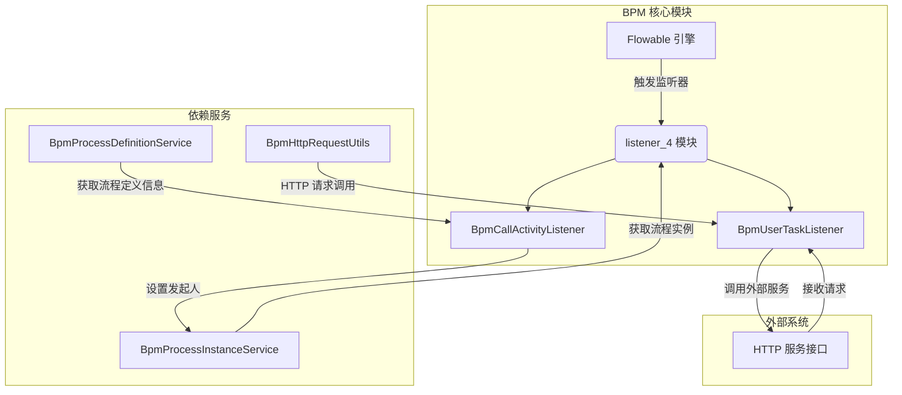
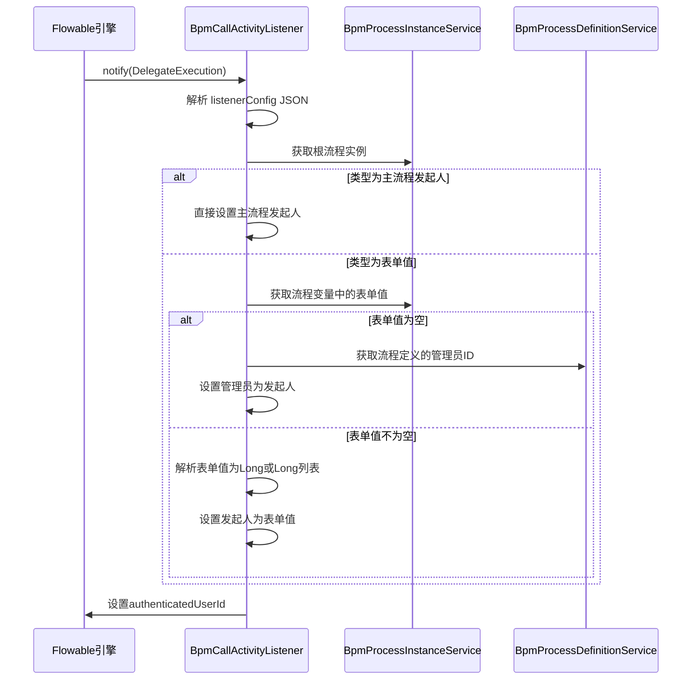
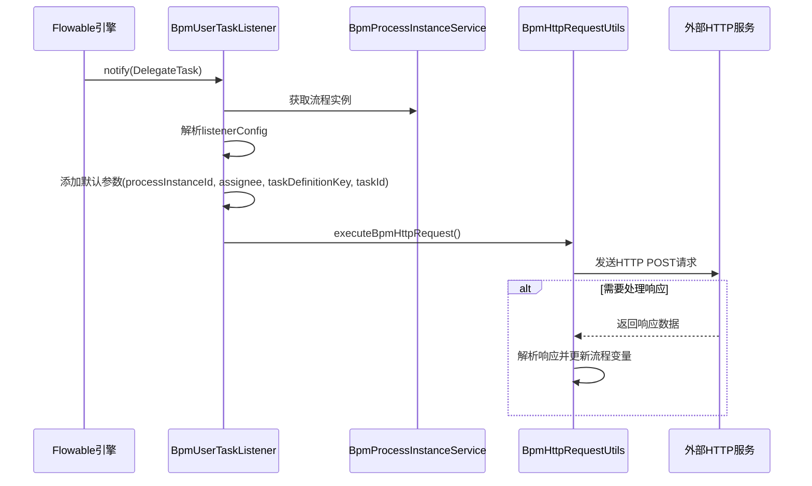

# listener_4 模块文档 - BPM 任务监听器

## 1. 模块概述

`listener_4` 模块是 BPM（业务流程管理）模块中的核心监听器组件，负责在流程执行的关键节点触发自定义的业务逻辑。该模块实现了 Flowable 引擎的监听器接口，通过配置化的方式扩展 BPM 流程的能力，主要包含两个核心监听器：

- **BpmCallActivityListener**：子流程调用监听器，负责设置子流程的发起人
- **BpmUserTaskListener**：用户任务通用监听器，负责在用户任务执行时触发 HTTP 请求

该模块采用配置驱动的设计模式，监听器的行为通过 JSON 表达式配置，实现了业务逻辑与流程引擎的解耦，支持灵活的业务扩展。

## 2. 架构概览



### 2.1 组件关系说明

- **BpmCallActivityListener** 实现 Flowable 的 `ExecutionListener` 接口，在子流程（Call Activity）启动时触发，负责根据配置设置子流程的发起人。
- **BpmUserTaskListener** 实现 Flowable 的 `TaskListener` 接口，在用户任务（User Task）触发时触发，负责向外部 HTTP 服务发送通知或请求。
- 两个监听器都通过 Spring 的 `@Component` 注解注册为 Spring Bean，并通过 `Expression` 字段接收配置。
- 监听器依赖 BPM 模块的服务层（`BpmProcessInstanceService`、`BpmProcessDefinitionService`）和工具类（`BpmHttpRequestUtils`）来完成业务逻辑。

## 3. 核心组件详解

### 3.1 BpmCallActivityListener - 子流程发起人设置监听器

#### 3.1.1 功能描述

该监听器在子流程（Call Activity）启动时被触发，负责根据配置动态设置子流程的发起人。支持以下三种发起人来源：

1. **主流程发起人**：直接使用主流程的发起人作为子流程发起人
2. **表单值**：从流程变量中获取表单字段的值作为发起人
3. **兜底策略**：当表单值为空时，支持多种兜底方案（主流程发起人、子流程管理员、主流程管理员）

#### 3.1.2 配置结构

监听器通过 `listenerConfig` 字段接收 JSON 格式的配置，配置结构如下：

```json
{
  "type": "FROM_FORM",
  "formField": "assigneeUserId",
  "emptyType": "MAIN_PROCESS_START_USER"
}
```

| 字段 | 说明 | 可选值 |
|------|------|--------|
| `type` | 发起人来源类型 | `MAIN_PROCESS_START_USER`、`FROM_FORM` |
| `formField` | 当 type 为 `FROM_FORM` 时，指定表单字段名 | 字符串 |
| `emptyType` | 当表单值为空时的兜底策略 | `MAIN_PROCESS_START_USER`、`CHILD_PROCESS_ADMIN`、`MAIN_PROCESS_ADMIN` |

#### 3.1.3 执行流程



#### 3.1.4 关键代码逻辑

```java
// 设置发起人
FlowableUtils.setAuthenticatedUserId(Long.parseLong(processInstance.getStartUserId()));

// 从流程变量获取表单值
String formFieldValue = MapUtil.getStr(processInstance.getProcessVariables(), startUserSetting.getFormField());

// 获取流程定义的管理员信息
BpmProcessDefinitionInfoDO processDefinition = processDefinitionService.getProcessDefinitionInfo(execution.getProcessDefinitionId());
List<Long> managerUserIds = processDefinition.getManagerUserIds();
```

### 3.2 BpmUserTaskListener - 用户任务 HTTP 通知监听器

#### 3.2.1 功能描述

该监听器在用户任务（User Task）被触发时被调用，负责向外部 HTTP 服务发送通知请求。支持配置请求路径、请求头和请求体参数，并可选择是否处理响应。

#### 3.2.2 配置结构

通过 `listenerConfig` 字段接收配置，解析为 `ListenerHandler` 对象：

```json
{
  "path": "http://external-service/bpm/task/notify",
  "header": [
    {"key": "X-Custom-Header", "value": "fixedValue", "type": "FIXED_VALUE"}
  ],
  "body": [
    {"key": "processInstanceId", "type": "FIXED_VALUE"},
    {"key": "assignee", "type": "FROM_FORM", "value": "assignee"}
  ]
}
```

#### 3.2.3 执行流程



#### 3.2.4 默认请求参数

监听器自动添加以下默认参数到请求体：

| 参数名 | 说明 | 来源 |
|--------|------|------|
| `processInstanceId` | 流程实例ID | 固定值 |
| `assignee` | 任务承办人 | 固定值 |
| `taskDefinitionKey` | 任务定义键 | 固定值 |
| `taskId` | 任务ID | 固定值 |

#### 3.2.5 HTTP 请求处理

`BpmHttpRequestUtils` 工具类负责实际的 HTTP 请求发送和响应处理：

- 使用 Spring 的 `RestTemplate` 发起 POST 请求
- 自动添加租户 ID 到请求头
- 支持从流程变量中提取参数作为请求头或请求体
- 响应处理：如果配置了 `handleResponse=true`，则解析响应并更新流程变量

### 3.3 BpmHttpRequestUtils - HTTP 请求工具类

该工具类封装了 BPM 相关的 HTTP 请求逻辑，主要功能包括：

- 构建 HTTP 请求头（支持从流程变量取值）
- 构建 HTTP 请求体
- 发送 HTTP 请求并处理响应
- 从响应中提取需要更新的流程变量

## 4. 模块依赖关系

### 4.1 内部依赖

| 依赖组件 | 说明 |
|----------|------|
| `BpmProcessInstanceService` | 获取流程实例信息、更新流程变量 |
| `BpmProcessDefinitionService` | 获取流程定义信息（如管理员列表） |
| `BpmHttpRequestUtils` | 封装 HTTP 请求逻辑 |
| `FlowableUtils` | Flowable 引擎工具类，设置认证用户 |
| `JsonUtils` | JSON 序列化和反序列化 |

### 4.2 外部依赖

| 依赖模块 | 说明 |
|----------|------|
| **tenant** | 租户上下文（`TenantContextHolder`），用于多租户隔离 |
| **system** | 用户权限相关，通过 `FlowableUtils.setAuthenticatedUserId` 设置认证用户 |
| **mq** | 部分监听器可能涉及消息队列通知（如 `BpmHttpCallbackTrigger`） |

## 5. 使用场景示例

### 5.1 场景一：子流程发起人自动分配

在审批流程中，当需要启动一个子流程（如请假审批）时，希望子流程的发起人自动继承主流程的发起人，或者从表单中指定。

**配置示例：**
```json
{
  "type": "FROM_FORM",
  "formField": "subProcessAssignee",
  "emptyType": "CHILD_PROCESS_ADMIN"
}
```

### 5.2 场景二：用户任务外部通知

当某个任务被分配给用户时，需要向外部系统（如钉钉、企业微信）发送通知。

**配置示例：**
```json
{
  "path": "https://notify-service.example.com/bpm/task/assigned",
  "header": [
    {"key": "Authorization", "value": "Bearer ${token}", "type": "FROM_FORM"},
    {"key": "X-BPM-Type", "value": "TASK_ASSIGN", "type": "FIXED_VALUE"}
  ],
  "body": [
    {"key": "taskId", "type": "FIXED_VALUE"},
    {"key": "assignee", "type": "FIXED_VALUE"},
    {"key": "processInstanceId", "type": "FIXED_VALUE"}
  ],
  "handleResponse": true,
  "response": [
    {"key": "taskId", "value": "externalTaskId"}
  ]
}
```

## 6. 相关模块参考

- [bpm](bpm.md) - BPM 模块整体架构
- [tenant](tenant.md) - 租户上下文管理
- [system](system.md) - 用户权限与安全
- [flowable](flowable.md) - Flowable 引擎集成

## 7. 常见问题

### Q1: 监听器配置不生效怎么办？

**检查点：**
1. 确认监听器配置是否正确绑定到流程节点的扩展字段
2. 确认 JSON 格式是否正确，可以使用在线 JSON 校验工具
3. 确认依赖的服务 Bean 是否正确注入（`@Resource` 注解）

### Q2: HTTP 请求超时如何处理？

**建议：**
- 在 `BpmHttpRequestUtils` 中设置合理的超时时间
- 对于非关键的通知，可以设置 `handleResponse=false` 不等待响应
- 考虑使用异步消息队列替代同步 HTTP 调用

### Q3: 如何调试监听器？

**调试方法：**
1. 在监听器中添加日志输出（`log.info` / `log.error`）
2. 检查 Flowable 引擎的日志级别
3. 使用 Postman 手动测试配置的 HTTP 接口
4. 查看流程实例的变量和日志记录
