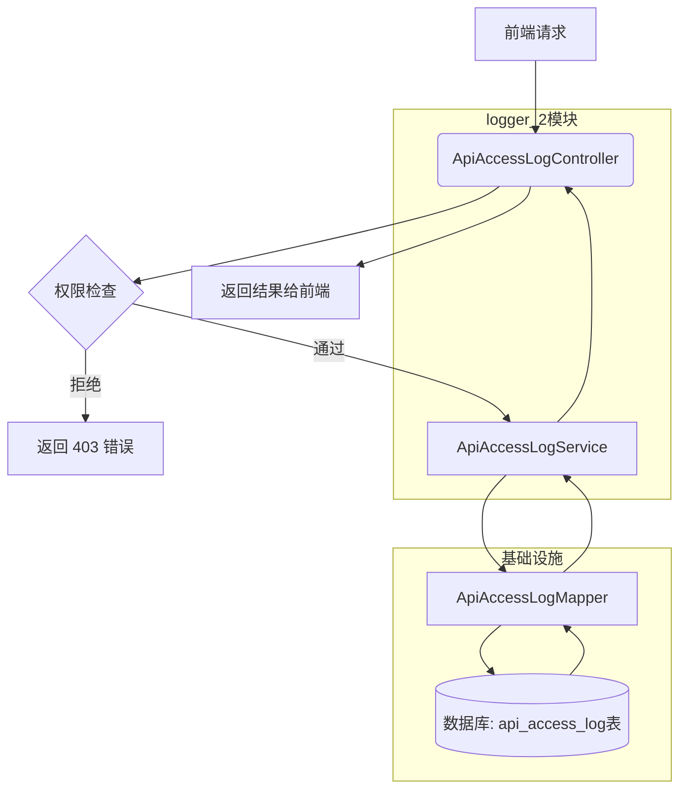
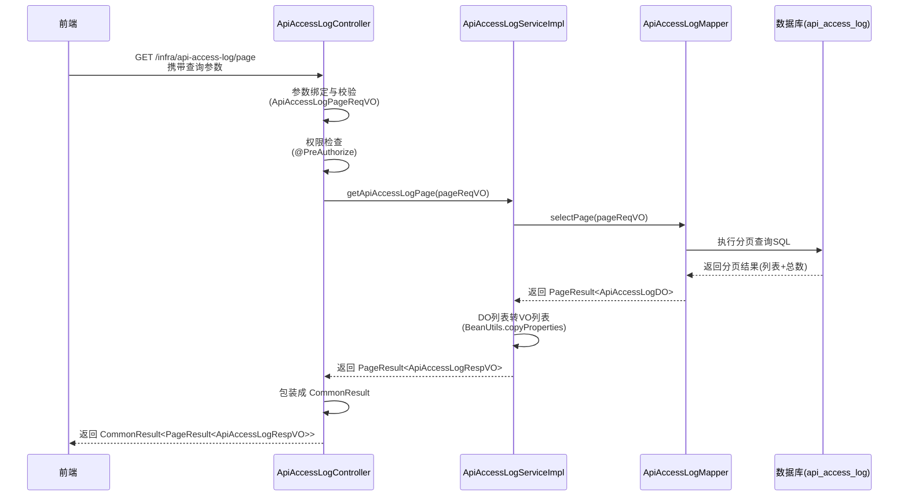
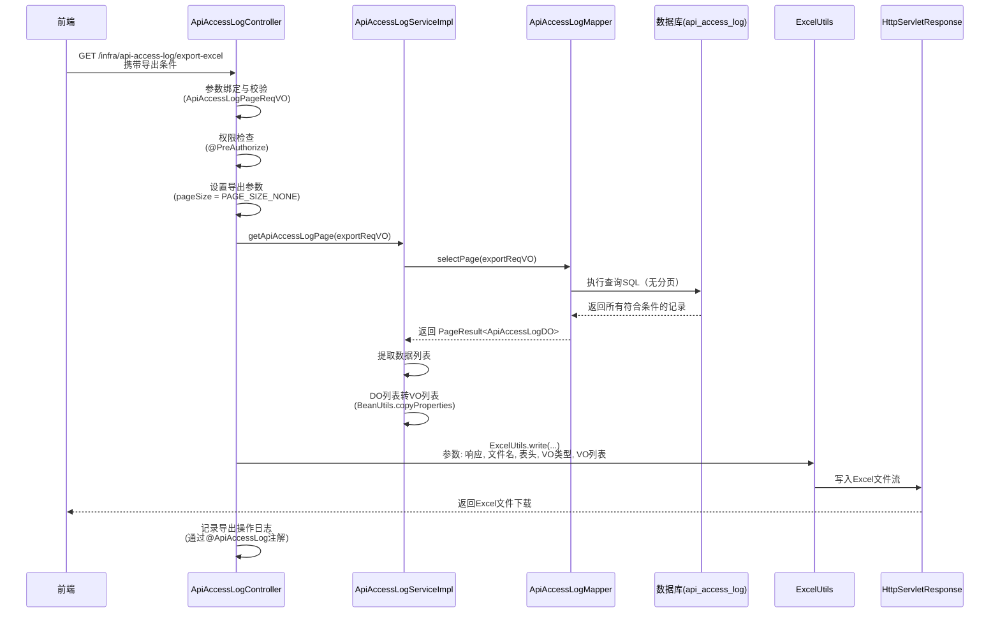

# logger_2 模块文档

## 模块概述

logger_2 模块（ApiAccessLogController）是 Yudao 框架中负责 API 访问日志查询、分页和导出的后台管理接口。该模块提供了对系统中所有 API 请求的访问日志进行查询、分页检索以及 Excel 导出功能，便于管理员审计和分析系统使用情况。

## 核心功能

1. **单条日志查询**：根据日志 ID 查询具体的 API 访问日志详情。
2. **分页查询**：支持多种过滤条件（用户编号、用户类型、应用名、请求地址、开始时间、执行时长、结果码等）的 API 访问日志分页列表。
3. **Excel 导出**：将符合条件的 API 访问日志导出为 Excel 文件，并自动记录导出操作的访问日志。

## 架构设计

### 组件关系

logger_2 模块主要由以下组件组成：

- **控制层 (Controller)**：`ApiAccessLogController` - 处理 HTTP 请求，提供 RESTful 接口。
- **服务层 (Service)**：`ApiAccessLogServiceImpl` - 实现业务逻辑，包括日志查询、分页和清理。
- **数据访问层 (Mapper)**：`ApiAccessLogMapper` - MyBatis mapper，负责与数据库交互。
- **数据对象 (DO)**：`ApiAccessLogDO` - 表示数据库表 `api_access_log` 的实体类。
- **视图对象 (VO)**：
  - `ApiAccessLogPageReqVO` - 分页查询请求参数封装。
  - `ApiAccessLogRespVO` - 响应数据封装，用于返回给前端。

### 依赖关系

logger_2 模块依赖以下内部组件和外部框架：

- 内部服务：`ApiAccessLogService`
- 工具类：`BeanUtils`（属性复制）、`ExcelUtils`（Excel 导出）、`StrUtils`（字符串截取）
- 框架注解：`@ApiAccessLog`（用于记录导出操作的访问日志）
- Spring 框架：`@RestController`、`@GetMapping`、`@PreAuthorize` 等
- Swagger 注解：用于 API 文档生成

### 数据流

以下是 logger_2 模块处理一个请求的典型数据流：

1. **请求接收**：前端发送 HTTP GET 请求至 `/infra/api-access-log/get`、`/page` 或 `/export-excel`。
2. **参数验证**：Spring MVC 自动将请求参数绑定到相应的 VO 对象（如 `ApiAccessLogPageReqVO`），并进行校验。
3. **权限检查**：通过 `@PreAuthorize` 注解和自定义权限表达式（如 `@ss.hasPermission`）验证当前用户是否具备相应权限。
4. **业务处理**：控制器调用 `ApiAccessLogService` 的相应方法：
   - 查询单条日志：调用 `getApiAccessLog(id)`。
   - 分页查询：调用 `getApiAccessLogPage(pageReqVO)`。
   - 导出 Excel：调用 `getApiAccessLogPage(exportReqVO)` 获取数据，然后使用 `ExcelUtils` 生成 Excel 文件并写入响应流。
5. **数据访问**：服务层通过 `ApiAccessLogMapper` 执行数据库操作（SELECT、分页查询等）。
6. **响应返回**：控制器将服务层返回的 DO 对象通过 `BeanUtils` 转换为 VO 对象，封装在 `CommonResult` 中返回；导出操作则直接写入 HTTP 响应流。

## 接口说明

### 获得 API 访问日志

- **路径**：`GET /infra/api-access-log/get`
- **功能**：根据日志 ID 查询具体的 API 访问日志详情。
- **请求参数**：
  - `id` (Long, 必填)：日志主键
- **返回结果**：
  - `CommonResult<ApiAccessLogRespVO>`：成功时返回日志详情，失败时返回错误信息。

### 获得 API 访问日志分页

- **路径**：`GET /infra/api-access-log/page`
- **功能**：支持多条件过滤的 API 访问日志分页列表查询。
- **请求参数**：封装在 `ApiAccessLogPageReqVO` 中，包括：
  - `userId` (Long)：用户编号
  - `userType` (Integer)：用户类型
  - `applicationName` (String)：应用名
  - `requestUrl` (String)：请求地址（模糊匹配）
  - `beginTime` (LocalDateTime[])：开始时间范围
  - `duration` (Integer)：执行时长（大于等于，单位：毫秒）
  - `resultCode` (Integer)：结果码
  - 以及 `PageParam` 中的分页参数（页码、页大小等）
- **返回结果**：
  - `CommonResult<PageResult<ApiAccessLogRespVO>>`：成功时返回分页数据（列表及总数），失败时返回错误信息。

### 导出 API 访问日志 Excel

- **路径**：`GET /infra/api-access-log/export-excel`
- **功能**：导出符合条件的 API 访问日志为 Excel 文件。
- **请求参数**：同分页查询的 `ApiAccessLogPageReqVO`（但会自动将页大小设置为无限制以导出所有数据）。
- **返回结果**：直接返回 Excel 文件流（`application/vnd.ms-excel`），文件名为 "API 访问日志.xls"。
- **特别说明**：
  - 该操作会被记录为访问日志（操作类型为 EXPORT），通过 `@ApiAccessLog(operateType = EXPORT)` 注解实现。
  - 导出前会自动将请求的 `pageSize` 设置为 `PageParam.PAGE_SIZE_NONE`（即 -1），以获取所有符合条件的记录。

## 在系统中的作用

logger_2 模块是 Yudao 框架监控和审计子系统的重要组成部分，具体作用包括：

1. **操作审计**：记录所有 API 请求的详细信息（包括请求参数、响应结果、执行时长等），为系统安全审计和问题排查提供依据。
2. **性能监控**：通过分析日志的时长字段，可以监控 API接口的性能性能，识别优化化瓶颈。
3. **使用统计**：统计不同用户、应用、接口的访问频率，帮助了解系统使用情况。
4. **故障诊断**：当系统出现异常时，可以通过访问日志快速定位问题请求和错误信息。
5. **合规性**：满足某些行业对操作日志留存的合规要求。

在整个系统中，logger_2 模块通常与以下模块协作：
- **操作日志模块 (OperateLog)**：记录业务操作日志，而 logger_2 专注于 API 访问日志。
- **登录日志模块 (LoginLog)**：记录用户登录行为。
- **监控告警模块**：可能基于 API 访问日志的异常（如高错误率、慢请求）触发告警。

## Mermaid 图表

### 架构图

以下 Mermaid 图展示了 logger_2 模块的分层架构及其与相关模块的交互：

### 数据流图（以分页查询为例）

以下 Mermaid 图展示了 logger_2 模块处理分页查询请求的详细数据流：

### 导出Excel数据流图

以下 Mermaid 图展示了 logger_2 模块处理Excel导出请求的数据流：

## 与其他模块的关联

logger_2 模块主要依赖和关联以下模块（通过服务接口或共享基础设施）：

- **基础设施模块**：使用了框架提供的通用工具类（BeanUtils、ExcelUtils、StrUtils）和注解（@ApiAccessLog）。
- **租户模块**：在服务层的 `createApiAccessLog` 方法中（虽然当前控制器不直接调用，但服务实现中有租户相关逻辑）使用了 `TenantContextHolder` 和 `TenantUtils`。
- **数据权限模块**：虽然当前控制器未直接体现，但服务层可能通过 MyBatis 自动注入的方式支持数据权限过滤（取决于具体实现）。

在模块树中，可以看到 logger_2 模块位于 `yudao-module-infra` 下，属于基础设施模块的一部分，为其他业务模块提供 API 访问日志查询能力。

## 结论

logger_2 模块通过清晰的分层设计，提供了简单易用的 API 访问日志查询和导出功能。它利用了 Yudao 框架的统一组件和约定，确保了与其他监控模块的一致性和可维护性。该模块对于系统的运维监控、安全审计和性能优化具有重要价值。