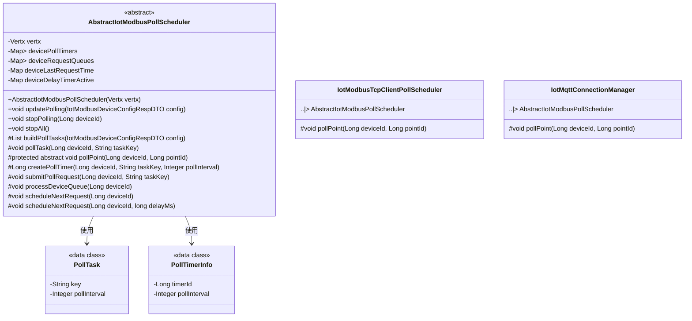
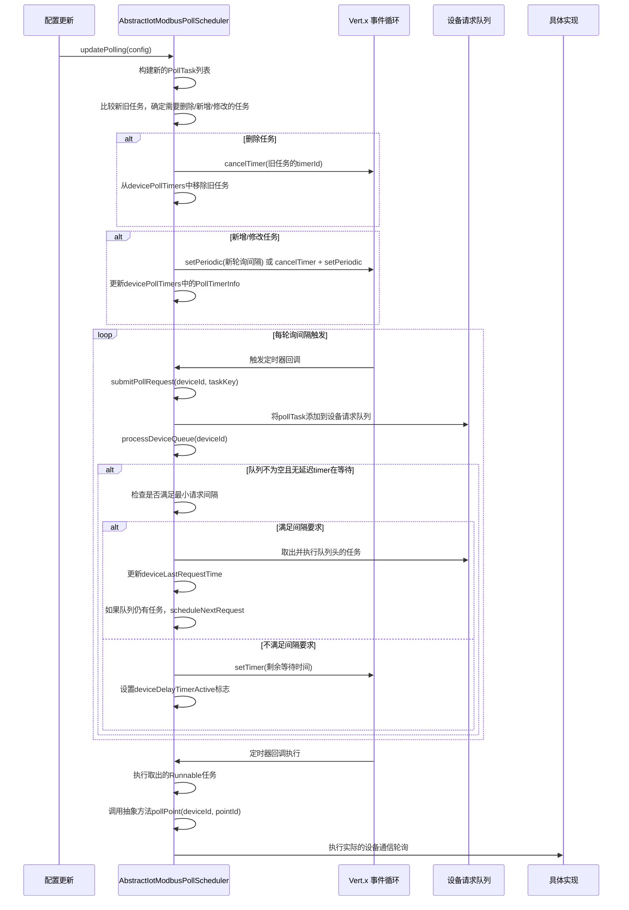
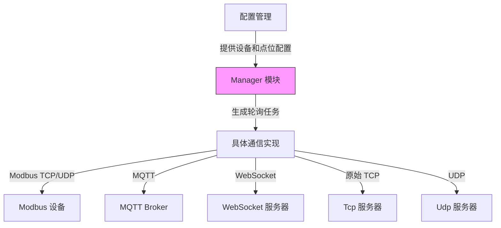

# Manager 模块文档

## 概述

Manager 模块是物联网网关中负责设备通信轮询调度的核心组件。它提供了一套通用的定时器管理和请求队列限速机制，用于高效、安全地轮询各种工业设备（特别是Modbus设备）的数据点位。

该模块的核心是 `AbstractIotModbusPollScheduler` 抽象类，它封装了通用的定时器管理、per-device 请求队列限速逻辑，子类只需实现具体的轮询动作（如读取单个点位或批量读取多个点位）。

## 核心功能

1. **定时器管理**：为每个设备的每个轮询任务创建和管理Vert.x定时器
2. **请求队列限速**：实现per-device的请求队列，防止设备被过度请求导致性能下降
3. **动态更新**：支持轮询任务的增量更新（新增、删除、修改轮询间隔）
4. **异常处理**：对轮询过程中的异常进行捕获和日志记录，确保系统稳定性
5. **资源清理**：提供停止单个设备或所有设备轮询的方法，防止资源泄漏

## 架构设计

### 组件关系

Manager 模块主要包含以下组件：

- `AbstractIotModbusPollScheduler`：抽象基类，提供通用的轮询调度功能
- 具体实现类（如 `IotModbusTcpClientPollScheduler`）：继承基类并实现具体的轮询逻辑
- 数据传输对象：`PollTask` 和 `PollTimerInfo` 用于封装轮询任务和定时器信息

### 类图



### 工作流程



## 详细设计

### 核心数据结构

1. **devicePollTimers**：存储设备轮询任务的定时器信息
   - 外层Key: deviceId (Long)
   - 内层Key: taskKey (String)
   - Value: PollTimerInfo (包含timerId和pollInterval)

2. **deviceRequestQueues**：per-device的请求队列
   - Key: deviceId (Long)
   - Value: Queue<Runnable> (存储待执行的轮询任务)

3. **deviceLastRequestTime**：记录每个设备最后一次请求的时间戳
   - Key: deviceId (Long)
   - Value: lastRequestTimeMs (Long)

4. **deviceDelayTimerActive**：标记设备是否有延迟timer在等待
   - Key: deviceId (Long)
   - Value: 是否有延迟timer在等待 (Boolean)

### 关键常量

- `MIN_REQUEST_INTERVAL = 1000`：同设备最小请求间隔（毫秒），防止Modbus设备性能不足时请求堆积
- `MAX_QUEUE_SIZE = 1000`：每个设备请求队列的最大长度，超出时丢弃最旧请求

### 主要方法说明

#### updatePolling(IotModbusDeviceConfigRespDTO config)
增量更新轮询任务：
1. 删除不再存在的任务对应的定时器
2. 为新增任务创建定时器
3. 对轮询间隔变化的任务，重建定时器
4. 其他属性变化不需要重建定时器（因为pollTask运行时从缓存取最新配置）

#### submitPollRequest(Long deviceId, String taskKey)
提交轮询请求到设备请求队列：
1. 将请求添加到设备的请求队列（超出MAX_QUEUE_SIZE时丢弃最旧请求）
2. 调用processDeviceQueue处理队列

#### processDeviceQueue(Long deviceId)
处理设备请求队列：
1. 检查是否已有延迟timer在等待
2. 检查是否满足最小请求间隔要求
3. 如果满足，立即执行队列头任务；否则调度延迟执行
4. 执行后如果队列仍有任务，继续调度下一个任务的延迟执行

#### pollTask(Long deviceId, String taskKey)
默认的轮询任务实现：
将任务标识作为点位ID，调用抽象方法pollPoint(deviceId, pointId)

#### stopPolling(Long deviceId) / stopAll()
停止设备或所有设备的轮询：
1. 取消所有相关的Vert.x定时器
2. 清理所有相关的数据结构（请求队列、最后请求时间、延迟timer标记）

## 在系统中的作用

Manager 模块位于物联网网关的通信层，是连接配置管理和实际设备通信之间的桥梁：



Manager 模块不直接处理具体的通信协议，而是将通信任务调度交给具体的实现类（如IotModbusTcpClientPollScheduler、IotMqttConnectionManager等），这些实现类负责：
- 建立和维护与设备的连接
- 编码/解码通信协议
- 实际发送/接收数据
- 处理连接异常和重连

这样设计使得Manager模块可以复用通用的调度逻辑，而不同的通信协议只需实现各自的通信细节。

## 使用示例

要创建一个新的轮询调度器实现，需要继承AbstractIotModbusPollScheduler并实现pollPoint方法：

```java
@Component
public class MyCustomPollScheduler extends AbstractIotModbusPollScheduler {

    public MyCustomPollScheduler(Vertx vertx) {
        super(vertx);
    }

    @Override
    protected void pollPoint(Long deviceId, Long pointId) {
        // 实现具体的点位轮询逻辑
        // 例如：从设备缓存中读取点位值，或直接与设备通信
        IotModbusPointRespDTO point = pointCache.get(pointId);
        if (point != null) {
            // 执行实际的Modbus读取操作
            readModbusPoint(deviceId, point);
        }
    }
    
    // 可选：覆盖buildPollTasks以实现点位批量读取
    @Override
    protected List<PollTask> buildPollTasks(IotModbusDeviceConfigRespDTO config) {
        // 将同一功能码、相同起始地址的连续点位合并为一个批量读取任务
        return groupPointsForBatchRead(config.getPoints());
    }
}
```

## 性能考虑

1. **定时器效率**：使用Vert.x的setPeriodic和setTimer，相比Java的Timer和ScheduledExecutorService更轻量级
2. **队列管理**：使用ConcurrentLinkedQueue实现无锁的请求队列，提高并发性能
3. **内存泄漏防止**：通过stopPolling方法及时清理所有相关数据结构
4. **请求合并**：通过覆盖buildPollTasks和pollTask方法，可以实现点位的批量读取，减少实际的通信次数
5. **异常隔离**：单个轮询任务的异常不会影响其他任务的执行

## 与其他模块的关系

Manager 模块主要与以下模块交互：

1. **配置模块**：通过updatePolling方法接收设备和点位配置更新
2. **缓存模块**：具体实现类可能需要从缓存中读取最新的设备点位配置
3. **通信模块**：具体实现类负责与实际的通信实现（如Netty客户端）交互
4. **监控模块**：可以通过扩展来添加轮询成功/失败的监控上报

在依赖方面，Manager 模块主要依赖：
- Vert.x 框架（用于定时器和事件循环）
- Lombok（用于简化数据类的实现）
- 项目通用工具类（如CollectionUtils）

## 注意事项

1. **抽象方法实现**：继承AbstractIotModbusPollScheduler的子类必须实现pollPoint方法来定义具体的轮询动作
2. **线程安全**：所有共享状态都使用了并发集合（ConcurrentHashMap、ConcurrentLinkedQueue），确保线程安全
3. **资源清理**：在停止服务或更新配置时，应及时调用stopPolling方法防止定时器泄漏
4. **配置一致性**：更新轮询配置时，确保新旧配置的taskKey保持一致，以便正确处理任务的增量更新
5. **异常处理**：虽然基类已经捕获并记录了轮询任务的异常，但具体实现的pollPoint方法仍应考虑业务层面的异常处理策略

## 结论

Manager 模块通过抽象通用的轮询调度逻辑，为物联网网关提供了一个灵活、高效且可扩展的设备通信调度框架。它有效地解决了Modbus等工业协议在高并发场景下的性能问题，同时保持了代码的简洁性和可维护性。通过继承基类并实现具体的轮询逻辑，开发者可以快速添加对新通信协议或设备类型的支持。