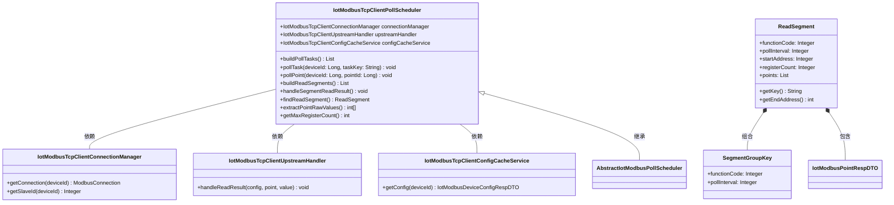
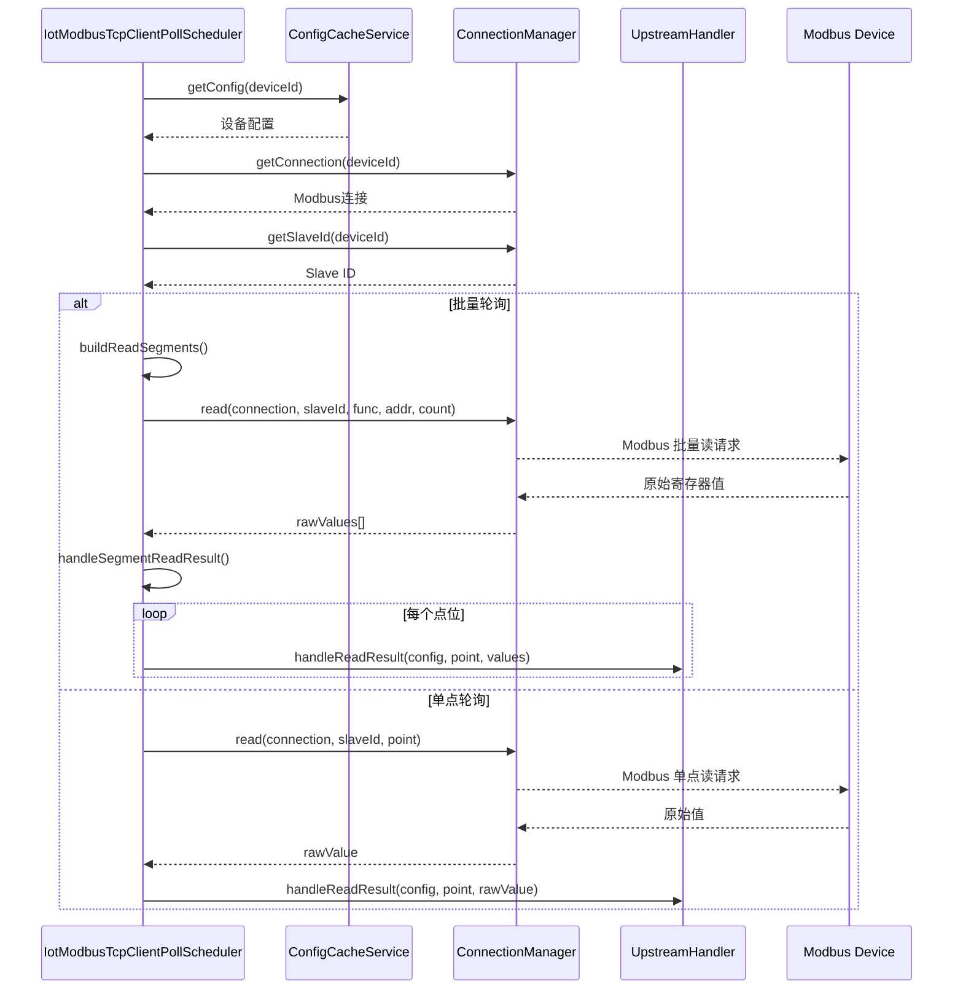
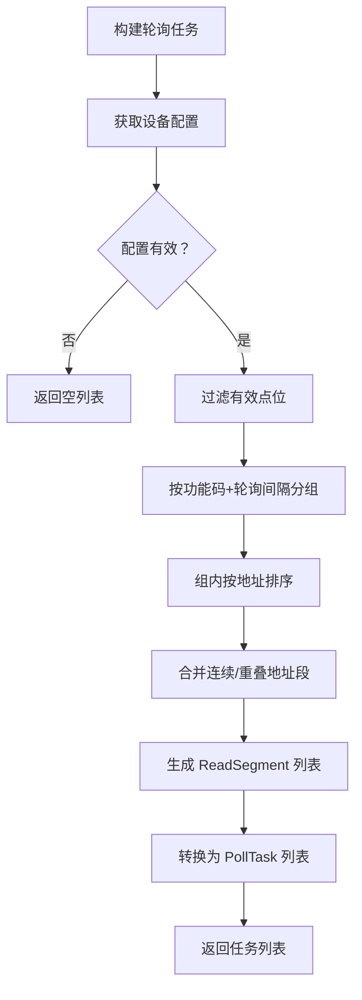
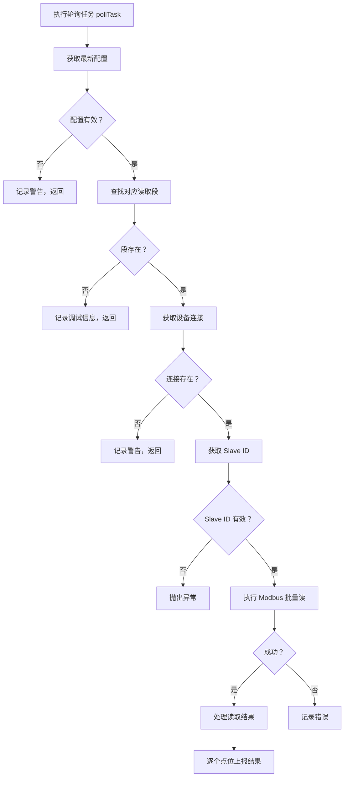
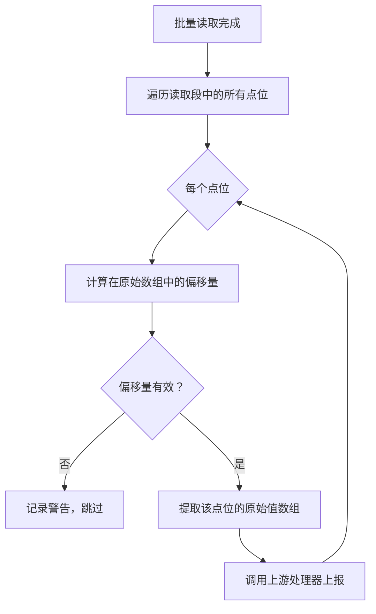
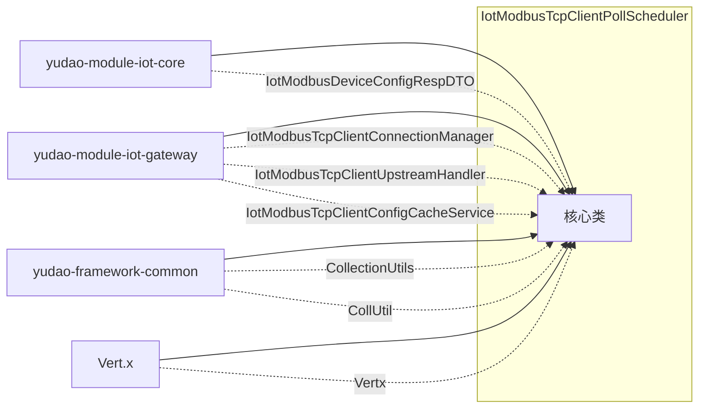

# manager_2 模块文档 - IoT Modbus TCP 客户端轮询调度器

## 1. 模块概述

**manager_2** 模块是 IoT 网关（IoT Gateway）中负责 Modbus TCP 客户端轮询调度的核心组件。该模块实现了基于 Vert.x 的事件驱动轮询调度器，用于管理 IoT 设备 Modbus 点位的定时读取任务，支持批量读取、地址合并、动态更新等高级功能，确保高效、可靠地从 Modbus 设备采集数据。

模块核心类为 `IotModbusTcpClientPollScheduler`，继承自 `AbstractIotModbusPollScheduler`，负责：
- 构建轮询任务（PollTask）
- 执行轮询读取（pollTask / pollPoint）
- 合并连续地址段以减少 Modbus 请求次数
- 处理读取结果并上报
- 动态更新轮询配置

## 2. 架构设计

### 2.1 模块定位

```
┌─────────────────────────────────────────────────────────────────┐
│                      IoT 网关模块                               │
│  ┌─────────────┐    ┌─────────────┐    ┌─────────────────────┐  │
│  │  Modbus TCP │    │   MQTT      │    │     WebSocket       │  │
│  │  客户端     │    │  客户端     │    │     客户端          │  │
│  └──────┬──────┘    └──────┬──────┘    └────────────┬────────┘  │
│         │                 │                         │           │
│    ┌────▼────┐      ┌────▼────┐              ┌──────▼──────┐   │
│  │ IotModbus │      │ IotMqtt │              │ IotWebSocket│   │
│  │ TcpClient│      │ TcpClient│              │ TcpClient   │   │
│  │ PollSched│      │ PollSched│              │ PollSched   │   │
│  │ 器       │      │ 器       │              │ 器         │   │
│  └────┬────┘      └────┬────┘              └──────┬──────┘   │
│       │               │                           │          │
│       └───────────────┼───────────────────────────┘          │
│                       │                                    │
│              ┌────────▼────────────────────────────────┐    │
│              │        统一轮询调度框架                 │    │
│              │  AbstractIotModbusPollScheduler         │    │
│              └──────────────────────────────────────────┘    │
└───────────────────────────────────────────────────────────────┘
```

### 2.2 组件关系图



### 2.3 数据流图



## 3. 核心组件说明

### 3.1 IotModbusTcpClientPollScheduler

**功能描述**：IoT Modbus TCP 客户端轮询调度器，管理点位的轮询定时器，调度读取任务并上报结果。

**主要职责**：
1. 根据设备配置构建轮询任务列表
2. 执行定时轮询（批量或单点）
3. 合并连续地址段以优化 Modbus 请求
4. 处理读取结果并向上游处理器上报
5. 动态更新轮询配置

**构造函数参数**：
| 参数 | 类型 | 说明 |
|------|------|------|
| vertx | Vertx | Vertx 事件循环上下文 |
| connectionManager | IotModbusTcpClientConnectionManager | Modbus TCP 连接管理器 |
| upstreamHandler | IotModbusTcpClientUpstreamHandler | 上游结果处理器 |
| configCacheService | IotModbusTcpClientConfigCacheService | 配置缓存服务 |

### 3.2 ReadSegment（读取段）

**功能描述**：表示一次 Modbus 批量读请求对应的连续地址段，包含功能码、轮询间隔、起始地址、寄存器数量和包含的点位列表。

**属性**：
| 属性 | 类型 | 说明 |
|------|------|------|
| functionCode | Integer | Modbus 功能码（如 0x03 读保持寄存器） |
| pollInterval | Integer | 轮询间隔（毫秒） |
| startAddress | Integer | 起始寄存器地址 |
| registerCount | Integer | 寄存器数量 |
| points | List<IotModbusPointRespDTO> | 该读取段包含的点位列表 |

**方法**：
- `getKey()`：生成段唯一标识键，格式为 `functionCode:pollInterval:startAddress:registerCount`
- `getEndAddress()`：计算结束地址（起始地址 + 寄存器数量）

### 3.3 SegmentGroupKey（段分组键）

**功能描述**：用于对点位进行分组的键，相同功能码和轮询间隔的点位可以合并到同一个读取段中。

**属性**：
| 属性 | 类型 | 说明 |
|------|------|------|
| functionCode | Integer | Modbus 功能码 |
| pollInterval | Integer | 轮询间隔（毫秒） |

### 3.4 辅助类与工具

| 类名 | 说明 |
|------|------|
| IotModbusTcpClientUtils | Modbus TCP 客户端工具类，提供读取方法 |
| IotModbusCommonUtils | Modbus 通用工具类，包含功能码常量、点位查找等 |
| PollTask | 轮询任务，包含任务键和轮询间隔 |
| IotModbusDeviceConfigRespDTO | 设备配置响应 DTO，包含点位列表 |
| IotModbusPointRespDTO | 点位响应 DTO，包含地址、数量、功能码等信息 |

## 4. 核心流程详解

### 4.1 轮询任务构建流程



**关键逻辑**：
1. **分组策略**：仅当功能码和轮询间隔完全相同时，点位才能合并到同一组
2. **合并规则**：组内按寄存器地址排序后，合并连续或重叠的地址区间
3. **长度限制**：根据 Modbus 功能码限制单次读取的最大寄存器数量（线圈/离散输入：2000，保持/输入寄存器：125）

### 4.2 轮询执行流程



### 4.3 批量读取结果处理

当批量读取返回原始寄存器值数组后，需要按点位进行切片处理：



**偏移量计算公式**：
```
offset = 点位寄存器地址 - 读取段起始地址
end = offset + 点位寄存器数量
pointRawValues = rawValues[offset:end]
```

## 5. API 说明

### 5.1 公共方法

| 方法签名 | 说明 |
|----------|------|
| `protected List<PollTask> buildPollTasks(IotModbusDeviceConfigRespDTO config)` | 根据设备配置构建轮询任务列表 |
| `protected void pollTask(Long deviceId, String taskKey)` | 执行指定任务的轮询（批量读取） |
| `protected void pollPoint(Long deviceId, Long pointId)` | 执行单个点位的轮询（单点读取） |
| `protected void handleSegmentReadResult(IotModbusDeviceConfigRespDTO config, ReadSegment segment, int[] rawValues)` | 处理批量读取结果 |

### 5.2 静态工具方法

| 方法签名 | 说明 |
|----------|------|
| `static List<ReadSegment> buildReadSegments(IotModbusDeviceConfigRespDTO config)` | 构建批量读取段列表 |
| `static int[] extractPointRawValues(int[] rawValues, ReadSegment segment, IotModbusPointRespDTO point)` | 从批量结果中提取单个点位的值 |
| `static boolean isValidReadPoint(IotModbusPointRespDTO point)` | 验证点位是否有效 |

### 5.3 受保护方法（可重写）

| 方法签名 | 说明 |
|----------|------|
| `protected void pollTask(Long deviceId, String taskKey)` | 轮询任务执行入口 |
| `protected void pollPoint(Long deviceId, Long pointId)` | 单点轮询执行入口 |

## 6. 依赖关系

### 6.1 模块依赖



### 6.2 核心依赖组件

| 依赖组件 | 模块路径 | 作用 |
|----------|----------|------|
| IotModbusTcpClientConnectionManager | `yudao-module-iot-gateway/.../tcpclient/manager/` | 管理 Modbus TCP 连接 |
| IotModbusTcpClientUpstreamHandler | `yudao-module-iot-gateway/.../handler/` | 处理读取结果上报 |
| IotModbusTcpClientConfigCacheService | 未提供 | 缓存设备配置 |
| IotModbusDeviceConfigRespDTO | `yudao-module-iot-core/.../dto/` | 设备配置 DTO |
| IotModbusPointRespDTO | `yudao-module-iot-core/.../dto/` | 点位 DTO |
| AbstractIotModbusPollScheduler | `yudao-module-iot-gateway/.../common/manager/` | 父类调度器 |

## 7. 配置与扩展

### 7.1 Modbus 功能码寄存器限制

不同 Modbus 功能码对单次读取的寄存器数量有不同限制：

| 功能码 | 说明 | 最大寄存器数 |
|--------|------|-------------|
| 0x01 | 读线圈 | 2000 |
| 0x02 | 读离散输入 | 2000 |
| 0x03 | 读保持寄存器 | 125 |
| 0x04 | 读输入寄存器 | 125 |

### 7.2 扩展点

1. **自定义轮询策略**：可通过继承 `IotModbusTcpClientPollScheduler` 并重写 `buildPollTasks` 或 `pollTask` 方法实现自定义调度逻辑
2. **地址合并优化**：`buildReadSegments` 方法中的合并逻辑可根据实际需求调整
3. **结果处理扩展**：`handleSegmentReadResult` 可被重写以自定义结果上报方式

## 8. 错误处理

| 错误场景 | 处理方式 |
|----------|----------|
| 设备配置为空 | 记录警告日志，跳过轮询 |
| 读取段未找到 | 记录调试日志，跳过陈旧任务 |
| 无可用连接 | 记录警告日志，跳过轮询 |
| Slave ID 未配置 | 抛出 Assert 异常 |
| 批量读取结果长度不足 | 记录警告日志，跳过该点位 |
| 读取失败 | 记录错误日志，包含设备 ID 和段信息 |

## 9. 性能优化策略

1. **地址合并**：将连续或重叠的寄存器地址合并为一次批量读取，减少 Modbus 请求次数
2. **分组策略**：按功能码和轮询间隔分组，确保语义正确性
3. **增量更新**：通过 taskKey 识别，支持动态更新时只处理变化的部分
4. **异步处理**：基于 Vert.x 的非阻塞 I/O，提高并发处理能力

## 10. 参考文档

- [IoT 网关模块文档](iot_gateway.md)
- [Modbus 协议规范](https://modbus.org/specs.php)
- [Vert.x 异步编程指南](https://vertx.io/docs/)
- [yudao-framework-common 工具类文档](../framework-common.md)

---

*文档生成时间：2024年 | 基于 yudao-module-iot 代码库版本*
