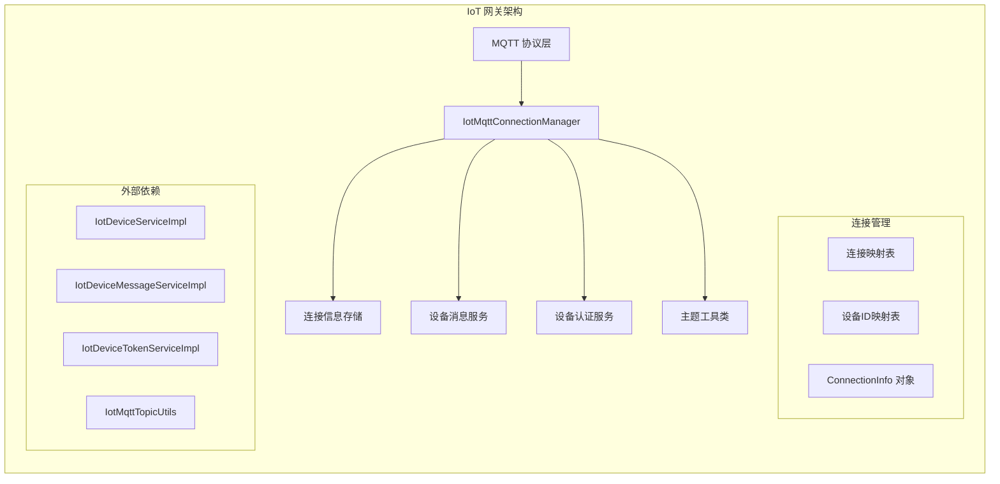
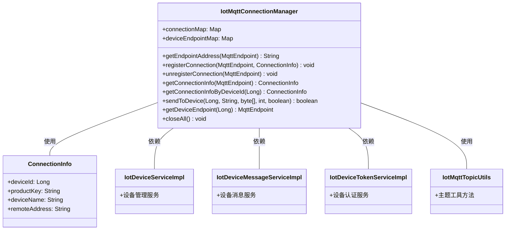
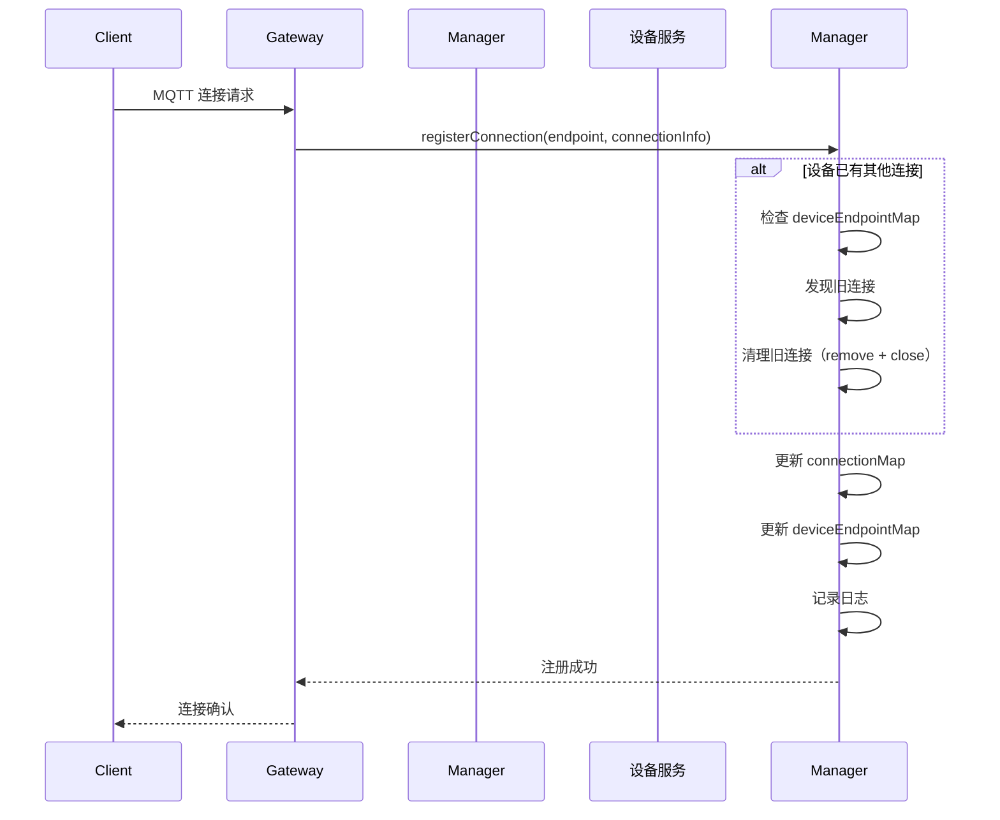
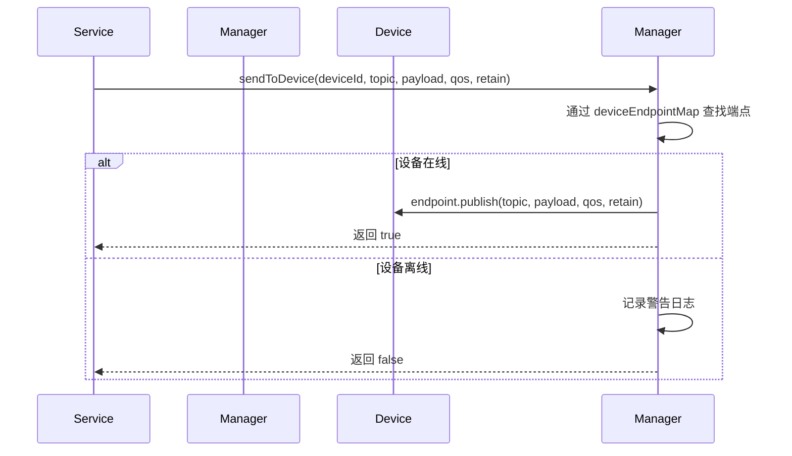
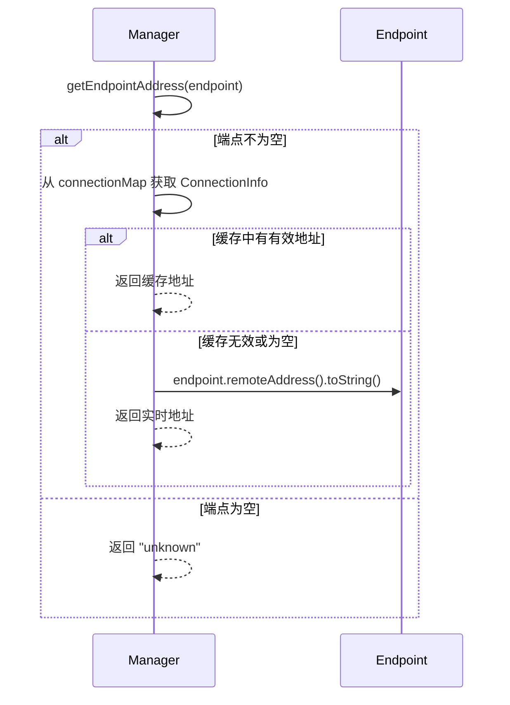
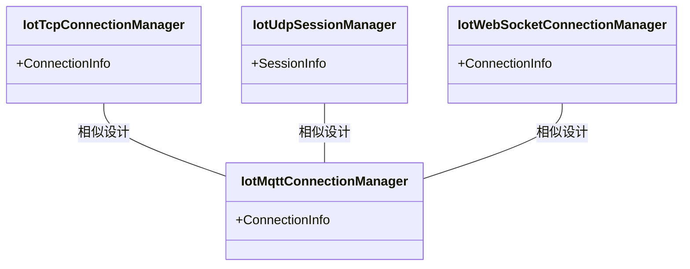
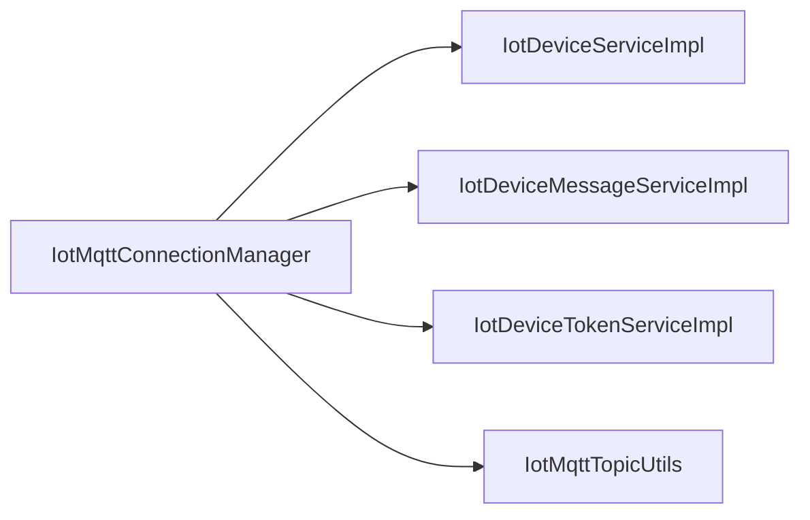

# IoT 网关 MQTT 连接管理器 (manager_3)

## 1. 模块概述

**manager_3** 是 IoT 网关模块中的核心组件，负责统一管理 MQTT 协议的连接管理。该模块实现了设备连接的注册、注销、状态维护和消息下发功能，是 IoT 设备与云端服务之间通信的桥梁。

模块位于：`yudao-module-iot/yudao-module-iot-gateway/src/main/java/cn/iocoder/yudao/module/iot/gateway/protocol/mqtt/manager/`

## 2. 架构设计

### 2.1 整体架构



### 2.2 组件关系



## 3. 核心功能

### 3.1 连接管理

| 方法 | 描述 | 参数 | 返回值 |
|------|------|------|--------|
| `registerConnection` | 注册设备连接，包含认证信息 | `endpoint`: MQTT 端点<br>`connectionInfo`: 连接信息 | 无 |
| `unregisterConnection` | 注销设备连接 | `endpoint`: MQTT 端点 | 无 |
| `getConnectionInfo` | 根据端点获取连接信息 | `endpoint`: MQTT 端点 | `ConnectionInfo` |
| `getConnectionInfoByDeviceId` | 根据设备ID获取连接信息 | `deviceId`: 设备ID | `ConnectionInfo` |
| `getDeviceEndpoint` | 获取设备连接端点 | `deviceId`: 设备ID | `MqttEndpoint` |
| `closeAll` | 关闭所有连接 | 无 | 无 |

### 3.2 消息下发

| 方法 | 描述 | 参数 | 返回值 |
|------|------|------|--------|
| `sendToDevice` | 向指定设备发送消息 | `deviceId`: 设备ID<br>`topic`: 主题<br>`payload`: 消息内容<br>`qos`: 服务质量<br>`retain`: 是否保留 | `boolean` 发送成功/失败 |

### 3.3 地址获取

| 方法 | 描述 | 参数 | 返回值 |
|------|------|------|--------|
| `getEndpointAddress` | 安全获取端点地址（优先缓存，失败则实时获取） | `endpoint`: MQTT 端点 | `String` 地址字符串 |

## 4. 数据结构

### 4.1 ConnectionInfo 类

```java
@Data
public static class ConnectionInfo {
    /** 设备 ID */
    private Long deviceId;
    /** 产品 Key */
    private String productKey;
    /** 设备名称 */
    private String deviceName;
    /** 连接地址 */
    private String remoteAddress;
}
```

**字段说明：**
- `deviceId`: 唯一标识设备的ID，用于快速查找设备连接
- `productKey`: 设备所属产品的Key，用于设备分组和权限控制
- `deviceName`: 设备名称，便于人工识别
- `remoteAddress`: 设备连接的远程地址（IP:Port），用于日志记录和监控

### 4.2 映射表结构

```mermaid
erDiagram
    IotMqttConnectionManager ||--o{ connectionMap : "包含"
    IotMqttConnectionManager ||--o{ deviceEndpointMap : "包含"
    
    connectionMap {
        MqttEndpoint key
        ConnectionInfo value
    }
    
    deviceEndpointMap {
        Long key (deviceId)
        MqttEndpoint value
    }
```

**connectionMap**: `Map<MqttEndpoint, ConnectionInfo>` - 以 MQTT 端点为键，连接信息为值，用于快速查找端点对应的连接信息。

**deviceEndpointMap**: `Map<Long, MqttEndpoint>` - 以设备ID为键，MQTT 端点为值，用于通过设备ID快速定位连接端点。

## 5. 工作流程

### 5.1 设备连接注册流程



### 5.2 消息下发流程



### 5.3 地址获取流程



## 6. 与其他模块的集成

### 6.1 协议层集成

manager_3 是 IoT 网关 MQTT 协议层的核心组件，与其他协议管理器保持一致的设计模式：



**设计一致性：**
- 所有管理器都使用 `ConnectionInfo` 或 `SessionInfo` 存储设备连接信息
- 都维护设备ID到端点的映射关系
- 都提供注册、注销、获取连接信息的基本操作
- 都使用 `ConcurrentHashMap` 保证线程安全

### 6.2 服务层依赖



**依赖说明：**
- `IotDeviceServiceImpl`: 设备管理服务，用于获取设备详细信息
- `IotDeviceMessageServiceImpl`: 设备消息服务，用于消息队列处理
- `IotDeviceTokenServiceImpl`: 设备认证服务，用于验证设备身份
- `IotMqttTopicUtils`: MQTT 主题工具类，用于生成和管理 MQTT 主题

## 7. 异常处理

### 7.1 异常处理策略

| 场景 | 处理方式 | 日志级别 |
|------|----------|----------|
| 端点为 null | 返回 "unknown" | 无 |
| 缓存获取失败 | 尝试实时获取 | 无 |
| 实时获取异常 | 捕获异常，返回 "unknown" | 无 |
| 设备离线发送消息 | 记录警告，返回 false | WARN |
| 发送消息失败 | 记录错误，返回 false | ERROR |
| 关闭连接异常 | 捕获异常，忽略 | 无 |

### 7.2 关键异常处理代码

```java
// 安全获取端点地址，捕获所有异常
try {
    realTimeAddress = endpoint.remoteAddress().toString();
} catch (Exception ignored) {
    // 连接已关闭，忽略异常
}

// 关闭所有连接时，捕获并忽略异常
for (MqttEndpoint endpoint : endpoints) {
    try {
        endpoint.close();
    } catch (Exception ignored) {
        // 连接可能已关闭，忽略异常
    }
}
```

## 8. 线程安全设计

IotMqttConnectionManager 通过以下机制保证线程安全：

1. **ConcurrentHashMap**: 使用 `ConcurrentHashMap` 存储连接映射，支持高并发读写
2. **原子操作**: 所有对共享数据的操作都是原子的
3. **复制再清空**: `closeAll()` 方法先复制端点列表再清空映射，避免并发修改
4. **异常捕获**: 所有可能抛异常的代码块都有 try-catch 保护

## 9. 配置与使用

### 9.1 Spring 组件声明

```java
@Slf4j
@Component
public class IotMqttConnectionManager {
    // 作为 Spring Bean 自动注册
}
```

### 9.2 典型使用场景

```java
// 1. 设备连接注册
ConnectionInfo connectionInfo = new ConnectionInfo();
connectionInfo.setDeviceId(deviceId);
connectionInfo.setProductKey(productKey);
connectionInfo.setDeviceName(deviceName);
connectionInfo.setRemoteAddress(endpoint.remoteAddress().toString());
connectionManager.registerConnection(endpoint, connectionInfo);

// 2. 向设备发送消息
boolean success = connectionManager.sendToDevice(
    deviceId, 
    "device/" + deviceId + "/command", 
    commandBytes, 
    1, 
    false
);

// 3. 获取设备连接信息
ConnectionInfo info = connectionManager.getConnectionInfoByDeviceId(deviceId);
if (info != null) {
    // 设备在线
}
```

## 10. 性能优化

### 10.1 缓存策略

- **地址缓存**: 优先从 `connectionMap` 获取地址，避免频繁调用 `remoteAddress()` 可能抛出的异常
- **双映射**: 同时维护端点到连接信息和设备ID到端点的映射，实现 O(1) 时间复杂度的查找

### 10.2 连接清理

- **旧连接覆盖**: 当同一设备有新连接时，自动清理旧连接，避免资源泄漏
- **批量关闭**: `closeAll()` 方法先复制端点列表再关闭，避免并发修改问题

## 11. 参考文档

- [IoT 网关模块文档](iot_gateway.md)
- [TCP 连接管理器文档](manager_4.md)
- [UDP 会话管理器文档](manager_5.md)
- [WebSocket 连接管理器文档](manager_6.md)
- [Modbus 轮询调度器文档](manager_2.md)

## 12. 版本信息

| 版本 | 日期 | 作者 | 说明 |
|------|------|------|------|
| 1.0.0 | 2024-01-01 | 芋道源码 | 初始版本 |
