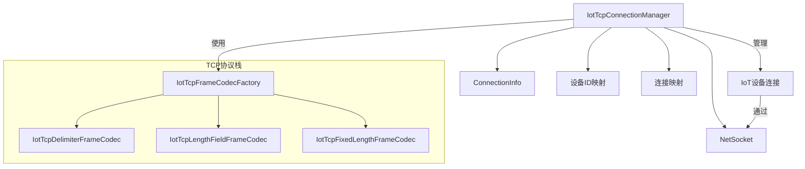
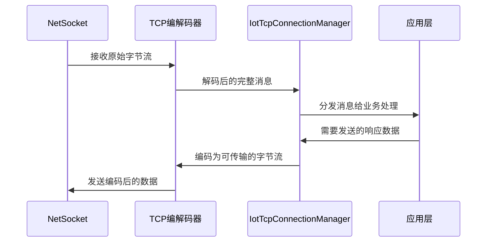
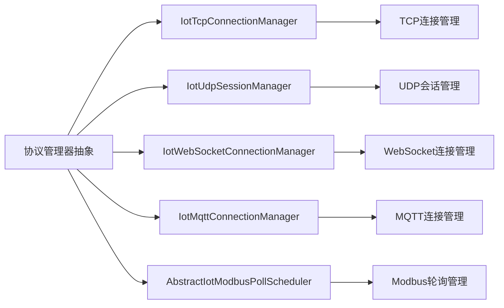
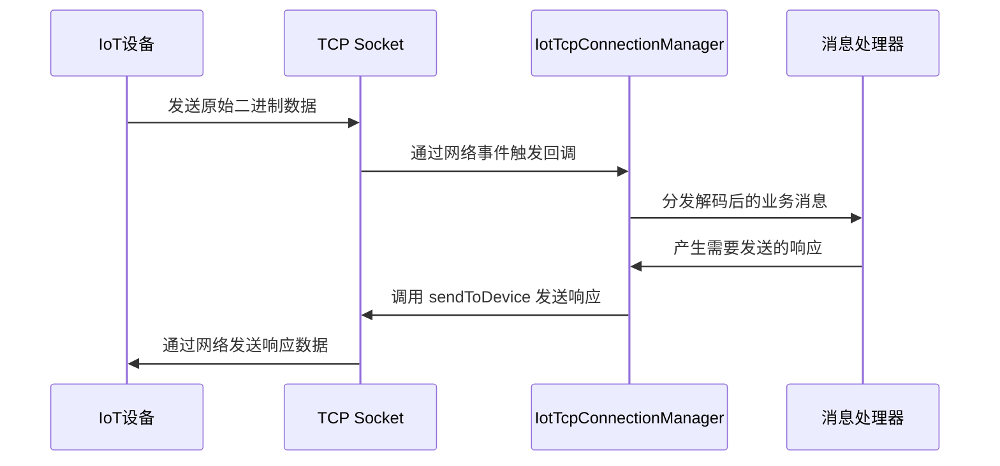

# IotTcpConnectionManager 文档

## 概述

IotTcpConnectionManager 是物联网网关中 TCP 协议的连接管理器，负责统一管理 TCP 连接的认证状态、设备会话和消息发送功能。它是 IoT 网关协议栈中的关键组件，确保设备能够安全可靠地通过 TCP 连接与网关通信。

## 核心职责

1. **连接生命周期管理**：注册、注销和维护 TCP 连接状态
2. **设备会话管理**：将设备 ID 与对应的 TCP 连接建立映射关系
3. **连接数量控制**：限制最大并发连接数，防止资源耗尽
4. **消息发送**：向特定设备发送二进制数据
5. **连接清理**：在异常情况下安全关闭连接并清理资源

## 架构设计

### 组件关系



### 关键数据结构

- **connectionMap**: `ConcurrentHashMap<NetSocket, ConnectionInfo>` - 存储 TCP 连接及其关联的连接信息
- **deviceSocketMap**: `ConcurrentHashMap<Long, NetSocket>` - 存储设备 ID 到 TCP 连接的映射，用于快速查找设备对应的连接

## 详细设计

### ConnectionInfo 内部类

存储每个 TCP 连接的认证和设备信息：

| 属性 | 类型 | 说明 |
|------|------|------|
| deviceId | Long | 设备唯一标识符 |
| productKey | String | 产品标识，用于区分不同产品线的设备 |
| deviceName | String | 设备名称，便于识别和管理 |

### 主要方法

#### 1. registerConnection

注册新的设备连接，包含完整的认证信息。

**同步机制**：使用 `synchronized` 关键字确保连接数检查和注册的原子性，防止并发情况下超过最大连接限制。

**连接替换逻辑**：
- 检查设备是否已有其他连接
- 如果存在且不是当前连接，则断开旧连接
- 清理旧连接的映射后注册新连接

**参数**：
- `socket`: TCP 网络套接字
- `deviceId`: 设备 ID
- `connectionInfo`: 包含设备认证信息的 ConnectionInfo 对象

#### 2. unregisterConnection

注销设备连接，安全地从两个映射中移除连接信息。

**安全机制**：使用 `Map.remove(key, value)` 方法确保只移除当前连接对应的映射，防止误删新连接。

#### 3. sendToDevice

向指定设备发送二进制消息。

**流程**：
1. 根据设备 ID 查找对应的 TCP 连接
2. 如果设备未连接，记录警告并返回 false
3. 尝试通过 socket 发送数据
4. 发送成功返回 true，发送失败时清理连接并返回 false

**异常处理**：发送失败时自动清理连接，防止僵尸连接占用资源

#### 4. closeAll

关闭所有管理的连接，用于网关关闭或维护期间。

**两阶段关闭**：
1. 先复制连接列表并清空映射，防止回调期间并发修改
2. 遍历关闭所有连接，忽略可能已关闭的连接异常

## 与其他组件的交互

### 与 TCP 编解码器的协作

IotTcpConnectionManager 与 TCP 编解码器协作处理数据帧的编解码：



### 与 IoT 网关其他协议的关系

作为 TCP 协议的连接管理器，IotTcpConnectionManager 与其他协议的管理器形成统一的接口：



## 使用场景

### 设备连接建立

当新的 IoT 设备通过 TCP 连接到网关时：
1. 网关接受 TCP 连接并获得 NetSocket 对象
2. 通过握手协议获取设备认证信息（deviceId, productKey, deviceName）
3. 调用 `registerConnection` 将连接注册到管理器
4. 后续所有针对该设备的通信都通过设备 ID 进行路由

### 消息收发循环



### 连接异常处理

当检测到连接异常时：
1. 网络层触发关闭事件
2. 管理器通过 `unregisterConnection` 清理相关映射
3. 资源得到及时释放，防止内存泄漏
4. 设备可以重新建立连接

## 性能特点

### 并发安全

- 使用 `ConcurrentHashMap` 存储连接映射，支持高并发读写
- 关键操作（如连接注册）使用同步机制确保一致性
- 读取操作（如获取连接信息）无需额外同步

### 资源管理

- 最大连接数限制防止资源耗尽
- 主动清理机制防止僵尸连接
- 异常情况下的安全连接关闭

### 扩展性

- 通过设备 ID 与连接的解耦，支持设备迁移和负载均衡
- 统一的连接管理接口，便于协议扩展
- 内部使用抽象的 ConnectionInfo，便于扩展认证信息

## 配置参数

| 参数 | 说明 | 取值范围 | 默认值 |
|------|------|----------|--------|
| maxConnections | 最大并发连接数 | 正整数 | 由创建者指定 |

## 异常处理

### 主动抛出异常

- `IllegalStateException`: 当连接数达到上限时尝试注册新连接
- `IllegalArgumentException`: 当关键配置参数为 null 时

### 捕获并处理的异常

- 网络 I/O 异常：在消息发送过程中捕获，并自动清理故障连接
- 连接关闭异常：在批量关闭过程中捕获并忽略，防止级联失败

## 最佳实践

### 在网关中的使用

1. **合理设置最大连接数**：根据服务器硬件能力和预期设备数量进行配置
2. **监控连接状态**：定期检查连接数和活跃设备数量
3. **处理连接泄漏**：确保所有异常路径都能正确清理连接资源
4. **与认证系统集成**：在注册连接前完成设备身份验证

### 性能优化建议

1. **批量操作**：在可能的情况下批量处理连接操作
2. **异步处理**：考虑将耗时的消息处理异步化，避免阻塞连接管理器
3. **内存监控**：监控 ConnectionInfo 对象的内存使用，特别是在大规模设备场景下

## 与相关模块的关联

### 依赖模块

- **TCP 编解码器模块**：提供帧的编解码功能
- **IoT 网关核心**：提供设备管理和消息路由基础设施
- **Vert.x 框架**：底层网络通信库

### 被依赖模块

- **IoT 设备服务层**：使用连接管理器向设备发送命令和配置
- **消息处理器**：通过连接管理器接收来自设备的上报数据
- **网关监控模块**：查询连接状态和设备在线情况

## 接口规范

### 公共方法

| 方法 | 返回值 | 说明 |
|------|--------|------|
| `registerConnection(NetSocket, Long, ConnectionInfo)` | void | 注册新设备连接 |
| `unregisterConnection(NetSocket)` | void | 注销设备连接 |
| `getConnectionInfo(NetSocket)` | ConnectionInfo | 获取指定连接的信息 |
| `getConnectionInfoByDeviceId(Long)` | ConnectionInfo | 根据设备 ID 获取连接信息 |
| `sendToDevice(Long, byte[])` | boolean | 向指定设备发送消息 |
| `closeAll()` | void | 关闭所有连接 |

### 线程安全性

- 所有公共方法都是线程安全的
- 可以在多线程环境中安全使用
- 内部状态更新通过同步机制或并发集合保证一致性

## 示例用法

### 注册新设备连接

```java
// 创建连接管理器，最大支持 1000 个并发连接
IotTcpConnectionManager connectionManager = new IotTcpConnectionManager(1000);

// 当有新 TCP 连接建立时
NetSocket socket = ...; // 从 Vert.x 获得的网络套接字
Long deviceId = 12345L;
ConnectionInfo connInfo = new IotTcpConnectionManager.ConnectionInfo();
connInfo.setDeviceId(deviceId);
connInfo.setProductKey("product_001");
connInfo.setDeviceName("sensor_001");

// 注册连接
connectionManager.registerConnection(socket, deviceId, connInfo);
```

### 发送消息到设备

```java
// 准备要发送的二进制数据
byte[] command = {0x01, 0x02, 0x03, 0x04};

// 向设备 ID 为 12345 的设备发送命令
boolean success = connectionManager.sendToDevice(12345L, command);
if (success) {
    System.out.println("命令发送成功");
} else {
    System.out.println("设备未连接或发送失败");
}
```

### 安全关闭所有连接

```java
// 在网关关闭时调用
connectionManager.closeAll();
System.out.println("所有 TCP 连接已安全关闭");
```

## 注意事项

1. **连接数限制**：注册连接前应确保未超过最大连接数，否则会抛出 IllegalStateException
2. **设备 ID 唯一性**：同一设备 ID 不应同时有多个活跃连接，管理器会自动处理连接替换
3. **空指针保护**：传入的 NetSocket 和 ConnectionInfo 参数不应为 null
4. **异常恢复**：发送失败后连接会被自动清理，上层业务需要处理重连逻辑
5. **内存泄漏防止**：确保在所有异常路径中都能正确调用 unregisterConnection 方法

## 设计决策说明

### 为什么使用双映射结构

- **connectionMap (NetSocket → ConnectionInfo)**: 快速从网络套接字获取连接信息，用于处理网络事件
- **deviceSocketMap (Device ID → NetSocket)**: 快速从设备 ID 查找对应的连接，用于消息发送和设备管理

这种设计使得两种常见操作都能达到 O(1) 时间复杂度：
1. 根据网络事件获取连接信息
2. 根据设备 ID 发送消息

### 为什么注册方法使用同步

连接数检查和注册必须是原子操作，否则在高并发场景下可能出现：
1. 多个线程同时检测到连接数未达上限
2. 所有线程都尝试注册新连接
3. 实际连接数超过预设限制

使用 synchronized 确保检查和注册作为一个原子操作执行。

### 为什么发送失败时清理连接

当消息发送失败时，通常表示连接已经出现问题（如对端异常关闭、网络中断等）。保持这样一个故障连接：
1. 会占用连接资源
2. 可能导致后续发送操作反复失败
3. 无法及时检测到设备实际已经离线

因此，在发送失败时主动清理连接是一种资源保护和故障快速恢复的机制。

## 未来改进方向

1. **连接心跳机制**：添加连接存活检测，及时发现半打开连接
2. **连接池复用**：在短连接场景下实现连接复用以减少建立开销
3. **细粒度限流**：根据设备或产品线实施不同的连接限制策略
4. **监控指标暴露**：提供连接数、活跃设备数、消息吞吐量等监控指标
5. **TLS 支持增强**：更好地集成安全连接的生命周期管理