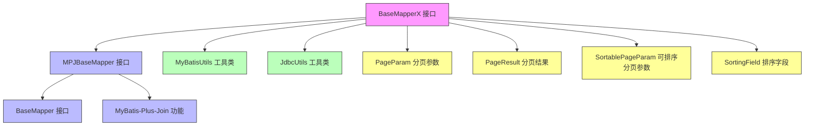
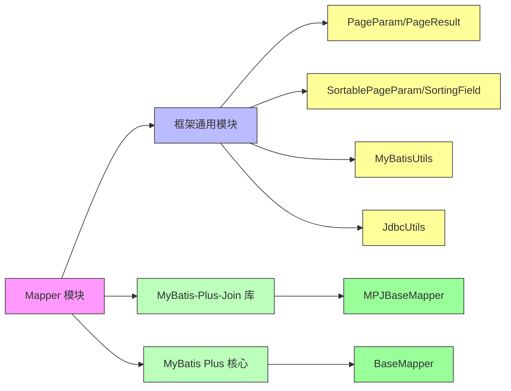
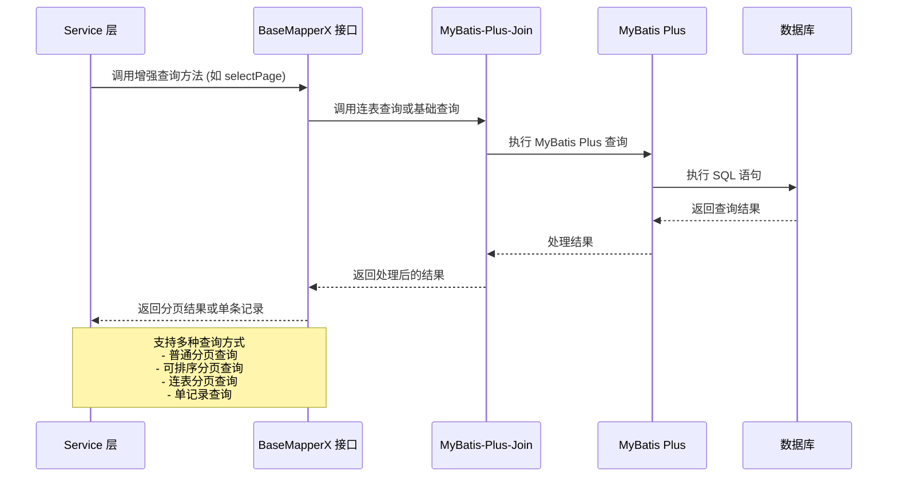

# Mapper 模块文档

## 概述

Mapper 模块是 Yudao 框架中 MyBatis Plus 的增强扩展，提供了基于 MyBatis Plus 的 BaseMapper 的增强实现。它集成了 MyBatis-Plus-Join (MPJ) 功能，提供了更强大的查询能力，包括连表查询、分页查询等高级特性。

该模块的核心是 `BaseMapperX` 接口，它继承自 `MPJBaseMapper`（MyBatis-Plus-Join 的基础映射器），并在其基础上扩展了多种实用的查询方法，使得数据访问层的开发更加便捷和高效。

## 核心功能

BaseMapperX 提供了以下核心功能：

1. **增强的分页查询**：支持普通分页和可排序分页，包括特殊的不分页查询（返回所有数据）
2. **连表查询支持**：集成了 MyBatis-Plus-Join 的能力，支持复杂的多表关联查询
3. **灵活的查询条件**：支持多种查询条件构建方式，包括字段名字符串和 Lambda 表达式
4. **单记录查询便利方法**: 提供了便捷的单记录查询方法，支持多种参数形式
5. **与 MyBatis Plus 无缝集成**: 完全兼容 MyBatis Plus 的所有特性和插件机制

## 架构与组件关系

Mapper 模块主要由以下组件组成：

- **BaseMapperX.java**: 核心接口，定义了所有增强的查询方法
- **依赖组件**: 依赖于框架通用模块的分页参数类和 MyBatis 工具类

### 组件关系图



### 依赖关系图



### 数据流图



## 在系统中的作用

Mapper 模块位于 Yudao 框架的数据访问层，是服务层与数据库之间的桥梁。它为整个框架提供了统一、高效的数据访问接口，被各个业务模块的 Mapper 接口广泛继承和使用。

### 与其他模块的关系

1. **与服务层**: 服务层通过注入继承自 BaseMapperX 的具体 Mapper 接口来进行数据操作
2. **与实体模型**: BaseMapperX 是泛型接口，具体的 Mapper 接口需要指定对应的实体类型
3. **与配置模块**: 通过 MyBatis Plus 的自动配置，自动注入 Mapper 实现
4. **与工具类**: 依赖框架通用模块的分页工具和 MyBatis 工具类实现高级功能

### 典型使用场景

在 Yudao 框架中，几乎所有的业务模块都会创建自己的 Mapper 接口继承自 BaseMapperX，例如：

```java
public interface UserMapper extends BaseMapperX<UserDO> {
    // 可以在这里添加自定义的查询方法
    // 继承自 BaseMapperX 的方法可以直接使用
}
```

然后在服务层中使用：

```java
@Service
public class UserService {
    @Autowired
    private UserMapper userMapper;
    
    public PageResult<UserDO> getUserPage(PageParam pageParam) {
        return userMapper.selectPage(pageParam, new LambdaQueryWrapper<UserDO>()
            .like(UserDO::getNickname, "张")
            .orderByDesc(UserDO::getId));
    }
}
```

## API 详解

### 核心方法说明

#### 分页查询方法

1. `selectPage(SortablePageParam pageParam, Wrapper<T> queryWrapper)`
   - 支持排序的分页查询
   - 当 pageSize 为 PageParam.PAGE_SIZE_NONE (-1) 时，返回所有数据不分页

2. `selectPage(PageParam pageParam, Wrapper<T> queryWrapper)`
   - 普通分页查询（不支持排序）
   - 当 pageSize 为 PageParam.PAGE_SIZE_NONE (-1) 时，返回所有数据不分页

3. `selectPage(PageParam pageParam, Collection<SortingField> sortingFields, Wrapper<T> queryWrapper)`
   - 支持自定义排序字段的分页查询
   - 当 pageSize 为 PageParam.PAGE_SIZE_NONE (-1) 时，返回所有数据不分页

#### 连表分页查询方法

1. `selectJoinPage(PageParam pageParam, Class<D> clazz, MPJLambdaWrapper<T> lambdaWrapper)`
   - 连表分页查询，返回指定类型的结果
   - 当 pageSize 为 PageParam.PAGE_SIZE_NONE (-1) 时，返回所有数据不分页

2. `selectJoinPage(SortablePageParam pageParam, Class<D> clazz, MPJLambdaWrapper<T> lambdaWrapper)`
   - 支持排序的连表分页查询
   - 当 pageSize 为 PageParam.PAGE_SIZE_NONE (-1) 时，返回所有数据不分页

3. `selectJoinPage(PageParam pageParam, Class<DTO> resultTypeClass, MPJBaseJoin<T> joinQueryWrapper)`
   - 使用 MPJBaseJoin 进行连表分页查询

#### 单记录查询方法

1. `selectOne(String field, Object value)`
   - 根据单个字段等于指定值查询单条记录

2. `selectOne(SFunction<T, ?> field, Object value)`
   - 根据 Lambda 表达式指定的字段等于指定值查询单条记录

3. `selectOne(String field1, Object value1, String field2, Object value2)`
   - 根据两个字段都等于指定值查询单条记录（AND 条件）

4. `selectOne(SFunction<T, ?> field1, Object value1, SFunction<T, ?> field2, Object value2)`
   - 根据两个 Lambda 表达式指定的字段都等于指定值查询单条记录（AND 条件）

### 依赖的通用组件

#### PageParam 分页参数
- `pageNo`: 页码，从 1 开始
- `pageSize`: 每页条数，特殊值 -1 表示不分页查询所有数据
- 提供了参数验证（页码最小值 1，每页条数范围 1-200）

#### PageResult 分页结果
- `total`: 总记录数
- `list`: 当前页的数据列表

#### SortablePageParam 可排序分页参数
- 继承自 PageParam
- `sortingFields`: 排序字段列表

#### SortingField 排序字段
- `field`: 字段名
- `order`: 排序方式（asc/desc）

## 最佳实践

1. **合理使用分页**: 对于可能返回大量数据的查询，始终使用分页查询，避免内存溢出
2. **选择合适的查询方法**: 
   - 简单查询使用基本的 selectPage 方法
   - 需要排序时使用支持排序的变体
   - 关联查询时使用 selectJoinPage 系列方法
3. **利用 Lambda 表达式**: 使用基于 Lambda 表达式的查询方法可以避免硬编码字段名，提高代码的可维护性
4. **充分利用继承**: 自定义 Mapper 接口应继承 BaseMapperX 以获得所有增强功能
5. **注意事性能**: 连表查询虽然强大，但要注意对数据库性能的 impact，必要时添加适当的索引

## 与传统 MyBatis Plus 的区别

| 特性 | 传统 BaseMapper | BaseMapperX |
|------|----------------|-------------|
| 基础 CRUD | ✓ | ✓ (继承自 BaseMapper) |
| 连表查询 | ✗ | ✓ (集成 MyBatis-Plus-Join) |
| 高级分页 | 基础分页 | 支持排序分页和特殊的不分页查询 |
| 单记录查询 | 基于 ID 查询 | 多种字段组合查询方法 |
| Lambda 支持 | 有限 | 完整支持 Lambda 表达式查询 |
| 扩展性 | 良好 | 更好（额外提供了许多实用方法） |

## 结论

Mapper 模块通过 BaseMapperX 接口为 Yudao 框架提供了强大的数据访问能力。它不仅继承了 MyBatis Plus 的所有特性，还通过集成 MyBatis-Plus-Join 和添加实用的查询方法，显著提升了开发效率和代码可维护性。在整个框架中，它作为数据访问层的基础组件，被广泛应用于各个业务模块，是实现高效数据访问的关键组件。