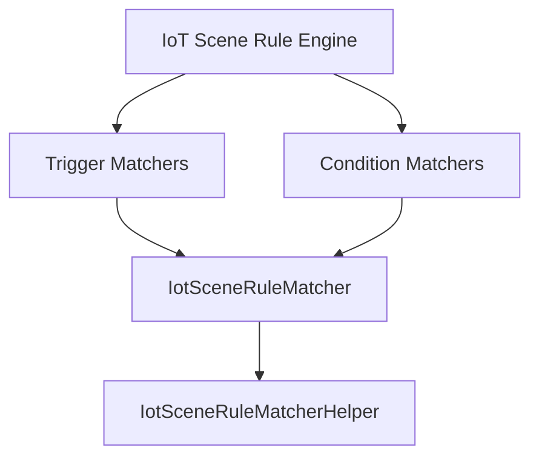

# Matcher Module

## Introduction

The matcher module in the IoT service is responsible for evaluating conditions and triggers in IoT scene rules. It provides a flexible and extensible mechanism to match device events and states against predefined rules.

## Architecture Overview

The matcher module consists of two main parts:

1. **Matcher Helper (`IotSceneRuleMatcherHelper`)**: A utility class that provides common methods for condition evaluation, logging, and validation.
2. **Matcher Interface (`IotSceneRuleMatcher`)**: An interface that defines the contract for all matchers (trigger and condition matchers).

The actual trigger and condition matchers (which are not part of the provided core components but are implemented elsewhere) use the helper to perform the matching logic and implement the matcher interface to be recognized by the rule engine.

## Sub-modules

- [Matcher Helper](matcher_helper.md)
- [Matcher Interface](matcher_interface.md)