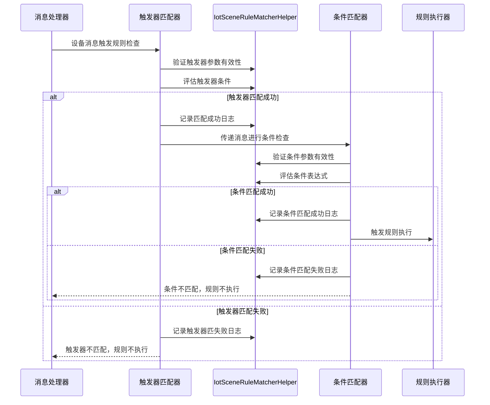

# IotSceneRuleMatcherHelper 模块文档

## 模块概述

IotSceneRuleMatcherHelper 是一个工具类，位于 `cn.iocoder.yudao.module.iot.service.rule.scene.matcher` 包中，为 IoT 场景规则匹配器提供通用的条件评估逻辑和工具方法。该类被触发器和条件匹配器实现广泛使用，以统一处理条件判断、参数验证和日志记录等功能。

## 核心功能

1. **条件评估**：提供统一的条件匹配逻辑，支持各种操作符（如等于、不等于、大于、小于、之间等）
2. **表达式处理**：利用 Spring Expression Language (SpEL) 进行复杂条件的评估
3. **参数验证**：验证触发器和条件的操作符及参数是否有效
4. **日志记录**：提供匹配成功和失败的调试日志
5. **标识符匹配**：检查产品ID和设备ID是否匹配
6. **数值比较优化**：特殊处理数值比较以避免 SpEL 中的比较问题

## 架构说明

IotSceneRuleMatcherHelper 作为工具类，在 IoT 规则引擎的匹配器层发挥核心作用。它不直接参与规则的定义或执行流程，而是为各种具体的匹配器实现提供通用能力。

### 与其他模块的关系

```mermaid
graph TD
    %% 主要组件
    A[IotSceneRuleMatcherHelper] --> B[触发器匹配器]
    A --> C[条件匹配器]
    A --> D[规则引擎]
    
    %% 触发器匹配器
    B --> B1[设备属性后触发匹配器]
    B --> B2[设备事件后触发匹配器]
    B --> B3[定时器触发匹配器]
    B --> B4[设备服务调用触发匹配器]
    B --> B5[设备状态更新触发匹配器]
    
    %% 条件匹配器
    C --> C1[设备属性条件匹配器]
    C --> C2[设备状态条件匹配器]
    C --> C3[当前时间条件匹配器]
    
    %% 依赖的框架工具类
    A --> E[Spring表达式工具]
    A --> F[对象工具]
    A --> G[字符串工具]
    A --> H[数字工具]
    A --> I[集合工具]
    
    %% IoT核心依赖
    A --> J[IotDeviceService]
    A --> K[IotDeviceDO]
    A --> L[IotSceneRuleDO]
    A --> M[IotSceneRuleConditionOperatorEnum]
    
    %% 样式
    classDef utility fill:#E3F2FD,stroke:#2196F3,stroke-width:1px;
    classDef matcher fill:#FFF3E0,stroke:#FF9800,stroke-width:1px;
    classDef engine fill:#E8F5E9,stroke:#4CAF50,stroke-width:1px;
    classDef framework fill:#F3E5F5,stroke:#9C27B0,stroke-width:1px;
    classDef iot fill:#E1F5FE,stroke:#03A9F4,stroke-width:1px;
    
    class A utility
    class B,C matcher
    class D engine
    class E,F,G,H,I framework
    class J,K,L,M iot
```



### 数据流说明

在 IoT 场景规则匹配过程中，数据流大致如下：



## 详细设计

### 类结构

IotSceneRuleMatcherHelper 是一个最终类（final class），采用工具类模式设计：
- 私有构造函数防止实例化
- 所有方法为静态方法，可直接通过类名调用
- 使用 Lombok 的 @Slf4j 注解进行日志记录

### 核心方法说明

#### 条件评估方法

| 方法名 | 参数 | 返回值 | 说明 |
|--------|------|--------|------|
| evaluateCondition | sourceValue(Object), operator(String), paramValue(String) | boolean | 主要条件评估入口方法，内部调用 evaluateConditionWithOperatorEnum |
| evaluateConditionWithOperatorEnum | sourceValue(Object), operatorEnum(IotSceneRuleConditionOperatorEnum), paramValue(String) | boolean | 使用操作符枚举进行条件评估的核心方法 |
| buildSpringExpressionVariables | sourceValue(Object), operatorEnum(IotSceneRuleConditionOperatorEnum), paramValue(String) | Map<String,Object> | 构建 Spring 表达式变量映射 |
| isNumericComparisonOperator | operatorEnum(IotSceneRuleConditionOperatorEnum) | boolean | 判断是否为数值比较操作符 |
| isNumericComparison | sourceValue(Object), parameterValues(List<String>) | boolean | 判断是否为数值比较场景 |

#### 触发器验证方法

| 方法名 | 参数 | 返回值 | 说明 |
|--------|------|--------|------|
| isBasicTriggerValid | trigger(IotSceneRuleDO.Trigger) | boolean | 检查触发器基本参数是否有效（非空且类型不为空） |
| isTriggerOperatorAndValueValid | trigger(IotSceneRuleDO.Trigger) | boolean | 检查触发器操作符和值是否有效（均不为空） |
| logTriggerMatchSuccess | message(IotDeviceMessage), trigger(IotSceneRuleDO.Trigger) | void | 记录触发器匹配成功的调试日志 |
| logTriggerMatchFailure | message(IotDeviceMessage), trigger(IotSceneRuleDO.Trigger), reason(String) | void | 记录触发器匹配失败的调试日志 |

#### 条件验证方法

| 方法名 | 参数 | 返回值 | 说明 |
|--------|------|--------|------|
| isBasicConditionValid | condition(IotSceneRuleDO.TriggerCondition) | boolean | 检查条件基本参数是否有效（非空且类型不为空） |
| isConditionOperatorAndParamValid | condition(IotSceneRuleDO.TriggerCondition) | boolean | 检查条件操作符和参数是否有效（均不为空） |
| logConditionMatchSuccess | message(IotDeviceMessage), condition(IotSceneRuleDO.TriggerCondition) | void | 记录条件匹配成功的调试日志 |
| logConditionMatchFailure | message(IotDeviceMessage), condition(IotSceneRuleDO.TriggerCondition), reason(String) | void | 记录条件匹配失败的调试日志 |

#### 通用工具方法

| 方法名 | 参数 | 返回值 | 说明 |
|--------|------|--------|------|
| isIdentifierMatched | expectedIdentifier(String), actualIdentifier(String) | boolean | 检查两个标识符是否匹配（非空且相等） |
| productAndDeviceNotMatched | message(IotDeviceMessage), productId(Long), deviceId(Long) | boolean | 校验消息中的产品和设备是否与给定ID不匹配 |

### 关键实现细节

#### Spring 表达式处理

该帮助类利用 Spring Expression Language (SpEL) 进行条件评估，这是一个强大的表达式解析框架。关键实现包括：

1. **变量构建**：将源值、操作值和操作值列表放入 SpEL 变量映射中
2. **表达式解析**：使用预定义的操作符对应的 SpEL 表达式进行求值
3. **数值比较优化**：针对数值比较操作符（如大于、小于、之间等），特殊处理源值和参数值为数字类型，以避免 SpEL 中基于 compareTo 的比较问题

#### 操作符支持

通过 IotSceneRuleConditionOperatorEnum 枚举支持以下操作符：
- EQUALS, NOT_EQUALS：等于、不等于
- CONTAINS, NOT_CONTAINS：包含、不包含
- STARTS_WITH, ENDS_WITH：以...开头、以...结尾
- BETWEEN, NOT_BETWEEN：在范围内、不在范围内
- GREATER_THAN, GREATER_THAN_OR_EQUALS：大于、大于等于
- LESS_THAN, LESS_THAN_OR_EQUALS：小于、小于等于
- IN, NOT_IN：在集合中、不在集合中
- IS_EMPTY, IS_NOT_EMPTY：为空、不为空
- MATCHES, NOT_MATCHES：正则匹配、不匹配

每个操作符对应一个 SpEL 表达式模板，如：
- EQUALS: "#source == #value"
- BETWEEN: "#source >= #value[0] and #source <= #value[1]"
- GREATER_THAN: "#source > #value"

#### 日志记录

所有匹配操作（无论成功还是失败）都会记录调试日志，便于问题排查和性能分析。日志包含：
- 消息的 requestId（如果可用）
- 触发器/条件的类型
- 失败原因（仅在匹配失败时）

## 在系统中的作用

IotSceneRuleMatcherHelper 是 IoT 规则引擎匹配器层的基础组件，其作用体现在：

1. **代码复用**：避免在每个匹配器实现中重复编写条件评估和参数验证逻辑
2. **一致性**：确保所有匹配器使用相同的条件评估标准和验证规则
3. **可维护性**：集中管理条件评估逻辑，修改时只需更新一个地方
4. **可扩展性**：新增操作符时只需在枚举中添加对应的 SpEL 表达式
5. **性能优化**：通过数值比较的特殊处理提高条件评估效率

### 与匹配器接口的关系

虽然 IotSceneRuleMatcherHelper 本身不是匹配器接口的实现，但它被所有匹配器实现所依赖。匹配器接口定义如下（参考 IotSceneRuleMatcher.java）：

```java
public interface IotSceneRuleMatcher {
    /**
     * 判断是否匹配
     *
     * @param message 设备消息
     * @return 是否匹配
     */
    boolean isMatched(IotDeviceMessage message);
}
```

各种具体的匹配器（如 IotDevicePropertyConditionMatcher、IotDeviceEventPostTriggerMatcher 等）都实现了此接口，并在其 isMatched 方法内部调用 IotSceneRuleMatcherHelper 的方法来完成实际的匹配逻辑。

## 依赖说明

### 框架依赖
- cn.iocoder.yudao.framework.common.util.number.NumberUtils
- cn.iocoder.yudao.framework.common.util.object.ObjectUtils
- cn.iocoder.yudao.framework.common.util.spring.SpringExpressionUtils
- cn.iocoder.yudao.framework.common.util.spring.SpringUtils
- cn.iocoder.yudao.framework.common.util.collection.CollectionUtils
- cn.iocoder.yudao.framework.common.util.string.StrUtil
- cn.hutool.core.text.CharPool
- cn.hutool.core.util.NumberUtil
- cn.hutool.core.util.ObjectUtil
- cn.hutool.core.util.StrUtil

### 项目依赖
- cn.iocoder.yudao.module.iot.core.mq.message.IotDeviceMessage
- cn.iocoder.yudao.module.iot.dal.dataobject.device.IotDeviceDO
- cn.iocoder.yudao.module.iot.dal.dataobject.rule.IotSceneRuleDO
- cn.iocoder.yudao.module.iot.enums.rule.IotSceneRuleConditionOperatorEnum
- cn.iocoder.yudao.module.iot.service.device.IotDeviceService

## 使用示例

以下是在条件匹配器中如何使用 IotSceneRuleMatcherHelper 的示例：

```java
@Override
public boolean isMatched(IotDeviceMessage message) {
    // 1. 基础验证
    if (!IotSceneRuleMatcherHelper.isBasicConditionValid(this)) {
        IotSceneRuleMatcherHelper.logConditionMatchFailure(message, this, "基本参数无效");
        return false;
    }
    
    // 2. 操作符和参数验证
    if (!IotSceneRuleMatcherHelper.isConditionOperatorAndParamValid(this)) {
        IotSceneRuleMatcherHelper.logConditionMatchFailure(message, this, "操作符或参数无效");
        return false;
    }
    
    // 3. 获取源值（实际实现中会从消息中提取对应属性的值）
    Object sourceValue = extractValueFromMessage(message);
    
    // 4. 条件评估
    boolean matched = IotSceneRuleMatcherHelper.evaluateCondition(
        sourceValue, 
        this.getOperator(), 
        this.getParam()
    );
    
    // 5. 记录结果并返回
    if (matched) {
        IotSceneRuleMatcherHelper.logConditionMatchSuccess(message, this);
    } else {
        IotSceneRuleMatcherHelper.logConditionMatchFailure(message, this, "条件不匹配");
    }
    
    return matched;
}
```

## 性能考虑

1. **静态方法**：所有方法为静态，避免了实例化开销
2. **早期返回**：在参数验证失败时尽早返回，减少不必要的计算
3. **日志级别**：使用 debug 级别日志，在生产环境中对性能影响 minimal
4. **数值优化**：针对数值比较的特殊处理避免了字符串到数字的反复转换
5. **复用变量映射**：在评估过程中复用 Spring 表达式变量映射，减少对象创建

## 异常处理

该帮助类对所有可能的异常进行了捕获和处理：
- 在 evaluateCondition 和 evaluateConditionWithOperatorEnum 方法中捕获所有 Exception
- 发生异常时记录错误日志并返回 false，确保匹配过程不会因单个条件评估错误而中断
- 这种设计保证了规则引擎的健壮性，即使某个条件评估出现意外错误，也不会影响其他规则的执行

## 与其他模块的关联

虽然本文档聚焦于 IotSceneRuleMatcherHelper，但理解其在更大系统中的作用很重要：

- **[IotSceneRuleMatcher](matcher_interface.md)**：定义了匹配器的契约接口
- **[触发器匹配器](trigger/)**：各种触发器匹配器实现，如设备属性后触发匹配器
- **[条件匹配器](condition/)**：各种条件匹配器实现，如设备属性条件匹配器
- **[IotDeviceService](../device/IotDeviceServiceImpl.md)**：提供设备信息查询能力，用于产品和设备ID校验
- **[框架工具类](../framework/)**：底层依赖的通用工具类，提供字符串、对象、数字等操作

> 注：上述链接中的文档需要在对应的模块文档中查看，以避免信息重复。

## 最佳实践

1. **统一使用**：所有匹配器实现都应使用此帮助类进行条件评估和参数验证
2. **日志一致性**：通过帮助类记录日志，确保日志格式和内容的一致性
3. **错误容忍**：帮助类的异常处理机制确保了单个匹配器的失败不会影响整个规则引擎
4. **性能监控**：通过调试日志可以监控匹配器的性能和匹配率
5. **扩展友好**：新增操作符时只需在 IotSceneRuleConditionOperatorEnum 中添加对应条目和 SpEL 表达式

## 结论

IotSceneRuleMatcherHelper 是 IoT 场景规则引擎匹配器层的核心工具类，通过提供统一的条件评估逻辑、参数验证和日志记录功能，显著提高了代码的可维护性、一致性和可靠性。其设计遵循了工具类最佳实践，并在整个 IoT 规则引擎中发挥着基础性支撑作用。