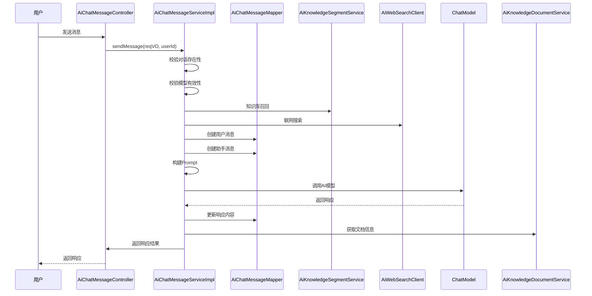
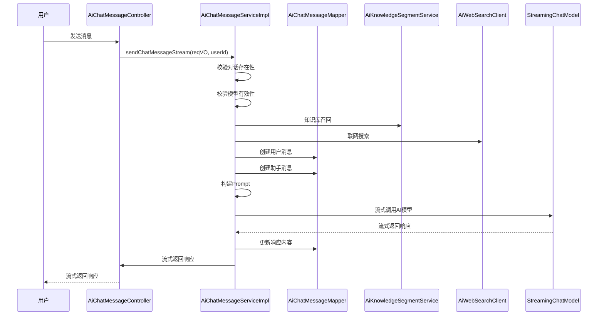

# 消息模块 (message) 文档

## 模块概述

消息模块（message）是AI聊天系统的核心组件之一，主要负责处理用户与AI之间的聊天消息交互。该模块提供了消息的发送、接收、存储和管理功能，支持实时聊天和历史消息查询。

### 主要功能

1. **消息发送**：支持文本消息、附件消息的发送
2. **消息接收**：支持流式和非流式消息响应
3. **消息管理**：支持消息的删除、查询和分页
4. **知识库集成**：支持从知识库中召回相关信息
5. **联网搜索**：支持从互联网搜索相关信息
6. **工具调用**：支持AI工具的调用和执行

### 架构图

```flowchart
TD
    A[用户] -->|发送消息| B[AiChatMessageController]
    B -->|处理请求| C[AiChatMessageServiceImpl]
    C -->|调用AI模型| D[ChatModel]
    C -->|知识库召回| E[AiKnowledgeSegmentService]
    C -->|联网搜索| F[AiWebSearchClient]
    C -->|工具调用| G[AiToolService]
    C -->|存储消息| H[AiChatMessageMapper]
    D -->|返回响应| C
    C -->|返回结果| B
    B -->|返回响应| A
```

## 核心组件

### 1. 控制器层 (Controller)

#### AiChatMessageController

**文件位置**: `yudao-module-ai/src/main/java/cn/iocoder/yudao/module/ai/controller/admin/chat/AiChatMessageController.java`

**功能**:
- 提供消息相关的API接口
- 处理消息的发送、查询和删除操作
- 支持流式和非流式消息响应

**主要接口**:

1. **发送消息（段式）**
   - `POST /ai/chat/message/send`
   - 一次性返回完整响应，适合非实时场景
   - 请求参数: `AiChatMessageSendReqVO`
   - 响应: `CommonResult<AiChatMessageSendRespVO>`

2. **发送消息（流式）**
   - `POST /ai/chat/message/send-stream`
   - 流式返回响应，适合实时聊天场景
   - 请求参数: `AiChatMessageSendReqVO`
   - 响应: `Flux<CommonResult<AiChatMessageSendRespVO>>`

3. **获取指定对话的消息列表**
   - `GET /ai/chat/message/list-by-conversation-id`
   - 获取某个对话的所有消息
   - 参数: `conversationId`
   - 响应: `CommonResult<List<AiChatMessageRespVO>>`

4. **删除消息**
   - `DELETE /ai/chat/message/delete`
   - 删除指定消息
   - 参数: `id`
   - 响应: `CommonResult<Boolean>`

5. **删除指定对话的消息**
   - `DELETE /ai/chat/message/delete-by-conversation-id`
   - 删除某个对话的所有消息
   - 参数: `conversationId`
   - 响应: `CommonResult<Boolean>`

6. **获取消息分页**
   - `GET /ai/chat/message/page`
   - 用于对话管理菜单的消息分页查询
   - 参数: `AiChatMessagePageReqVO`
   - 响应: `CommonResult<PageResult<AiChatMessageRespVO>>`

7. **管理员删除消息**
   - `DELETE /ai/chat/message/delete-by-admin`
   - 管理员删除指定消息
   - 参数: `id`
   - 响应: `CommonResult<Boolean>`

### 2. 服务层 (Service)

#### AiChatMessageServiceImpl

**文件位置**: `yudao-module-ai/src/main/java/cn/iocoder/yudao/module/ai/service/chat/AiChatMessageServiceImpl.java`

**功能**:
- 实现消息的核心业务逻辑
- 处理消息的发送、接收、存储和管理
- 集成AI模型、知识库、联网搜索等功能

**核心方法**:

1. **sendMessage**
   - 发送消息（非流式）
   - 处理消息的完整流程：
     - 校验对话存在性
     - 校验模型有效性
     - 知识库召回
     - 联网搜索
     - 创建用户消息
     - 创建助手消息
     - 构建Prompt
     - 调用AI模型
     - 更新响应内容
     - 返回响应结果

2. **sendChatMessageStream**
   - 发送消息（流式）
   - 与非流式类似，但使用流式响应
   - 支持实时消息展示

3. **recallKnowledgeSegment**
   - 知识库召回
   - 根据对话角色和内容，从知识库中搜索相关段落

4. **buildPrompt**
   - 构建AI模型的Prompt
   - 包含系统消息、历史消息、当前消息、知识库内容、联网搜索结果、附件内容等

5. **filterContextMessages**
   - 过滤历史消息上下文
   - 根据对话配置，获取最近的n组对话历史

6. **getToolCallbackListByRoleId**
   - 获取工具回调列表
   - 根据对话角色ID，获取相关的工具调用

7. **deleteChatMessage**
   - 删除指定消息
   - 校验消息存在性和用户权限

8. **deleteChatMessageByConversationId**
   - 删除指定对话的所有消息

9. **getChatMessagePage**
   - 获取消息分页
   - 用于对话管理界面

### 3. 数据传输对象 (DTO)

#### 请求对象

1. **AiChatMessagePageReqVO**
   - 消息分页查询请求对象
   - 字段：
     - `conversationId`: 对话编号
     - `userId`: 用户编号
     - `content`: 消息内容
     - `createTime`: 创建时间范围

2. **AiChatMessageSendReqVO**
   - 消息发送请求对象
   - 字段：
     - `conversationId`: 聊天对话编号
     - `content`: 聊天内容
     - `useContext`: 是否携带上下文
     - `useSearch`: 是否联网搜索
     - `attachmentUrls`: 附件URL数组

#### 响应对象

1. **AiChatMessageRespVO**
   - 消息响应对象
   - 字段：
     - `id`: 编号
     - `conversationId`: 对话编号
     - `replyId`: 回复消息编号
     - `type`: 消息类型（USER、ASSISTANT等）
     - `userId`: 用户编号
     - `roleId`: 角色编号
     - `model`: 模型标志
     - `modelId`: 模型编号
     - `content`: 聊天内容
     - `reasoningContent`: 推理内容
     - `useContext`: 是否携带上下文
     - `segmentIds`: 知识库段落编号数组
     - `segments`: 知识库段落数组
     - `webSearchPages`: 联网搜索的网页内容数组
     - `attachmentUrls`: 附件URL数组
     - `createTime`: 创建时间
     - `roleName`: 角色名字（仅在对话管理时加载）

   - 嵌套类：
     - `KnowledgeSegment`: 知识库段落
       - `id`: 段落编号
       - `content`: 切片内容
       - `documentId`: 文档编号
       - `documentName`: 文档名称

2. **AiChatMessageSendRespVO**
   - 消息发送响应对象
   - 包含发送的消息和接收的消息
   - 嵌套类：
     - `Message`: 消息对象
       - `id`: 消息编号
       - `type`: 消息类型
       - `content`: 消息内容
       - `createTime`: 创建时间
       - `segmentIds`: 知识库段落编号数组
       - `segments`: 知识库段落数组
       - `webSearchPages`: 联网搜索的网页内容数组

### 4. 数据访问层 (Mapper)

#### AiChatMessageMapper

**功能**:
- 消息数据的CRUD操作
- 根据对话ID查询消息列表
- 根据用户ID分页查询消息
- 统计消息数量

## 消息处理流程

### 非流式消息处理流程



### 流式消息处理流程



## 核心功能详解

### 1. 消息发送

消息发送是消息模块的核心功能，支持两种模式：

1. **非流式发送**：适合需要完整响应的场景
2. **流式发送**：适合实时聊天场景，支持边生成边展示

#### 消息发送流程

1. **校验对话存在性**：
   - 检查对话是否存在
   - 检查用户是否有权限访问该对话

2. **校验模型有效性**：
   - 检查模型是否存在
   - 获取模型配置

3. **知识库召回**：
   - 根据对话角色和内容，从知识库中搜索相关段落
   - 使用 `AiKnowledgeSegmentService` 实现

4. **联网搜索**：
   - 根据用户请求，从互联网搜索相关信息
   - 使用 `AiWebSearchClient` 实现

5. **创建用户消息**：
   - 将用户消息存储到数据库
   - 记录消息类型、内容、附件等信息

6. **创建助手消息**：
   - 创建空的助手消息，等待AI响应
   - 记录消息类型、关联用户消息等信息

7. **构建Prompt**：
   - 系统消息：对话角色的系统提示
   - 历史消息：最近的对话历史
   - 当前消息：用户发送的消息
   - 知识库内容：召回的知识库段落
   - 联网搜索结果：搜索到的网页内容
   - 附件内容：用户上传的附件

8. **调用AI模型**：
   - 使用 `ChatModel` 调用AI模型
   - 获取AI响应

9. **处理响应**：
   - 更新助手消息的内容
   - 返回响应结果

### 2. 知识库召回

知识库召回是消息模块的重要功能，用于从知识库中搜索与用户问题相关的信息。

#### 知识库召回流程

1. **获取对话角色**：
   - 根据对话ID获取对话信息
   - 获取对话角色ID

2. **获取角色知识库**：
   - 根据角色ID获取角色信息
   - 获取角色关联的知识库ID列表

3. **遍历召回**：
   - 对每个知识库ID，调用 `AiKnowledgeSegmentService.searchKnowledgeSegment`
   - 搜索与用户问题相关的段落

4. **返回结果**：
   - 返回召回的知识库段落列表

### 3. 联网搜索

联网搜索功能允许AI在回答问题时参考互联网上的信息。

#### 联网搜索流程

1. **检查搜索开关**：
   - 检查用户请求中的 `useSearch` 参数
   - 检查 `AiWebSearchClient` 是否可用

2. **执行搜索**：
   - 调用 `AiWebSearchClient.search` 方法
   - 传入用户问题和搜索数量

3. **处理结果**：
   - 将搜索结果添加到Prompt中
   - 返回搜索结果

### 4. 工具调用

工具调用功能允许AI在回答问题时调用外部工具。

#### 工具调用流程

1. **获取工具列表**：
   - 根据对话角色ID获取角色信息
   - 获取角色关联的工具ID列表

2. **获取工具回调**：
   - 根据工具ID获取工具信息
   - 调用 `ToolCallbackResolver` 获取工具回调

3. **构建工具上下文**：
   - 构建工具调用的上下文
   - 将工具信息添加到Prompt中

4. **调用AI模型**：
   - AI模型根据Prompt决定是否调用工具
   - 如果需要调用工具，则执行工具调用

### 5. 消息上下文

消息上下文功能允许AI在回答问题时参考之前的对话历史。

#### 消息上下文流程

1. **检查上下文开关**：
   - 检查用户请求中的 `useContext` 参数
   - 检查对话配置中的 `maxContexts` 参数

2. **获取历史消息**：
   - 根据对话ID获取历史消息列表
   - 过滤出有效的对话历史

3. **构建上下文**：
   - 根据配置获取最近的n组对话历史
   - 将历史消息添加到Prompt中

## 与其他模块的集成

### 1. 知识库模块 (knowledge)

消息模块与知识库模块紧密集成，用于知识库召回功能。

**集成点**：
- `AiKnowledgeSegmentService`: 知识库段落服务
- `AiKnowledgeDocumentService`: 知识库文档服务

**数据流**：
1. 用户发送消息
2. 消息模块调用知识库模块进行召回
3. 知识库模块返回相关段落
4. 消息模块将段落添加到Prompt中
5. AI模型根据Prompt生成响应

### 2. 聊天对话模块 (conversation)

消息模块与聊天对话模块紧密集成，用于对话管理功能。

**集成点**：
- `AiChatConversationService`: 聊天对话服务

**数据流**：
1. 用户发送消息
2. 消息模块校验对话存在性
3. 消息模块获取对话配置（角色、模型、上下文等）
4. 消息模块根据对话配置处理消息

### 3. AI模型模块 (model)

消息模块与AI模型模块紧密集成，用于AI模型调用。

**集成点**：
- `AiModelService`: AI模型服务

**数据流**：
1. 消息模块构建Prompt
2. 消息模块调用AI模型
3. AI模型返回响应
4. 消息模块处理响应

### 4. 工具模块 (tool)

消息模块与工具模块紧密集成，用于工具调用功能。

**集成点**：
- `AiToolService`: 工具服务
- `ToolCallbackResolver`: 工具回调解析器

**数据流**：
1. 消息模块获取工具列表
2. 消息模块构建工具上下文
3. AI模型根据Prompt决定是否调用工具
4. 如果需要调用工具，则执行工具调用

## 配置项

### AI配置

```yaml
# AI相关配置
# 知识库召回相关配置
yudao.ai.knowledge:
  # 知识库召回的最大结果数
  max-results: 5
  # 知识库召回的相似度阈值
  similarity-threshold: 0.7

# 联网搜索相关配置
yudao.ai.web-search:
  # 是否启用联网搜索
  enable: true
  # 搜索结果的最大数量
  max-results: 10

# MCP客户端相关配置
yudao.ai.mcp.client:
  # 是否启用MCP客户端
  enable: true
  # MCP客户端名称
  name: mcp
```

### 消息配置

```yaml
# 消息相关配置
yudao.message:
  # 消息上下文的最大数量
  max-contexts: 5
  # 消息的最大长度
  max-length: 10000
```

## 最佳实践

### 1. 消息发送优化

1. **使用流式发送**：
   - 对于实时聊天场景，使用流式发送可以提升用户体验
   - 流式发送可以边生成边展示，减少用户等待时间

2. **合理设置上下文**：
   - 根据对话的复杂性设置上下文数量
   - 过多的上下文会增加AI模型的处理负担

3. **控制消息长度**：
   - 设置消息的最大长度，避免过长的消息影响性能
   - 对于超长消息，可以考虑分段发送

### 2. 知识库召回优化

1. **优化知识库内容**：
   - 确保知识库内容的质量和相关性
   - 定期更新和维护知识库内容

2. **调整召回参数**：
   - 根据实际需求调整召回的最大结果数和相似度阈值
   - 过多的召回结果会增加处理负担

3. **缓存召回结果**：
   - 对于相同的问题，可以缓存召回结果
   - 减少重复的知识库搜索

### 3. 联网搜索优化

1. **控制搜索开关**：
   - 根据用户需求和系统负载控制搜索开关
   - 搜索功能会增加系统的复杂性和负担

2. **优化搜索结果**：
   - 对搜索结果进行过滤和排序
   - 选择最相关的搜索结果

3. **限制搜索数量**：
   - 设置搜索结果的最大数量
   - 避免过多的搜索结果影响性能

## 常见问题

### 1. 消息发送失败

**问题描述**：用户发送消息后，没有收到AI的响应。

**可能原因**：
1. 对话不存在或用户没有权限访问
2. 模型配置错误或模型不可用
3. 知识库召回失败
4. 联网搜索失败
5. AI模型调用失败

**解决方案**：
1. 检查对话ID和用户权限
2. 检查模型配置和可用性
3. 检查知识库召回功能
4. 检查联网搜索功能
5. 检查AI模型调用日志

### 2. 消息响应延迟

**问题描述**：用户发送消息后，响应时间过长。

**可能原因**：
1. AI模型处理时间过长
2. 知识库召回时间过长
3. 联网搜索时间过长
4. 系统负载过高

**解决方案**：
1. 优化AI模型配置
2. 优化知识库召回参数
3. 控制联网搜索开关
4. 增加系统资源

### 3. 消息内容不符合预期

**问题描述**：AI的响应内容与用户的问题不符。

**可能原因**：
1. 知识库召回的内容不相关
2. 联网搜索的结果不相关
3. AI模型的理解能力有限
4. 提示词（Prompt）构建不合理

**解决方案**：
1. 优化知识库内容
2. 优化搜索关键词
3. 调整AI模型参数
4. 优化提示词（Prompt）构建

## 总结

消息模块是AI聊天系统的核心组件，提供了消息的发送、接收、存储和管理功能。模块通过与知识库、联网搜索、工具调用等功能的集成，实现了强大的AI聊天能力。

在使用消息模块时，需要注意以下几点：

1. **合理配置**：根据实际需求配置消息上下文、知识库召回、联网搜索等参数
2. **性能优化**：注意系统性能，避免过多的上下文、过长的消息、过多的搜索结果
3. **错误处理**：做好错误处理和日志记录，便于问题排查
4. **安全性**：注意用户权限的校验，避免越权访问

通过合理使用消息模块，可以构建出高效、稳定、智能的AI聊天系统。