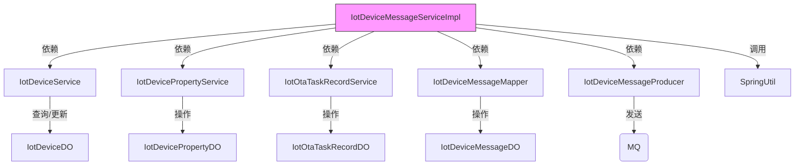
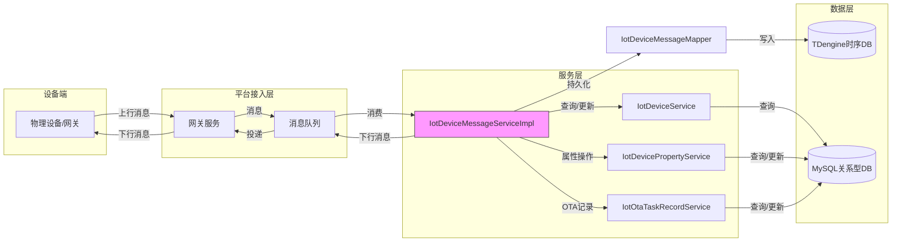
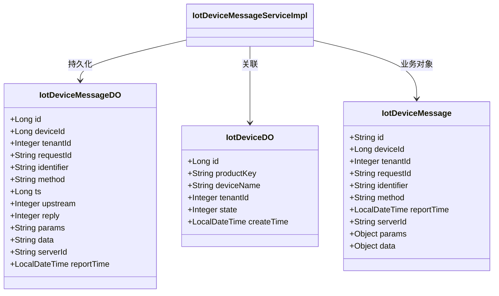

# IotDeviceMessageServiceImpl 模块文档

## 模块概述

IotDeviceMessageServiceImpl 是物联网(IoT)模块中负责处理设备消息的服务实现类。它提供了设备上行消息处理、下行消息发送、消息日志记录以及消息查询等核心功能，是IoT平台设备通信的核心组件。

## 核心职责

1. **设备消息发送**：支持向设备发送上行和下行消息
2. **消息处理**：处理来自设备的各类上行消息（状态更新、属性上报、事件上报、OTA进度上报、拓扑操作等）
3. **批量消息处理**：解析和处理设备批量上报的属性、事件和子设备数据
4. **消息日志**：异步记录设备通信消息到TDengine时序数据库
5. **消息查询**：提供设备消息的分页查询、统计和聚合功能

## 架构与组件关系

IotDeviceMessageServiceImpl 作为IoT服务层的核心组件，与多个其他服务和组件协作：



## 系统集成点

IotDeviceMessageServiceImpl 在IoT平台架构中的位置和集成点：



## 详细功能说明

### 1. 消息发送功能

#### sendDeviceMessage 方法
- **作用**：向指定设备发送消息（上行或下行）
- **参数**：
  - `message`: 要发送的IoT设备消息对象
  - `device` (可选): 设备信息对象
  - `serverId` (可选): 服务器标识（用于下行消息路由）
- **流程**：
  1. 补充消息的后端字段（ID、时间戳、设备ID、租户ID等）
  2. 判断消息方向（上行/下行）
  3. 上行消息：直接通过消息生产者发送
  4. 下行消息：需要验证serverId存在，然后通过网关发送并记录日志

### 2. 上行消息处理

#### handleUpstreamDeviceMessage 方法
- **作用**：处理来自设备的上行消息
- **处理的消息类型**：
  - 设备状态更新（STATE_UPDATE）
  - 属性上报（PROPERTY_POST）
  - 批量上报（PROPERTY_PACK_POST）
  - OTA进度上报（OTA_PROGRESS）
  - 拓扑操作（TOPO_ADD/TOPO_DELETE/TOPO_GET）
  - 子设备动态注册（SUB_DEVICE_REGISTER）
- **特点**：
  - 异步记录消息日志
  - 支持消息应答机制（非_reply消息且未禁用回复时自动回复）
  - 异常处理：业务异常记录警告，系统异常抛出

### 3. 批量消息处理

#### handlePackMessage 方法
- **作用**：处理设备批量上报的属性、事件和子设备数据
- **流程**：
  1. 解析批量消息参数为IotDevicePropertyPackPostReqDTO对象
  2. 处理网关设备自身的属性和事件数据
  3. 遍历处理所有子设备的属性和事件数据
  4. 为每类数据生成标准消息并发送到消息队列

### 4. 消息日志功能

#### createDeviceLogAsync 方法
- **作用**：异步记录设备通信消息到TDengine时序数据库
- **特点**：
  - 使用@Async注解实现异步处理
  - 转换消息对象为数据库实体
  - 处理参数和数据的JSON序列化
  - 捕获并记录异常（避免异步方法异常被吞掉）
  - 设置上行/下行标志、回复标志和标识符

### 5. 消息查询功能

#### getDeviceMessagePage 方法
- **作用**：分页查询设备消息
- **特点**：
  - 处理表不存在的情况（返回空结果而非异常）
  - 使用MyBatis-Plus分页插件

#### getDeviceMessageListByRequestIdsAndReply 方法
- **作用**：根据请求ID列表和是否为回复消息查询消息列表

#### getDeviceMessageCount 方法
- **作用**：根据创建时间查询消息数量

#### getDeviceMessageSummaryByDate 方法
- **作用**：按日期间隔统计上行和下行消息数量
- **特点**：
  - 按小时统计原始数据
  - 按指定间隔合并数据
  - 返回时间范围和对应的上行/下行计数

## 数据模型

IotDeviceMessageServiceImpl 主要操作以下数据模型：



## 与其他模块的关系

IotDeviceMessageServiceImpl 作为IoT平台的核心消息处理服务，与其他模块有以下关联：

- **与设备服务(IotDeviceService)**：通过设备ID获取设备信息，更新设备状态，处理拓扑关系
- **与属性服务(IotDevicePropertyService)**：处理属性上报和批量属性上报
- **与OTA服务(IotOtaTaskRecordService)**：处理OTA升级进度上报
- **与消息队列**：通过IotDeviceMessageProducer发送和接收设备消息
- **与TDengine**：通过IotDeviceMessageMapper存储和查询时序消息数据

有关其他相关模块的详细信息，请参考：
- [IotDeviceService](iot_device_service.md)
- [IotDevicePropertyService](iot_device_property_service.md)
- [IotOtaTaskRecordService](iot_ota_task_record_service.md)
- [消息队列机制](messaging_system.md)
- [TDengine时序存储](tdengine_storage.md)

## 异常处理

服务中定义了特定的错误码：
- `DEVICE_DOWNSTREAM_FAILED_SERVER_ID_NULL`：下行消息发送失败，因为设备的serverId为空

## 线程安全与并发

- 服务类本身是无状态的，可以安全地在多线程环境中使用
- 异步日志方法(createDeviceLogAsync)使用@Async注解，在独立线程中执行
- 依赖的服务(IotDeviceService等)应确保自身的线程安全

## 性能考虑

1. **异步处理**：消息日志记录采用异步方式，避免影响主链路性能
2. **批量处理**：通过handlePackMessage方法将批量上报拆分为单条消息处理，充分利用消息队列的削峰作用
3. **缓存利用**：通过deviceService.getDeviceFromCache方法减少数据库访问
4. **延迟加载**：对IotOtaTaskRecordService使用@Lazy注解避免循环依赖

## 最佳实践

1. **消息幂等性**：服务设计考虑了消息的幂等处理，特别是在网络重传情况下
2. **错误容错**：下行消息发送失败时会有明确的错误提示，上行消息处理异常不会影响消息的确认
3. **资源管理**：异步方法内部捕获异常并记录日志，防止线程池被异常占用
4. **解耦设计**：通过消息队列进行设备通信，实现了设备端和平台端的解耦

## 使用示例

```java
// 发送设备属性下行消息
IotDeviceMessage message = IotDeviceMessage.requestOf(
    deviceId, 
    tenantId, 
    serverId, 
    IotDeviceMessageMethodEnum.PROPERTY_SET.getMethod(),
    propertyValueMap
);
iotDeviceMessageService.sendDeviceMessage(message);

// 处理上行消息（通常在消息监听器中调用）
@Override
public void onMessage(IotDeviceMessage message) {
    IotDeviceDO device = iotDeviceService.getDeviceById(message.getDeviceId());
    iotDeviceMessageService.handleUpstreamDeviceMessage(message, device);
}
```

## 结论

IotDeviceMessageServiceImpl 是IoT平台设备通信的核心组件，提供了完整的设备消息发送、处理、日志和查询功能。通过与其他IoT服务的协作和消息队列的解耦设计，它能够高效可靠地处理大规模设备的通信需求，是构建稳定物联网平台的关键基础设施。