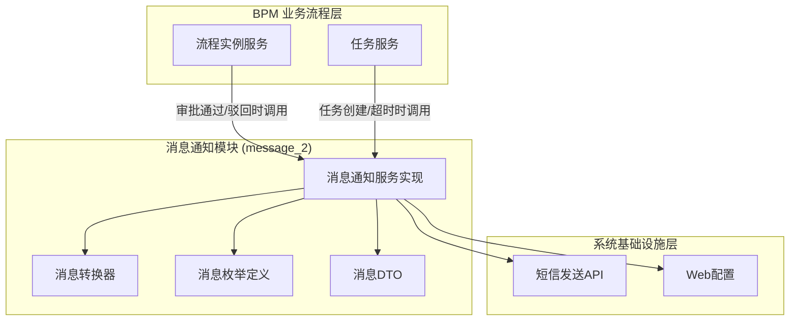
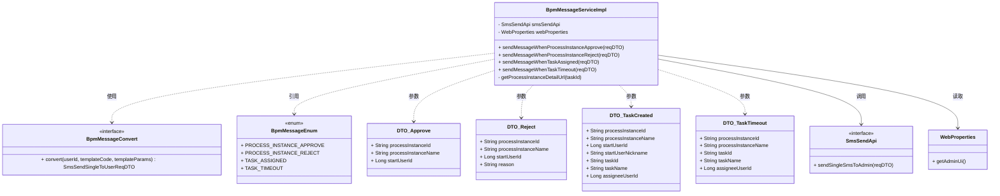
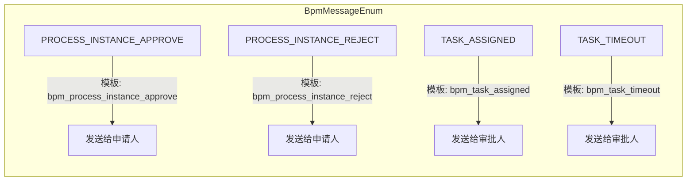
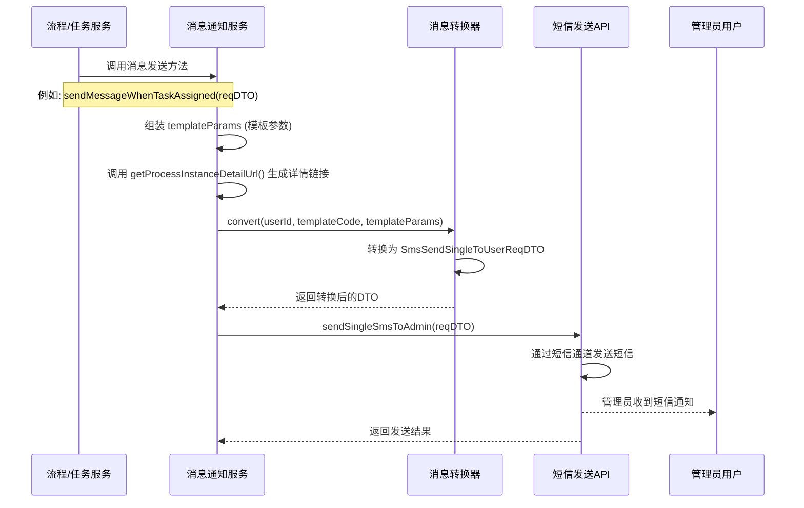
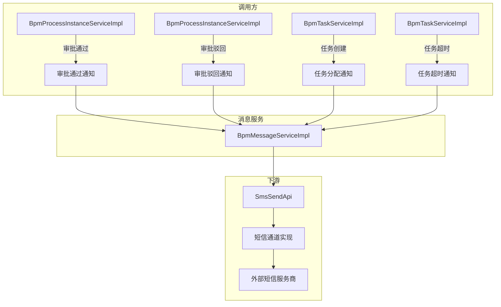

# BPM 消息通知模块 (message_2)

## 概述

`BpmMessageServiceImpl` 是工作流（BPM）模块中的消息通知服务实现，负责在流程审批的关键生命周期节点自动向相关用户发送短信通知。该模块通过集成系统短信发送 API（`SmsSendApi`），在流程实例审批通过、审批驳回、任务分配、任务超时等场景下，向发起人或审批人发送模板化短信通知，实现流程状态的实时触达。

---

## 架构图

### 模块层级关系



### 核心组件依赖关系



---

## 核心功能

### 1. 流程审批通过通知 (`sendMessageWhenProcessInstanceApprove`)

当流程实例被审批通过时，向流程发起人发送短信通知。

**通知参数：**
| 参数 | 说明 | 来源 |
|------|------|------|
| processInstanceName | 流程实例名称 | 请求DTO |
| detailUrl | 详情链接 | 通过 WebProperties 拼接生成 |

### 2. 流程审批驳回通知 (`sendMessageWhenProcessInstanceReject`)

当流程实例被审批驳回时，向流程发起人发送短信通知，包含驳回原因。

**通知参数：**
| 参数 | 说明 | 来源 |
|------|------|------|
| processInstanceName | 流程实例名称 | 请求DTO |
| reason | 驳回原因 | 请求DTO |
| detailUrl | 详情链接 | 通过 WebProperties 拼接生成 |

### 3. 任务分配通知 (`sendMessageWhenTaskAssigned`)

当任务被分配给审批人时，向审批人发送短信通知。

**通知参数：**
| 参数 | 说明 | 来源 |
|------|------|------|
| processInstanceName | 流程实例名称 | 请求DTO |
| taskName | 任务名称 | 请求DTO |
| startUserNickname | 发起人昵称 | 请求DTO |
| detailUrl | 详情链接 | 通过 WebProperties 拼接生成 |

### 4. 任务超时通知 (`sendMessageWhenTaskTimeout`)

当任务审批超时时，向审批人发送超时提醒短信。

**通知参数：**
| 参数 | 说明 | 来源 |
|------|------|------|
| processInstanceName | 流程实例名称 | 请求DTO |
| taskName | 任务名称 | 请求DTO |
| detailUrl | 详情链接 | 通过 WebProperties 拼接生成 |

---

## 消息类型枚举



每种消息类型对应一个短信模板标识（`smsTemplateCode`），关联 `SmsTemplateDO` 的 `code` 属性，通过系统短信模块进行模板渲染和发送。

---

## 数据流

### 流程审批消息发送时序



### 详情链接生成逻辑

```mermaid
flowchart LR
    A[WebProperties.getAdminUi().getUrl()] --> B[拼接 /bpm/process-instance/detail?id=]
    C[流程实例ID] --> B
    B --> D[完整详情URL]
    D --> E[作为模板参数传入短信]
```

---

## 模块依赖

| 依赖模块 | 依赖组件 | 用途 |
|---------|---------|------|
| [system](system.md) | `SmsSendApi` | 短信发送接口，用于向管理员用户发送短信 |
| [system](system.md) | `SmsSendSingleToUserReqDTO` | 短信发送请求DTO |
| framework-web | `WebProperties` | 获取管理后台UI的基础URL，用于拼接流程详情链接 |
| [message_3](message_3.md) | `BpmMessageConvertImpl` | MapStruct 生成的转换器，将消息参数转换为短信发送请求DTO |
| 内部枚举 | `BpmMessageEnum` | 定义消息类型及对应的短信模板标识 |
| 内部DTO | `BpmMessageSendWhenProcessInstanceApproveReqDTO` | 审批通过通知请求参数 |
| 内部DTO | `BpmMessageSendWhenProcessInstanceRejectReqDTO` | 审批驳回通知请求参数 |
| 内部DTO | `BpmMessageSendWhenTaskCreatedReqDTO` | 任务分配通知请求参数 |
| 内部DTO | `BpmMessageSendWhenTaskTimeoutReqDTO` | 任务超时通知请求参数 |

---

## 调用链路



---

## 配置说明

短信模块需要预先配置短信模板，模板标识与 `BpmMessageEnum` 中定义一致：

| 消息枚举 | 模板标识 | 模板参数 |
|---------|---------|---------|
| PROCESS_INSTANCE_APPROVE | `bpm_process_instance_approve` | processInstanceName, detailUrl |
| PROCESS_INSTANCE_REJECT | `bpm_process_instance_reject` | processInstanceName, reason, detailUrl |
| TASK_ASSIGNED | `bpm_task_assigned` | processInstanceName, taskName, startUserNickname, detailUrl |
| TASK_TIMEOUT | `bpm_task_timeout` | processInstanceName, taskName, detailUrl |

管理后台 UI 地址通过 `WebProperties` 配置，格式为：`${admin-ui-url}/bpm/process-instance/detail?id=${processInstanceId}`。

---

## 相关文档

- [流程实例服务](task_5.md) - BpmProcessInstanceServiceImpl，流程审批的调用方
- [任务服务](task_5.md) - BpmTaskServiceImpl，任务分配与超时的调用方
- [系统短信模块](dto_29.md) - SmsSendApi 及其实现
- [消息转换器](message_3.md) - BpmMessageConvertImpl
