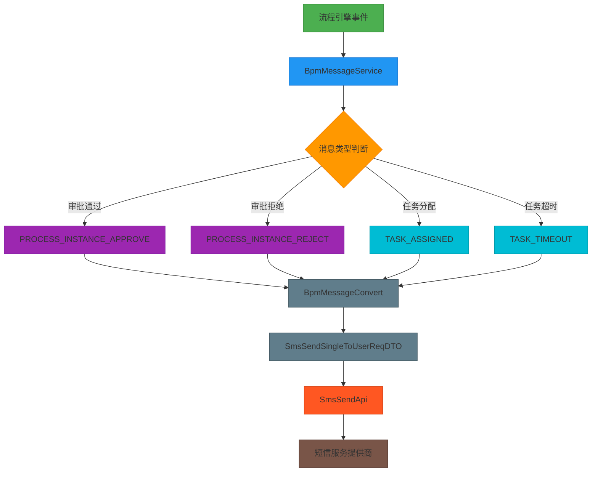
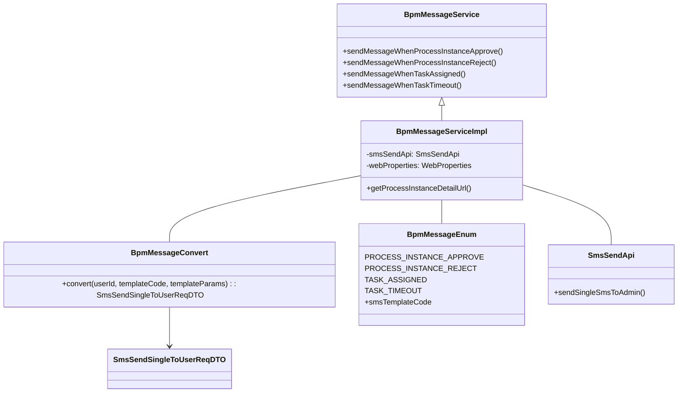
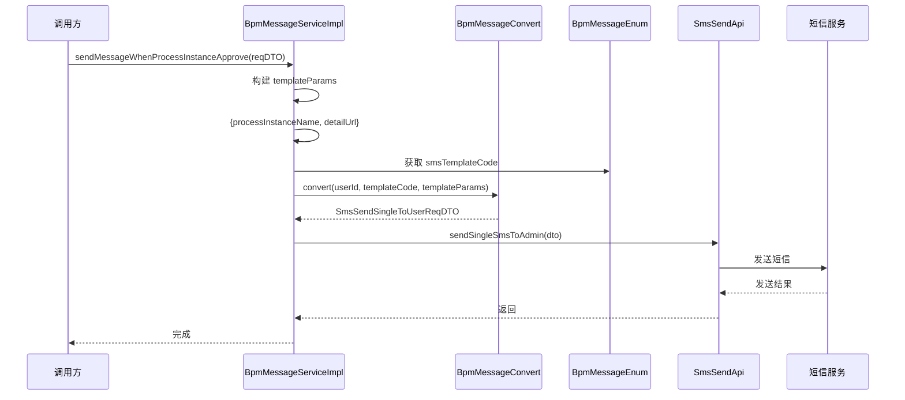
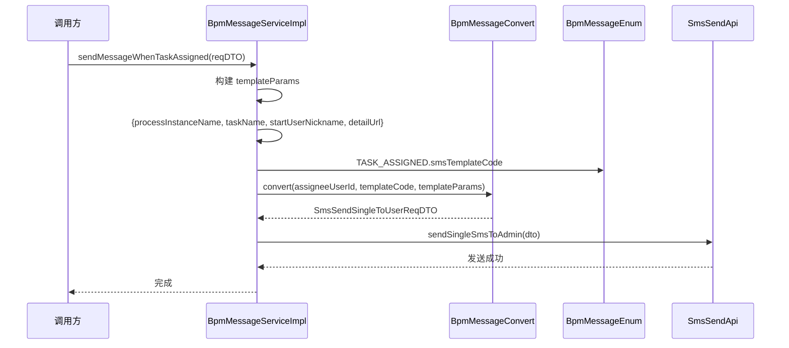
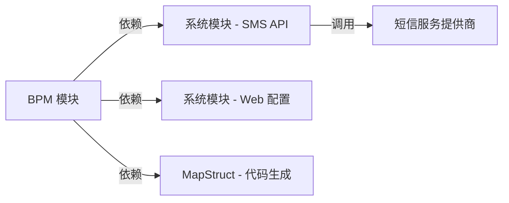

# BPM 消息模块文档 (BPM Message Module)

## 1. 概述

BPM 消息模块负责在流程引擎的关键事件节点自动发送通知短信，实现业务流程与即时通讯的无缝集成。该模块监听工作流中的审批通过、审批拒绝、任务分配和任务超时等事件，并通过系统短信服务向相关用户发送实时提醒。

**核心功能：**
- 流程实例审批通过通知
- 流程实例审批拒绝通知  
- 任务分配通知
- 任务超时提醒

**模块定位：** 作为 BPM 业务模块的子系统，与系统短信服务 API 深度集成，为工作流提供消息通知能力。

---

## 2. 架构设计

### 2.1 整体架构图



### 2.2 组件关系图



---

## 3. 核心组件说明

### 3.1 BpmMessageService（消息服务接口）

**路径：** `yudao-module-bpm/src/main/java/cn/iocoder/yudao/module/bpm/service/message/BpmMessageService.java`

**功能描述：** 定义 BPM 消息发送的业务接口，封装四种典型的消息场景。

```java
public interface BpmMessageService {
    /** 发送流程实例被通过的消息 */
    void sendMessageWhenProcessInstanceApprove(@Valid BpmMessageSendWhenProcessInstanceApproveReqDTO reqDTO);
    
    /** 发送流程实例被不通过的消息 */
    void sendMessageWhenProcessInstanceReject(@Valid BpmMessageSendWhenProcessInstanceRejectReqDTO reqDTO);
    
    /** 发送任务被分配的消息 */
    void sendMessageWhenTaskAssigned(@Valid BpmMessageSendWhenTaskCreatedReqDTO reqDTO);
    
    /** 发送任务审批超时的消息 */
    void sendMessageWhenTaskTimeout(@Valid BpmMessageSendWhenTaskTimeoutReqDTO reqDTO);
}
```

### 3.2 BpmMessageServiceImpl（消息服务实现类）

**路径：** `yudao-module-bpm/src/main/java/cn/iocoder/yudao/module/bpm/service/message/BpmMessageServiceImpl.java`

**功能描述：** 消息服务的实际实现类，负责构建消息参数、调用转换器和执行短信发送。

**关键方法：**
- `sendMessageWhenProcessInstanceApprove()`：审批通过后通知申请人
- `sendMessageWhenProcessInstanceReject()`：审批拒绝后通知申请人并附带原因
- `sendMessageWhenTaskAssigned()`：任务分配时通知审批人
- `sendMessageWhenTaskTimeout()`：任务超时时提醒审批人

**依赖注入：**
```java
@Resource private SmsSendApi smsSendApi;      // 短信发送API
@Resource private WebProperties webProperties; // 系统配置（管理后台URL）
```

### 3.3 BpmMessageConvert（消息转换器）

**路径：** `yudao-module-bpm/src/main/java/cn/iocoder/yudao/module/bpm/convert/message/BpmMessageConvert.java`

**功能描述：** 使用 MapStruct 将 BPM 内部 DTO 转换为系统短信 API 所需的请求对象。

```java
@Mapper
public interface BpmMessageConvert {
    BpmMessageConvert INSTANCE = Mappers.getMapper(BpmMessageConvert.class);
    
    @Mapping(target = "mobile", ignore = true)
    @Mapping(source = "userId", target = "userId")
    @Mapping(source = "templateCode", target = "templateCode")
    @Mapping(source = "templateParams", target = "templateParams")
    SmsSendSingleToUserReqDTO convert(Long userId, String templateCode, Map<String, Object> templateParams);
}
```

**生成的实现类：** `BpmMessageConvertImpl`（位于 target/generated-sources 目录）

### 3.4 BpmMessageEnum（消息枚举）

**路径：** `yudao-module-bpm/src/main/java/cn/iocoder/yudao/module/bpm/enums/message/BpmMessageEnum.java`

**功能描述：** 定义所有消息类型的常量及其对应的短信模板代码。

```java
@AllArgsConstructor
@Getter
public enum BpmMessageEnum {
    PROCESS_INSTANCE_APPROVE("bpm_process_instance_approve"), // 流程任务被审批通过时，发送给申请人
    PROCESS_INSTANCE_REJECT("bpm_process_instance_reject"),   // 流程任务被审批不通过时，发送给申请人
    TASK_ASSIGNED("bpm_task_assigned"),                       // 任务被分配时，发送给审批人
    TASK_TIMEOUT("bpm_task_timeout");                         // 任务审批超时时，发送给审批人
    
    private final String smsTemplateCode; // 关联 SmsTemplateDO 的 code 属性
}
```

### 3.5 消息触发 DTO

每个消息场景都有独立的请求 DTO，用于传递必要的数据：

| DTO 名称 | 用途 |
|----------|------|
| `BpmMessageSendWhenProcessInstanceApproveReqDTO` | 流程实例审批通过 |
| `BpmMessageSendWhenProcessInstanceRejectReqDTO` | 流程实例审批拒绝 |
| `BpmMessageSendWhenTaskCreatedReqDTO` | 任务创建/分配 |
| `BpmMessageSendWhenTaskTimeoutReqDTO` | 任务超时 |

---

## 4. 数据流程

### 4.1 审批通过消息流程



### 4.2 任务分配消息流程



---

## 5. 关键配置

### 5.1 WebProperties（管理后台地址）

**作用：** 用于生成流程实例详情页面的完整 URL。

```java
// 在 BpmMessageServiceImpl 中
private String getProcessInstanceDetailUrl(String taskId) {
    return webProperties.getAdminUi().getUrl() + "/bpm/process-instance/detail?id=" + taskId;
}
```

**配置文件示例：**
```yaml
yudao:
  admin-ui:
    url: http://localhost:8080
```

### 5.2 短信模板配置

消息枚举中的 `smsTemplateCode` 需要与系统中的短信模板代码保持一致，例如：

| 消息类型 | 短信模板代码 | 接收对象 |
|----------|-------------|----------|
| PROCESS_INSTANCE_APPROVE | bpm_process_instance_approve | 申请人 |
| PROCESS_INSTANCE_REJECT | bpm_process_instance_reject | 申请人 |
| TASK_ASSIGNED | bpm_task_assigned | 审批人 |
| TASK_TIMEOUT | bpm_task_timeout | 审批人 |

---

## 6. 依赖关系

### 6.1 模块依赖



### 6.2 包结构依赖

```
yudao-module-bpm/
├── service/message/              # 消息服务层
│   ├── BpmMessageService.java    # 接口
│   └── BpmMessageServiceImpl.java # 实现
│   └── dto/                      # 请求 DTO
│       ├── BpmMessageSendWhen...ReqDTO
├── convert/message/              # 消息转换器
│   └── BpmMessageConvert.java    # MapStruct 接口
├── enums/message/                # 消息枚举
│   └── BpmMessageEnum.java
└── ...
```

---

## 7. 扩展点

### 7.1 未来规划

根据 `BpmMessageService` 接口中的 TODO 注释，未来计划支持：
- **消息可配置化**：不同流程可以配置不同的消息通知规则
- **内容自定义**：灵活设置消息模板和内容
- **多通道支持**：除了短信，还支持邮件、站内信、推送等多种通知方式

### 7.2 自定义扩展

如需扩展新的消息类型，建议遵循以下步骤：
1. 在 `BpmMessageEnum` 中添加新的枚举值
2. 创建新的 Request DTO（如 `BpmMessageSendWhenXXXReqDTO`）
3. 在 `BpmMessageServiceImpl` 中实现新的消息发送方法
4. 在 `BpmMessageConvert` 中添加相应的转换映射（如果需要）

---

## 8. 参考文档

- [系统短信模块](system_sms.md) - 短信发送 API 详细说明
- [BPM 流程引擎模块](bpm_engine.md) - 流程引擎整体架构
- [MapStruct 转换器使用指南](mapstruct_converter.md) - 代码生成转换器最佳实践
- [系统配置中心](system_config.md) - WebProperties 配置说明
