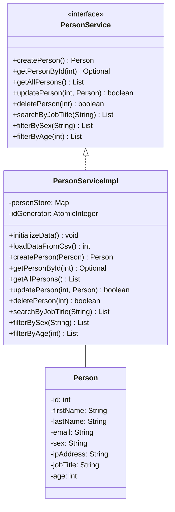
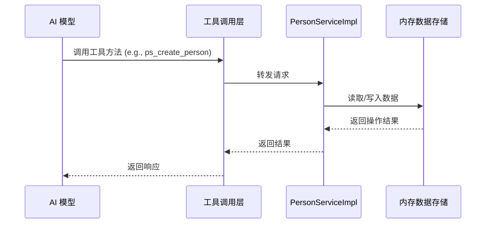

# Method 模块文档

## 1. 模块概述

`method` 模块是 AI 模块（`yudao-module-ai`）中的一个工具方法模块，主要提供基于 Spring AI 的工具方法实现。当前核心实现是 `PersonServiceImpl`，它实现了 `PersonService` 接口，通过内存数据存储管理 Person 对象，并暴露了一系列工具方法供 AI 模型调用。

该模块遵循 Spring Boot 和 Spring AI 的规范，使用 `@Tool` 注解将服务方法注册为 AI 工具函数，支持 CRUD 操作、数据查询和过滤等功能。

## 2. 架构设计

### 2.1 模块结构

```
method/
├── PersonServiceImpl.java          # 核心实现类
└── Person.java                     # Person 数据对象（引用）
```

### 2.2 组件关系



### 2.3 数据流



## 3. 核心组件说明

### 3.1 PersonServiceImpl

**文件路径**: `yudao-module-ai/src/main/java/cn/iocoder/yudao/module/ai/tool/method/PersonServiceImpl.java`

**类说明**:
- 实现了 `PersonService` 接口
- 使用 `ConcurrentHashMap` 作为线程安全的内存数据存储
- 使用 `AtomicInteger` 保证 ID 生成的线程安全
- 通过 `@PostConstruct` 注解在初始化时加载 CSV 数据
- 所有方法均使用 `@Tool` 注解标记，暴露为 AI 可调用的工具函数

**主要方法**:

| 方法名 | 工具名 | 描述 | 参数 | 返回值 |
|--------|--------|------|------|--------|
| `createPerson` | `ps_create_person` | 创建新人记录 | `Person personData` | `Person` |
| `getPersonById` | `ps_get_person_by_id` | 按 ID 查询人员 | `int id` | `Optional<Person>` |
| `getAllPersons` | `ps_get_all_persons` | 获取所有人员 | - | `List<Person>` |
| `updatePerson` | `ps_update_person` | 更新人员信息 | `int id, Person updatedPersonData` | `boolean` |
| `deletePerson` | `ps_delete_person` | 删除人员 | `int id` | `boolean` |
| `searchByJobTitle` | `ps_search_by_job_title` | 按职位搜索 | `String jobTitleQuery` | `List<Person>` |
| `filterBySex` | `ps_filter_by_sex` | 按性别过滤 | `String sex` | `List<Person>` |
| `filterByAge` | `ps_filter_by_age` | 按年龄过滤 | `int age` | `List<Person>` |

### 3.2 Person 数据对象

**说明**: 人员数据实体，包含以下字段：
- `id`: 唯一标识（整数）
- `firstName`: 名
- `lastName`: 姓
- `email`: 邮箱
- `sex`: 性别
- `ipAddress`: IP 地址
- `jobTitle`: 职位
- `age`: 年龄

## 4. 初始化流程

```mermaid
graph TD
    A[PersonServiceImpl 实例化] --> B[依赖注入完成]
    B --> C[@PostConstruct 触发]
    C --> D[调用 initializeData()]
    D --> E[调用 loadDataFromCsv()]
    E --> F[解析 CSV 数据]
    F --> G[构建 Person 对象]
    G --> H[存入 personStore]
    H --> I[更新最大 ID]
    I --> J[初始化 idGenerator]
    J --> K[日志记录初始化完成]
```

**CSV 数据包含 100 条预置人员记录**，字段顺序为：Id, FirstName, LastName, Email, Sex, IpAddress, JobTitle, Age。

## 5. 线程安全设计

| 组件 | 作用 | 线程安全机制 |
|------|------|-------------|
| `ConcurrentHashMap` | 人员数据存储 | 内置并发控制，支持高并发读写 |
| `AtomicInteger` | ID 生成器 | 原子操作保证 ID 唯一性 |
| `Collections.unmodifiableList()` | 返回结果 | 防止外部修改内部数据 |
| `computeIfPresent()` | 更新操作 | 原子性更新 |

## 6. 错误处理

- **空指针检查**: 所有输入参数均进行 null 检查
- **数据格式验证**: CSV 解析时验证字段数量，跳过异常行
- **异常捕获**: 捕获 `NumberFormatException` 和其他异常，记录警告日志
- **操作日志**: 使用 `log.debug`、`log.warn`、`log.error` 记录不同级别的操作信息

## 7. 与其他模块的依赖关系

### 7.1 依赖模块

| 模块 | 依赖说明 |
|------|---------|
| `yudao-module-ai` | 当前模块所属的 AI 模块 |
| `spring-ai` | Spring AI 框架，提供 `@Tool` 注解支持 |
| `lombok` | 提供 `@Slf4j` 日志注解 |

### 7.2 被依赖模块

- **UI 层**: `yudao-ui/yudao-ui-admin-vue3/src/api/ai/tool/method/` 可能调用此模块的工具方法
- **AI 服务**: 其他 AI 服务可能通过此模块获取人员数据

## 8. 使用示例

### 8.1 AI 工具调用示例

```javascript
// AI 模型调用示例
const result = await aiTool.call({
    name: 'ps_create_person',
    arguments: {
        firstName: 'John',
        lastName: 'Doe',
        email: 'john@example.com',
        sex: 'Male',
        ipAddress: '192.168.1.1',
        jobTitle: 'Software Engineer',
        age: 30
    }
});
```

### 8.2 服务层调用示例

```java
@Autowired
private PersonService personService;

// 创建人员
Person newPerson = personService.createPerson(new Person(...));

// 查询人员
Optional<Person> person = personService.getPersonById(1);

// 更新人员
boolean updated = personService.updatePerson(1, updatedPerson);

// 搜索人员
List<Person> engineers = personService.searchByJobTitle("Engineer");
```

## 9. 扩展建议

1. **数据持久化**: 当前使用内存存储，建议扩展为数据库存储（如 MyBatis）
2. **分页支持**: 在 `getAllPersons` 等方法中添加分页参数
3. **数据验证**: 增加对年龄、邮箱等字段的格式验证
4. **缓存优化**: 对于频繁查询的数据，可引入 Redis 缓存
5. **审计日志**: 记录数据的创建、修改、删除操作日志

## 10. 参考文档

- [Spring AI 官方文档](https://spring.io/projects/spring-ai)
- [PersonService 接口定义](PersonService.java)
- [AI 模块整体架构](ai-module.md)
