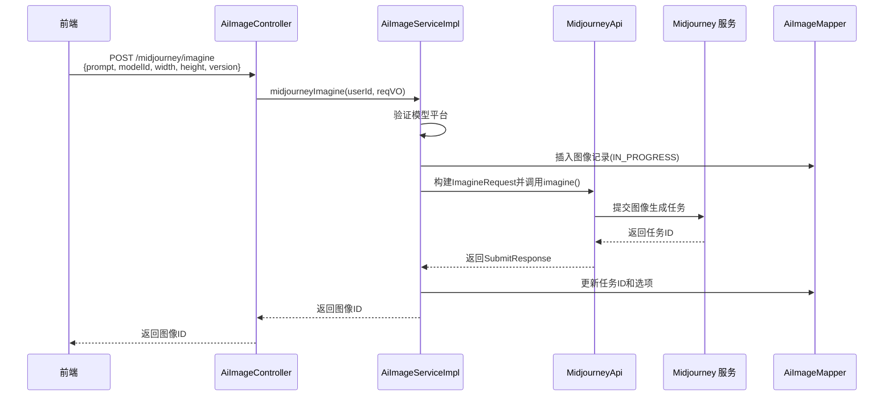
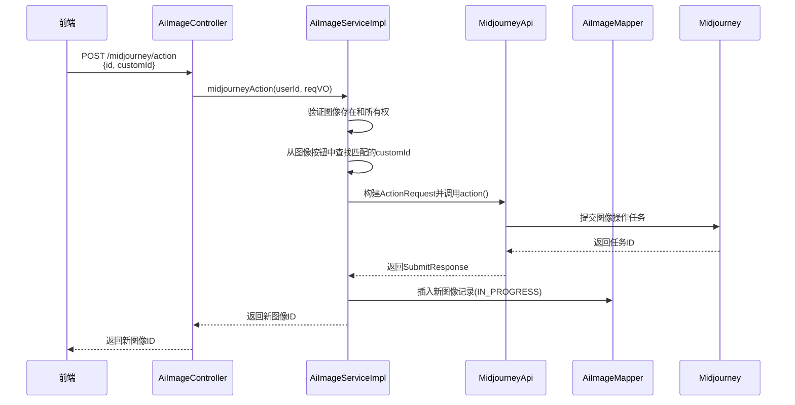

# Midjourney 模块文档

## 概述

Midjourney 模块是 Yudao AI 模块的一部分，专门负责与 Midjourney AI 绘画服务的集成。该模块提供了完整的 Midjourney 图像生成功能，包括图像生成、状态同步、图像操作（如放大、变体等）以及结果处理。

该模块遵循典型的分层架构：
- **控制层**（Controller）：处理 HTTP 请求和响应
- **服务层**（Service）：实现业务逻辑
- **数据访问层**（DAO）：与数据库交互
- **工具类**：与 Midjourney 服务通信的 API 客户端

## 架构概述

```mermaid
graph TD
    A[前端请求] --> B[AiImageController]
    B --> C[AiImageServiceImpl]
    C --> D[MidjourneyApi]
    D --> E[Midjourney 服务]
    E -->|回调| F[/midjourney/notify 端点]
    F --> C
    C --> G[AiImageMapper]
    G --> H[(数据库)] H[AiImageMapper] --> H[(数据库)]:::db
    classDef db fill:#f9f,stroke:#333,stroke-width:1px;
```

### 核心组件

| 组件 | 负责 |
|------|------|
| `AiImageController` | 处理图像相关的 HTTP 请求，包括 Midjourney 专属端点 |
| `AiImageServiceImpl` | 实现图像业务逻辑，包括 Midjourney 图像生成、状态同步和操作 |
| `MidjourneyApi` | 与 Midjourney 代理服务通信的 API 客户端 |
| `AiMidjourneyImagineReqVO` | Midjourney 图像生成请求的数据传输对象 |
| `AiMidjourneyActionReqVO` | Midjourney 图像操作请求的数据传输对象 |
| `AiMidjourneySyncJob` | 定时任务，用于同步 Midjourney 任务状态 |

## 功能详解

### 1. 图像生成流程

当用户通过 `/ai/image/midjourney/imagine` 端点提交图像生成请求时：

1. 控制器验证请求参数并调用服务层
2. 服务层验证模型是否为 Midjourney 平台
3. 创建图像记录并设置初始状态为 "进行中"
4. 构建 Midjourney API 请求（包括提示词、尺寸、版本等参数）
5. 调用 Midjourney 服务提交图像生成任务
6. 保存任务 ID 并返回图像 ID 给前端
7. 前端可以通过图像 ID 轮询查询生成结果



### 2. 状态同步机制

由于 Midjourney 图像生成是异步过程，系统需要定期检查任务状态：

1. `AiMidjourneySyncJob` 定时任务（由 Quartz 调度）触发执行
2. 调用 `AiImageServiceImpl.midjourneySync()` 方法
3. 服务层查询所有状态为 "进行中" 的 Midjourney 图像
4. 为这些图像调用 Midjourney API 获取最新状态
5. 根据返回状态更新数据库中的图像记录：
   - 成功：设置状态为 "成功"，保存图片 URL
   - 失败：设置状态为 "失败"，保存错误信息
   - 进行中：保持状态不变，更新按钮信息（用于后续操作）

```mermaid
sequenceDiagram
    participant 调度器 as Quartz Scheduler
    participant 任务 as AiMidjourneySyncJob
    participant 服务 as AiImageServiceImpl
    participant API as MidjourneyApi
    participant Midjourney as Midjourney 服务
    participant 数据库 as AiImageMapper

    调度器->>任务: 触发执行
    任务->>服务: midjourneySync()
    服务->>数据库: 查询IN_PROGRESS状态的Midjourney图像
    循环 每个图像
        服务->>API: getTaskList(taskIds)
        API->>Midjourney: 查询任务状态
        Midjourney-->>API: 返回任务通知列表
        API-->>服务: 返回任务通知映射
        服务->>服务: 更新MidjourneyStatus(图像, 通知)
        服务->>数据库: 更新图像状态、图片URL、错误信息等
    end
    服务-->>任务: 返回已处理图像数量
    任务-->>调度器: 记录执行日志
```

### 3. 图像操作流程

用户可以对已生成的 Midjourney 图像执行各种操作（如放大 U1-U4，变体 V1-V4 等）：

1. 前端通过 `/ai/image/midjourney/action` 端点提交操作请求
2. 请求包含图像 ID 和自定义操作 ID（如 `MJ::JOB::variation::4::06aa3e66-0e97-49cc-8201-e0295d883de4`）
3. 服务层验证图像存在且属于当前用户
4. 从图像的按钮列表中查找匹配的操作
5. 调用 Midjourney API 提交操作请求
6. 创建新的图像记录来存放操作结果
7. 返回新图像 ID 给前端



### 4. 回调处理

Midjourney 服务会通过 HTTP 回调通知任务状态变化：

1. Midjourney 服务调用系统的 `/ai/image/midjourney/notify` 端点
2. 端点使用 `@PermitAll` 和 `@TenantIgnore` 注解，允许无需认证的访问
3. 控制器直接将请求转发给服务层处理
4. 服务层根据任务 ID 查找对应的图像记录
5. 更新图像状态、图片 URL、错误信息等字段
6. 如果任务完成，设置完成时间

```mermaid
sequenceDiagram
    participant Midjourney as Midjourney 服务
    participant 控制器 as AiImageController
    participant 服务 as AiImageServiceImpl
    participant 数据库 as AiImageMapper
    participant 文件服务 as FileApi

    Midjourney->>控制器: POST /midjourney/notify<br/>{id, status, imageUrl, ...}
    控制器->>服务: midjourneyNotify(notify)
    服务->>数据库: 根据taskId查找图像记录
    替代 未找到图像
        服务-->>控制器: 记录警告并返回
    否则 找到图像
        服务->>服务: 转换Midjourney状态到内部状态
        替代 有图片URL
            服务->>文件服务: 下载并上传图片
            文件服务-->>服务: 返回文件路径
        end
        服务->>数据库: 更新图像状态、图片URL、按钮、错误信息、完成时间
    end
    服务-->>控制器: 返回成功响应
    控制器-->>Midjourney: 返回成功响应
```

## 与其他模块的关系

Midjourney 模块是 AI 模块的图像功能的一部分，与以下模块有关联：

- **AI 模块核心**：依赖 `AiModelService` 来验证和获取 AI 模型信息
- **文件服务**：使用 `FileApi` 将从服务` 来存储从 Midjourney 下载的图片
- **数据库**：通过 `AiImageMapper` 持久化图像记录
- **定时任务**：使用 Quartz 调度 `AiMidjourneySyncJob` 来同步任务状态

## 数据模型

Midjourney 功能扩展了基础的 `AiImageDO` 数据模型，添加了以下字段：

| 字段 | 说明 |
|------|------|
| `taskId` | Midjourney 任务 ID，用于追踪异步操作 |
| `buttons` | 可用的操作按钮信息（JSON 格式），用于前端显示操作选项 |
| `options` | 图像生成/操作的选项参数（JSON 格式） |
| `platform` | AI 平台标识，固定为 `midjourney` |
| `errorMessage` | 操作失败时的错误信息 |

## 配置说明

Midjourney 功能依赖以下配置：

1. **AI 模型配置**：在系统中需要配置 Midjourney 平台的 AI 模型
2. **Midjourney 服务地址**：通过 `MidjourneyApi` 配置访问 Midjourney 代理服务的地址
3. **文件存储配置**：用于存储从 Midjourney 下载的生成图片
4. **定时任务配置**：配置 `AiMidjourneySyncJob` 的执行间隔（默认每分钟执行一次）

## 使用示例

### 生成图片请求

```http
POST /ai/image/midjourney/imagine
Content-Type: application/json

{
  "prompt": "中国神龙",
  "modelId": 1,
  "width": 1024,
  "height": 1024,
  "version": "6.0"
}
```

### 执行图像操作（放大）

```http
POST /ai/image/midjourney/action
Content-Type: application/json

{
  "id": 123,
  "customId": "MJ::JOB::upscale::2::06aa3e66-0e97-49cc-8201-e0295d883de4"
}
```

## 错误处理

模块中定义了以下业务异常：

- `IMAGE_NOT_EXISTS`：图像记录不存在
- `IMAGE_CUSTOM_ID_NOT_EXISTS`：指定的操作 ID 不存在
- `IMAGE_MIDJOURNEY_SUBMIT_FAIL`：提交任务到 Midjourney 失败（通常是配额不足）

## 性能考虑

1. **异步处理**：图像生成和操作都是异步的，不会阻塞请求线程
2. **状态同步优化**：同步任务批量处理所有进行中的任务，减少 API 调用次数
3. **数据库索引**：建议对 `taskId`、`status`、`platform` 字段建立索引以提高查询性能
4. **文件存储**：生成的图片通过文件服务存储，避免直接占用数据库空间

## 未来改进方向

1. **WebSocket 实时更新**：替换轮询机制，使用 WebSocket 实时推送图像生成进度
2. **更丰富的操作支持**：支持更多 Midjourney 高级功能（如变形、局部重绘等）
3. **结果缓存**：对常用提示词的结果进行缓存以提高响应速度
4. **错误重试机制**：对失败的任务实现智能重试策略