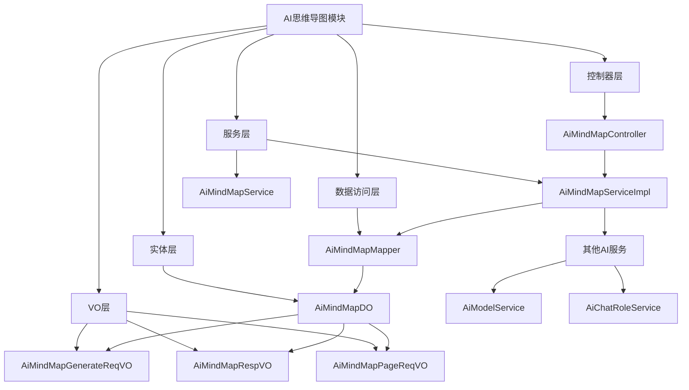
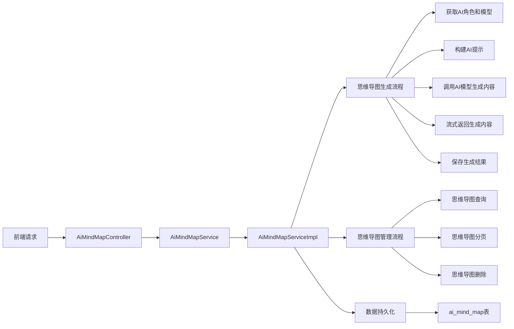
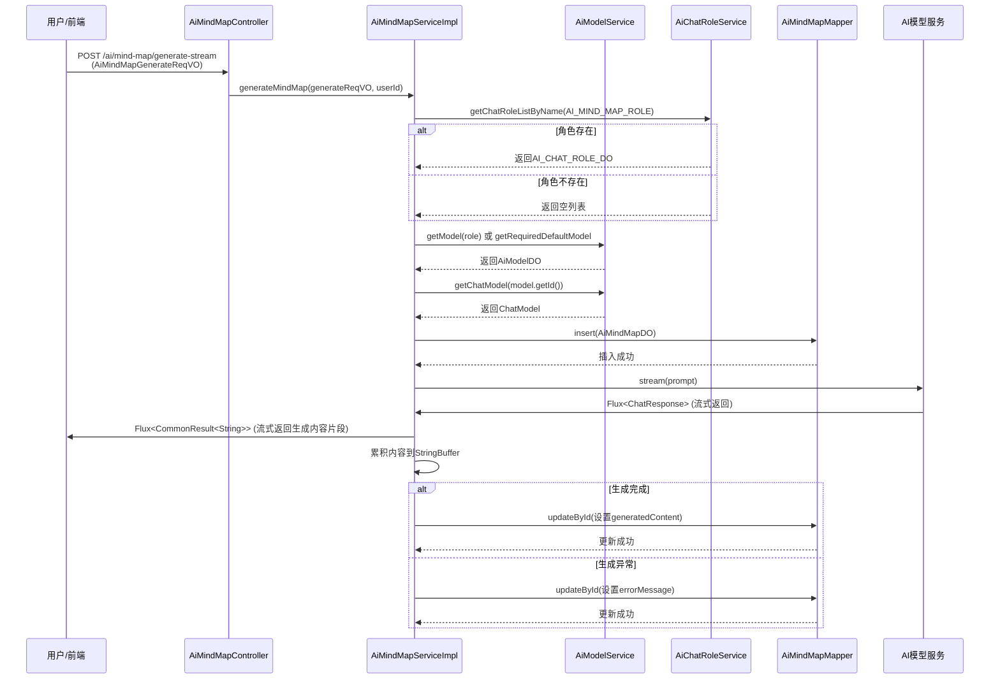
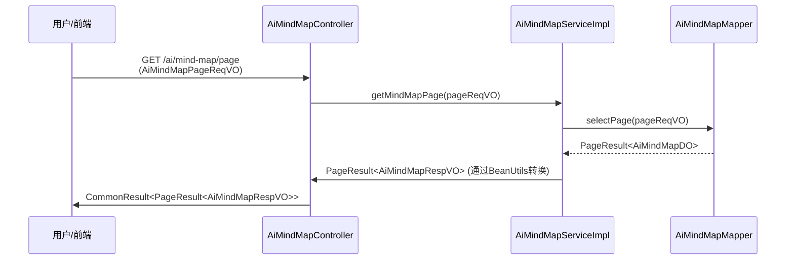
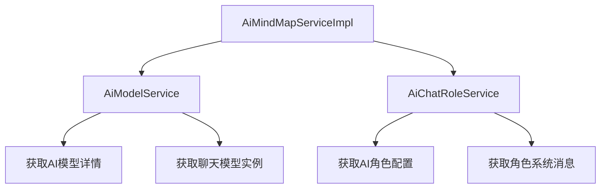

# AI思维导图模块文档

## 模块概述

AI思维导图模块是Yudao框架AI模块的一部分，提供基于人工智能的思维导图生成功能。用户可以通过输入提示词(prompt)，让AI模型生成结构化的思维导图内容，以Markdown格式返回。

该模块支持流式生成，能够实时返回生成过程中的内容，提升用户体验。生成的思维导图会被持久化存储，用户可以进行查询、分页和删除操作。

## 核心功能

1. **思维导图生成**：根据用户提供的提示词，调用AI模型生成思维导图内容
2. **流式响应**：支持Server-Sent Events (SSE) 实时返回生成内容
3. **思维导图管理**：提供思维导图的查询、分页和删除功能
4. **历史记录**：存储生成的思维导图记录，包含生成内容、使用的模型和平台信息

## 架构设计

### 模块结构



### 组件关系



## 详细设计

### 控制器层 (AiMindMapController)

控制器负责处理HTTP请求，提供RESTful API接口：

- **生成思维导图（流式）**：`POST /ai/mind-map/generate-stream`
  - 请求体：`AiMindMapGenerateReqVO` (包含prompt)
  - 响应：`Flux<CommonResult<String>>` (Server-Sent Events格式)
  - 功能：根据用户提示词生成思维导图内容，以流式方式返回

- **删除思维导图**：`DELETE /ai/mind-map/delete`
  - 参数：`id` (思维导图ID)
  - 响应：`CommonResult<Boolean>`
  - 功能：删除指定ID的思维导图记录

- **获取思维导图分页**：`GET /ai/mind-map/page`
  - 参数：`AiMindMapPageReqVO` (支持按用户ID、提示词、创建时间过滤)
  - 响应：`CommonResult<PageResult<AiMindMapRespVO>>`
  - 功能：分页查询思维导图历史记录

### 服务层 (AiMindMapServiceImpl)

服务层实现核心业务逻辑：

1. **思维导图生成流程**：
   - 获取思维导图助手角色（AI_MIND_MAP_ROLE），如果不存在则使用默认模型
   - 根据角色获取对应的AI模型
   - 构建系统消息（角色设定）和用户消息（提示词）
   - 调用AI模型服务进行流式生成
   - 实时累积生成内容并通过流式接口返回
   - 生成完成后更新数据库中的完整内容
   - 错误处理：捕获异常并将错误信息保存到数据库

2. **思维导图管理**：
   - 删除思维导图：先验证存在性，然后删除记录
   - 分页查询：根据查询条件过滤并按ID倒序排列返回结果

### 数据访问层 (AiMindMapMapper)

使用MyBatis-Plus框架，提供基础CRUD操作和自定义分页查询：

- 继承BaseMapperX获得基本的增删改查方法
- 自定义selectPage方法实现分页查询，支持按用户ID、提示词和创建时间范围过滤

### 实体层 (AiMindMapDO)

数据库表 `ai_mind_map` 的映射实体：

| 字段名 | 类型 | 说明 |
|--------|------|------|
| id | Long | 主键ID |
| userId | Long | 用户ID，关联AdminUserDO |
| platform | String | AI平台（如OpenAI、Azure等） |
| modelId | Long | AI模型ID，关联AiModelDO |
| model | String | AI模型名称 |
| prompt | String | 用户输入的提示词 |
| generatedContent | String | AI生成的思维导图内容（Markdown格式） |
| errorMessage | String | 生成过程中的错误信息（如果有） |
| createTime | LocalDateTime | 创建时间（继承自BaseDO） |

### VO层

- **AiMindMapGenerateReqVO**：生成请求，包含必填的prompt字段
- **AiMindMapRespVO**：响应VO，包含思维导图的所有字段
- **AiMindMapPageReqVO**：分页请求，继承PageParam，支持按userId、prompt和createTime范围查询

### 前端层 (Vue 3)

前端提供对应的API接口定义：

- **MindMapVO**：思维导图数据结构
- **AiMindMapGenerateReqVO**：生成请求结构
- API路径：`/ai/mind-map` 下的各个端点

## 工作流程

### 思维导图生成流程



### 思维导图查询流程



## 技术实现要点

### 流式响应实现

使用Spring WebFlux的Flux结合Server-Sent Events实现实时流式返回：

```java
@PostMapping(value = "/generate-stream", produces = MediaType.TEXT_EVENT_STREAM_VALUE)
public Flux<CommonResult<String>> generateMindMap(
    @RequestBody @Valid AiMindMapGenerateReqVO generateReqVO) {
    return mindMapService.generateMindMap(generateReqVO, getLoginUserId());
}
```

在服务层中，通过`chatModel.stream(prompt)`获得Flux<ChatResponse>，然后使用`map`操作符将每个chunk转换为成功响应，并在`doOnComplete`和`doOnError`中处理完成和异常情况。

### 错误处理机制

1. **业务验证**：使用JSR-303注解（如@NotBlank）进行参数验证
2. **异常捕获**：在流式处理中使用`doOnError`捕获异常
3. **状态更新**：无论成功还是失败，都会更新数据库记录：
   - 成功：更新generatedContent字段
   - 失败：更新errorMessage字段
4. **错误恢复**：使用`onErrorResume`确保流不会因错误而中断

### 角色和模型选择机制

1. 优先使用名为"AI_MIND_MAP_ROLE"的思维导图助手角色
2. 如果角色存在且配置了模型ID，则使用该模型
3. 如果角色不存在或未配置模型，则使用系统默认的聊天模型
4. 验证所选模型类型必须是CHAT类型

## 与其他模块的关系

### 依赖的AI模块服务



### 数据表关系

```mermaid
erDiagram
    AI_MIND_MAP ||--o{ ADMIN_USER : "创建"
    AI_MIND_MAP ||--o{ AI_MODEL : "使用"
    AI_MIND_MAP {
        Long id PK
        Long userId FK
        String platform
        Long modelId FK
        String model
        String prompt
        String generatedContent
        String errorMessage
        DateTime createTime
    }
    ADMIN_USER {
        Long userId PK
        String username
        String nickname
        // ... 其他字段
    }
    AI_MODEL {
        Long id PK
        String model
        String platform
        Integer type
        // ... 其他字段
    }
```

### 在系统中的定位

AI思维导图模块是Yudao AI模块的一个具体功能组件，与其他AI功能模块并列：

- AI对话 (AiChatConversationController, AiChatMessageController)
- AI图像生成 (AiImageController)
- AI知识库 (AiKnowledgeController系列)
- AI音乐生成 (AiMusicController)
- AI写作助手 (AiWriteController)
- AI工作流 (AiWorkflowController)
- AI思维导图 (AiMindMapController) ← 本模块

所有这些模块共享底层的AI服务基础设施，如模型管理、角色管理等。

## API接口详情

### 生成思维导图（流式）

- **路径**：POST /ai/mind-map/generate-stream
- **请求体**：
  ```json
  {
    "prompt": "Java 学习路线"
  }
  ```
- **响应**：Server-Sent Events格式
  ```
  data: {"code":200,"message":"成功","data":"# Java 学习路线\n\n## 核心概念\n"}
  data: {"code":200,"message":"成功","data":"\n### 面向对象编程\n"}
  data: {"code":200,"message":"成功","data":null}  // 完成标记
  ```
- **权限**：无需特殊权限
- **备注**：流式返回，每个data块包含增量生成内容

### 删除思维导图

- **路径**：DELETE /ai/mind-map/delete
- **请求参数**：
  - id (Long)：思维导图ID
- **响应**：
  ```json
  {
    "code": 200,
    "message": "成功",
    "data": true
  }
  ```
- **权限**：需要 ai:mind-map:delete 权限

### 获取思维导图分页

- **路径**：GET /ai/mind-map/page
- **请求参数**：
  - pageSize (Integer)：页大小
  - pageNum (Integer)：页码
  - userId (Long)：用户ID（可选）
  - prompt (String)：提示词（可选）
  - createTime (LocalDateTime[])：创建时间范围（可选）
- **响应**：
  ```json
  {
    "code": 200,
    "message": "成功",
    "data": {
      "list": [
        {
          "id": 3373,
          "userId": 4325,
          "prompt": "Java 学习路线",
          "generatedContent": "# Java 学习路线\n\n## 核心概念\n### 面向对象编程\n",
          "platform": "OpenAI",
          "model": "gpt-3.5-turbo-0125",
          "errorMessage": null,
          "createTime": "2023-05-20 10:30:00"
        }
      ],
      "total": 1,
      "pageSize": 10,
      "pageNum": 1
    }
  }
  ```
- **权限**：需要 ai:mind-map:query 权限

## 数据库表结构

```sql
CREATE TABLE ai_mind_map (
    id BIGINT PRIMARY KEY AUTO_INCREMENT COMMENT '编号',
    user_id BIGINT NOT NULL COMMENT '用户编号',
    platform VARCHAR(50) NOT NULL COMMENT '平台',
    model_id BIGINT COMMENT '模型编号',
    model VARCHAR(100) COMMENT '模型',
    prompt VARCHAR(500) NOT NULL COMMENT '生成内容提示',
    generated_content TEXT COMMENT '生成的思维导图内容',
    error_message VARCHAR(200) COMMENT '错误信息',
    create_time DATETIME NOT NULL COMMENT '创建时间',
    INDEX idx_user_id (user_id),
    INDEX idx_create_time (create_time)
) COMMENT='AI思维导图表';
```

## 错误码定义

在服务实现中使用的错误码：

- `MODEL_NOT_EXISTS`：模型不存在
- `MODEL_USE_TYPE_ERROR`：模型使用类型错误（必须是CHAT类型）
- `MIND_MAP_NOT_EXISTS`：思维导图不存在
- `WRITE_STREAM_ERROR`：思维导图生成流错误

## 最佳实践和注意事项

1. **流式处理**：由于Flux是异步的，无法透传租户信息，因此使用`TenantUtils.executeIgnore()`在完成和错误回调中执行数据库操作
2. **内容累积**：使用StringBuffer累积流式返回的内容，避免频繁创建字符串对象
3. **空值处理**：使用`StrUtil.nullToDefault()`处理可能的null返回值
4. **角色回退**：当指定的AI角色不存在时，自动回退到默认模型，确保服务可用性
5. **模型验证**：严格验证所选模型的类型必须是CHAT类型，防止使用不兼容的模型
6. **错误持久化**：无论成功还是失败，都将结果持久化到数据库，便于后续查询和问题排查

## 未来改进方向

1. **支持更多导图格式**：除了Markdown，支持Mermaid、PlantUML等其他导图格式
2. **导图编辑功能**：提供在线编辑和修改生成的思维导图
3. **导图导出**：支持导出为图片、PDF等格式
4. **模板功能**：提供常用思维导图模板供用户选择
5. **协作编辑**：支持多用户协作编辑同一个思维导图
6. **智能建议**：基于用户历史生成内容提供智能提示词建议