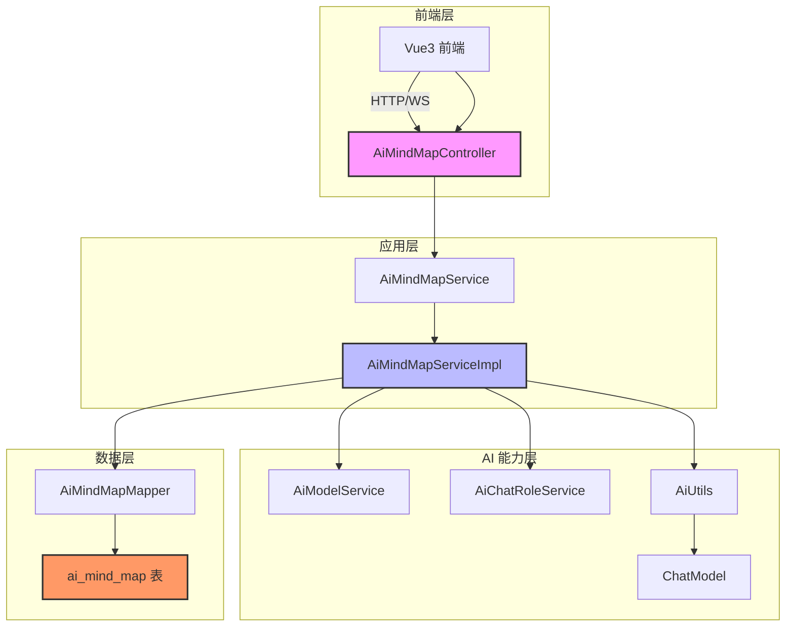
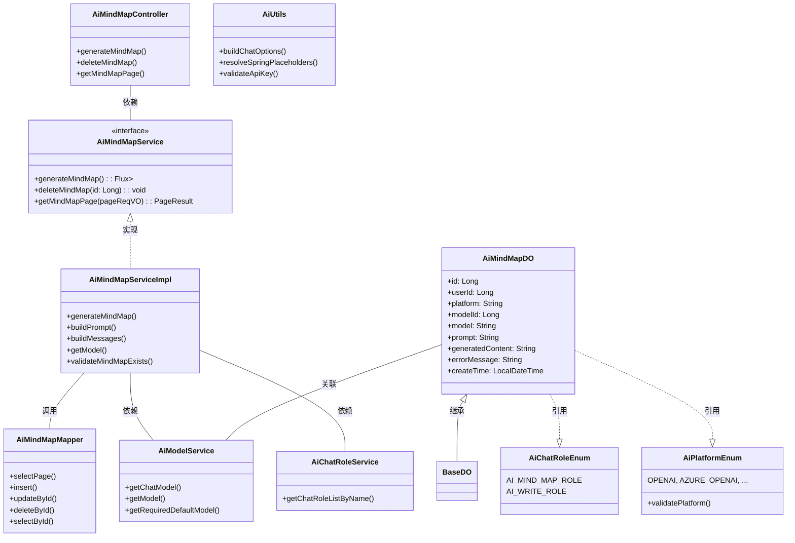
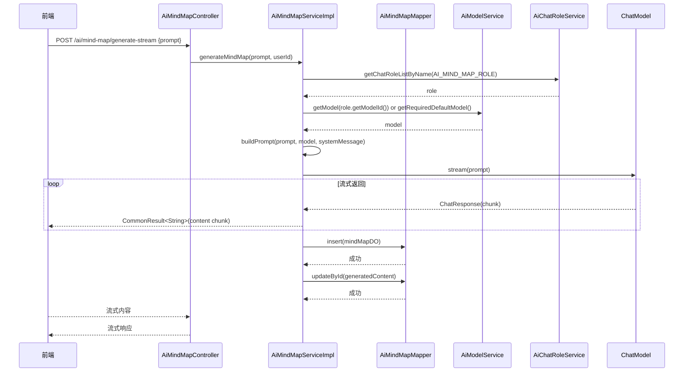
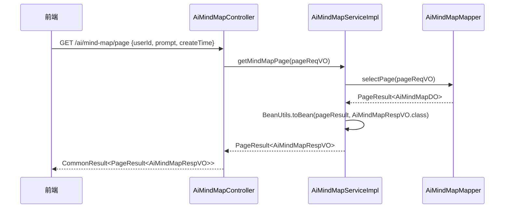

# AI 思维导图模块 (mindmap) 文档

## 1. 模块概述

AI 思维导图模块是 Yudao 框架 AI 功能的重要组成部分，提供基于大语言模型的思维导图自动生成服务。该模块支持用户输入文本提示，通过配置的 AI 模型生成结构化的 Markdown 格式思维导图内容，并支持对生成的思维导图进行管理（分页查询、删除等操作）。

**核心功能：**
- 流式生成思维导图内容
- 思维导图管理（分页查询、删除）
- 支持多平台 AI 模型调用
- 与 AI 角色系统、模型系统集成

---

## 2. 架构设计

### 2.1 整体架构图



### 2.2 组件关系图



---

## 3. 核心组件说明

### 3.1 控制器层 (AiMindMapController)

**文件路径:** `yudao-module-ai/src/main/java/cn/iocoder/yudao/module/ai/controller/admin/mindmap/AiMindMapController.java`

负责接收前端请求，调用 Service 层处理业务逻辑，返回响应结果。

| API 方法 | 请求路径 | 请求方式 | 描述 |
|---------|---------|---------|------|
| generateMindMap | `/ai/mind-map/generate-stream` | POST | 流式生成思维导图 |
| deleteMindMap | `/ai/mind-map/delete` | DELETE | 删除思维导图 |
| getMindMapPage | `/ai/mind-map/page` | GET | 获取思维导图分页列表 |

**权限控制：**
- 删除操作：`@PreAuthorize("@ss.hasPermission('ai:mind-map:delete')")`
- 分页查询：`@PreAuthorize("@ss.hasPermission('ai:mind-map:query')")`

### 3.2 服务接口层 (AiMindMapService)

**文件路径:** `yudao-module-ai/src/main/java/cn/iocoder/yudao/module/ai/service/mindmap/AiMindMapService.java`

定义思维导图服务的业务接口，包含三个核心方法：

```java
public interface AiMindMapService {
    // 生成思维导图（流式返回）
    Flux<CommonResult<String>> generateMindMap(AiMindMapGenerateReqVO generateReqVO, Long userId);
    
    // 删除思维导图
    void deleteMindMap(Long id);
    
    // 获取分页列表
    PageResult<AiMindMapDO> getMindMapPage(AiMindMapPageReqVO pageReqVO);
}
```

### 3.3 服务实现层 (AiMindMapServiceImpl)

**文件路径:** `yudao-module-ai/src/main/java/cn/iocoder/yudao/module/ai/service/mindmap/AiMindMapServiceImpl.java`

核心业务逻辑实现类，主要功能包括：

1. **思维导图生成流程：**
   - 获取思维导图助手角色配置（`AI_MIND_MAP_ROLE`）
   - 根据角色获取对应的 AI 模型
   - 构建 Prompt（系统消息 + 用户提示词）
   - 调用 ChatModel 流式生成内容
   - 保存生成的思维导图记录到数据库
   
2. **关键方法：**
   - `generateMindMap()`: 主入口，处理生成逻辑和流式返回
   - `buildPrompt()`: 构建 Prompt 对象
   - `buildMessages()`: 构建消息列表（SystemMessage + UserMessage）
   - `getModel()`: 获取 AI 模型
   - `validateMindMapExists()`: 验证思维导图是否存在

3. **异常处理：**
   - 使用 `TenantUtils.executeIgnore()` 忽略租户上下文进行异步更新
   - 错误时记录错误信息到数据库

### 3.4 数据访问层 (AiMindMapMapper)

**文件路径:** `yudao-module-ai/src/main/java/cn/iocoder/yudao/module/ai/dal/mysql/mindmap/AiMindMapMapper.java`

继承自 `BaseMapperX<AiMindMapDO>`，提供基本的 CRUD 操作，并扩展了分页查询方法：

```java
default PageResult<AiMindMapDO> selectPage(AiMindMapPageReqVO reqVO) {
    return selectPage(reqVO, new LambdaQueryWrapperX<AiMindMapDO>()
            .eqIfPresent(AiMindMapDO::getUserId, reqVO.getUserId())
            .eqIfPresent(AiMindMapDO::getPrompt, reqVO.getPrompt())
            .betweenIfPresent(AiMindMapDO::getCreateTime, reqVO.getCreateTime())
            .orderByDesc(AiMindMapDO::getId));
}
```

### 3.5 数据对象 (AiMindMapDO)

**文件路径:** `yudao-module-ai/src/main/java/cn/iocoder/yudao/module/ai/dal/dataobject/mindmap/AiMindMapDO.java`

对应数据库表 `ai_mind_map`，存储思维导图的元数据和生成内容：

| 字段名 | 类型 | 描述 |
|-------|------|------|
| id | Long | 主键 |
| userId | Long | 用户编号 |
| platform | String | AI 平台（如 OpenAI、AzureOpenAI 等） |
| modelId | Long | 模型 ID |
| model | String | 模型名称 |
| prompt | String | 生成内容提示 |
| generatedContent | String | 生成的思维导图内容（Markdown 格式） |
| errorMessage | String | 错误信息 |
| createTime | LocalDateTime | 创建时间 |

### 3.6 请求/响应 VO 类

#### 3.6.1 生成请求 (AiMindMapGenerateReqVO)

**文件路径:** `yudao-module-ai/src/main/java/cn/iocoder/yudao/module/ai/controller/admin/mindmap/vo/AiMindMapGenerateReqVO.java`

```java
@Data
@Schema(description = "管理后台 - AI 思维导图生成 Request VO")
public class AiMindMapGenerateReqVO {
    @Schema(description = "思维导图内容提示", example = "Java 学习路线")
    @NotBlank(message = "思维导图内容提示不能为空")
    private String prompt;
}
```

#### 3.6.2 分页请求 (AiMindMapPageReqVO)

**文件路径:** `yudao-module-ai/src/main/java/cn/iocoder/yudao/module/ai/controller/admin/mindmap/vo/AiMindMapPageReqVO.java`

```java
@Data
@Schema(description = "管理后台 - AI 思维导图分页 Request VO")
public class AiMindMapPageReqVO extends PageParam {
    private Long userId;
    private String prompt;
    private LocalDateTime[] createTime;
}
```

#### 3.6.3 响应 (AiMindMapRespVO)

**文件路径:** `yudao-module-ai/src/main/java/cn/iocoder/yudao/module/ai/controller/admin/mindmap/vo/AiMindMapRespVO.java`

包含所有 AiMindMapDO 的字段，用于前端展示。

### 3.7 枚举类

#### 3.7.1 聊天角色枚举 (AiChatRoleEnum)

**文件路径:** `yudao-module-ai/src/main/java/cn/iocoder/yudao/module/ai/enums/AiChatRoleEnum.java`

定义了 AI 聊天角色的预设，其中 `AI_MIND_MAP_ROLE` 专门用于思维导图生成：

```java
AI_MIND_MAP_ROLE("导图助手", """
    你是一位非常优秀的思维导图助手，你会把用户的所有提问都总结成思维导图，然后以 Markdown 格式输出。markdown 只需要输出一级标题，二级标题，三级标题，四级标题，最多输出四级，除此之外不要输出任何其他 markdown 标记。下面是一个合格的例子：
    # Geek-AI 助手
    ## 完整的开源系统
    ### 前端开源
    ### 后端开源
    ## 支持各种大模型
    ### OpenAI
    ### Azure
    ### 文心一言
    ### 通义千问
    ## 集成多种收费方式
    ### 支付宝
    ### 微信
    除此之外不要任何解释性语句。
""");
```

#### 3.7.2 平台枚举 (AiPlatformEnum)

**文件路径:** `yudao-module-ai/src/main/java/cn/iocoder/yudao/module/ai/enums/model/AiPlatformEnum.java`

支持多种 AI 平台，包括国内平台（通义千问、文心一言、DeepSeek 等）和国际平台（OpenAI、Anthropic、Gemini 等）。

---

## 4. 数据流程图

### 4.1 思维导图生成流程



### 4.2 分页查询流程



---

## 5. API 说明

### 5.1 生成思维导图

**请求:** `POST /ai/mind-map/generate-stream`

**请求体:**
```json
{
  "prompt": "Java 学习路线"
}
```

**响应:** 流式返回 `text/event-stream` 格式，每个事件为 `data: {"code":200,"message":"success","data":"markdown content"}`

**示例响应:**
```
data: {"code":200,"message":"success","data":"# Java 学习路线\n\n## 基础知识\n### Java 语法\n### 面向对象编程"}
data: {"code":200,"message":"success","data":"\n## 核心技术\n### JVM\n### 并发编程"}
...
```

### 5.2 删除思维导图

**请求:** `DELETE /ai/mind-map/delete?id={id}`

**响应:**
```json
{
  "code": 200,
  "message": "success",
  "data": true
}
```

### 5.3 获取思维导图分页

**请求:** `GET /ai/mind-map/page?userId=1&prompt=Java&page=1&size=10`

**响应:**
```json
{
  "code": 200,
  "message": "success",
  "data": {
    "list": [
      {
        "id": 1,
        "userId": 1,
        "prompt": "Java 学习路线",
        "generatedContent": "# Java 学习路线...",
        "platform": "OpenAI",
        "model": "gpt-3.5-turbo",
        "errorMessage": null,
        "createTime": "2024-01-01T10:00:00"
      }
    ],
    "total": 1,
    "page": 1,
    "size": 10
  }
}
```

---

## 6. 前端对接说明

**API 文件:** `yudao-ui/yudao-ui-admin-vue3/src/api/ai/mindmap/index.ts`

**TypeScript 接口:**

```typescript
export interface MindMapVO {
  id: number          // 编号
  userId: number      // 用户编号
  prompt: string      // 生成内容提示
  generatedContent: string // 生成的思维导图内容
  platform: string    // 平台
  model: string       // 模型
  errorMessage: string // 错误信息
}

export interface AiMindMapGenerateReqVO {
  prompt: string
}
```

**功能模块:**
- 思维导图生成页面（流式显示）
- 思维导图列表页面（分页表格）
- 删除确认对话框

---

## 7. 依赖模块

| 模块 | 依赖说明 |
|------|---------|
| yudao-module-ai (model) | 依赖 `AiModelService` 获取 AI 模型配置 |
| yudao-module-ai (chat) | 依赖 `AiChatRoleService` 获取聊天角色配置 |
| yudao-framework-common | 提供 `CommonResult`、`PageResult`、`BeanUtils` 等通用工具 |
| yudao-framework-tenant | 租户上下文支持（`TenantUtils`） |
| spring-ai | 提供 `ChatModel`、`Prompt`、`ChatResponse` 等 AI 能力 |
| mybatis-plus | 数据持久层支持 |

---

## 8. 错误码说明

| 错误码 | 描述 | 触发场景 |
|-------|------|---------|
| 1_040_008_000 | 思维导图不存在！ | 删除不存在的思维导图 |
| 1_040_001_000 | 模型不存在！ | 找不到指定模型 |
| 1_040_001_003 | 操作失败，该模型的模型类型不正确 | 模型类型不是 CHAT |
| 1_040_07_001 | 写作生成异常！ | 思维导图生成过程中发生错误 |

---

## 9. 扩展建议

1. **支持更多导出格式**：除了 Markdown，可考虑支持 PNG/SVG 图片导出
2. **思维导图编辑功能**：允许用户对生成的思维导图进行在线编辑
3. **模板库**：预置常用思维导图模板供用户选择
4. **协作功能**：支持多人协作编辑思维导图
5. **历史版本管理**：保留思维导图的历史版本，支持回溯

---

## 10. 相关文件清单

| 文件路径 | 说明 |
|---------|------|
| `src/main/java/cn/iocoder/yudao/module/ai/controller/admin/mindmap/AiMindMapController.java` | 控制器 |
| `src/main/java/cn/iocoder/yudao/module/ai/service/mindmap/AiMindMapService.java` | 服务接口 |
| `src/main/java/cn/iocoder/yudao/module/ai/service/mindmap/AiMindMapServiceImpl.java` | 服务实现 |
| `src/main/java/cn/iocoder/yudao/module/ai/dal/dataobject/mindmap/AiMindMapDO.java` | 数据对象 |
| `src/main/java/cn/iocoder/yudao/module/ai/dal/mysql/mindmap/AiMindMapMapper.java` | Mapper 接口 |
| `src/main/java/cn/iocoder/yudao/module/ai/controller/admin/mindmap/vo/*.java` | VO 类 |
| `src/main/java/cn/iocoder/yudao/module/ai/enums/AiChatRoleEnum.java` | 聊天角色枚举 |
| `src/api/ai/mindmap/index.ts` (前端) | TypeScript API 定义 |
