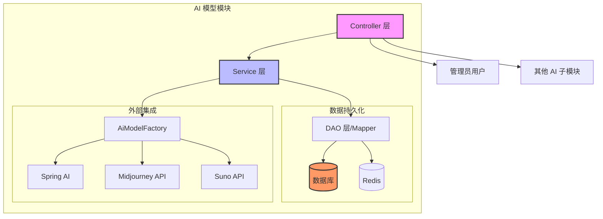
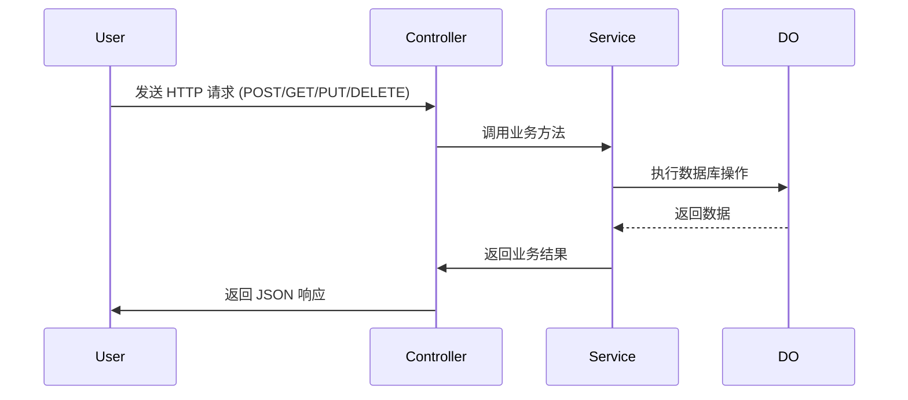
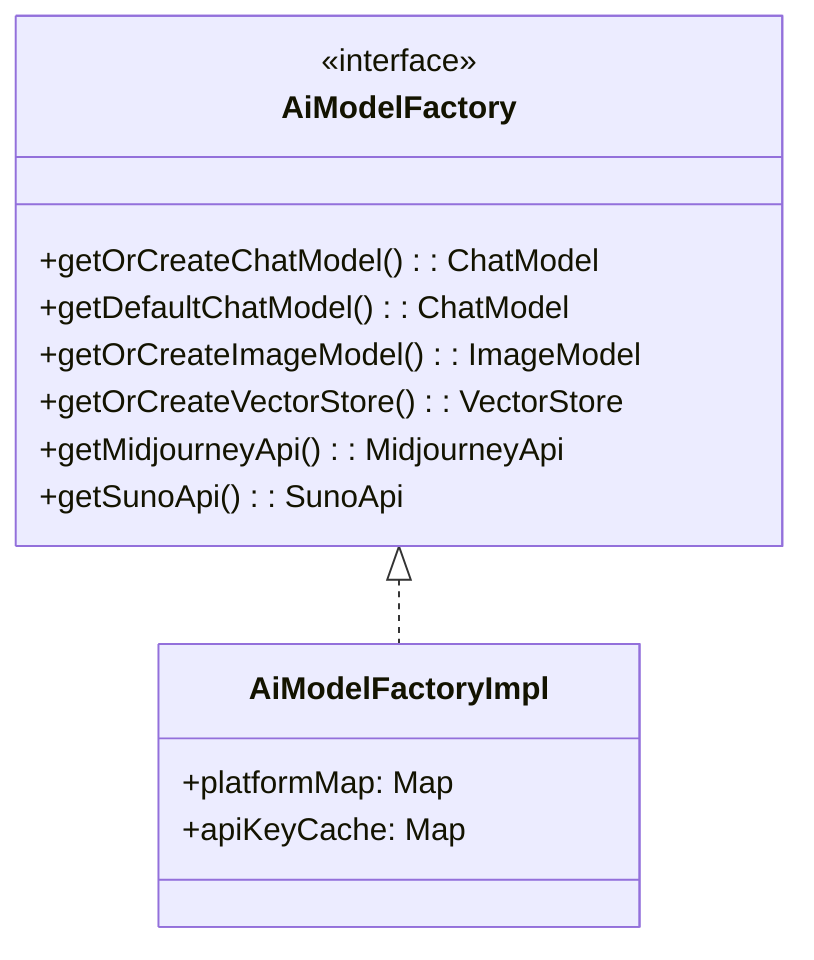
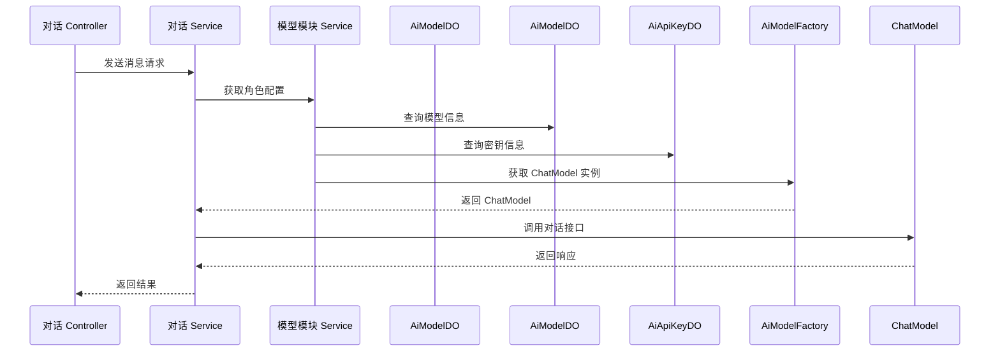

# AI 模型模块 (Model Module) 文档

## 1. 模块概述

AI 模型模块是 Yudao 平台 AI 功能的核心基础模块，负责管理 AI 服务的基础配置资源。该模块提供了对 **API 密钥、AI 模型、聊天角色和工具** 的统一管理能力，为整个 AI 子系统提供底层支撑。

### 核心功能

- **API 密钥管理**：集中存储和管理不同 AI 平台的 API 密钥，支持多平台（OpenAI、通义千问、文心一言等）
- **AI 模型管理**：配置具体的 AI 模型实例，关联对应的 API 密钥，设置模型参数（温度、最大 Token 数等）
- **聊天角色管理**：创建和管理预设的对话角色，每个角色可绑定特定模型、知识库和工具
- **工具管理**：注册和管理 AI 可用的外部工具（如天气查询、文件浏览等）

### 模块定位

```
┌─────────────────────────────────────────────────────┐
│              AI 应用层                              │
│  (对话、绘图、音乐、写作、工作流等)                 │
└──────────────────┬──────────────────────────────────┘
                   │ 依赖
┌─────────────────────────────────────────────────────┐
│            AI 模型模块 (本模块)                     │
│  管理 API 密钥、模型、角色、工具等基础配置          │
└──────────────────┬──────────────────────────────────┘
                   │ 被调用
┌─────────────────────────────────────────────────────┐
│           Spring AI / 第三方 AI 服务               │
└─────────────────────────────────────────────────────┘
```

## 2. 架构设计

### 2.1 整体架构图



### 2.2 分层架构

| 层级 | 职责 | 主要组件 |
|------|------|----------|
| **Controller 层** | HTTP 请求处理、参数校验、权限控制 | `Ai*Controller` 系列 |
| **Service 层** | 业务逻辑处理、数据校验、事务管理 | `Ai*ServiceImpl` 系列 |
| **DAO 层** | 数据库操作 | `Ai*Mapper` |
| **VO 层** | 数据传输对象（请求/响应） | `Ai*ReqVO`, `Ai*RespVO` |
| **DO 层** | 数据对象（数据库表映射） | `Ai*DO` |
| **工厂层** | AI 模型实例化管理 | `AiModelFactory` |

## 3. 核心组件详解

### 3.1 实体类（DO）

#### 3.1.1 AiApiKeyDO - API 密钥

```java
@TableName("ai_api_key")
@Data
public class AiApiKeyDO extends BaseDO {
    private Long id;              // 主键
    private String name;          // 密钥名称（如：OpenAI 密钥）
    private String apiKey;       // 实际密钥内容
    private String platform;     // 平台类型（枚举 AiPlatformEnum）
    private String url;          // 自定义 API 地址
    private Integer status;      // 状态（启用/禁用）
}
```

**说明**：存储 AI 服务的认证信息，支持多平台密钥管理。密钥内容在数据库中加密存储。

#### 3.1.2 AiModelDO - AI 模型

```java
@TableName("ai_model")
@Data
public class AiModelDO extends BaseDO {
    private Long id;              // 主键
    private Long keyId;           // 关联 AiApiKeyDO.id
    private String name;          // 模型显示名称
    private String model;         // 模型标识（如：gpt-4-turbo）
    private String platform;     // 平台类型
    private Integer type;         // 模型类型（枚举 AiModelTypeEnum）
    private Integer sort;         // 排序值
    private Integer status;      // 状态
    
    // 对话配置参数
    private Double temperature;   // 温度参数（0-2，控制随机性）
    private Integer maxTokens;    // 单条回复最大 Token 数
    private Integer maxContexts;  // 上下文最大 Message 数
}
```

**说明**：定义具体的 AI 模型实例，关联 API 密钥并配置模型参数。支持多种模型类型（对话、图片、语音等）。

#### 3.1.3 AiChatRoleDO - 聊天角色

```java
@TableName("ai_chat_role")
@Data
public class AiChatRoleDO extends BaseDO {
    private Long id;              // 主键
    private String name;          // 角色名称
    private String avatar;        // 角色头像 URL
    private String category;      // 角色分类（如：创作、客服）
    private String description;   // 角色描述
    private String systemMessage; // 角色设定（System Prompt）
    private Long userId;          // 用户编号（个人角色专用）
    private Long modelId;         // 关联 AiModelDO.id
    
    // 关联关系（使用 TypeHandler 存储列表）
    @TableField(typeHandler = LongListTypeHandler.class)
    private List<Long> knowledgeIds;  // 知识库 ID 列表
    @TableField(typeHandler = LongListTypeHandler.class)
    private List<Long> toolIds;       // 工具 ID 列表
    @TableField(typeHandler = StringListTypeHandler.class)
    private List<String> mcpClientNames; // MCP Client 名称列表
    
    private Boolean publicStatus;   // 是否公开（true=管理员创建，false=个人私有）
    private Integer sort;           // 排序值
    private Integer status;         // 状态
}
```

**说明**：预定义的对话角色配置，包含 System Prompt、关联模型、知识库和工具。支持公开角色（管理员创建）和私有角色（用户自定义）。

#### 3.1.4 AiToolDO - AI 工具

```java
@TableName("ai_tool")
@Data
public class AiToolDO extends BaseDO {
    private Long id;              // 主键
    private String name;          // 工具名称（对应 Spring Tool Bean 名）
    private String description;   // 工具描述
    private Integer status;      // 状态
}
```

**说明**：注册 AI 可调用的外部工具，工具名称需与 Spring Bean 名称一致（如 `weather_query`、`directory_list`）。

### 3.2 视图对象（VO）

#### 3.2.1 请求 VO（ReqVO）

所有请求 VO 均继承自 `PageParam`（分页基础），包含分页查询参数：

| VO 类 | 用途 | 关键字段 |
|-------|------|----------|
| `AiApiKeySaveReqVO` | 密钥新增/修改 | name, apiKey, platform, url, status |
| `AiApiKeyPageReqVO` | 密钥分页查询 | name, platform, status |
| `AiModelSaveReqVO` | 模型新增/修改 | keyId, name, model, platform, type, sort, temperature, maxTokens, maxContexts |
| `AiModelPageReqVO` | 模型分页查询 | name, model, platform |
| `AiChatRoleSaveReqVO` | 角色新增/修改 | modelId, name, avatar, category, systemMessage, knowledgeIds, toolIds, mcpClientNames |
| `AiChatRolePageReqVO` | 角色分页查询 | name, category, publicStatus |
| `AiToolSaveReqVO` | 工具新增/修改 | name, description, status |
| `AiToolPageReqVO` | 工具分页查询 | name, description, status, createTime |

#### 3.2.2 响应 VO（RespVO）

响应 VO 包含查询结果，部分字段通过 `@Trans` 注解实现自动关联查询：

```java
// 示例：AiChatRoleRespVO 中的关联查询
@Trans(type = TransType.SIMPLE, target = AiModelDO.class, fields = { "name", "model" }, 
       refs = { @Ref("modelName"), @Ref("model") })
private Long modelId;

private String modelName;  // 自动填充
private String model;      // 自动填充
```

### 3.3 Controller 层

四个 Controller 遵循统一的设计模式：



**权限控制**：所有写操作均通过 `@PreAuthorize("@ss.hasPermission('...')")` 进行权限校验，遵循 RBAC 模型。

### 3.4 Service 层

Service 层包含核心业务逻辑：

- **数据校验**：检查关联记录是否存在（如密钥、模型、知识库、工具）
- **状态验证**：确保记录处于启用状态
- **业务规则**：如私有角色的用户归属校验、公开角色的权限控制
- **异常处理**：抛出自定义异常（如 `API_KEY_NOT_EXISTS`, `MODEL_DISABLE`）

### 3.5 AiModelFactory - AI 模型工厂



**作用**：缓存和管理 AI 模型实例，避免重复创建，提高性能。支持多种 AI 平台（OpenAI、通义千问、Midjourney 等）。

## 4. 数据关系图

```mermaid
erDiagram
    AiApiKeyDO ||--o{ AiModelDO : "一对多"
    AiModelDO ||--o{ AiChatRoleDO : "一对多"
    AiChatRoleDO ||--o{ AiKnowledgeDO : "多对多" (通过 knowledgeIds)
    AiChatRoleDO ||--o{ AiToolDO : "多对多" (通过 toolIds)
    AiToolDO ||--o{ AiChatRoleDO : "一对多"
    
    AiApiKeyDO {
        Long id PK
        String name
        String apiKey
        String platform
        String url
        Integer status
    }
    
    AiModelDO {
        Long id PK
        Long keyId FK
        String name
        String model
        String platform
        Integer type
        Integer sort
        Integer status
        Double temperature
        Integer maxTokens
        Integer maxContexts
    }
    
    AiChatRoleDO {
        Long id PK
        String name
        String avatar
        String category
        String description
        String systemMessage
        Long userId
        Long modelId FK
        List<Long> knowledgeIds
        List<Long> toolIds
        List<String> mcpClientNames
        Boolean publicStatus
        Integer sort
        Integer status
    }
    
    AiToolDO {
        Long id PK
        String name
        String description
        Integer status
    }
```

## 5. API 接口说明

### 5.1 API 密钥管理 (`/ai/api-key`)

| 方法 | 路径 | 描述 | 权限 |
|------|------|------|------|
| POST | `/create` | 创建 API 密钥 | `ai:api-key:create` |
| PUT | `/update` | 更新 API 密钥 | `ai:api-key:update` |
| DELETE | `/delete` | 删除 API 密钥 | `ai:api-key:delete` |
| GET | `/get` | 获取 API 密钥详情 | `ai:api-key:query` |
| GET | `/page` | 分页查询 API 密钥 | `ai:api-key:query` |
| GET | `/simple-list` | 获取简单密钥列表（仅用于选择） | - |

### 5.2 聊天角色管理 (`/ai/chat-role`)

| 方法 | 路径 | 描述 | 权限 |
|------|------|------|------|
| GET | `/my-page` | 我的角色分页 | - |
| GET | `/get-my` | 获取我的角色详情 | - |
| POST | `/create-my` | 创建我的角色 | - |
| PUT | `/update-my` | 更新我的角色 | - |
| DELETE | `/delete-my` | 删除我的角色 | - |
| GET | `/category-list` | 获取角色分类列表 | - |
| POST | `/create` | 创建公共角色 | `ai:chat-role:create` |
| PUT | `/update` | 更新公共角色 | `ai:chat-role:update` |
| DELETE | `/delete` | 删除公共角色 | `ai:chat-role:delete` |
| GET | `/get` | 获取公共角色详情 | `ai:chat-role:query` |
| GET | `/page` | 分页查询公共角色 | `ai:chat-role:query` |

### 5.3 AI 模型管理 (`/ai/model`)

| 方法 | 路径 | 描述 | 权限 |
|------|------|------|------|
| POST | `/create` | 创建模型 | `ai:model:create` |
| PUT | `/update` | 更新模型 | `ai:model:update` |
| DELETE | `/delete` | 删除模型 | `ai:model:delete` |
| GET | `/get` | 获取模型详情 | `ai:model:query` |
| GET | `/page` | 分页查询模型 | `ai:model:query` |
| GET | `/simple-list` | 获取模型简单列表（按类型筛选） | - |

### 5.4 AI 工具管理 (`/ai/tool`)

| 方法 | 路径 | 描述 | 权限 |
|------|------|------|------|
| POST | `/create` | 创建工具 | `ai:tool:create` |
| PUT | `/update` | 更新工具 | `ai:tool:update` |
| DELETE | `/delete` | 删除工具 | `ai:tool:delete` |
| GET | `/get` | 获取工具详情 | `ai:tool:query` |
| GET | `/page` | 分页查询工具 | `ai:tool:query` |
| GET | `/simple-list` | 获取工具简单列表 | - |

## 6. 配置说明

### 6.1 全局配置 (`application.yaml`)

```yaml
yudao:
  ai:
    # 各平台的全局默认配置（作为 fallback）
    doubao:
      enable: false
      apiKey: ""
      model: ""
      temperature: 1.0
      maxTokens: 4096
      topP: 0.9
    
    openai:
      enable: false
      apiKey: ""
      baseUrl: ""
      model: ""
      temperature: 1.0
      maxTokens: 4096
      topP: 0.9
    
    midjourney:
      enable: false
      baseUrl: ""
      apiKey: ""
      notifyUrl: ""
    
    suno:
      enable: false
      baseUrl: ""
    
    webSearch:
      enable: false
      apiKey: ""
```

**注意**：生产环境中建议通过数据库动态配置 API 密钥，避免硬编码在配置文件中。

### 6.2 平台枚举支持

系统支持以下 AI 平台（`AiPlatformEnum`）：

| 平台 | 平台标识 | 说明 |
|------|----------|------|
| TongYi | TONG_YI | 阿里通义千问 |
| YiYan | YI_YAN | 百度文心一言 |
| DeepSeek | DEEP_SEEK | DeepSeek |
| ZhiPu | ZHI_PU | 智谱 AI |
| XingHuo | XING_HUO | 讯飞星火 |
| DouBao | DOU_BAO | 字节豆包 |
| HunYuan | HUN_YUAN | 腾讯混元 |
| SiliconFlow | SILICON_FLOW | 硅基流动 |
| MiniMax | MINI_MAX | MiniMax |
| Moonshot | MOONSHOT | KIMI |
| BaiChuan | BAI_CHUAN | 百川智能 |
| StepFun | STEP_FUN | 阶跃星辰 |
| OpenAI | OPENAI | OpenAI 官方 |
| AzureOpenAI | AZURE_OPENAI | Azure OpenAI |
| Anthropic | ANTHROPIC | Claude |
| Gemini | GEMINI | Google Gemini |
| Ollama | OLLAMA | 本地 Ollama |
| StableDiffusion | STABLE_DIFFUSION | 图像生成 |
| Midjourney | MIDJOURNEY | 图像生成 |
| SUNO | SUNO | 音乐生成 |
| GROK | GROK | xAI Grok |

## 7. 与其他模块的交互

### 7.1 与对话模块（Chat）的交互



### 7.2 与知识模块（Knowledge）的交互

聊天角色可关联多个知识库（`knowledgeIds`），在对话时用于 RAG（检索增强生成）。

### 7.3 与工具模块（Tool）的交互

聊天角色可绑定多个工具，当用户问题涉及工具能力时，系统会自动触发工具调用。

### 7.4 与其他 AI 子模块的关系

```
┌─────────────┐    ┌─────────────┐    ┌─────────────┐
│   对话模块   │    │   绘图模块   │    │   音乐模块   │
│   (Chat)     │    │   (Image)   │    │   (Music)   │
└──────┬──────┘    └──────┬──────┘    └──────┬──────┘
       │                  │                  │
       └────────┬─────────┼─────────────────┘
                │
        ┌───────▼───────┐
        │   模型模块    │
        │   (Model)     │
        │ 统一管理      │
        │ 密钥/模型/    │
        │ 角色/工具     │
        └───────────────┘
```

## 8. 安全设计

1. **密钥加密**：API 密钥在存储时应加密（实际实现中需配合加密组件）
2. **权限隔离**：私有角色仅限创建者访问，公开角色对所有用户可见
3. **RBAC 权限控制**：每个操作都有对应的权限标识（如 `ai:model:create`）
4. **输入验证**：所有请求参数均使用 `@Valid` 进行校验
5. **防注入**：System Prompt 等文本字段需注意 XSS 防护

## 9. 扩展点

### 9.1 添加新 AI 平台

1. 在 `AiPlatformEnum` 中添加新的平台枚举值
2. 实现 `AiModelFactory` 中的对应方法（如 `getOrCreateChatModel`）
3. 创建针对该平台的 `ChatModel` 实现类（参考 `XingHuoChatModel`、`ZhiPuChatModel`）
4. 在 `YudaoAiProperties` 中添加该平台的默认配置

### 9.2 添加新工具

1. 创建 Spring Bean 实现 `ToolCallback` 接口
2. 在 `AiToolController` 中注册工具（或通过配置自动发现）
3. 在聊天角色中引用该工具（`toolIds`）

### 9.3 添加新的模型类型

1. 在 `AiModelTypeEnum` 中添加新的类型
2. 在 `AiModelDO` 中增加对应的配置字段
3. 在 `AiModelService` 中处理新类型的特殊逻辑

## 10. 常见问题

### Q1: 如何切换不同的 API 密钥？
A: 在模型配置中选择不同的 `keyId`，即可切换使用的密钥。支持同一模型使用不同密钥的场景（如多账号配额管理）。

### Q2: 私有角色和公开角色的区别是什么？
A: 
- **公开角色**：由管理员创建，`publicStatus=true`，所有用户可见和使用
- **私有角色**：由用户自己创建，`publicStatus=false`，仅创建者本人可见

### Q3: 如何为不同模型设置不同的温度参数？
A: 在每个 `AiModelDO` 实例中单独配置 `temperature` 字段，实现细粒度的参数控制。

### Q4: 工具调用的流程是怎样的？
A: 当聊天角色绑定了工具，且用户问题触发了工具调用条件时，系统会：
1. 解析用户意图，确定需要调用的工具
2. 根据工具名称查找对应的 Spring Bean
3. 执行工具调用，获取结果
4. 将结果整合到回复中返回给用户

## 11. 参考文档

- [yudao-framework 通用工具模块](framework_utils.md)
- [AI 对话模块](chat.md)
- [AI 知识模块](knowledge.md)
- [Spring AI 官方文档](https://spring.io/projects/spring-ai)
