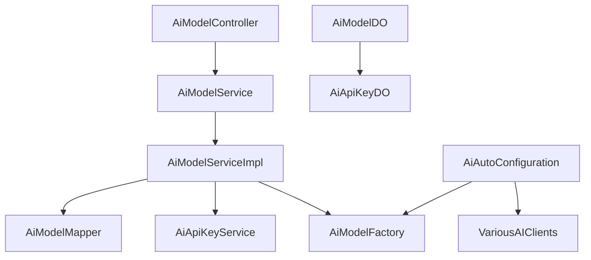
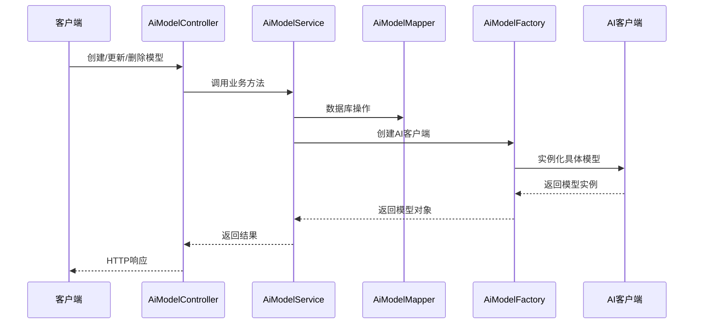

# 模块 2：AI 模型管理模块

## 概述

AI 模型管理模块（`model_2`）是系统中负责管理和配置各种 AI 模型的核心模块。该模块允许用户通过统一的接口管理不同平台的 AI 模型，包括对话、图像生成、向量计算等多种类型的模型。

模块的主要功能包括：
- **模型管理**：支持创建、更新、删除和查询 AI 模型
- **模型配置**：管理模型的参数配置，如温度、最大 Token 数、上下文长度等
- **平台支持**：支持多种 AI 平台，包括国内外主流平台
- **集成支持**：与 Spring AI 框架集成，提供统一的模型访问接口

## 架构设计

### 核心组件

#### 1. 数据访问层
- **`AiModelDO`**: 模型数据对象，映射数据库表 `ai_model`
- **`AiModelMapper`**: MyBatis Mapper，提供数据库操作方法
- **`AiApiKeyDO`**: API 密钥数据对象，映射数据库表 `ai_api_key`

#### 2. 业务逻辑层
- **`AiModelService`**: 模型服务接口，定义模型管理的核心业务逻辑
- **`AiModelServiceImpl`**: 模型服务实现类，实现具体的业务逻辑
- **`AiModelFactory`**: 模型工厂，负责创建不同平台的模型实例

#### 3. 控制器层
- **`AiModelController`**: 模型控制器，提供 RESTful API 接口

#### 4. 配置层
- **`AiAutoConfiguration`**: Spring 自动配置类，负责创建各种 AI 模型的 Bean
- **`YudaoAiProperties`**: AI 模块的配置属性类

### 依赖关系



### 数据流



## 核心功能

### 1. 模型管理

#### 模型类型

模块支持以下模型类型（定义在 `AiModelTypeEnum`）：

| 类型值 | 类型名称 | 描述 |
|--------|----------|------|
| 1 | 对话 | 支持文本对话的模型 |
| 2 | 图片 | 支持图像生成的模型 |
| 3 | 语音 | 支持语音处理的模型 |
| 4 | 视频 | 支持视频处理的模型 |
| 5 | 向量 | 支持向量计算的模型 |
| 6 | 重排序 | 支持结果重排序的模型 |

#### 平台支持

模块支持以下 AI 平台（定义在 `AiPlatformEnum`）：

**国内平台：**
- 通义千问 (TongYi)
- 文心一言 (YiYan)
- DeepSeek
- 智谱 (ZhiPu)
- 星火 (XingHuo)
- 豆包 (DouBao)
- 混元 (HunYuan)
- 硅基流动 (SiliconFlow)
- MiniMax
- 月之暗面 (Moonshot)
- 百川智能 (BaiChuan)
- 阶跃星辰 (StepFun)

**国外平台：**
- OpenAI
- AzureOpenAI
- Anthropic
- Gemini
- Ollama
- StableDiffusion
- Midjourney
- Suno
- Grok

### 2. API 接口

#### 创建模型

**接口：** `POST /ai/model/create`

**请求参数：**
```json
{
  "keyId": 22042,
  "name": "测试模型",
  "model": "gpt-3.5-turbo-0125",
  "platform": "OpenAI",
  "type": 1,
  "sort": 1,
  "status": 1,
  "temperature": 0.7,
  "maxTokens": 4096,
  "maxContexts": 8192
}
```

**响应：**
```json
{
  "code": 0,
  "data": 2630,
  "msg": "成功"
}
```

#### 更新模型

**接口：** `PUT /ai/model/update`

**请求参数：**
```json
{
  "id": 2630,
  "keyId": 22042,
  "name": "更新后的模型",
  "model": "gpt-3.5-turbo-0125",
  "platform": "OpenAI",
  "type": 1,
  "sort": 1,
  "status": 1,
  "temperature": 0.7,
  "maxTokens": 4096,
  "maxContexts": 8192
}
```

**响应：**
```json
{
  "code": 0,
  "data": true,
  "msg": "成功"
}
```

#### 删除模型

**接口：** `DELETE /ai/model/delete?id=2630`

**响应：**
```json
{
  "code": 0,
  "data": true,
  "msg": "成功"
}
```

#### 查询模型

**接口：** `GET /ai/model/get?id=2630`

**响应：**
```json
{
  "code": 0,
  "data": {
    "id": 2630,
    "keyId": 22042,
    "name": "测试模型",
    "model": "gpt-3.5-turbo-0125",
    "platform": "OpenAI",
    "type": 1,
    "sort": 1,
    "status": 1,
    "temperature": 0.7,
    "maxTokens": 4096,
    "maxContexts": 8192,
    "createTime": "2024-01-01T12:00:00"
  },
  "msg": "成功"
}
```

#### 分页查询模型

**接口：** `GET /ai/model/page`

**请求参数：**
```json
{
  "pageNo": 1,
  "pageSize": 10,
  "name": "测试",
  "model": "gpt-3.5",
  "platform": "OpenAI"
}
```

**响应：**
```json
{
  "code": 0,
  "data": {
    "list": [
      {
        "id": 2630,
        "keyId": 22042,
        "name": "测试模型",
        "model": "gpt-3.5-turbo-0125",
        "platform": "OpenAI",
        "type": 1,
        "sort": 1,
        "status": 1,
        "temperature": 0.7,
        "maxTokens": 4096,
        "maxContexts": 8192,
        "createTime": "2024-01-01T12:00:00"
      }
    ],
    "total": 1
  },
  "msg": "成功"
}
```

### 3. 模型配置

#### 模型参数

| 参数 | 类型 | 描述 | 示例值 |
|------|------|------|--------|
| temperature | Double | 温度参数，控制生成回复的随机性 | 0.7 |
| maxTokens | Integer | 单条回复的最大 Token 数量 | 4096 |
| maxContexts | Integer | 上下文的最大 Message 数量 | 8192 |

#### 配置示例

```yaml
# application.yml 配置示例
yudao:
  ai:
    tongyi:
      enable: true
      api-key: your-api-key
    openai:
      enable: true
      api-key: your-api-key
```

## 与其他模块的交互

### 1. API 密钥模块

AI 模型管理模块依赖 API 密钥模块来获取和验证 API 密钥。模型配置中引用的 `keyId` 关联到 API 密钥模块的 `ai_api_key` 表。

**关联关系：**
- `AiModelDO.keyId` → `AiApiKeyDO.id`

### 2. Spring AI 集成

模块通过 `AiModelFactory` 与 Spring AI 框架集成，提供统一的模型访问接口。

**主要集成点：**
- `ChatModel` 接口：用于对话模型
- `ImageModel` 接口：用于图像生成模型
- `MidjourneyApi`：用于 Midjourney 绘图
- `SunoApi`：用于 Suno 音乐生成
- `VectorStore`：用于向量存储

### 3. 向量存储集成

模块支持多种向量存储后端，包括：
- SimpleVectorStore
- QdrantVectorStore
- RedisVectorStore
- MilvusVectorStore

## 实现细节

### 1. 模型工厂

`AiModelFactory` 是模块的核心组件，负责根据平台和配置创建具体的模型实例。

```java
public interface AiModelFactory {
    ChatModel getOrCreateChatModel(AiPlatformEnum platform, String apiKey, String url);
    ImageModel getOrCreateImageModel(AiPlatformEnum platform, String apiKey, String url);
    MidjourneyApi getOrCreateMidjourneyApi(String apiKey, String url);
    SunoApi getOrCreateSunoApi(String apiKey, String url);
    VectorStore getOrCreateVectorStore(Class<? extends VectorStore> vectorStoreClass,
                                      EmbeddingModel embeddingModel,
                                      Map<String, Class<?>> metadataFields);
}
```

### 2. 自动配置

`AiAutoConfiguration` 类负责根据配置创建各种 AI 模型的 Bean。

```java
@Configuration
@EnableConfigurationProperties({ YudaoAiProperties.class, ... })
public class AiAutoConfiguration {
    @Bean
    public AiModelFactory aiModelFactory() {
        return new AiModelFactoryImpl();
    }

    @Bean
    @ConditionalOnProperty(value = "yudao.ai.tongyi.enable", havingValue = "true")
    public DashScopeChatModel dashScopeChatModel(...) { ... }

    // 其他平台的模型创建方法
}
```

### 3. 配置属性

`YudaoAiProperties` 类定义了模块的配置属性，支持通过配置文件灵活配置各种 AI 平台。

```java
@ConfigurationProperties(prefix = "yudao.ai")
@Data
public class YudaoAiProperties {
    private DouBao doubao;
    private HunYuan hunyuan;
    private SiliconFlow siliconflow;
    // ... 其他平台配置
}
```

## 最佳实践

### 1. 模型选择

根据使用场景选择合适的模型类型和模型平台：

- **对话场景**：选择 `CHAT` 类型的模型
- **图像生成**：选择 `IMAGE` 类型的模型
- **向量计算**：选择 `EMBEDDING` 类型的模型

### 2. 参数调优

根据具体需求调整模型参数：

- **温度参数**：较低的温度值会使输出更收敛于高频词汇，较高的则增加多样性
- **最大 Token 数**：根据回复长度需求设置
- **上下文长度**：根据对话历史长度需求设置

### 3. 安全管理

- 定期轮换 API 密钥
- 使用不同的密钥管理不同的模型
- 限制模型的使用频率和并发数

## 常见问题

### 1. 模型不可用

**问题**：创建模型后调用时提示模型不可用

**解决方案**：
1. 检查 API 密钥是否正确
2. 检查平台是否支持该模型
3. 检查网络连接是否正常
4. 检查模型状态是否为启用状态

### 2. 参数配置无效

**问题**：修改模型参数后不生效

**解决方案**：
1. 检查参数是否符合平台要求
2. 确认模型支持该参数配置
3. 检查是否重新创建了模型实例

### 3. 性能问题

**问题**：模型响应速度慢

**解决方案**：
1. 检查网络延迟
2. 优化参数配置
3. 考虑使用更高性能的模型
4. 检查是否有并发限制

## 未来扩展

### 1. 新平台支持

可以通过扩展 `AiPlatformEnum` 和 `AiAutoConfiguration` 来支持新的 AI 平台。

### 2. 模型监控

可以集成监控系统，实时监控模型的使用情况和性能指标。

### 3. 自动优化

可以实现模型参数的自动优化功能，根据使用反馈自动调整模型参数。

---

**相关模块：**
- [API 密钥管理模块](../api_key_management.md)
- [Spring AI 集成文档](https://docs.spring.io/spring-ai/reference/index.html)

**更新时间：** 2024-01-01
**版本：** 1.0.0