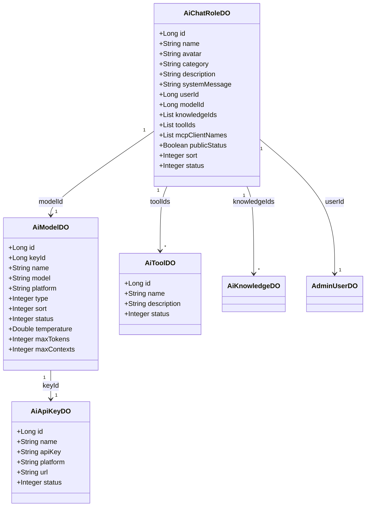
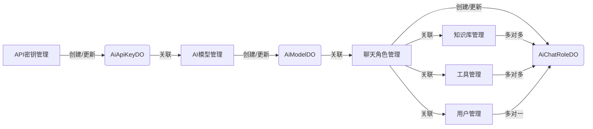

# 模型3模块文档

## 概述
模型3模块是Yudao AI模块中的数据访问层，定义了AI模型、聊天角色、工具和API密钥的数据对象（DO）。这些对象用于与数据库交互，存储AI相关的配置和实体信息。

## 核心功能
- 定义AI模型的配置信息（如模型名称、平台、类型、参数等）
- 定义聊天角色的信息（包括角色名称、头像、描述、设定、关联的模型、知识库、工具等）
- 定义AI工具的信息（工具名称、描述、状态）
- 定义API密钥的信息（名称、密钥、平台、URL、状态）

## 架构和组件关系

### 组件结构
模型3模块包含以下核心数据对象：
- `AiModelDO`: AI模型数据对象
- `AiChatRoleDO`: 聊天角色数据对象
- `AiToolDO`: AI工具数据对象
- `AiApiKeyDO`: API密钥数据对象

### 依赖关系
- `AiModelDO` 依赖于 `AiApiKeyDO`（通过 `keyId` 外键）
- `AiChatRoleDO` 依赖于：
  - `AiModelDO`（通过 `modelId` 外键）
  - `AiKnowledgeDO`（来自知识模块，通过 `knowledgeIds` 列表）
  - `AiToolDO`（通过 `toolIds` 列表）
  - 系统模块的 `AdminUserDO`（通过 `userId` 外键）
- `AiToolDO` 和 `AiApiKeyDO` 没有对本模块其他对象的直接依赖，但可能被其他模块引用。

### 数据流
在AI模块中，数据流通常如下：
1. API密钥（AiApiKeyDO）被创建和管理，用于认证AI平台。
2. AI模型（AiModelDO）被创建，关联到一个API密钥。
3. 聊天角色（AiChatRoleDO）被创建，关联到一个AI模型，并且可以关联多个知识库和工具。
4. AI工具（AiToolDO）被定义，可被聊天角色引用。

## 在整个系统中的作用
模型3模块为AI模块提供了持久化层，存储AI模型、角色、工具和API密钥的配置。它被AI模块的服务层（如AiModelServiceImpl, AiChatRoleServiceImpl等）和控制器层使用，以实现AI功能的配置和管理。

## Mermaid图表

### 组件关系图

### 数据流图

## 参考其他模块
- 知识库模块：[knowledge.md](knowledge.md) - 提供AiKnowledgeDO的定义
- 系统模块：[system.md](system.md) - 提供AdminUserDO的定义
- 工具模块：本模块内部定义了AiToolDO，但工具的实现逻辑在工具模块（如yudao-module-ai/src/main/java/cn/iocoder/yudao/module/ai/tool/function/）中。

## 结论
模型3模块是AI模块的基础数据层，通过定义清晰的数据对象和关联关系，支持AI模型的配置、角色的自定义、工具的集成和API密钥的管理，为AI功能的实现提供了必要的数据支持。