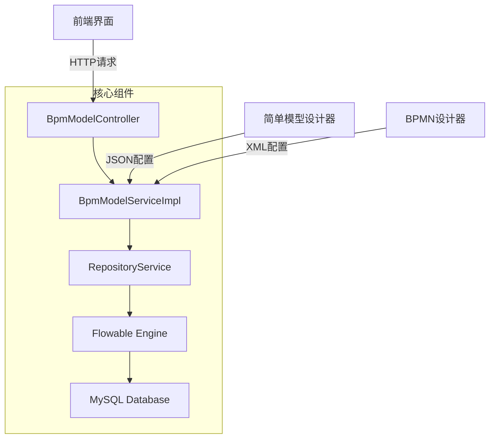
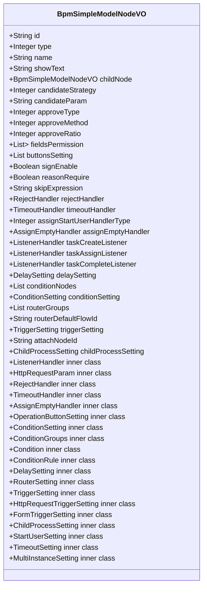
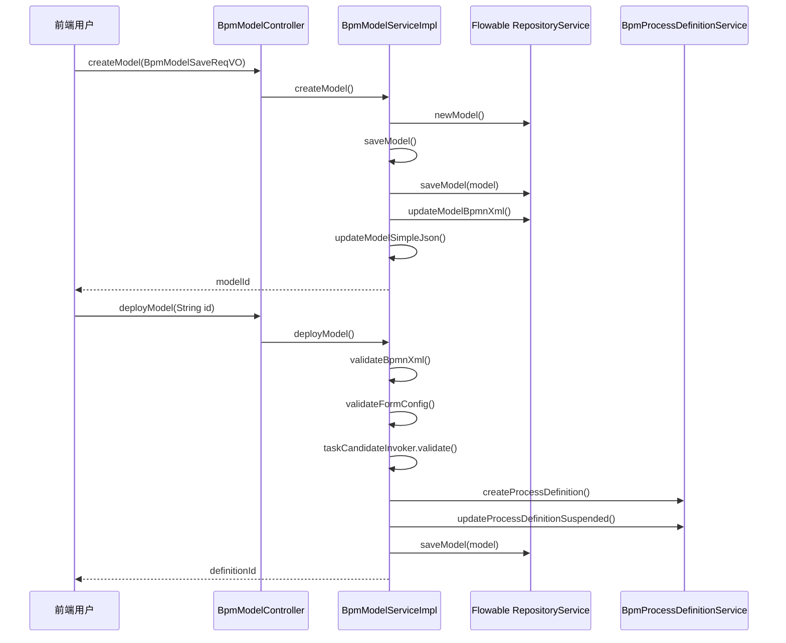
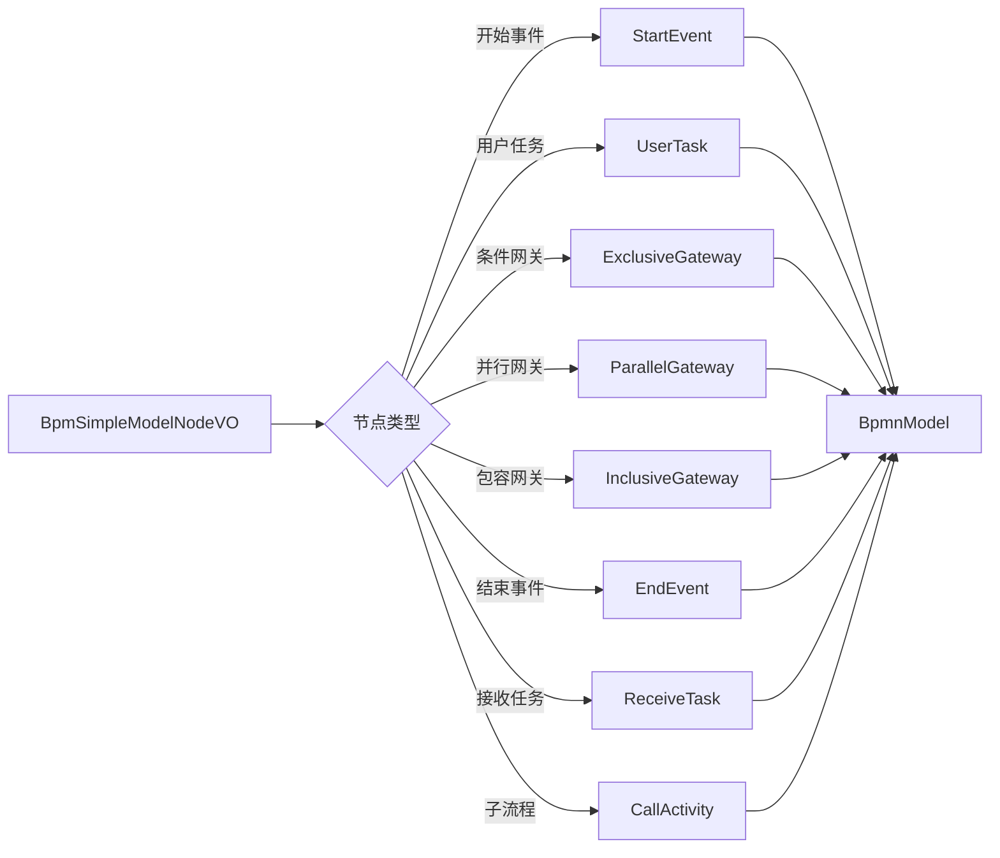
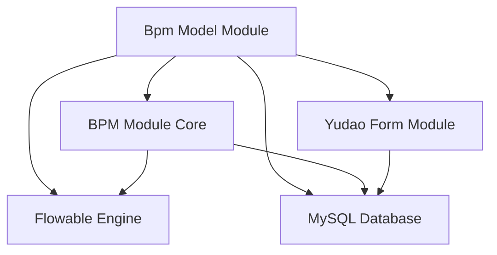
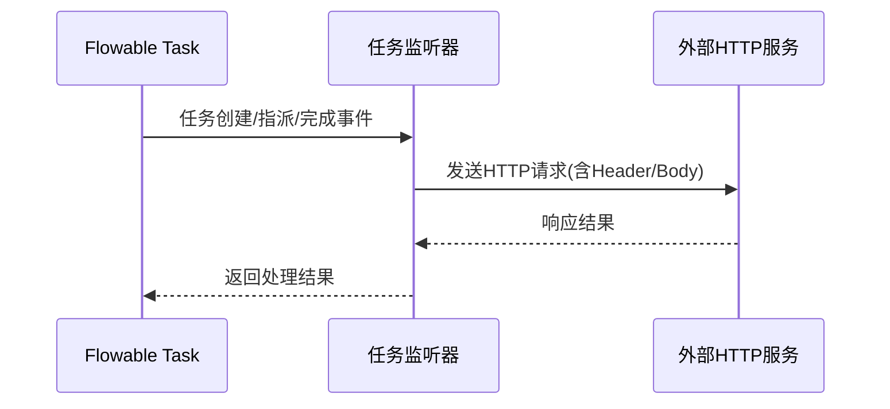

# 流程模型管理模块 (model_5)

## 1. 概述

**流程模型管理模块**是Yudao BPM（业务流程管理）子系统的核心组件，负责流程模型的创建、编辑和管理。该模块提供了两种流程设计器：

1. **标准BPMN设计器** - 支持完整的BPMN 2.0规范，适用于复杂业务流程
2. **仿钉钉快搭设计器** - 简化版可视化设计器，快速构建常见审批流程

模块基于Flowable工作流引擎，实现了流程模型的完整生命周期管理，包括模型创建、保存、更新、状态变更、部署和删除等操作。

## 2. 架构概览



### 2.1 分层架构

- **Controller层**: 接收前端请求，进行参数校验，调用Service层处理业务逻辑
- **Service层**: 核心业务逻辑实现，包含模型创建、更新、部署、删除等核心操作
- **DAO层**: 通过Flowable的RepositoryService与数据库交互
- **工具层**: BpmnModelUtils、SimpleModelUtils等辅助工具类

## 3. 核心功能模块

### 3.1 模型VO层 (Value Object)

#### 3.1.1 BpmModelSaveReqVO - 模型保存请求VO

```java
@Data
@Schema(description = "管理后台 - 流程模型的保存 Request VO")
public class BpmModelSaveReqVO extends BpmModelMetaInfoVO {
    
    private String id;                    // 编号
    @NotEmpty(message = "流程标识不能为空") private String key;     // 流程标识
    @NotEmpty(message = "流程名称不能为空") private String name;    // 流程名称
    private String category;              // 分类
    private String bpmnXml;               // BPMN XML内容
    private BpmSimpleModelNodeVO simpleModel; // 仿钉钉流程设计模型对象
}
```

**字段说明**:
- `key`: 流程唯一标识符，需符合NCName命名规则
- `name`: 流程显示名称
- `bpmnXml`: 标准BPMN XML内容（仅BPMN类型使用）
- `simpleModel`: 简化模型JSON结构（仅简单模型类型使用）

#### 3.1.2 BpmModelUpdateStateReqVO - 模型状态更新VO

```java
@Data
@Schema(description = "管理后台 - 流程模型更新状态 Request VO")
public class BpmModelUpdateStateReqVO {
    
    @NotNull(message = "编号不能为空") private String id;
    @NotNull(message = "状态不能为空") private Integer state; // SuspensionState枚举值
}
```

#### 3.1.3 BpmModeUpdateBpmnReqVO - BPMN更新VO

```java
@Data
@Schema(description = "管理后台 - 流程模型的更新 BPMN XML Request VO")
public class BpmModeUpdateBpmnReqVO {
    
    @NotEmpty(message = "流程编号不能为空") private String id;
    @NotEmpty(message = "BPMN XML 不能为空") private String bpmnXml;
}
```

#### 3.1.4 BpmSimpleModelNodeVO - 仿钉钉节点VO

这是简化模型设计的核心数据结构，采用树形结构表示整个流程：



**节点类型支持**:
- 开始事件 (StartEvent)
- 用户任务 (UserTask) - 审批节点
- 条件网关 (ExclusiveGateway) - 分支判断
- 并行网关 (ParallelGateway) - 并行分支
- 包容网关 (InclusiveGateway) - 包容分支
- 结束事件 (EndEvent)
- 接收任务 (ReceiveTask) - HTTP触发器
- 子流程 (CallActivity) - 嵌套流程

### 3.2 Service层实现

#### 3.2.1 BpmModelServiceImpl

核心服务类，实现流程模型的全生命周期管理：



**核心方法**:

| 方法 | 描述 |
|------|------|
| `createModel()` | 创建新流程模型，支持BPMN和简单模型两种类型 |
| `updateModel()` | 更新模型基本信息 |
| `updateModelBpmnXml()` | 更新BPMN XML内容 |
| `updateSimpleModel()` | 更新简单模型JSON配置 |
| `deployModel()` | 部署模型，生成流程定义并激活新版本 |
| `updateModelState()` | 更新模型启用/禁用状态 |
| `deleteModel()` | 删除模型（挂起关联的流程定义） |
| `cleanModel()` | 清理模型相关的所有运行和历史数据 |

#### 3.2.2 关键验证逻辑

**部署前验证** (`validateBpmnXml`):
1. 检查BPMN解析是否成功
2. 验证存在StartEvent（开始事件）
3. 验证所有UserTask都有name属性
4. 验证第一个UserTask的候选人策略不是"审批人自选"（确保有默认分配规则）

**表单配置验证** (`validateFormConfig`):
- 检查是否配置了表单（普通表单或自定义页面）
- 验证表单ID或自定义路径非空

### 3.3 模型转换与工具类

#### 3.3.1 SimpleModelUtils - 简单模型转BPMN工具

将仿钉钉设计的JSON模型转换为Flowable可识别的BpmnModel对象：



**支持的节点转换器**:
- StartNodeConvert - 开始节点转换
- ConditionNodeConvert - 条件节点转换
- ApproveNodeConvert - 审批节点转换
- ParallelBranchNodeConvert - 并行分支转换
- ChildProcessConvert - 子流程转换
- TriggerNodeConvert - 触发器节点转换

#### 3.3.2 BpmnModelUtils - BPMN工具类

提供BPMN模型的读取、查询和操作辅助方法，如获取开始事件、遍历元素等。

## 4. 数据流分析

### 4.1 模型创建流程

```mermaid
flowchart TD
    A[前端提交BpmModelSaveReqVO] --> B[BpmModelController.createModel()]
    B --> C[BpmModelServiceImpl.createModel()]
    C --> D[校验流程标识唯一性]
    D --> E[创建Flowable Model对象]
    E --> F[设置租户ID和排序]
    F --> G[保存模型基础信息]
    G --> H{模型类型?}
    H -->|BPMN| I[直接保存bpmnXml]
    H -->|SIMPLE| J[SimpleModelUtils.buildBpmnModel()]
    J --> K[生成BPMN XML]
    K --> L[保存BPMN XML到模型]
    L --> M[保存简单模型JSON到模型]
    M --> N[返回模型ID]
```

### 4.2 模型部署流程

```mermaid
flowchart TD
    A[前端调用deployModel] --> B[BpmModelServiceImpl.deployModel()]
    B --> C[校验模型存在且当前用户有权限]
    B --> D[获取BPMN XML内容]
    D --> E[验证BPMN有效性]
    E --> F[校验表单配置]
    F --> G[校验任务分配规则]
    G --> H[获取简单模型JSON]
    H --> I[创建流程定义]
    I --> J[挂起旧版本流程定义]
    J --> K[更新模型deploymentId关联]
    K --> L[返回新流程定义ID]
```

## 5. 与其他模块的集成

### 5.1 与表单模块集成

流程模型部署时，需要关联表单配置：
- **普通表单**: 关联yudao-form模块的表单ID
- **自定义页面**: 配置自定义创建/查看路径

### 5.2 与任务候选者策略集成

在部署前会调用 `taskCandidateInvoker.validateBpmnConfig()` 验证任务分配策略，确保每个用户任务都有合法的候选人分配规则。

### 5.3 与流程定义集成

模型部署后，会创建对应的流程定义（ProcessDefinition），并自动挂起同模型的其他版本，确保只有最新版本可发起流程实例。

## 6. API接口参考

### 6.1 模型管理API

| 接口 | 方法 | 端点 | 描述 |
|------|------|------|------|
| 创建模型 | POST | /bpm/model/create | 创建新流程模型 |
| 更新模型 | PUT | /bpm/model/update | 更新模型信息 |
| 更新BPMN | PUT | /bpm/model/update-bpmn | 更新BPMN XML内容 |
| 更新简单模型 | PUT | /bpm/simple-model/update | 更新简单模型配置 |
| 部署模型 | POST | /bpm/model/deploy/{id} | 部署模型并创建流程定义 |
| 更新状态 | POST | /bpm/model/update-state | 启用/禁用模型 |
| 删除模型 | DELETE | /bpm/model/delete/{id} | 删除模型（挂起关联定义） |
| 清理模型 | POST | /bpm/model/clean/{id} | 清理模型所有相关数据 |
| 获取模型列表 | GET | /bpm/model/list | 查询模型列表 |
| 获取模型详情 | GET | /bpm/model/get/{id} | 获取模型详细信息 |

### 6.2 简单模型专用API

| 接口 | 方法 | 端点 | 描述 |
|------|------|------|------|
| 获取简单模型 | GET | /bpm/simple-model/get/{id} | 获取简单模型的JSON配置 |
| 更新简单模型 | POST | /bpm/simple-model/update | 更新简单模型配置 |

## 7. 配置项

### 7.1 模型元数据 (BpmModelMetaInfoVO)

模型包含的元数据信息：

```java
@Data
@Schema(description = "流程模型元数据")
public class BpmModelMetaInfoVO {
    
    private String sort;                    // 排序
    private String description;             // 描述
    private String formType;                // 表单类型(NORMAL/CUSTOM)
    private Long formId;                    // 表单ID(普通表单)
    private String formCustomCreatePath;    // 自定义创建路径
    private String formCustomViewPath;      // 自定义查看路径
    private List<Long> managerUserIds;      // 管理员用户ID列表
}
```

**表单类型**:
- `NORMAL`: 使用yudao-form系统中的普通表单
- `CUSTOM`: 使用Vue自定义页面

### 7.2 模型类型

| 类型码 | 类型名 | 描述 |
|--------|--------|------|
| 1 | BPMN | 标准BPMN流程模型 |
| 2 | SIMPLE | 仿钉钉快搭简化模型 |

## 8. 错误码定义

| 错误码 | 描述 |
|--------|------|
| MODEL_KEY_VALID | 流程标识格式不正确 |
| MODEL_KEY_EXISTS | 流程标识已存在 |
| MODEL_NOT_EXISTS | 流程模型不存在 |
| MODEL_UPDATE_FAIL_NOT_MANAGER | 无模型管理权限 |
| MODEL_DEPLOY_FAIL_BPMN_START_EVENT_NOT_EXISTS | BPMN缺少开始事件 |
| MODEL_DEPLOY_FAIL_BPMN_USER_TASK_NAME_NOT_EXISTS | UserTask未设置名称 |
| MODEL_DEPLOY_FAIL_FIRST_USER_TASK_CANDIDATE_STRATEGY_ERROR | 第一个UserTask候选人策略错误 |
| MODEL_DEPLOY_FAIL_FORM_NOT_CONFIG | 未配置表单 |
| FORM_NOT_EXISTS | 表单不存在 |
| PROCESS_DEFINITION_NOT_EXISTS | 流程定义不存在 |

## 9. 依赖关系



## 10. 扩展点

### 10.1 任务候选者策略扩展

通过 `BpmTaskCandidateInvoker` 接口扩展任务分配策略，支持多种候选人计算方式：
- 部门领导
- 指定用户
- 表达式计算
- 表单动态取值

### 10.2 监听器支持

节点支持任务监听器配置，可在任务创建、指派、完成时执行HTTP回调：



### 10.3 超时与拒绝处理

审批节点支持：
- **超时处理**: 设置超时时间、最大提醒次数、超时后行为
- **拒绝处理**: 拒绝后的驳回节点配置

---

*本模块文档由AI助手自动生成，基于代码分析和系统架构理解。*